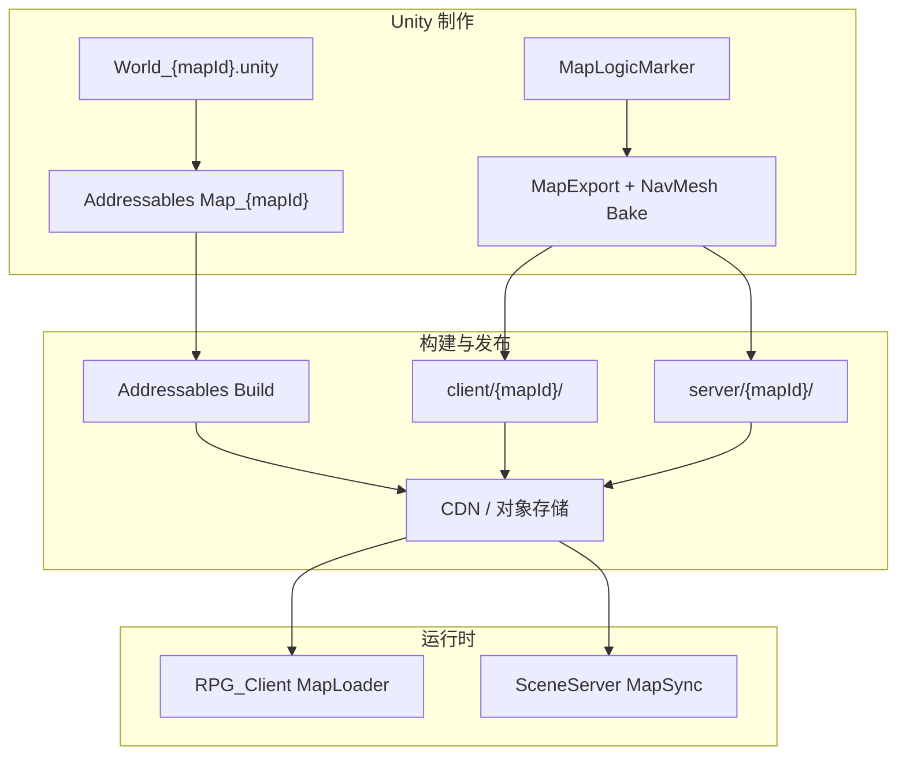
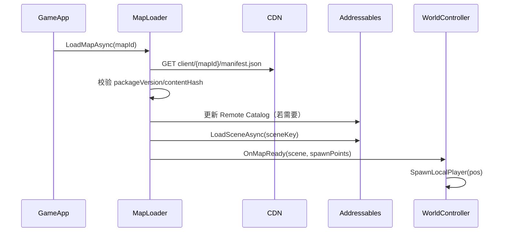

# 3D 地图资源双端拉取方案

## 现状（与本仓对齐）

| 能力 | 状态 |
|------|------|
| 进世界协议 `S2CEnterGame.map_id` | 已有 [`Common/LoginMsg.proto`](Common/LoginMsg.proto) |
| 运行时 `WorldController.LoadMap` | 仅读 `ambient.json` + 生成胶囊体，**不加载 3D 场景** |
| `map/1002/*.json` | 2D 网格遗留数据，**无 C# 加载器** |
| [`docs/RPG_WorldData.md`](docs/RPG_WorldData.md) + [`manifest_v1.example.json`](docs/manifest_v1.example.json) | 目标契约已写，**未落地** |
| Addressables UPM | 已安装（`com.unity.addressables: 1.22.3`），**无 Addressables 设置/分组** |
| [`MapExportWindow`](assets/_Project/Scripts/Editor/MapExportWindow.cs) | 仅导出 `client/{id}/manifest.json` + `spawn_points.json` |



---

## 一、统一资源契约（双端共用）

以 [`manifest_v1.example.json`](docs/manifest_v1.example.json) 为基准，**扩展 v1 字段**（写入 [`docs/RPG_WorldData.md`](docs/RPG_WorldData.md)）：

```json
{
  "version": 1,
  "mapId": 1002,
  "packageVersion": "20250624.1",
  "sceneName": "World_1002",
  "coordSystem": "unity_y_up",
  "cdn": {
    "baseUrl": "https://cdn.example.com/rpg/map/",
    "clientManifest": "client/1002/manifest.json",
    "serverManifest": "server/1002/manifest.json",
    "addressablesCatalog": "addressables/Map_1002/catalog_1.0.json"
  },
  "assets": {
    "scene": "Addressables/Map_1002/scene",
    "terrain": "Addressables/Map_1002/terrain",
    "buildings": "Addressables/Map_1002/buildings"
  },
  "sharedLogic": {
    "spawnPoints": "logic/spawn_points.json",
    "npcSpawns": "logic/npc_spawns.json"
  },
  "serverCollision": "collision/navmesh.bin",
  "contentHash": "sha256:..."
}
```

**目录约定（CDN 根 `rpg/map/`）**

| 路径 | 消费者 | 内容 |
|------|--------|------|
| `client/{mapId}/manifest.json` | 客户端 | 逻辑 JSON + Addressables 地址键 |
| `client/{mapId}/logic/*.json` | 双端 | spawn、NPC、触发器（**同一份**） |
| `client/{mapId}/scene/buildings.json` | 客户端 | Prefab 引用 + Transform |
| `server/{mapId}/manifest.json` | SceneServer | 与 client `packageVersion` 一致 |
| `server/{mapId}/collision/navmesh.bin` | SceneServer | 寻路/碰撞（Unity NavMesh 导出或 Recast） |
| `addressables/Map_{mapId}/` | 客户端（服务端可选拉全量） | catalog + bundles |

**废弃**：根目录 `map/1002/ground.json`、`collision.json` 等 2D 网格文件标记为 legacy，新地图不再产出；`ambient.json` 可迁入 `logic/npc_spawns.json` 或保留为轻量配置。

---

## 二、Unity 3D 地图制作（客户端真源）

### 2.1 场景规范

按 [`assets/_Project/Scenes/README.md`](assets/_Project/Scenes/README.md)：

1. 新建 `assets/_Project/Scenes/World_{mapId}.unity`（如 `World_1002`）
2. 地形：Terrain 或 Mesh + URP 材质；建筑/道具做成 **Prefab**
3. 逻辑点：挂 [`MapLogicMarker`](assets/_Project/Scripts/World/MapLogicMarker.cs)（SpawnPoint / 后续 Trigger）
4. 烘焙 **NavMesh**（供 server 包导出）

### 2.2 Addressables 分组（Remote）

首次初始化 Addressables（`Window → Asset Management → Addressables → Groups`）：

| Group | 模式 | 内容 |
|-------|------|------|
| `Map_1002` | **Remote** | `World_1002.unity`（场景）、terrain mesh、building prefabs |
| `Map_Common` | Local 或 Remote | 共享材质、树、岩石等 |

地址键与 manifest 对齐，例如：

- `Addressables/Map_1002/scene` → `World_1002` 场景
- `Addressables/Map_1002/terrain` → 地形 Prefab/Mesh

**Profile**：配置 Remote Load Path 指向 CDN（开发期可用本地 `http://127.0.0.1:8080`）。

### 2.3 扩展 MapExport

增强 [`MapExportWindow.cs`](assets/_Project/Scripts/Editor/MapExportWindow.cs)：

- 同时导出 `client/{mapId}/` 与 `server/{mapId}/`
- 输出：`spawn_points.json`、`npc_spawns.json`、`buildings.json`、`lighting.json`
- 烘焙并导出 `server/{mapId}/collision/navmesh.bin`（Unity `NavMeshSurface` 或自定义二进制）
- 写入 `packageVersion`、`contentHash`、Addressables 地址键到 manifest
- 可选：`meta/coord_transform.json`（若服务端坐标系与 Unity 不一致）

---

## 三、构建与发布到 CDN

新增脚本（建议 [`scripts/build_map_packages.ps1`](scripts/)）：

1. Unity batchmode：`Addressables.BuildPlayerContent`（按 mapId 或全量）
2. 运行 MapExport → 产出 `client/` + `server/` 目录
3. 组装 CDN 目录结构：

```text
rpg/map/
  index.json              # 全地图清单 [{ mapId, packageVersion, contentHash }]
  client/1002/...
  server/1002/...
  addressables/Map_1002/  # catalog + *.bundle
```

4. 上传到对象存储（OSS/S3/MinIO），开启静态文件 + HTTPS

**开发期**：本地 `python -m http.server` 或 `scripts/serve_map_cdn.ps1` 模拟 CDN；客户端 `client_config.xml` 增加 `mapCdnBaseUrl`。

---

## 四、客户端运行时加载

新增 [`MapLoader`](assets/_Project/Scripts/World/)（或 `World/Map/MapResourceService.cs`）：



**改造点**：

- [`WorldController.LoadMap`](assets/_Project/Scripts/World/WorldController.cs)：改为 `await _mapLoader.LoadAsync(enter.MapId)`，再 spawn 玩家
- [`GameApp`](assets/_Project/Scripts/App/GameApp.cs)：进世界前显示加载 UI；失败走 `ShowError`
- [`ClientConfigLoader`](assets/_Project/Scripts/Config/ClientConfigLoader.cs) + [`config/client_config.xml.example`](config/client_config.xml.example)：新增 `mapCdnBaseUrl`、`addressablesRemoteUrl`
- 保留 dev 回退：CDN 不可用时读本地 `map/`（经 [`sync_streaming_assets.ps1`](scripts/sync_streaming_assets.ps1)）

**与协议对齐**：`S2CEnterGame` 可增加可选 `map_package_version`（需在 RPG_Common 提 PR）；短期客户端以 manifest 自校验为主，版本不一致时拒绝进图并提示更新。

---

## 五、SceneServer 同源拉取（你选择的 full_sync）

SceneServer **不跑 Unity**，但从 **同一 CDN 根** 拉取：

| 拉取项 | 用途 |
|--------|------|
| `server/{mapId}/manifest.json` | 版本、路径索引 |
| `logic/spawn_points.json`、`npc_spawns.json` | 刷怪、出生点（与客户端一致） |
| `collision/navmesh.bin` | 寻路、移动校验 |
| `client/{mapId}/scene/buildings.json` | 静态障碍/建筑占位校验 |
| （可选）`addressables/*.bundle` 中的 collision mesh | 工具链校验、反作弊高度采样 |

**建议实现（RPG_Server 仓，本仓只提供契约与导出物）**：

1. 启动或首玩家进图时：`MapSyncService.EnsureMap(mapId)`
2. HTTP GET `index.json` → `client+server manifest` → 比对 `contentHash`
3. 缓存到 `data/map/{mapId}/`（与 [`RPG_WorldData.md`](docs/RPG_WorldData.md) 一致）
4. 进图 RPC：校验客户端上报的 `packageVersion` 与缓存一致，否则返回错误码

本仓可交付：**manifest 字段说明 + navmesh.bin 格式说明 + 示例拉取脚本** [`scripts/fetch_map_package.ps1`](scripts/) 供服务端集成测试。

---

## 六、推荐实施顺序

| 阶段 | 目标 | 产出 |
|------|------|------|
| **P0 契约** | 扩展 manifest、CDN 目录、`index.json` | 更新 [`RPG_WorldData.md`](docs/RPG_WorldData.md)、example manifest |
| **P1 制作** | `World_1002.unity` + Addressables `Map_1002` Remote 组 | 可 Play 的单地图场景 |
| **P2 导出** | MapExport 双端包 + navmesh | `client/1002`、`server/1002` |
| **P3 发布** | `build_map_packages.ps1` + 本地 CDN | 开发环境可 HTTP 拉取 |
| **P4 客户端** | `MapLoader` + `WorldController` 改造 | 进世界加载 3D 场景 |
| **P5 服务端** | SceneServer `MapSyncService` + 版本校验 | 与客户端同源 CDN |
| **P6 清理** | 废弃 2D `map/*.json` 加载路径 | 文档标注 legacy |

---

## 七、Common 仓：什么能提交、什么不能

Common 是 **独立 Git 仓库**（[RPG_Common](https://github.com/hechuangguo/RPG_Common)），以 submodule 挂在 Client/Server 的 `Common/` 目录。**客户端与服务端均可修改、提交、推送**（见 [`docs/COMMON.md`](docs/COMMON.md)）。

| 内容 | 放哪里 | 谁提交 | 说明 |
|------|--------|--------|------|
| `.proto` 协议 | `Common/*.proto` | **RPG_Common 仓** | 在 `Common/` 子模块内改完 commit+push，主仓 bump 指针 |
| 双端共用 JSON 逻辑 | `Common/map/{mapId}/` | **RPG_Common 仓** | `meta.json`、`spawns.json`、`collision.json` 等 |
| Unity 场景 / Prefab / 材质 | `assets/_Project/` | **RPG_Client 仓** | 3D 美术真源，不进 Common |
| Addressables bundle / CDN 包 | CDN + `.gitignore` | **不提交 Git** | `client/`、`server/` 导出物、`*.bundle` 走 CDN |
| 根目录 `map/` | `map/{mapId}/` | **逐步废弃** | 旧镜像/遗留；新流程以 `Common/map/` + MapExport + CDN 为准 |

**提交流程（推荐）**：

```powershell
.\scripts\commit_push_all.ps1 -m "feat: 协议与客户端联调"
# 顺序：Common (RPG_Common) → 主仓指针 + C# 改动
# 仅推主仓：加 -SkipCommon
```

**与 3D 地图方案的关系**：
- MapExport 产出的 `spawn_points.json` 等：发布到 **CDN**；开发期可同步到 `Common/map/` 并提交 RPG_Common
- 大块 3D 资源不进 Common

### detached HEAD 排查

若 `git -C Common branch` 显示 detached，先 `git -C Common checkout main` 再提交。

### 脚本改动（已落实）

- [`scripts/_common_guard.ps1`](scripts/_common_guard.ps1)：仅提示，不拦截
- [`scripts/commit_push_all.ps1`](scripts/commit_push_all.ps1)：默认先推 Common；`-SkipCommon` 跳过
- [`scripts/sync_common.ps1`](scripts/sync_common.ps1)、[`sync_all.ps1`](scripts/sync_all.ps1)：本地改动时警告
- [`commit_push_all.bat`](commit_push_all.bat)、[`sync_protobuf.ps1`](scripts/sync_protobuf.ps1)：说明已更新

---

## 八、关键注意

- **Boot 场景与 World 场景分离**：继续用 [`Boot.unity`](assets/_Project/Scenes/Boot.unity) 做登录 UI；进世界后 `Addressables.LoadSceneAsync` 叠加或切换到 `World_{mapId}`（推荐 **Additive Load**，Boot UI 隐藏）。
- **不要**把大地图 bundle 提交进 Git：CDN + Addressables Remote 构建物进 `.gitignore`；Git 只保留场景源文件、导出 JSON 样例、manifest example。
- **双端一致性**：`spawn_points.json` / `npc_spawns.json` 只从 MapExport 产出一份，复制到 client 与 server 目录，避免手工双维护。
- **与现有 ambient**：[`MapAmbientController`](assets/_Project/Scripts/World/MapAmbientController.cs) 可逐步改为读 `npc_spawns.json` + Addressables NPC Prefab，替代程序化胶囊。

---

## 本仓首批改动文件（P0–P4）

- 文档：[`docs/RPG_WorldData.md`](docs/RPG_WorldData.md)、[`docs/manifest_v1.example.json`](docs/manifest_v1.example.json)、[`docs/CONFIG.md`](docs/CONFIG.md)、[`README.md`](README.md)
- Editor：[`MapExportWindow.cs`](assets/_Project/Scripts/Editor/MapExportWindow.cs)
- Runtime：新建 `MapLoader.cs`、`MapPackageManifest.cs`；改 [`WorldController.cs`](assets/_Project/Scripts/World/WorldController.cs)、[`GameApp.cs`](assets/_Project/Scripts/App/GameApp.cs)
- 配置：[`ClientConfigLoader.cs`](assets/_Project/Scripts/Config/ClientConfigLoader.cs)、[`config/client_config.xml.example`](config/client_config.xml.example)
- 脚本：[`scripts/build_map_packages.ps1`](scripts/)、[`scripts/fetch_map_package.ps1`](scripts/)
- Unity：Addressables 设置与 `Map_1002` 组（`assets/AddressableAssetsData/`，首次创建后纳入版本控制）
