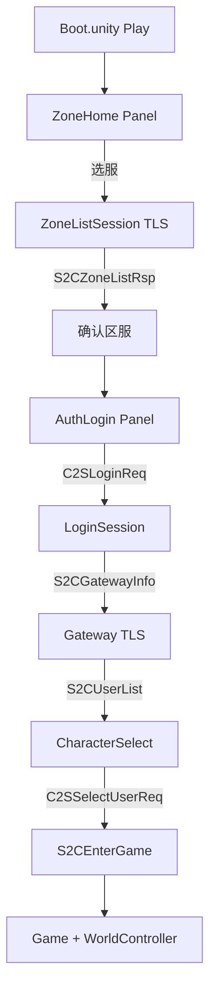

# Boot 场景 Canvas + LoginServer 联调

## 现状

| 项 | 状态 |
|----|------|
| [`Boot.unity`](assets/_Project/Scenes/Boot.unity) | **不存在**（仓库内 0 个 `.unity` 文件） |
| [`EditorBuildSettings.asset`](ProjectSettings/EditorBuildSettings.asset) | `m_Scenes: []`，无法直接 Play 构建 |
| [`GameUiController.cs`](assets/_Project/Scripts/UI/GameUiController.cs) | 全部 `[SerializeField]` 未绑定 |
| [`GameApp.cs`](assets/_Project/Scripts/App/GameApp.cs) | 依赖 `_ui`、`_world` 场景引用 |
| [`client_config.xml`](assets/StreamingAssets/config/client_config.xml) | 已指向 `192.168.65.128:9010`，`insecureSkipVerify=1` |
| 网络层 | [`LoginSession`](assets/_Project/Scripts/Net/LoginSession.cs) / [`ZoneListSession`](assets/_Project/Scripts/Net/ZoneListSession.cs) 已实现 Gateway 回环替换与 `ResumeGatewayForCharSelect` |



---

## Phase 1：Editor 一键生成 Boot 场景（推荐做法）

手写 `.unity` YAML 易错；新增 Editor 脚本 [`assets/_Project/Scripts/Editor/BootSceneSetup.cs`](assets/_Project/Scripts/Editor/BootSceneSetup.cs)，菜单 **`RPG → Setup Boot Scene`**（与现有 [`MapExportWindow.cs`](assets/_Project/Scripts/Editor/MapExportWindow.cs) 同 asmdef）。

### 1.1 场景根层级

```
Boot (Scene)
├── GameRoot                    [GameApp]
│   ├── World                   [WorldController]
│   │   └── Entities            [EntityManager]
│   │       └── EntityRoot      (empty Transform)
│   └── Main Camera
├── EventSystem                 (StandaloneInputModule)
└── Canvas                      [GameUiController] ScreenSpaceOverlay 1280×720 reference
    ├── StatusBar               (_statusText, _errorText 常驻顶部)
    ├── ZoneHomePanel           (active)
    ├── ServerListPanel         (inactive, 含说明 Text + 取消 Button)
    ├── AuthPanel
    ├── RegisterPanel
    ├── CharacterPanel
    ├── GameHudPanel            (占位 Text + 提示 WASD)
    └── ExitDialog              (inactive, 三按钮)
```

- **Canvas**：`CanvasScaler` → Scale With Screen Size，Reference 1280×720；`GraphicRaycaster`。
- **UI 控件**：使用内置 `UnityEngine.UI`（与现有代码一致：`Text` / `InputField` / `Button` / `Toggle`），不引入 TMP。
- **EntityManager**：`_playerPrefab` 留空（运行时 `CreatePrimitive(Capsule)`）；`_entityRoot` 指向 `EntityRoot`。
- **GameApp**：`_ui` → Canvas 上 `GameUiController`；`_world` → `WorldController`。
- **GameUiController**：用 `SerializedObject` 批量赋值全部 SerializeField（Panels、Inputs、Buttons、Texts）。
- **ExitDialog 三按钮**：在 Editor 脚本中创建并命名 `BtnReturnCharSelect` / `BtnReturnLogin` / `BtnQuit`；在 **GameUiController** 中新增对应 `[SerializeField] Button` 并在 `Awake` 里调用 `OnExitGameAction(ReturnCharSelect|ReturnLogin|Unspecified)`（`Unspecified` 对应退出客户端，与 [`GameApp`](assets/_Project/Scripts/App/GameApp.cs) 现有逻辑一致）。

### 1.2 保存与 Build Settings

- 保存至 [`assets/_Project/Scenes/Boot.unity`](assets/_Project/Scenes/Boot.unity)（覆盖时弹确认）。
- `EditorBuildSettings.scenes = [ Boot ]` 且 `enabled = true`。
- 更新 [`assets/_Project/Scenes/README.md`](assets/_Project/Scenes/README.md) 一行说明：首次打开工程执行 **RPG → Setup Boot Scene**。

### 1.3 运行前确认（用户侧）

- Unity Hub 打开仓库根目录，等待 Package Manager 解析完成。
- 若编译报错缺 `Google.Protobuf`：执行 [`scripts/fetch_google_protobuf.ps1`](scripts/fetch_google_protobuf.ps1) 或联网让 OpenUPM 拉包。

---

## Phase 2：补齐联调必需的小改动

改动范围小，与场景生成一并完成：

### 2.1 区列表状态机

[`GameApp.cs`](assets/_Project/Scripts/App/GameApp.cs) 中 `_zoneList.OnSuccess` 在 `ShowServerList`（内部已 `OnZoneConfirmed` → `SetState(ZoneHome)`）之后又 `SetState(ServerList)`，会把界面卡在空的服务列表面板。

**修复**：删除 `OnSuccess` 末尾的 `SetState(AppState.ServerList)`；保留用户点击「选服」时已有的 `SetState(ServerList)`。MVP 仍采用 [`ShowServerList`](assets/_Project/Scripts/UI/GameUiController.cs) 自动选第一个 `Enabled` 区服（README/注释已说明可后续扩展列表 Prefab）。

### 2.2 游戏中 ESC 退出

[`GameApp.cs`](assets/_Project/Scripts/App/GameApp.cs) `Update` 中：

- `AppState.Game` 且 `Input.GetKeyDown(KeyCode.Escape)` → `_ui.ShowExitDialog(true)`（再按 ESC 关闭，对齐旧 C++ `GameExitDialog` 行为）。
- `_game.OnDisconnected` 联调时加 `_suppressDisconnectNav` 标志，在 `RequestLogout` 进行中忽略断开导航（避免 logout 过程误回 ZoneHome）。

### 2.3 ServerListPanel 最小交互

- **取消**按钮：`GameUiController` 新增 `OnCancelServerList` Action；`GameApp` 绑定 `_zoneList.Cancel()` + `SetState(ZoneHome)`。
- **状态文案**：拉取区列表时 `_ui.SetStatus("正在连接 LoginServer...")`（在 `OnSelectServerClicked` 内）。

### 2.4 Register 返回

- RegisterPanel 增加 **返回登录** Button → `ShowRegister(false)` + `SetState(AuthLogin)`（仅 UI，不改网络）。

---

## Phase 3：LoginServer 联调 Checklist

**前置**：LoginServer 运行于 `192.168.65.128:9010`（与 StreamingAssets 配置一致）；TLS 联调 `insecureSkipVerify=1` 已开启。

| 步骤 | 操作 | 期望日志/现象（[`logs/client_YYYYMMDD.log`](logs/)） |
|------|------|------------------------------------------------------|
| 1 | Editor Play Boot 场景 | `GameBootstrap：Unity 客户端启动` |
| 2 | 区服主页 → 选服 | `ZoneListSession：收到区列表 N 条`；自动回到主页并显示区名 |
| 3 | 进入游戏 → 登录 | `LoginSession：开始登录` → `登录成功` → `连接 Gateway` → `S2CUserList` |
| 4 | 选角进世界 | `LoginSession：进入游戏 mapId=...`；Capsule 出现，WASD 可发移动 |
| 5 | ESC → 返回选角 | `GameApp：离世界完成 action=ReturnCharSelect` → `正在刷新角色列表` → 角色列表更新 |
| 6 | ESC → 返回登录 | `action=ReturnLogin` → 回到 AuthPanel |
| 7 | 注册（可选） | `OnRegisterSuccess` → 提示「注册成功，请登录」 |

**常见失败与定位**（联调时按需修代码，不扩大范围）：

- **连接超时**：确认 VM 防火墙 / LoginServer 监听；日志 `ConnectTimeout`。
- **Gateway 127.0.0.1**：已有 `IsLoopback` → 替换为 `loginHost`（[`LoginSession:346-349`](assets/_Project/Scripts/Net/LoginSession.cs)）。
- **ParseError**：执行 `.\scripts\sync_protobuf.ps1` 确保 Protobuf 与 Common 一致。
- **返回选角无 UserList**：观察 Gateway 是否在 `S2CLogoutRsp(RETURN_CHAR_SELECT)` 后推送 `S2CUserList`；若无，再在 `ResumeGatewayForCharSelect` 补发 Gateway 鉴权（仅在有实测证据时改）。

**不建议本阶段做的**：完整区列表 ScrollView、World_1002 Addressables 加载、XLua——留 Phase 2+。

---

## 交付物

1. `BootSceneSetup.cs` + `Boot.unity` + Build Settings 已注册  
2. `GameUiController` / `GameApp` 小补丁（退出框、区列表状态、ServerList 取消）  
3. 联调结果：上述 checklist 至少通过步骤 1–4；问题与日志摘要写入对话或 commit message（**不主动 git commit**，除非你要求）

## 验证方式

1. Unity Editor：**RPG → Setup Boot Scene** → Play  
2. 目视：ZoneHome → 选服 → 登录 → 选角 → 进游戏 HUD  
3. 查看 `logs/client_*.log` 中文链路是否完整
