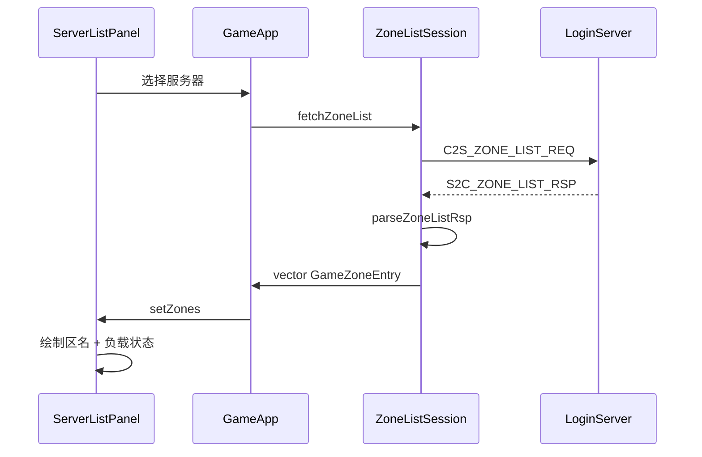

# 客户端区列表状态展示（Req 7）

## 现状对照（7 条需求）

| # | 需求 | 客户端状态 |
|---|------|-----------|
| 1 | 点击「选择服务器」→ 请求 LoginServer 区列表 | **已完成** — [`ZoneHomePanel`](d:\Study\RPG_Client\ui\ZoneHomePanel.cpp) → [`GameApp::beginFetchZoneList`](d:\Study\RPG_Client\app\GameApp.cpp) → [`ZoneListSession`](d:\Study\RPG_Client\net\ZoneListSession.cpp) |
| 2 | LoginServer 返回区列表 | **已完成**（联调侧） — 解析 `S2C_ZONE_LIST_RSP` |
| 3 | 客户端展示区列表供选择 | **已完成** — [`ServerListPanel`](d:\Study\RPG_Client\ui\ServerListPanel.cpp) |
| 4–6 | serverlist.xml / 起服缓存 / Super 动态更新 | **服务端职责**（本次不做）；客户端按协议字段展示 |
| 7 | 显示繁忙、畅通等 | **待实现** — 协议无负载字段，UI 仅显示「维护中」 |



## 实现策略（仅客户端）

服务端尚未下发负载字段时，客户端 **向后兼容** 旧 wire 格式；收到新格式时展示真实数据。

### 负载状态枚举（客户端域模型）

在 [`net/ZoneTypes.h`](d:\Study\RPG_Client\net\ZoneTypes.h) 增加：

```cpp
enum class ZoneLoadStatus : uint8_t
{
    Smooth      = 0,  // 畅通
    Busy        = 1,  // 繁忙
    Full        = 2,  // 爆满
    Maintenance = 3,  // 维护
};

struct GameZoneEntry {
    // 现有 zoneId / gameType / name / enabled
    ZoneLoadStatus loadStatus = ZoneLoadStatus::Smooth;
    uint16_t onlineCount = 0;
    uint8_t  gatewayCount = 0;
};
```

**旧格式回退规则**（服务端未升级时）：
- `enabled == false` → `Maintenance`
- `enabled == true`  → `Smooth`（暂显示「畅通」）
- `onlineCount` / `gatewayCount` 默认 0

---

## 1. 扩展共享协议（RPG_Common）

修改 [`Common/ClientMsg.h`](d:\Study\RPG_Client\Common\ClientMsg.h) 中 `Msg_S2C_ZoneEntryWire`，**在末尾追加**字段（`#pragma pack(1)` 保持）：

```cpp
struct Msg_S2C_ZoneEntryWire {
    uint32_t zoneId;
    uint8_t  gameType;
    uint8_t  enabled;
    char     name[32];
    char     ip[64];
    uint16_t superPort;
    // --- 新增（v2）---
    uint8_t  loadStatus;    // 0畅通 1繁忙 2爆满 3维护
    uint16_t onlineCount;
    uint8_t  gatewayCount;
    uint8_t  reserved;
};
```

记录旧结构体大小常量 `kZoneEntryWireV1Size`（用于兼容解析）。

> 服务端升级后需同步 RPG_Common submodule；本次只改客户端仓库内的 `Common/`。

---

## 2. 兼容解析

修改 [`sdk/net/ClientMsgHandler.cpp`](d:\Study\RPG_Client\sdk\net\ClientMsgHandler.cpp) 的 `parseZoneListRsp`：

- 根据 `len` 与 `hdr.count` 判断每条 entry 是 **v1** 还是 **v2** 大小
- v1：按现有字段解析 + 回退 `loadStatus`
- v2：读取 `loadStatus` / `onlineCount` / `gatewayCount`
- `loadStatus` 与 `enabled` 冲突时：**维护优先**（`enabled==0` 强制 `Maintenance`）

---

## 3. UI：ServerListPanel 展示负载

修改 [`ui/ServerListPanel.cpp`](d:\Study\RPG_Client\ui\ServerListPanel.cpp)：

| loadStatus | 右侧标签 | 颜色 |
|------------|---------|------|
| Smooth | 畅通 | 绿色 `(100, 220, 140)` |
| Busy | 繁忙 | 橙色 `(255, 180, 80)` |
| Full | 爆满 | 红色 `(255, 100, 90)` |
| Maintenance | 维护中 | 灰色 `(130, 130, 135)` |

布局调整（单行 `kRowHeight=36` 内）：
- 左：区服名 `z.name`
- 右：状态标签（`drawText` 右对齐或固定 x 偏移）
- 可选第二行小字：`在线 xxx`（仅 `onlineCount > 0` 时显示，避免旧服务端空白）

交互规则：
- `Maintenance` 或 `enabled==false`：行灰显、不可选（保持现有逻辑）
- `Full`：可选但可在标签旁加提示（首版可仍允许选中，与 enabled 一致）

抽取小函数 `loadStatusLabel(ZoneLoadStatus)` / `loadStatusColor(...)` 放在 `ServerListPanel.cpp` 匿名命名空间，避免过度抽象。

---

## 4. 文档补充

更新 [`README.md`](d:\Study\RPG_Client\README.md) 登录流程一节：
- 说明区列表来自网络 `C2S_ZONE_LIST_REQ`，**不读本地 serverlist.xml**
- 列出 `loadStatus` / `onlineCount` 含义
- 注明服务端（LoginServer + Super 上报）需发送 v2 wire 后客户端才显示真实繁忙度；旧服务端显示「畅通/维护中」

---

## 5. 验证步骤

1. **旧服务端联调**：仅 `enabled` 字段 → 维护区灰显，可用区显示「畅通」
2. **模拟 v2 数据**：临时在 `parseZoneListRsp` 或单元测试注入 `loadStatus=Busy, onlineCount=1200` → UI 显示「繁忙」+ 在线人数
3. **完整流程**：选区首页 → 选择服务器 → 列表展示状态 → 确定 → 返回首页显示区名
4. 编译 Debug，确认 `Common/ClientMsg.h` 结构体大小变更后 client/server 两侧一致（服务端后续对接时同步 submodule）

---

## 不在本次范围（服务端后续）

为完整满足 Req 4–6，服务端需另行实现（供联调参考）：

| 组件 | 路径 | 待做 |
|------|------|------|
| LoginServer 读 XML | [`RPG_Server/LoginServer/serverlist.xml`](d:\Study\RPG_Server\LoginServer\serverlist.xml) | 已存在 |
| 起服缓存 | [`ZoneInfoStore`](d:\Study\RPG_Server\LoginServer\ZoneInfoStore.h) | 已存在 |
| Super 上报更新 | `SuperServer` → `LoginServer` | 新增 `LOGIN_ZONE_STATUS_UPDATE` 协议；合并网关表 + 在线人数写入 `ZoneInfoStore` |
| 下发 v2 区列表 | [`LoginAuthService::onClientZoneList`](d:\Study\RPG_Server\LoginServer\LoginAuthService.cpp) | 填充 `loadStatus` / `onlineCount` / `gatewayCount` |

客户端本次完成后，服务端只需升级 Common + 填充新字段即可打通 Req 7 真实数据。
