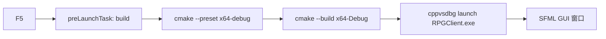

# 修复 Cursor F5 编译运行

## 问题根因

当前 [`.vscode/launch.json`](d:\Study\RPG_Client\.vscode\launch.json) 配置为 **Python 调试器**（`type: debugpy`，`program: ${file}`），与项目实际技术栈不符：

- 本项目是 **C++17 + CMake** 的 Windows GUI 客户端，可执行文件为 `RPGClient.exe`
- 按 F5 时 Cursor 会尝试用 Python 运行当前打开的文件（例如 `launch.json` 本身），无法编译/运行客户端
- 缺少 [`.vscode/tasks.json`](d:\Study\RPG_Client\.vscode\tasks.json)，没有“编译后再启动”的 `preLaunchTask`

项目已在 [`CMakeLists.txt`](d:\Study\RPG_Client\CMakeLists.txt) 中为 VS 调试设置了工作目录：

```80:82:d:\Study\RPG_Client\CMakeLists.txt
    # VS F5 does not expand $<TARGET_FILE_DIR:...>; use configure-time path.
    VS_DEBUGGER_WORKING_DIRECTORY "${CMAKE_BINARY_DIR}/bin"
```

[`CMakePresets.json`](d:\Study\RPG_Client\CMakePresets.json) 与 [`CMakeSettings.json`](d:\Study\RPG_Client\CMakeSettings.json) 已定义 **x64-Debug** 输出路径：

`out/build/x64-Debug/bin/RPGClient.exe`



## 修改方案

### 1. 重写 `launch.json`（核心）

将 `debugpy` 改为 Windows MSVC 调试器 `cppvsdbg`，目标为你选择的 **x64-Debug**：

| 字段 | 值 |
|------|-----|
| `type` | `cppvsdbg` |
| `program` | `${workspaceFolder}/out/build/x64-Debug/bin/RPGClient.exe` |
| `cwd` | `${workspaceFolder}/out/build/x64-Debug/bin` |
| `preLaunchTask` | `build-rpgclient-debug` |

`cwd` 必须指向 `bin/`，因为 POST_BUILD 会把 `config/`、`script/`、`assets/`、SFML DLL 复制到该目录（见 [`CMakeLists.txt`](d:\Study\RPG_Client\CMakeLists.txt) 第 84–105 行）。

### 2. 新增 `tasks.json`（F5 前自动编译）

添加默认构建任务 `build-rpgclient-debug`：

1. **配置**（仅当 `out/build/x64-Debug/CMakeCache.txt` 不存在时执行，避免每次 F5 都重新 configure）：
   ```powershell
   cmake --preset x64-debug
   ```
2. **编译**：
   ```powershell
   cmake --build out/build/x64-Debug --config Debug
   ```

使用 `group.kind: build` + `isDefault: true`，使 **Ctrl+Shift+B** 也能单独编译。

可选：增加 `fetch-fonts` 任务（调用 [`assets/fonts/fetch_font.ps1`](d:\Study\RPG_Client\assets\fonts\fetch_font.ps1)），在首次 F5 前手动运行一次即可（不每次 F5 都下载字体）。

### 3. 更新 `.vscode/settings.json`

在现有 `cmake.sourceDirectory` 基础上补充 CMake 集成设置，便于状态栏选 preset / IntelliSense：

```json
{
  "cmake.sourceDirectory": "${workspaceFolder}",
  "cmake.useCMakePresets": "always",
  "cmake.configureOnOpen": false,
  "C_Cpp.default.configurationProvider": "ms-vscode.cmake-tools"
}
```

`configureOnOpen: false` 避免每次打开工程都触发长时间 configure；首次 F5 由 build 任务按需 configure。

### 4. 新增 `.vscode/extensions.json`（推荐扩展）

提示安装 Cursor 调试 C++ 所需扩展：

- `ms-vscode.cpptools` — C/C++ 扩展（提供 `cppvsdbg`）
- `ms-vscode.cmake-tools` — CMake Tools（可选，改善 preset/IntelliSense）

## 首次 F5 前的前置条件（一次性）

若尚未构建过，需先完成 README 中的环境准备（不在本次 `.vscode` 修改范围内，但 F5 失败时常见原因）：

```powershell
git submodule update --init --recursive
.\3Party\download_and_build.ps1
.\assets\fonts\fetch_font.ps1
```

然后按 F5：build 任务会自动 `cmake --preset x64-debug` 并编译。

## 验证步骤

1. 在 Cursor 中打开仓库根目录 `RPG_Client`（不是子目录）
2. 确认已安装 **C/C++** 扩展（扩展面板搜索 `C/C++`）
3. 按 **F5**：
   - 终端应显示 CMake configure（首次）+ build 输出
   - 成功后启动 `RPGClient.exe` SFML 窗口
4. 在 `main.cpp` 或 `GameApp.cpp` 设断点，确认调试器能命中
5. 检查 `out/build/x64-Debug/bin/assets/fonts/NotoSansSC-Regular.otf` 存在（中文 UI 需要）

## 涉及文件

| 文件 | 操作 |
|------|------|
| [`.vscode/launch.json`](d:\Study\RPG_Client\.vscode\launch.json) | 重写为 `cppvsdbg` + Debug 路径 |
| [`.vscode/tasks.json`](d:\Study\RPG_Client\.vscode\tasks.json) | 新建：configure + build 任务 |
| [`.vscode/settings.json`](d:\Study\RPG_Client\.vscode\settings.json) | 补充 CMake / C++ 设置 |
| [`.vscode/extensions.json`](d:\Study\RPG_Client\.vscode\extensions.json) | 新建：推荐扩展列表 |
