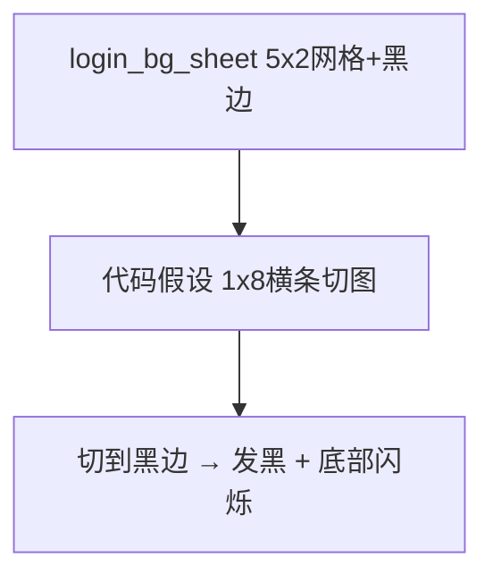

# 修复登录背景发黑与底部闪烁

## 根因

| 现象 | 原因 |
|------|------|
| 背景发黑 | [`login_bg_sheet.png`](assets/ui/login_bg_sheet.png) 是 **5 列 × 2 行** 缩略图拼贴，四周和帧间有大量**黑色留白**；cover 放大后黑边占满屏幕 |
| 底部一闪一闪 | [`LoginBackgroundAnim::draw`](ui/LoginBackgroundAnim.cpp) 按 **横条** 切图：`frameW = 1536 / 8 = 192px`，从 `y=0` 拉满高度。实际切线穿过网格缝与第二行缩略图，帧切换时 `textureRect` 在**黑边/错位区域**间跳动 |



静态 [`login_bg.png`](assets/ui/login_bg.png) 本身正常（1536×1024，无黑边），可作为可靠回退。

## 修复方案

### 1. 重新生成资源（核心）

- **删除** 当前错误的 `login_bg_sheet.png`
- **新生成** 真正的 **1 行 × 8 列** 横条序列帧：
  - 每帧为完整 16:9 山水（构图参考 `login_bg.png`）
  - 帧间**无黑边、无网格**，全画面铺满
  - 仅局部微动（瀑布水流、船体轻晃、鸟翅），避免整幅画位移
- 推荐尺寸：**8192 × 1024**（8 帧 × 1024px 宽，16:9 单帧）或 **6144 × 864**（8 × 768）
- 更新 [`login_bg_anim.json`](assets/ui/login_bg_anim.json)：`frames: 8`，`fps: 6`（略慢，动效更柔和）

### 2. 代码：加载校验 + 静态回退

在 [`LoginBackgroundAnim::load`](ui/LoginBackgroundAnim.cpp) 增加校验，**不合格则返回 false**，让 [`UiTheme::loadLoginBackground`](ui/UiTheme.cpp) 自动回退 `login_bg.png`：

- 单帧宽高比应在 **1.6 ~ 1.9**（16:9 附近）；当前网格单格约 1.5 且含黑边，可被拒绝
- `frameWidth = texWidth / frames` 后 `frameWidth >= texHeight * 1.5`（横条全画面帧应宽于高）

```cpp
const unsigned frameW = texSize.x / frames;
const float aspect = static_cast<float>(frameW) / texSize.y;
if (aspect < 1.55f || aspect > 2.0f) {
    warn("sheet layout invalid, fallback to static");
    return false;
}
```

这样即使以后再放入错误网格图，也不会再出现黑屏闪烁。

### 3. 不改动的部分

- [`UiTheme::drawBackground`](ui/UiTheme.cpp) 的 cover 绘制逻辑已正确，无需改
- 玻璃态面板、[`LoginChrome`](ui/LoginChrome.cpp) 退出按钮保持不变
- 不引入 GIF/MP4

### 4. 验证

1. `.\build_client.ps1` 编译通过
2. 启动后日志应出现 `LoginBackgroundAnim: loaded ... (8 frames @ 6 fps)` 或回退 `loaded static login background`
3. 背景为浅色水墨山水，**无大面积黑边**
4. 底部/边缘**无闪烁**；动效为同一构图下的轻微循环
5. 临时删掉 `login_bg_sheet.png`：应平滑回退静态 `login_bg.png`，不崩溃

## 风险说明

- AI 再次生成网格图的概率较高；**校验 + 静态回退**是必要保险
- 若新横条资源仍不理想，可暂时仅靠校验强制使用 `login_bg.png` 静态背景，待资源替换后再启用动画
