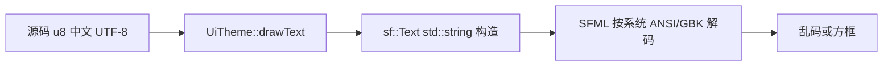

# 修复登录/注册界面 UTF-8 乱码

## 原因说明



| 现象 | 实际状态 |
|------|----------|
| 字体没加载 | **多数情况已解决**：[`client_20260613.log`](Client/out/build/x64-Debug/bin/logs/client_20260613.log) 已有 `loaded font .../NotoSansSC-Regular.otf` |
| 仍乱码 | **编码问题**：[`UiTheme.cpp`](Client/ui/UiTheme.cpp) 中 `sf::Text label(text, m_font, size)` 把 UTF-8 字节交给 SFML |

SFML 2.6 文档明确：`sf::String(const std::string&)` 是 **ANSI + locale** 转换，不是 UTF-8。项目源码用 `u8"仙侠世界"` 存的是 UTF-8，与 SFML 期望不一致 → 登录/注册所有经 `drawText` / `drawTitle` 的文字都会乱码（含 [`serverlist.xml`](Client/config/serverlist.xml) 里的 `RPG一区`）。

**与字体方案的关系**：换 NotoSansSC 只解决「缺字形」；当前乱码是「码点解析错误」，两者需同时满足才能正常显示中文。

---

## 修复方案（改动集中、影响面小）

### 1. UiTheme 统一 UTF-8 → sf::String

在 [`Client/ui/UiTheme.cpp`](Client/ui/UiTheme.cpp) 增加私有辅助（或 `Client/sdk/util/TextUtil.h`）：

```cpp
namespace {
sf::String utf8ToSfString(const std::string& utf8)
{
    if (utf8.empty()) return {};
    return sf::String::fromUtf8(utf8.begin(), utf8.end());
}
}
```

修改 [`drawText`](Client/ui/UiTheme.cpp) / [`drawTextCentered`](Client/ui/UiTheme.cpp)：

```cpp
// 之前
sf::Text label(text, m_font, size);

// 之后
sf::Text label(utf8ToSfString(text), m_font, size);
```

登录/注册相关 UI（[`LoginPanel`](Client/ui/LoginPanel.cpp)、[`RegisterPanel`](Client/ui/RegisterPanel.cpp)、[`Button`](Client/ui/widgets/Button.cpp)、[`TextInput`](Client/ui/widgets/TextInput.cpp)、[`Checkbox`](Client/ui/widgets/Checkbox.cpp)、[`ZoneSelectPanel`](Client/ui/ZoneSelectPanel.cpp)、[`GameApp`](Client/app/GameApp.cpp) Connecting 文案）**已全部走 UiTheme**，改一处即可全部生效。

### 2. 窗口标题（顺带）

[`GameApp.cpp`](Client/app/GameApp.cpp) 第 70–72 行：

```cpp
m_window.create(...,
    sf::String::fromUtf8(u8"仙侠世界 - RPG Client",
                         u8"仙侠世界 - RPG Client" + 28),  // 或先赋 std::string 再 fromUtf8
    sf::Style::Close);
```

推荐写法：

```cpp
const std::string title = u8"仙侠世界 - RPG Client";
m_window.create(..., sf::String::fromUtf8(title.begin(), title.end()), ...);
```

### 3. 游戏内 HUD（可选，本次建议一并做）

以下仍直接使用 `sf::Text(name, font, size)`，进游戏后中文同样会乱码：

- [`GameScene.cpp`](Client/game/GameScene.cpp)
- [`EntityManager.cpp`](Client/game/EntityManager.cpp)
- [`BuildingManager.cpp`](Client/game/BuildingManager.cpp)
- [`AmbientSystem.cpp`](Client/game/AmbientSystem.cpp)

建议抽出 [`TextUtil::utf8ToSfString`](Client/sdk/util/TextUtil.h) 供 UiTheme 与 game 层共用。

### 4. 文档补充（一行说明）

在 [`Client/README.md`](Client/README.md) Config/Run 或 Troubleshooting 增加：

> UI 中文为 UTF-8；SFML 绘制须用 `sf::String::fromUtf8`，不可直接把 UTF-8 `std::string` 传给 `sf::Text`。

---

## 验证

1. VS **x64-Debug** F5（确认 `bin/assets/fonts/NotoSansSC-Regular.otf` 存在）
2. 登录界面：`仙侠世界`、`踏入仙途`、`选择仙界`、`RPG一区` 正常
3. 注册界面：`注册道号`、`开宗立派` 正常
4. 窗口标题中文正常
5. 日志仍为 `UiTheme: loaded font ...NotoSansSC-Regular.otf`（字体路径无回归）

## 若仍无字体

日志若出现 `UiTheme: no font available` 或回退 `arial.ttf`，需先运行 [`fetch_font.ps1`](Client/assets/fonts/fetch_font.ps1) 并重建；这与 UTF-8 问题是独立故障。
