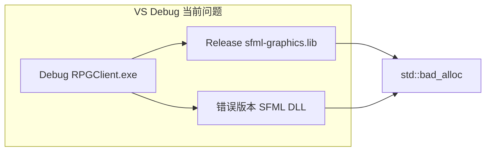

# 修复 Visual Studio Debug 下 std::bad_alloc

## 根因分析

你选择了 **VS Debug 配置**。当前 [`Client/CMakeLists.txt`](Client/CMakeLists.txt) 存在两处与 VS 不兼容的问题：

| 问题 | 现状 | Debug 运行时后果 |
|------|------|------------------|
| SFML 链接 | 固定 `sfml-graphics.lib` / `sfml-window.lib` / `sfml-system.lib`（**Release**） | Debug EXE + Release SFML 导入库 → CRT/堆不一致，SFML 内部 `new` 失败 → `std::bad_alloc` |
| DLL 复制 | `if(CMAKE_BUILD_TYPE STREQUAL "Debug")` 仅对单配置 Ninja 有效；**VS 多配置**下 `CMAKE_BUILD_TYPE` 常为空，逻辑不可靠 | 输出目录可能混入错误版本 SFML DLL |

日志 [`Client/build/bin/logs/client_20260613.log`](Client/build/bin/logs/client_20260613.log) 显示 `simsun.ttc` 加载成功且 `GameApp: initialized`，说明崩溃发生在 **初始化之后的首帧 UI 渲染**（SFML 绘制/字形缓存），与上述堆不匹配高度一致。

次要风险：`simsun.ttc` 体积大，首帧绘制中文时 SFML 字形缓存仍可能 OOM（已在 [`Client/ui/UiTheme.cpp`](Client/ui/UiTheme.cpp) 部分缓解，但 widgets 内仍有未保护的 `sf::Text` 构造）。



## 修复方案

### 1. CMake：按配置链接 SFML（核心）

修改 [`Client/CMakeLists.txt`](Client/CMakeLists.txt) 的 `target_link_libraries`：

```cmake
target_link_libraries(RPGClient PRIVATE
    $<$<CONFIG:Debug>:sfml-graphics-d>
    $<$<CONFIG:Debug>:sfml-window-d>
    $<$<CONFIG:Debug>:sfml-system-d>
    $<$<NOT:$<CONFIG:Debug>>:sfml-graphics>
    $<$<NOT:$<CONFIG:Debug>>:sfml-window>
    $<$<NOT:$<CONFIG:Debug>>:sfml-system>
    opengl32 winmm gdi32
    lua54 tinyxml2
    ws2_32
)
```

删除固定的 `set(SFML_LIBS ...)` 列表。

### 2. CMake：按配置复制 SFML DLL

用 **生成器表达式** 替换 `CMAKE_BUILD_TYPE` 判断，对每个模块复制对应 DLL：

- Debug: `sfml-*-d-2.dll`
- Release: `sfml-*-2.dll`
- `openal32.dll` 始终复制（无 debug 后缀）

示例模式：

```cmake
add_custom_command(TARGET RPGClient POST_BUILD
    COMMAND ${CMAKE_COMMAND} -E copy_if_different
        "$<IF:$<CONFIG:Debug>,${SFML_ROOT}/bin/sfml-graphics-d-2.dll,${SFML_ROOT}/bin/sfml-graphics-2.dll>"
        "$<TARGET_FILE_DIR:RPGClient>"
)
```

对 `graphics/window/system/network/audio` 共 5 个模块各一条。

### 3. CMake：VS 调试工作目录

在 `set_target_properties(RPGClient ...)` 增加：

```cmake
set_target_properties(RPGClient PROPERTIES
    RUNTIME_OUTPUT_DIRECTORY ${CMAKE_BINARY_DIR}/bin
    VS_DEBUGGER_WORKING_DIRECTORY "$<TARGET_FILE_DIR:RPGClient>"
)
```

确保 VS F5 时 cwd 为 `bin/`（含 `config/`、`script/` 等 POST_BUILD 资源），避免路径异常。

### 4. 字体与 UI 文本加固（次要但建议）

**字体候选顺序**（[`Client/ui/UiTheme.cpp`](Client/ui/UiTheme.cpp)）：

1. `assets/fonts/simsun.ttf`（若后续放入仓库的小体积字体）
2. `C:/Windows/Fonts/arial.ttf`（稳定、内存小）
3. **移除** `simsun.ttc`（集合字体，加载/字形缓存开销大）

**统一安全绘制**：在 `UiTheme` 增加 `drawText(...)`，内部 `try/catch (std::bad_alloc&)`；以下文件改为调用它或 `isFontLoaded()` 守卫：

- [`Client/ui/widgets/Button.cpp`](Client/ui/widgets/Button.cpp)
- [`Client/ui/widgets/TextInput.cpp`](Client/ui/widgets/TextInput.cpp)
- [`Client/ui/widgets/Checkbox.cpp`](Client/ui/widgets/Checkbox.cpp)
- [`Client/ui/RegisterPanel.cpp`](Client/ui/RegisterPanel.cpp)
- [`Client/app/GameApp.cpp`](Client/app/GameApp.cpp)（Connecting 状态文字）

### 5. 文档补充

在 [`Client/README.md`](Client/README.md) 增加 VS 说明：

- **推荐**：日常开发用 `.\build_client.ps1`（Release + Ninja）
- 若用 VS **Debug**：修复后需 **删除 build/out 目录并重新 Configure**，再 F5
- 临时规避：切换 VS 配置为 **Release** 再运行

## 验证步骤

1. 删除 `Client/build/`（及 VS 生成的 `out/` 若存在）
2. VS 打开 `Client/`，配置 **x64-Debug**，重新生成
3. 检查输出目录仅有 `sfml-*-d-2.dll`（无混用的 `sfml-*-2.dll`）
4. F5 启动 → 登录界面正常显示，无 `std::bad_alloc`
5. 再测 **x64-Release** 与 `build_client.ps1`，确认 Release 路径未回归

## 临时规避（修复前可立即尝试）

在 VS 工具栏将配置从 **Debug 改为 Release**，重新生成并运行；或继续使用 `Client\build_client.ps1` 产出的 Release 可执行文件。
