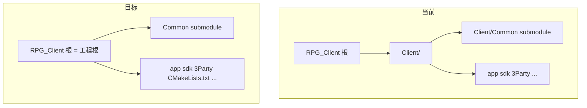

# 移除 Client/ 目录层级

## 目标结构



迁移后与 [RPG_Server](d:/Study/RPG_Server) 一致：双方协议 submodule 均在根级 `Common/`。

## 为何源码几乎不用改

- [`Client/CMakeLists.txt`](Client/CMakeLists.txt) 已全部使用 `${CMAKE_SOURCE_DIR}`（`Common`、`3Party`、`sdk/` 等相对路径），移到根目录后逻辑不变。
- 应用层 `#include` 形如 `"app/GameApp.h"`，include 根即 CMake 源目录，**无 `Client/` 硬编码**（仅注释/文档中有）。
- [`build_client.ps1`](Client/build_client.ps1) 用 `$PSScriptRoot` 定位工程根，脚本本身可原样留在根目录。

## 实施步骤

### 1. 迁移 Git Submodule（先处理）

`Client/Common` → `Common/`：

```powershell
git mv Client/Common Common
```

更新 [`.gitmodules`](.gitmodules)：

```ini
[submodule "Common"]
    path = Common
    url = https://github.com/hechuangguo/RPG_Common.git
    branch = main
```

执行 `git submodule sync` 刷新 `.git/config` 与 modules 路径。

### 2. 批量上移 Client/ 其余内容

对 [`Client/`](Client/) 下剩余顶层项逐一 `git mv` 到仓库根（约 20 项）：

| 类型 | 示例 |
|------|------|
| 目录 | `3Party/`, `app/`, `sdk/`, `config/`, `script/`, `scripts/`, ... |
| 文件 | `main.cpp`, `CMakeLists.txt`, `build_client.ps1` |

**README 冲突处理**：根目录已有 [`README.md`](README.md)，[`Client/README.md`](Client/README.md) 含完整构建说明。将 Client 版内容合并进根 `README.md`（去掉 `cd Client` 步骤），再 `git rm Client/README.md`。

删除空的 `Client/` 目录。

### 3. 清理误跟踪的构建产物（按你的选择）

从版本库移除并加入 [`.gitignore`](.gitignore)：

- `Client/out/` → 改为忽略 `out/`
- `build_configure.log`、`vs_modify.log`
- 同时将现有规则 `Client/build/` 等改为无 `Client/` 前缀：

```
build/
logs/
out/
3Party/_build/
3Party/sfml/
3Party/lua/
assets/fonts/NotoSansSC-Regular.otf
build_configure.log
vs_modify.log
```

```powershell
git rm -r --cached Client/out  # 迁移前路径；若已 mv 则用 out/
git rm --cached build_configure.log vs_modify.log
```

本地删除 `build/`、`out/` 缓存目录，避免旧绝对路径干扰 CMake。

### 4. 更新路径引用（配置与文档）

| 文件 | 改动 |
|------|------|
| [`build_client.ps1`](Client/build_client.ps1) | `Client/Common` → `Common`（submodule init 与报错文案） |
| [`scripts/init_common.ps1`](Client/scripts/init_common.ps1) | 输出路径 `Common/` |
| [`scripts/sync_common.ps1`](Client/scripts/sync_common.ps1) | `Client/Common` → `Common` |
| [`CMakeLists.txt`](Client/CMakeLists.txt) | 错误提示 `Client\3Party\...` → `3Party\...` |
| [`.vscode/settings.json`](.vscode/settings.json) | `cmake.sourceDirectory` → `D:/Study/RPG_Client` |
| [`3Party/README.md`](Client/3Party/README.md)、[`assets/fonts/README.md`](Client/assets/fonts/README.md) | 去掉 `cd Client` 说明 |
| 根 [`README.md`](README.md) | 合并 Client README；构建命令改为在仓库根执行 `.\build_client.ps1` |

**不修改**：`.cursor/plans/` 历史计划文件（保留原文档快照）。

**可选后续**（本仓库外）：[RPG_Common README](https://github.com/hechuangguo/RPG_Common) 仍写 Client 挂载路径为 `Client/Common/`，扁平化后可在 RPG_Common 改为 `Common/`。

### 5. 验证

```powershell
git submodule status          # Common 无 '-' 前缀
.\build_client.ps1            # 产出 build/bin/RPGClient.exe
```

- VS / CMake 扩展：打开仓库根目录，确认 IntelliSense 与 Debug 工作目录为 `build/bin/`。
- 抽查 `Common/ClientMsg.h` 存在且编译通过。

## 风险

| 风险 | 缓解 |
|------|------|
| Submodule 路径断裂 | 先 `git mv Common`，再 `submodule sync`，验证 `git submodule status` |
| 旧 `Client/out` CMake 缓存 | 删除 `out/`、`build/` 后全量 reconfigure |
| README 信息丢失 | 合并而非直接覆盖根 README |

## 提交建议

单次 commit 即可，例如：`refactor: flatten Client/ into repo root`。
