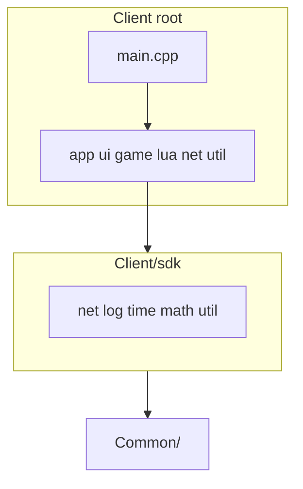

# 移除 Client/src 目录层级

## 目标结构

当前：

```
Client/
  sdk/           # 底层库（不变）
  src/
    app/ game/ lua/ net/ ui/ util/
    main.cpp
  config/ script/ ...
```

目标：

```
Client/
  sdk/           # 不变
  app/ game/ lua/ net/ ui/ util/
  main.cpp
  config/ script/ ...
```

## 为何无需改 `#include`

应用层头文件引用形如 `"app/GameApp.h"`、`"net/LoginSession.h"`，依赖 include 根目录为 **应用层根**（现为 `src/`，将改为 `Client/`）。

与 [`sdk/`](Client/sdk/) 无文件名冲突：

| 应用层 `Client/net/` | SDK `Client/sdk/net/` |
|---|---|
| LoginSession, GameSession | TcpClient, ClientMsgHandler, ProtocolCodec |

| 应用层 `Client/util/` | SDK `Client/sdk/util/` |
|---|---|
| ConfigLoader, LocalSettings | PathUtil, ServerListLoader |

## 实施步骤

### 1. 物理移动（git mv 或等效）

将 [`Client/src/`](Client/src/) 下内容移到 [`Client/`](Client/)：

- `src/app/` → `Client/app/`
- `src/game/` → `Client/game/`
- `src/lua/` → `Client/lua/`
- `src/net/` → `Client/net/`
- `src/ui/` → `Client/ui/`
- `src/util/` → `Client/util/`
- `src/main.cpp` → `Client/main.cpp`
- 删除空的 `Client/src/`

共 **48 个** `.h/.cpp` 文件 + `main.cpp`，**源码内容不改**。

### 2. 更新 [`Client/CMakeLists.txt`](Client/CMakeLists.txt)

**源文件 glob** — 将：

```cmake
file(GLOB_RECURSE APP_SRC CONFIGURE_DEPENDS src/*.cpp)
```

改为按应用目录收集（避免误扫 `build/` 等）：

```cmake
set(APP_DIRS app game lua net ui util)
set(APP_SRC ${CMAKE_SOURCE_DIR}/main.cpp)
foreach(dir ${APP_DIRS})
    file(GLOB_RECURSE _dir_src CONFIGURE_DEPENDS ${CMAKE_SOURCE_DIR}/${dir}/*.cpp)
    list(APPEND APP_SRC ${_dir_src})
endforeach()
```

**include 路径** — 将：

```cmake
${CMAKE_SOURCE_DIR}/src
```

改为：

```cmake
${CMAKE_SOURCE_DIR}
```

`sdk` 相关 include 保持不变。

### 3. 清理并重建

- 删除 [`Client/build/`](Client/build/)（或至少 reconfigure）以刷新 `VerifyGlobs.cmake` 中的旧 `src/` 路径
- 运行 [`Client/build_client.ps1`](Client/build_client.ps1)
- 确认产出 `Client/build/bin/RPGClient.exe` 且能启动

### 4. 文档（可选，最小改动）

[`Client/README.md`](Client/README.md) 当前未引用 `src/`，无需必改。

**不修改** [`.cursor/plans/mmorpg_sfml_client_d1c81fb3.plan.md`](.cursor/plans/mmorpg_sfml_client_d1c81fb3.plan.md)（按你的要求保留原 plan 文本）。

## 架构关系（移动后不变）



## 风险与验证

- **风险**：include 路径顺序导致 `net/` 或 `util/` 解析到错误目录 — 当前无同名头文件，移动后行为与现有一致。
- **验证**：`build_client.ps1` 零错误链接；运行 exe 进入登录界面。
