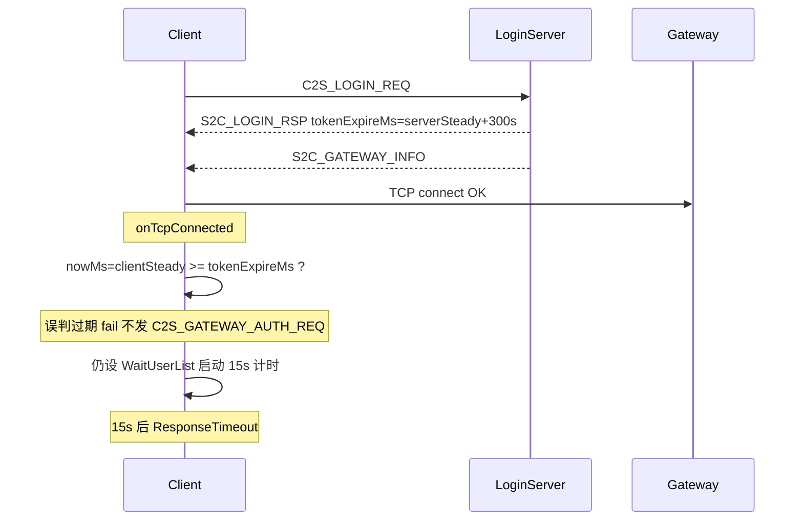

# Gateway 鉴权「票据已过期」与列表超时诊断

## 日志解读（本次现象）

```text
14:00:43.560  连接 LoginServer
14:00:43.811  连接 Gateway
14:00:43.845  登录票据已过期          ← 本地校验失败，鉴权包未发
14:00:43.845  无法连接游戏网关        ← fail() 主动 disconnect 的连带错误
14:00:58.862  获取角色列表超时        ← 约 15s 后（responseTimeout）
```

关键证据：**没有出现** `LoginSession：发送 Gateway 票据鉴权`。说明问题发生在 [`sendGatewayAuthOrLogin`](net/LoginSession.cpp) 第 492-496 行，**不是** Gateway 无响应、也不是之前已修的「忽略 S2C_LOGIN_RSP」路径。



---

## 根因 1：tokenExpireMs 时钟域不一致（主因）

### 服务端写入方式

[`LoginAuthService.cpp`](../RPG_Server/LoginServer/LoginAuthService.cpp) 成功登录时：

```cpp
loginRsp.tokenExpireMs =
    TimerMgr::NowMs() + LOGIN_TOKEN_TTL_SEC * 1000ULL;  // LOGIN_TOKEN_TTL_SEC=300
```

[`TimerMgr::NowMs()`](../RPG_Server/sdk/timer/TimerMgr.h) 使用 **steady_clock 自纪元起的毫秒**（进程/机器单调时钟，**非 Unix 墙钟**）。

### 客户端校验方式

[`sendGatewayAuthOrLogin`](net/LoginSession.cpp)：

```cpp
if (m_loginRsp.tokenExpireMs > 0 &&
    TimeUtil::nowMs() >= static_cast<int64_t>(m_loginRsp.tokenExpireMs))
```

[`TimeUtil::nowMs()`](sdk/time/TimeUtil.cpp) 同样是 **本机 steady_clock**。

### 为何跨机器必错

| 字段 | 含义 |
|------|------|
| `tokenExpireMs` | **服务端** steady 绝对值（通常 ≈ 服务端开机时长 + 300s） |
| `TimeUtil::nowMs()` | **客户端** steady 绝对值（≈ 客户端开机时长） |

两台机器的 steady 纪元与 uptime **完全不可比**。典型场景：

- 服务端刚启动：`tokenExpireMs` ≈ 3×10⁵ ~ 10⁷
- 客户端已运行数天：`nowMs()` ≈ 10⁹ 量级
- 结果：`clientNow >= tokenExpireMs` **立即成立** → 「登录票据已过期」

协议注释写「Unix epoch 毫秒」([`LoginMsg.h`](Common/LoginMsg.h) L94)，但实现用的是 steady，且跨主机比较——这是设计/实现不一致，不是网络或 Gateway 漏洞。

Gateway/Record 实际用 DB `expire_time = DATE_ADD(NOW(), INTERVAL 300 SECOND)` 校验，**服务端侧票据仍有效**；是客户端提前拦截。

---

## 根因 2：onTcpConnected 在 fail 后仍进入 WaitUserList（次因，解释 15s 超时）

[`onTcpConnected`](net/LoginSession.cpp) L423-433：

```cpp
m_gatewayConnected = true;
sendGatewayAuthOrLogin();   // 内部 fail() → resetToIdle()
m_state = State::WaitUserList;           // 仍会执行！
m_waitResponseStartMs = TimeUtil::nowMs(); // 启动 15s 计时
```

`fail()` 会把状态置 `Idle`，但 `onTcpConnected` **不检查返回值、不 return**，立刻覆盖为 `WaitUserList`。因此 UI 继续显示「正在获取角色列表…」，15 秒后 [`update()`](net/LoginSession.cpp) 触发 `ResponseTimeout`。

同时 `fail()` 内 `disconnect()` 可能再触发 `onTcpDisconnected`，产生第二条 ERR「无法连接游戏网关」。

---

## 修复方案

### 客户端（必做）

**1. 修正票据过期比较时钟**

在 [`sendGatewayAuthOrLogin`](net/LoginSession.cpp) 使用墙钟比较，与协议注释及服务端 DB 语义对齐：

```cpp
// 使用 TimeUtil::wallNowMs() 而非 nowMs()
if (m_loginRsp.tokenExpireMs > 0 &&
    TimeUtil::wallNowMs() >= static_cast<int64_t>(m_loginRsp.tokenExpireMs))
```

**2. 同步修正服务端 tokenExpireMs 写入（推荐一并改 Common/RPG_Server）**

[`LoginAuthService.cpp`](../RPG_Server/LoginServer/LoginAuthService.cpp) 改为：

```cpp
loginRsp.tokenExpireMs =
    static_cast<uint64_t>(TimeUtil::UnixMs()) + LOGIN_TOKEN_TTL_SEC * 1000ULL;
```

使 wire 字段真正表示 Unix 毫秒过期时刻，客户端 `wallNowMs()` 可正确比较。

> 若短期只改客户端、不改服务端：在服务端仍发 steady 绝对值时，**客户端本地过期校验仍不可靠**。更稳妥的客户端策略是：**删除或放宽本地过期校验**，仅校验 `loginToken` 非空，把过期交给 Gateway/Record；或改为服务端下发 **相对 TTL 秒数** 新字段（改动较大，非首选）。

**3. 修复 onTcpConnected 失败后续**

`sendGatewayAuthOrLogin()` 改为返回 `bool`，或在 `onTcpConnected` 中：

```cpp
sendGatewayAuthOrLogin();
if (m_state == State::Idle)  // fail 已 reset
    return;
m_state = State::WaitUserList;
...
```

避免假超时与重复 ERR。

**4. 增强诊断日志（中文）**

过期失败时记录（勿打 token 全文）：

```cpp
ClientLogger::instance().warn(
    "LoginSession：票据本地校验失败 过期时间=%llu 当前墙钟=%lld",
    rsp.tokenExpireMs, TimeUtil::wallNowMs());
```

便于确认修复前后数值域。

### 服务端（联调确认）

- LoginServer + Gateway + Record 均已启动
- Gateway 日志应有鉴权请求（修复后客户端才会发出）
- 区列表日志中 `ZoneListSession：获取区列表时连接已断开` 为独立问题（仍收到 1 个区），不阻塞本次登录链路

---

## 验证步骤

1. 应用客户端修复 + 服务端 `tokenExpireMs` 墙钟对齐（或客户端移除本地过期校验）
2. 重新编译，登录同一账号
3. 期望日志顺序：
   - `LoginSession：连接 Gateway ...`
   - `LoginSession：发送 Gateway 票据鉴权 ...`  ← **必须出现**
   - `LoginSession：Gateway 鉴权成功，等待角色列表`
   - `LoginSession：收到角色列表响应 数量=N ...`
4. 不应再出现：先「票据已过期」再 15s「获取角色列表超时」的组合
5. 若鉴权仍失败，应几秒内看到 Gateway 返回的 `S2C_LOGIN_RSP` 具体错误（已实现的 `handleGatewayLoginRsp`）

---

## 结论

| 问题 | 是否客户端 Gateway 组包/发送漏洞 |
|------|--------------------------------|
| 本次日志 | **否** — 鉴权包未发出，被错误的本地 `tokenExpireMs` 校验拦截 |
| 15s 超时 | **是（逻辑 bug）** — `onTcpConnected` 在 fail 后仍进入 `WaitUserList` |
| Gateway 鉴权组包 | **无问题** — `buildGatewayAuthReq` 与 wire 结构正确，修复时钟后即可正常发送 |
