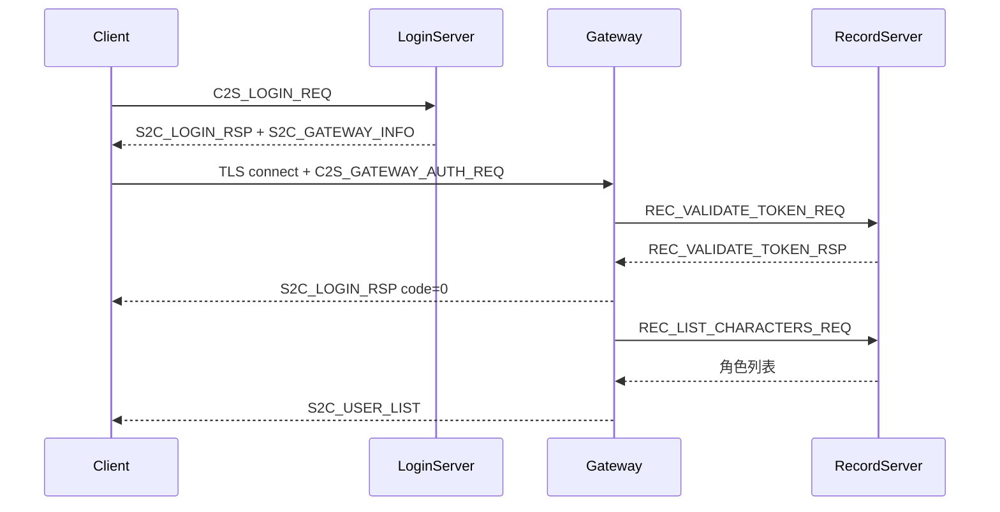

# Gateway 鉴权与「获取角色列表超时」诊断

## 结论：**鉴权组包基本正确；超时主因是错误被吞掉 + 服务端未回列表**

### 客户端 Gateway 鉴权实现（当前正确部分）

[`buildGatewayAuthReq`](sdk/net/ClientMsgHandler.cpp) 使用 wire v2 `encodeWire` + `initClientMsg`，字段与 [`Msg_C2S_GatewayAuthReq`](Common/LoginMsg.h) 一致：

```263:275:sdk/net/ClientMsgHandler.cpp
std::vector<char> ClientMsgHandler::buildGatewayAuthReq(...)
{
    Msg_C2S_GatewayAuthReq body{};
    copyFixedString(body.account, ...);
    copyFixedString(body.loginToken, ...);
    body.zoneId = zoneId;
    body.gameType = gameType;
    return encodeWire(body);
}
```

[`sendGatewayAuthOrLogin`](net/LoginSession.cpp) 在连上 Gateway 后发送，并校验 `loginToken` 非空、`tokenExpireMs` 未过期——逻辑合理。

流程与 RPG_Server 设计一致（见 [`RPG_Server/docs/LOGIN_CHAR_FLOW.md`](../RPG_Server/docs/LOGIN_CHAR_FLOW.md)）：



[`tryConnectGateway`](net/LoginSession.cpp) 在 `m_gotLoginRsp && m_gotGatewayInfo` 后断开 9010、连接 Gateway，[`onTcpConnected(ConnectGateway)`](net/LoginSession.cpp) 即发鉴权并进入 `WaitUserList`——**不是**在 LoginServer 上等列表，与旧版 bug 不同。

---

## 明确存在的客户端 Bug：忽略 Gateway 上的 `S2C_LOGIN_RSP`

[`onTcpMessage`](net/LoginSession.cpp) 在 `m_gatewayConnected` 时直接丢弃登录响应：

```681:687:net/LoginSession.cpp
if (flatId == clientMsgFlatId<Msg_S2C_LoginRsp>())
{
    if (m_gatewayConnected)
    {
        ClientLogger::instance().warn("LoginSession：Gateway 连接收到登录响应，已忽略");
        return;
    }
```

而服务端鉴权失败/Record 不可用时，Gateway **只发** `S2C_LOGIN_RSP code!=0` 然后踢连接（[`GatewayServer::onValidateTokenRsp`](../RPG_Server/GatewayServer/GatewayServer.cpp) L579-614）：

| 场景 | Gateway 行为 | 客户端当前行为 |
|------|-------------|----------------|
| 票据无效 | `S2C_LOGIN_RSP code=1` + Kick | **忽略** → 等不到 `S2C_USER_LIST` → 15s 超时 |
| Record 未连 | `S2C_USER_LIST code=-1` + `S2C_LOGIN_RSP code=-1` + Kick | 忽略 LoginRsp → 可能只收到错误列表或超时 |
| 鉴权成功 | `S2C_LOGIN_RSP code=0`，随后 `S2C_USER_LIST` | 忽略 LoginRsp（无害），等 USER_LIST |

**这正好解释你的现象**：界面已是「正在获取角色列表…」（`WaitUserList`），但真实失败原因被吞掉，最终显示「获取角色列表超时，服务器未响应」。

---

## 服务端也需并行排查（即使修客户端也应确认）

超时还可能是鉴权成功但 **Record 拉列表卡住/失败**：

1. **Gateway 是否可达**：`S2C_GATEWAY_INFO` 下发的 `gatewayIP:gatewayPort`（常见 9005）；客户端会把 `127.0.0.1` 替换为 `loginHost`（[`handleGatewayInfo`](net/LoginSession.cpp) L614-618），需确认替换后端口可从客户端机器访问。
2. **Gateway ↔ Record**：Gateway 日志应有 `Gateway 票据鉴权`；Record 需在线并完成 `REC_VALIDATE_TOKEN`。
3. **Record ↔ LoginServer 票据校验**：Record 通过外联向 LoginServer 校验 token（[`RecordServer::onValidateTokenReq`](../RPG_Server/RecordServer/RecordServer.cpp)）；LoginServer/Record 任一未启或外联配置错误会导致鉴权失败。
4. **TLS**：客户端 Gateway 连接同样走 TLS；Gateway TLS 配置需与客户端 `client_config.xml` 一致。

建议在服务端日志搜索：`Gateway 票据鉴权`、`鉴权成功`、`角色列表下发失败`、`Record 未连接`。

---

## 修复方案（客户端）

### 1. 处理 Gateway 连接上的 `S2C_LOGIN_RSP`

修改 [`net/LoginSession.cpp`](net/LoginSession.cpp) `onTcpMessage`：

- 当 `m_gatewayConnected && m_state == WaitUserList`（或 `ConnectGateway` 刚完成）收到 `S2C_LOGIN_RSP`：
  - `code != 0` → `fail(ClientErrorText::loginResultText(...))`，**立即展示真实原因**（如「登录票据无效或已过期」）
  - `code == 0` → 可记 debug 日志，继续等 `S2C_USER_LIST`（行为不变）

可抽取 `handleGatewayLoginRsp(const Msg_S2C_LoginRsp& rsp)` 保持文件清晰。

### 2. 增强诊断日志（中文，符合项目规范）

在以下节点增加 `ClientLogger::info/warn`：

- `sendGatewayAuthOrLogin`：account、zoneId、gateway 地址（勿打 token 全文）
- 收到 `S2C_USER_LIST`：count
- Gateway 鉴权失败 LoginRsp：code + msg

便于与 Gateway/Record 日志对照。

### 3. （可选）`S2C_USER_LIST` 非 OK 时已有 `fail(errMsg)`

[`parseUserList`](sdk/net/ClientMsgHandler.cpp) 在 `hdr.code != 0` 时会失败并显示文案；确认 Gateway 下发的错误列表能被收到（若被 Kick 太快，仍依赖步骤 1）。

---

## 验证步骤

1. 编译客户端，确保 LoginServer + Gateway + Record 均已启动且 Gateway 已向 LoginServer 注册。
2. 用 `hcg6` / `111111` 登录：
   - **修复前**：15s 后「获取角色列表超时」
   - **修复后（鉴权失败时）**：几秒内显示具体错误（如票据无效、存档服务不可用）
   - **链路正常时**：数秒内进入选角界面（0 个角色则进创角）
3. 对照日志：
   - 客户端：`LoginSession：发送 Gateway 票据鉴权` → `收到 N 个角色`
   - Gateway：`鉴权成功` → `角色列表下发`
4. 若仍超时且无 LoginRsp 错误：查 Gateway IP/端口防火墙、Record 外联、TLS。

---

## 无需修改的部分

- `buildGatewayAuthReq` / `encodeWire`：与 Gateway [`ClientMsgValidator`](../RPG_Server/GatewayServer/ClientMsgValidator.h) 定长 107 字节一致
- `parseUserList` 已使用 `parseMsgHeader`（变长头 8 字节），与 wire v2 对齐
- 不应回退为在 LoginServer 上等 `S2C_USER_LIST`（与当前服务端实现不符）
