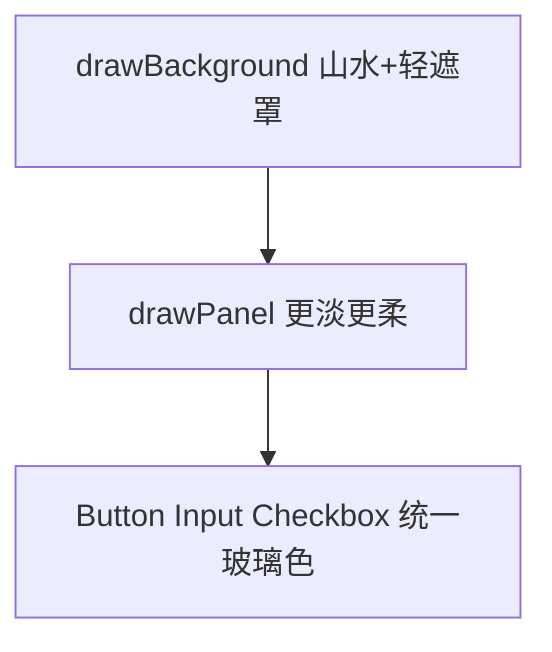

# 登录操作框与背景融合优化

## 现状问题

当前 [`ui/UiTheme.cpp`](ui/UiTheme.cpp) 在 `m_loginBgLoaded` 时虽已做「玻璃态」，但仍显突兀：

| 元素 | 当前值 | 视觉问题 |
|------|--------|----------|
| `panelFill` | `(28,38,42,120)` | 半透明色块仍像贴上去的卡片 |
| `panelBorder` | 金色 `(212,175,55,140)` | 1px 金框非常抢眼 |
| `drawPanel` 外扩柔光 | `(10,20,25,50)` + 12px | 形成第二道可见矩形边 |
| `buttonNormal/Hover` | alpha 150–180 + 1.5px 金描边 | 面板内又是两层方框 |
| `Checkbox` | 硬编码 `(10,25,28,200)` | 未走 theme，比输入框更实 |
| `ServerListPanel` 列表区 | 硬编码 `(10,25,28,180)` | 同上 |
| `titleColor` | 全不透明金色 | 标题过于「游戏 HUD」感 |

各 Panel（[`ZoneHomePanel`](ui/ZoneHomePanel.cpp)、[`AuthLoginPanel`](ui/AuthLoginPanel.cpp)、[`RegisterPanel`](ui/RegisterPanel.cpp)、[`ServerListPanel`](ui/ServerListPanel.cpp)）均调用 `m_theme->drawPanel()`，**无需改布局**，只调主题与控件绘制即可全局生效。

## 改动方案（仅 `hasLoginBackground()` 时生效）

### 1. 调色：更淡、去金色描边

在 [`UiTheme.cpp`](ui/UiTheme.cpp) 调整 `m_loginBgLoaded` 分支：

| 方法 | 目标值（示意） |
|------|----------------|
| `panelFill` | `(42, 52, 55, 55)` — 更低 alpha，偏水墨灰绿 |
| `panelBorder` | `(200, 210, 205, 35)` — 浅灰雾边，替代金色 |
| `buttonNormal` / `buttonHover` | `(50, 65, 68, 70)` / `(65, 80, 82, 95)` |
| `inputFill` | `(35, 48, 50, 60)` |
| `titleColor` | `(230, 220, 190, 200)` — 淡金白，非纯 HUD 金 |

无背景时保持现有实色样式不变。

### 2. `drawPanel`：羽化边缘、去掉硬框

重写 [`UiTheme::drawPanel`](ui/UiTheme.cpp) 的玻璃分支：

1. **底层羽化**（2 层扩边矩形，alpha 递减）：外扩 20px / 10px，颜色 `(25, 35, 38, 18)` / `(30, 40, 42, 28)`，柔化与背景的交界
2. **主体填充**：`panelFill()`，**`outlineThickness = 0`**（去掉金/灰硬描边）
3. **顶部高光线**（可选 1px）：`Color(255,255,255,12)` 模拟玻璃反光，增强质感但不抢眼

### 3. 控件统一走 theme

| 文件 | 改动 |
|------|------|
| [`ui/widgets/Button.cpp`](ui/widgets/Button.cpp) | 玻璃模式下 `outlineThickness` 降为 `0.5f` 或 `0`；描边用 `panelBorder()` |
| [`ui/widgets/TextInput.cpp`](ui/widgets/TextInput.cpp) | 未聚焦时 outline `0`；聚焦时用 `accentColor` 但 alpha 降至 ~120 |
| [`ui/widgets/Checkbox.cpp`](ui/widgets/Checkbox.cpp) | `setFillColor(m_theme->inputFill())`，outline 与 Button 一致 |
| [`ui/ServerListPanel.cpp`](ui/ServerListPanel.cpp) | 列表背景改用 `m_theme->inputFill()`，outline 与 panel 一致 |

### 4. 全屏遮罩微调

[`drawBackground`](ui/UiTheme.cpp) 中 scrim 由 `(15,25,30,45)` 略降为 `(15,25,30,35)`，减轻整体压暗，让面板与背景亮度更接近（面板本身已更透，需略减 scrim 避免文字难读）。

### 5. 文字可读性（轻量）

在 `drawText` / `drawTextCentered` 中，当 `m_loginBgLoaded` 时为主文字加 **1px 偏移暗色阴影**（`Color(10,15,18,80)`），保证面板极淡时中文仍清晰——不增加面板不透明度。

## 验证

1. `.\build_client.ps1` 编译通过
2. 选区首页 / 区列表 / 登录 / 注册：中间操作区**无明显金框、无实心卡片感**，能透出山水
3. 按钮、输入框、复选框风格一致，hover/聚焦仍可见
4. 无登录背景时（删 sheet 且删静态图）：回退渐变 + 原实色面板，行为不变

## 范围

- 只改 UI 主题与控件绘制；不改 Panel 布局、网络、退出按钮逻辑
- 不引入 SFML Shader 模糊（保持 SFML 2.x 纯 Shape 实现）
