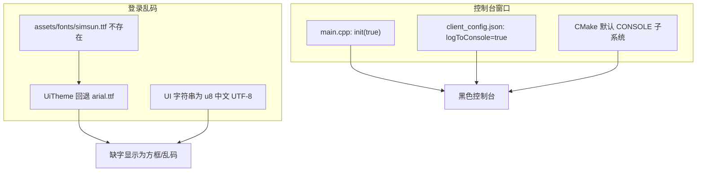

# 隐藏控制台 + 修复登录界面乱码

## 根因



| 现象 | 原因 | 说明 |
|------|------|------|
| 启动时出现控制台 | [`main.cpp`](Client/main.cpp) 在读取配置前就 `init(true)`；[`client_config.json`](Client/config/client_config.json) 默认 `logToConsole: true`；可执行文件为 **CONSOLE** 子系统 | 即使关闭 stdout 日志，CONSOLE 子系统仍会弹出黑窗 |
| 登录界面乱码 | [`assets/fonts/`](Client/assets/fonts/) 仅有 `.gitkeep`，[`UiTheme.cpp`](Client/ui/UiTheme.cpp) 回退到 `arial.ttf` | Arial 不含 CJK 字形；源码 UTF-8（`/utf-8` + `u8""`）本身是正确的 |

验证日志也印证了这一点：修复 bad_alloc 后日志为 `UiTheme: loaded font C:/Windows/Fonts/arial.ttf`。

---

## 方案 1：隐藏控制台，只保留登录窗口

### 1.1 CMake 改为 GUI 子系统

在 [`Client/CMakeLists.txt`](Client/CMakeLists.txt) 的 MSVC 分支增加：

```cmake
set_target_properties(RPGClient PROPERTIES
    WIN32_EXECUTABLE TRUE
)
```

保留现有 `int main()`，MSVC 会链接 `/SUBSYSTEM:WINDOWS /ENTRY:mainCRTStartup`，启动时不再分配控制台。

### 1.2 默认只写日志文件

| 文件 | 改动 |
|------|------|
| [`Client/main.cpp`](Client/main.cpp) | `ClientLogger::instance().init(false)` |
| [`Client/config/client_config.json`](Client/config/client_config.json) | `"logToConsole": false` |
| [`Client/util/ConfigLoader.cpp`](Client/util/ConfigLoader.cpp) | `applyDefaults()` 中 `m_logToConsole = false` |

[`GameApp::init`](Client/app/GameApp.cpp) 已在加载配置后调用 `setLogToConsole(m_config.logToConsole())`，开发调试时可在 JSON 里改回 `true`（但无 CONSOLE 子系统后 stdout 不可见，日志请看 `./logs/client_YYYYMMDD.log`）。

---

## 方案 2：内置中文字体，修复乱码

你已选择 **在 assets 内置字体**，不依赖系统字体。

### 2.1 下载脚本 + 构建集成

新增 [`Client/assets/fonts/fetch_font.ps1`](Client/assets/fonts/fetch_font.ps1)：

- 从 Google Fonts GitHub 下载 **Noto Sans SC Regular**（`NotoSansSC-Regular.otf`，SIL 开源，覆盖简体中文）
- 目标路径：`Client/assets/fonts/NotoSansSC-Regular.otf`
- 若文件已存在则跳过（与 [`3Party/download_and_build.ps1`](Client/3Party/download_and_build.ps1) 风格一致）

在 [`Client/build_client.ps1`](Client/build_client.ps1) 开头调用该脚本。

`.gitignore` 增加（可选，避免 ~16MB 字体进 Git）：

```gitignore
Client/assets/fonts/NotoSansSC-Regular.otf
```

保留 `.gitkeep`；字体来源与许可证见下方「方案 3」。

### 2.2 统一字体路径与加载顺序

[`Client/ui/UiTheme.cpp`](Client/ui/UiTheme.cpp) 候选顺序：

1. 调用方传入的 `primaryPath`（见下）
2. `assets/fonts/NotoSansSC-Regular.otf`（相对 exe 目录，与 POST_BUILD 复制一致）
3. `C:/Windows/Fonts/arial.ttf`（仅 ASCII 兜底，并打 WARN 日志）

[`Client/app/GameApp.cpp`](Client/app/GameApp.cpp) 第 75 行改为：

```cpp
m_theme.loadFont(PathUtil::joinPath(exeDir, "assets/fonts/NotoSansSC-Regular.otf"));
```

字体缺失时在登录界面顶部显示简短英文/ASCII 提示（可选，通过 `drawText`），避免静默乱码。

### 2.3 补齐仍用 raw `sf::Text` 的 UI

将以下改为 `UiTheme::drawText` / `drawTextCentered`（与 bad_alloc 加固一致）：

- [`Client/ui/LoginPanel.cpp`](Client/ui/LoginPanel.cpp) 错误信息
- [`Client/ui/ZoneSelectPanel.cpp`](Client/ui/ZoneSelectPanel.cpp) 区服列表标题与行文字

---

## 方案 3：同步更新文档

实现代码改动的同时更新以下文档，避免 README 与行为不一致。

### 3.1 [`Client/README.md`](Client/README.md)（主文档）

| 章节 | 补充内容 |
|------|----------|
| **目录结构** | `assets/fonts/` 下说明 `NotoSansSC-Regular.otf`（由 `fetch_font.ps1` 下载） |
| **Build** | 首次构建流程改为：`download_and_build.ps1` → `assets/fonts/fetch_font.ps1`（或 `build_client.ps1` 自动调用）→ 编译；注明字体未下载会导致中文 UI 乱码 |
| **Run** | 客户端为 **GUI 程序**（无控制台窗口）；日志仅写入 `logs/client_YYYYMMDD.log` |
| **Config** | 说明 `client_config.json` 中 `logToConsole` 默认 `false`；调试请查看日志文件而非 stdout |
| **Visual Studio** | 补充：F5 启动同样无控制台；字体需先 fetch，否则 Debug 输出目录 `bin/assets/fonts/` 缺字体 |

### 3.2 新增 [`Client/assets/fonts/README.md`](Client/assets/fonts/README.md)

- 字体文件名：`NotoSansSC-Regular.otf`
- 来源：Google Fonts — Noto Sans SC（SIL Open Font License 1.1）
- 下载命令：`.\fetch_font.ps1`（在 `Client/assets/fonts/` 或经 `build_client.ps1` 调用）
- 说明：字体默认不提交 Git（见根 `.gitignore`），克隆仓库后需执行一次 fetch
- 故障排查：若登录界面仍为方框/乱码，检查 `bin/assets/fonts/NotoSansSC-Regular.otf` 是否存在

### 3.3 [`README.md`](README.md)（仓库根）

在现有「见 Client/README」一句后，简短补充两点：

- 首次构建需下载第三方库 **与中文字体**
- 运行后为纯窗口客户端，日志在 `Client/build/bin/logs/`

### 3.4 代码内注释（轻量同步）

| 文件 | 改动 |
|------|------|
| [`Client/ui/UiTheme.h`](Client/ui/UiTheme.h) | `loadFont` 注释：`primaryPath` 示例改为 `assets/fonts/NotoSansSC-Regular.otf` |
| [`Client/sdk/log/ClientLogger.h`](Client/sdk/log/ClientLogger.h) | 注释说明：默认不写控制台；GUI 子系统下 stdout 不可用 |
| [`Client/config/client_config.json`](Client/config/client_config.json) | 值改为 `logToConsole: false`（JSON 无注释，字段含义写在 README Config 节） |

---

## 验证步骤

1. 运行 `Client/assets/fonts/fetch_font.ps1`（或 `build_client.ps1`）
2. 确认 `assets/fonts/NotoSansSC-Regular.otf` 存在，POST_BUILD 后 `bin/assets/fonts/` 也有
3. 启动客户端：**无控制台黑窗**，仅 SFML 登录窗口
4. 登录界面中文正常：`仙侠世界`、`踏入仙途`、`RPG一区` 等
5. 日志文件仍有 `UiTheme: loaded font .../NotoSansSC-Regular.otf`
6. Debug / Release 各测一次，确认字体加载无回归
7. 对照 README：Build/Run/Config/字体章节描述与上述行为一致

---

## 不在本次范围

- **中文输入**：[`TextInput.cpp`](Client/ui/widgets/TextInput.cpp) 仍只接受 ASCII（`ch >= 32 && ch < 127`），账号暂限英文/数字；显示乱码与输入限制是两件事，如需中文道号可另开任务。
