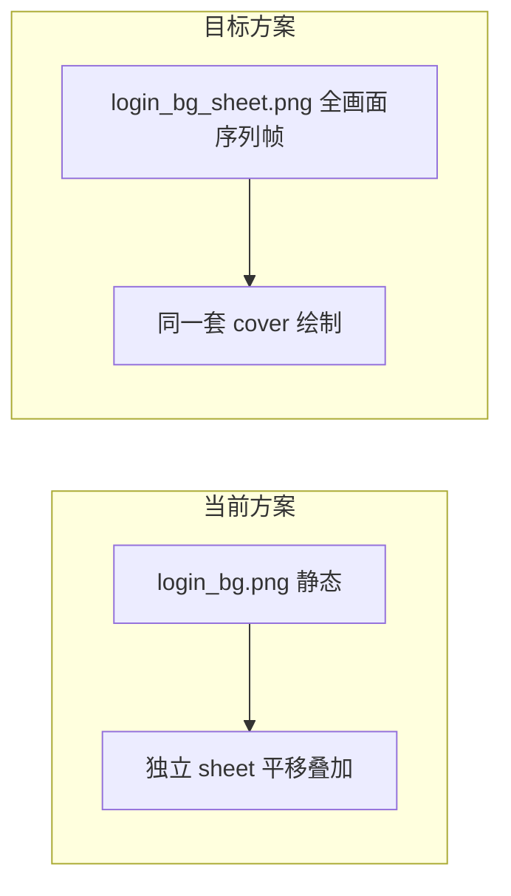

# 一体化动态登录背景（替换分层贴图）

## 问题根因

当前实现把鸟/船/瀑布做成**独立 sprite sheet**，在**窗口归一化坐标**上平移（鸟横飞、船往返），与 [`ui/UiTheme.cpp`](ui/UiTheme.cpp) 里底图的 **cover 缩放 + 居中偏移** 不一致，视觉上就像「一张小图在背景上滑动」，无法与山水融为一体。



## 目标

- **不再使用** `login_bird_sheet.png`、`login_boat_sheet.png`、`login_waterfall_sheet.png` 及复杂 `login_bg_anim.json` 图层配置
- 生成**全画面动态背景**（水墨仙侠山水，鸟/瀑布/渔夫渔船动效已烘焙进每一帧）
- 客户端只播放这一张序列帧图，绘制方式与静态底图相同（cover 铺满），玻璃态面板与退出按钮逻辑**保持不变**

## 1. 资源

| 文件 | 说明 |
|------|------|
| [`assets/ui/login_bg_sheet.png`](assets/ui/login_bg_sheet.png) | **新增**：横排 8–12 帧，每帧为完整 16:9 山水场景（含飞鸟、瀑布、渔船轻晃等），风格统一 |
| [`assets/ui/login_bg_anim.json`](assets/ui/login_bg_anim.json) | **简化为**：`{ "sheet": "login_bg_sheet.png", "frames": 10, "fps": 8 }` |
| `login_bg.png` | **删除或仅作 fallback 首帧**（推荐删除，避免双份资源） |
| `login_bird/boat/waterfall_sheet.png` | **删除** |

生成时注意：每帧构图一致，仅局部动效变化（水流、展翅、船体起伏），避免整幅画大幅位移。

## 2. 代码：简化 `LoginBackgroundAnim`

将 [`ui/LoginBackgroundAnim.h`](ui/LoginBackgroundAnim.h) / [`.cpp`](ui/LoginBackgroundAnim.cpp) 从「多图层 + 路径运动」改为**单张全画面序列帧播放器**：

- `load(exeDir)`：读简化 JSON，加载 `login_bg_sheet.png`
- `update(dt)`：仅递增 `frameIndex`（无 `x/speed/xMin/xMax`）
- `draw(target, coverTransform)`：按当前帧切 `sf::IntRect`，用与底图**相同的 scale 与 position** 绘制（不再传 `windowSize` 做独立定位）

建议在 [`ui/UiTheme.cpp`](ui/UiTheme.cpp) 的 `drawBackground` 中计算一次 cover 参数并复用：

```cpp
const float scale = std::max(windowW / texW, windowH / texH);
const float offsetX = (windowW - texW * scale) / 2.f;
const float offsetY = (windowH - texH * scale) / 2.f;
// 动态背景：m_loginAnim.draw(target, scale, offsetX, offsetY);
```

加载逻辑（[`UiTheme::loadLoginBackground`](ui/UiTheme.cpp)）调整为：

- 优先加载 `login_bg_sheet.png`（动态）
- 若 sheet 失败，回退 `login_bg.png`（静态）或渐变（与现有一致）
- 删除对分层 sheet 的加载与 warn 分支

## 3. 清理

- 删除 obsolete PNG 与 JSON 字段文档（更新 [`assets/ui/README.md`](assets/ui/README.md)、[`README.md`](README.md) 登录背景小节）
- `LoginBackgroundAnim` 内移除 `BirdAnim` / `BoatAnim` / `WaterfallAnim` 结构体及平移 `update` 逻辑
- **不改动**：玻璃态 `drawPanel`、`inputFill`、`LoginChrome` 退出按钮、[`app/GameApp.cpp`](app/GameApp.cpp) 的 `isPreGameState` 接入

## 4. 验证

1. `.\build_client.ps1` 编译通过
2. 选区/登录/注册各页：背景为**同一幅山水在动**，无独立贴图滑过画面
3. 窗口缩放（16:9 / 非 16:9）：动效与背景边缘仍对齐，无漂移
4. 删除 `login_bg_sheet.png`：回退静态图或渐变，不崩溃

## 范围外

- 不引入 GIF/MP4 解码依赖
- 不修改 `AppState::Game` 场景
