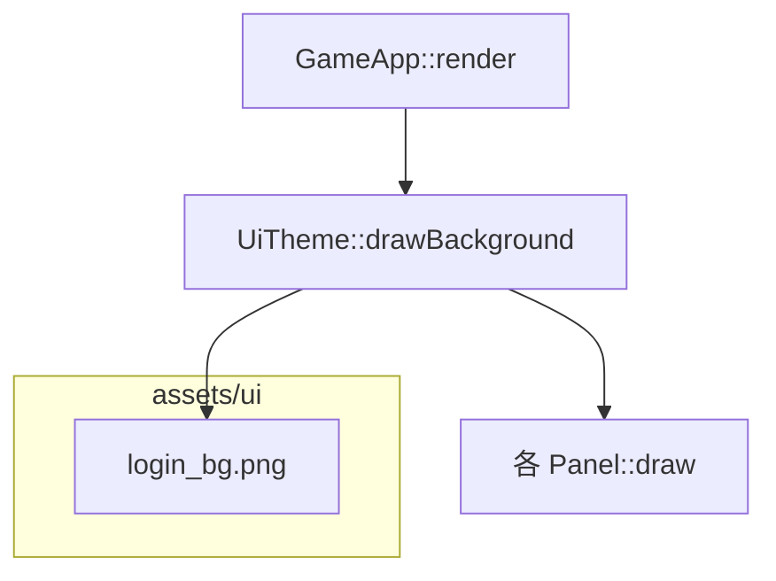

# 登录界面仙侠山水背景图

## 现状

所有登录前界面在 [`app/GameApp.cpp`](app/GameApp.cpp) 的 `render()` 中调用 `m_theme.drawBackground()`：

```349:388:app/GameApp.cpp
case AppState::ZoneHome:
    m_theme.drawBackground(m_window, m_window.getSize());
    ...
case AppState::AuthLogin:
    m_theme.drawBackground(m_window, m_window.getSize());
    m_authLoginPanel.draw(m_window);
```

当前 [`ui/UiTheme.cpp`](ui/UiTheme.cpp) 的 `drawBackground` 仅绘制上下两段青色/墨绿矩形，无图片资源。`assets/` 下仅有字体，CMake POST_BUILD 已复制整个 `assets/` 目录，新增图片会自动进 `build/bin/assets/`。

默认窗口 **1280×720**（[`config/client_config.json`](config/client_config.json)）。

## 目标效果

- 仙侠水墨山水：远山、树木、河流/水面、天空、飞鸟
- 色调偏淡墨青绿，留出画面中央区域放 UI 面板（不过分杂乱）
- 应用于：**ZoneHome、ServerList、LoadingAuth、AuthLogin、Register**（你已确认）



## 实施步骤

### 1. 生成并添加背景资源

- 用 AI 生成横版 **1920×1080** PNG：`assets/ui/login_bg.png`
- 画面描述：中国水墨仙侠山水，层叠远山、松树、河岸、平静水面、淡蓝天空与薄云、2–3 只飞鸟；整体柔和、偏留白，适合 UI 叠加
- 新增 [`assets/ui/README.md`](assets/ui/README.md) 简述用途与替换方式
- 在 [`assets/fonts/README.md`](assets/fonts/README.md) 或根 [`README.md`](README.md) 补一句：登录背景位于 `assets/ui/login_bg.png`

### 2. 扩展 UiTheme 加载与绘制

修改 [`ui/UiTheme.h`](ui/UiTheme.h) / [`ui/UiTheme.cpp`](ui/UiTheme.cpp)：

| 新增 | 说明 |
|------|------|
| `bool loadLoginBackground(const std::string& path)` | 加载纹理；失败打日志，回退渐变 |
| `bool hasLoginBackground() const` | 是否已加载 |
| 成员 `sf::Texture m_loginBg` + `bool m_loginBgLoaded` | 纹理状态 |

`drawBackground` 逻辑：

1. 若 `m_loginBgLoaded`：用 `sf::Sprite` **cover** 铺满窗口（按 `max(scaleX, scaleY)` 缩放，居中裁剪），再绘制
2. 否则：保留现有双色渐变（兼容缺图/加载失败）

参考 cover 计算（伪代码）：

```cpp
const float sx = windowW / texW;
const float sy = windowH / texH;
const float scale = std::max(sx, sy);
sprite.setScale(scale, scale);
sprite.setPosition((windowW - texW * scale) / 2.f, (windowH - texH * scale) / 2.f);
```

加载失败时 `ClientLogger::warn`，不崩溃。

### 3. GameApp 初始化时加载

在 [`app/GameApp.cpp`](app/GameApp.cpp) `init()` 中，`loadFont` 之后增加：

```cpp
m_theme.loadLoginBackground(PathUtil::joinPath(exeDir, "assets/ui/login_bg.png"));
```

无需改 `render()` 分支——各 `AppState` 已统一调用 `drawBackground`。

### 4. 面板可读性（最小调整）

现有 [`drawPanel`](ui/UiTheme.cpp) 填充色为 `sf::Color(45, 100, 105, 240)`，半透明金边面板在复杂背景上通常够用。

若实机对比度不足，仅微调 `panelFill()` alpha（例如 240→250）或加极淡全屏暗角矩形（可选，视生成图效果再定，非必做）。

### 5. 验证

- `.\build_client.ps1` 或 VS x64-Debug 编译
- 确认 `build/bin/assets/ui/login_bg.png` 存在
- 启动客户端，依次查看：选区首页 → 区列表 → 登录 → 注册，背景一致
- 删除 `login_bg.png` 后应回退渐变且无崩溃

## 不涉及

- 游戏内场景（`AppState::Game`）背景
- 动画/视差（静态图即可）
- 修改协议或网络逻辑

## 文件清单

| 文件 | 操作 |
|------|------|
| `assets/ui/login_bg.png` | 新增（AI 生成） |
| `assets/ui/README.md` | 新增 |
| `ui/UiTheme.h` | 扩展 API 与成员 |
| `ui/UiTheme.cpp` | 加载 + cover 绘制 |
| `app/GameApp.cpp` | init 中加载背景 |
| `README.md` | 可选一句资源说明 |
