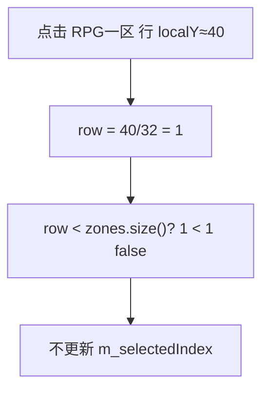

# 登录 UI：输入光标 + 区服下拉框

## 问题根因

| 需求 | 现状 |
|------|------|
| 输入框无光标 | [`TextInput`](Client/ui/widgets/TextInput.cpp) 只绘制边框与文字，无 caret 逻辑 |
| 区服点击无反应 | **坐标 bug**：列表从 `top + 36` 绘制，但点击用 `(localY / 32)` 当 row，点第一行区服时 `row=1`，而 `zones.size()==1` 越界 → 不选中 |
| 需要下拉列表 | 当前 [`ZoneSelectPanel`](Client/ui/ZoneSelectPanel.cpp) 始终展开列表，交互也不符合下拉预期 |



你已选择 **下拉框** 方案。

---

## 方案 1：TextInput 闪烁光标（登录 + 注册）

修改 [`Client/ui/widgets/TextInput.h`](Client/ui/widgets/TextInput.h) / [`.cpp`](Client/ui/widgets/TextInput.cpp)：

- 新增成员：`m_cursorPos`（字节位置，默认文末）、`m_blinkElapsed`、`m_cursorVisible`
- 新增 `void update(float dt)`：聚焦时每 0.5s 切换 `m_cursorVisible`
- 输入/删除时更新 `m_cursorPos = m_text.size()`（当前仅末尾输入，足够）
- `draw()`：聚焦且 `m_cursorVisible` 时，在文字末尾绘制 2px 宽竖线（`sf::RectangleShape`）

**光标 X 坐标**：在 [`UiTheme`](Client/ui/UiTheme.h) 增加：

```cpp
float measureTextWidth(const std::string& utf8, unsigned size) const;
```

实现用 `sf::Text(TextUtil::utf8ToSfString(utf8), m_font, size).getLocalBounds().width`（字体未加载返回 0）。

**帧更新链路**：

- [`LoginPanel`](Client/ui/LoginPanel.h) / [`RegisterPanel`](Client/ui/RegisterPanel.h) 增加 `update(float dt)`，转发给各 `TextInput`
- [`GameApp::update`](Client/app/GameApp.cpp) 在 `Login` / `Register` 状态下调用对应 panel 的 `update(dt)`

---

## 方案 2：ZoneSelectPanel 改为下拉框

重构 [`ZoneSelectPanel`](Client/ui/ZoneSelectPanel.h) / [`.cpp`](Client/ui/ZoneSelectPanel.cpp)（保留类名，避免大面积改名）：

### 交互

- **折叠态**（默认）：单行框显示当前选中区名，或 `u8"请选择仙界"`；右侧 `▼` 指示
- **点击折叠框**：展开/收起 `m_dropdownOpen`
- **展开态**：在框下方绘制区服列表（每项 `m_rowHeight=32`）
- **点击列表项**：选中 enabled 区服，`m_dropdownOpen=false`，触发可选回调供 LoginPanel 刷新登录按钮
- **点击框外**：收起下拉（在 `handleEvent` 中检测 `!m_bounds.contains(pos)` 且不在展开列表区域时关闭）

### 布局常量

| 常量 | 值 |
|------|-----|
| `m_headerHeight` | 36（标题「选择仙界」+ 折叠框） |
| `m_rowHeight` | 32 |
| 折叠框区域 | `m_bounds` 内 header 下方单行 |

### 点击修复

列表行索引统一为：

```cpp
const float listTop = m_bounds.top + m_headerHeight;
const int row = static_cast<int>((pos.y - listTop) / m_rowHeight);
```

仅在 `m_dropdownOpen && row >= 0 && row < zones.size()` 时更新选中。

### 初始选中

- `setup()` 或 `selectZoneId()` 后：若仅 1 个 enabled 区服，可自动选中（改善单区体验）
- [`LoginPanel::applyLocalSettings`](Client/ui/LoginPanel.cpp) 仍调用 `selectZoneId(lastZoneId)`

### LoginPanel 布局调整

[`LoginPanel::setup`](Client/ui/LoginPanel.cpp) 将区服控件高度从 `140` 改为 **折叠高度 72**（标题 + 单行框）；展开时列表向下延伸，可动态扩大绘制区域或使用 `m_bounds.height = header + rowCount * rowHeight`（展开时更新 bounds 便于 hit test）。

建议：`m_bounds.height` 在展开时设为 `headerHeight + zones.size() * rowHeight`，折叠时为 `headerHeight + comboRowHeight(36)`，保证点击检测与绘制一致。

### 可选：测试多区配置

在 [`config/serverlist.xml`](Client/config/serverlist.xml) 增加 1–2 个 disabled/enabled 示例区（如 `RPG二区`），便于验证下拉与维护中灰显；不影响现有 `RPG一区`。

---

## 方案 3：文档（一行）

[`Client/README.md`](Client/README.md) Run/UI 节补充：区服为下拉选择；输入框聚焦时显示闪烁光标。

---

## 验证

1. **登录页**：点击账号/密码框，可见闪烁竖线光标；输入字符光标跟随文末
2. **注册页**：三个输入框同样有空标
3. **区服**：点击折叠框展开列表；点击 `RPG一区` 后折叠框显示区名，`踏入仙途` 可点（账号非空时）
4. 若 `serverlist.xml` 增加多区：下拉列表可滚动/逐项可选，维护中区灰显不可选
5. Release / Debug 各编译通过
