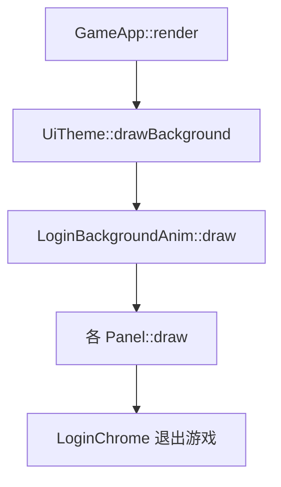

# 登录界面融合、动效背景与退出按钮

## 目标

| 需求 | 方案 |
|------|------|
| 操作框与背景融合 | `UiTheme` 在已加载背景时切换「玻璃态」配色与多层 `drawPanel` |
| 背景动图（序列帧） | 静态底图 + `LoginBackgroundAnim` 叠加鸟/船/瀑布 sprite sheet |
| 退出游戏 | 全登录前流程底部固定「退出游戏」按钮，点击 `m_window.close()` |

覆盖界面（你已确认）：**ZoneHome、ServerList、LoadingAuth、AuthLogin、Register、Connecting**。



---

## 1. 面板与背景融合（[`ui/UiTheme.cpp`](ui/UiTheme.cpp)）

**问题**：当前 `panelFill()` 为 `(20,40,45,210)` 实心块 + 2px 金色描边，叠在山水图上显突兀；[`TextInput`](ui/widgets/TextInput.cpp) 另用硬编码 `(10,25,28,200)`。

**改动**（仅当 `hasLoginBackground()` 为 true 时）：

- **全屏轻遮罩**：`drawBackground` 在底图与动画层之后、UI 之前，叠一层 `sf::Color(15, 25, 30, 45)` 全屏矩形，统一色调。
- **玻璃态面板** `drawPanel` 三层：
  1. 外扩 12px 柔光：`Color(10, 20, 25, 50)`
  2. 主体填充：`(28, 38, 42, 120)`（低 alpha 墨青）
  3. 描边：金色 `(212, 175, 55, 140)`，厚度 1px
- **控件配色**：`panelFill` / `buttonNormal` / `buttonHover` / 新增 `inputFill()` 在 `hasLoginBackground()` 时返回更透明、偏水墨灰绿的色值；[`Button`](ui/widgets/Button.cpp) 已走 theme，[`TextInput`](ui/widgets/TextInput.cpp) 改为 `m_theme->inputFill()`。
- 无背景图时保持现有实色样式，行为不变。

---

## 2. 序列帧动效背景

SFML 2.x 不支持 GIF；采用 **静态底图 + 多张横向/纵向序列帧 PNG**，由新类驱动。

### 2.1 资源（AI 生成，放入 [`assets/ui/`](assets/ui/)）

| 文件 | 说明 |
|------|------|
| `login_bg.png` | 已有静态山水底图（无鸟船瀑布主体动画，避免与序列帧重叠） |
| `login_bird_sheet.png` | 横排 4 帧，飞鸟展翅循环 |
| `login_boat_sheet.png` | 横排 4 帧，渔夫小船轻微起伏 |
| `login_waterfall_sheet.png` | 横排 6–8 帧，瀑布水流循环 |
| `login_bg_anim.json` | 图层位置、帧数、fps、运动路径（归一化 0–1 坐标） |

`login_bg_anim.json` 示例结构：

```json
{
  "birds": [
    { "sheet": "login_bird_sheet.png", "frames": 4, "fps": 10, "y": 0.14, "speed": 0.045, "scale": 0.08 }
  ],
  "boat": {
    "sheet": "login_boat_sheet.png", "frames": 4, "fps": 4,
    "y": 0.70, "xMin": 0.18, "xMax": 0.62, "speed": 0.012, "scale": 0.12
  },
  "waterfall": {
    "sheet": "login_waterfall_sheet.png", "frames": 8, "fps": 14,
    "x": 0.74, "y": 0.10, "w": 0.09, "h": 0.38
  }
}
```

坐标相对窗口尺寸，与 `drawBackground` 的 cover 缩放一致。

### 2.2 新类 `LoginBackgroundAnim`

新增 [`ui/LoginBackgroundAnim.h`](ui/LoginBackgroundAnim.h) / [`.cpp`](ui/LoginBackgroundAnim.cpp)：

- `bool load(const std::string& exeDir)`：读 JSON + 加载三张 sheet
- `void update(float dt)`：帧索引递增、鸟横向飞行（出屏重置）、船在 `xMin`–`xMax` 间往返、瀑布循环帧
- `void draw(sf::RenderTarget&, sf::Vector2u windowSize)`：按当前帧 `sf::IntRect` 切图绘制 `sf::Sprite`
- 加载失败：仅记录 warn，不影响静态底图

### 2.3 接入 `UiTheme` / `GameApp`

- [`UiTheme`](ui/UiTheme.h) 持有 `LoginBackgroundAnim m_loginAnim`
- `loadLoginBackground` 成功后调用 `m_loginAnim.load(exeDir)`
- `drawBackground`：底图 cover → `m_loginAnim.draw` → 全屏轻遮罩
- 新增 `UiTheme::updateLoginBackground(float dt)`
- [`GameApp::update`](app/GameApp.cpp)：在 `ZoneHome` / `ServerList` / `LoadingAuth` / `AuthLogin` / `Register` / `Connecting` 分支调用 `m_theme.updateLoginBackground(dt)`

[`CMakeLists.txt`](CMakeLists.txt) 将新 `.cpp` 纳入现有 APP 源文件 glob（`ui/*.cpp` 已覆盖）。

---

## 3. 「退出游戏」按钮（全登录前界面）

新增轻量 [`ui/LoginChrome.h`](ui/LoginChrome.h) / [`.cpp`](ui/LoginChrome.cpp)：

- 单颗 [`Button`](ui/widgets/Button.h)，文案 `退出游戏`
- 固定于窗口底部居中：`y = viewSize.y - 56`，宽 160、高 40（与「登录游戏」同规格）
- `setOnExit(std::function<void()>)`；`setup` / `handleEvent` / `draw` / `onResize`

[`GameApp`](app/GameApp.cpp)：

- 成员 `LoginChrome m_loginChrome`
- `init()` 中 `setup` + 回调 `m_window.close()`
- `processEvents` / `render` / `onResize`：对上述 6 个 `AppState` 调用 chrome（**Game 场景不显示**）
- `Connecting` 状态也允许退出（直接关窗）

不修改各 Panel 内部布局，避免区列表底部按钮拥挤。

---

## 4. 文档

- 更新 [`assets/ui/README.md`](assets/ui/README.md)：列出序列帧资源与 `login_bg_anim.json` 字段
- [`README.md`](README.md) 登录背景小节补一句：动效为序列帧叠加

---

## 5. 验证

1. `.\build_client.ps1` 编译通过
2. 选区首页：面板半透明、背景鸟/船/瀑布可见动画
3. 切换区列表 / 登录 / 注册：背景动画连续、面板风格一致
4. 各页底部「退出游戏」可关闭客户端
5. 删除某 sheet 或 JSON：回退静态底图 + 玻璃态仍可用，不崩溃

## 风险与范围

- 序列帧需与底图构图对齐（JSON 中微调 `x/y/scale`）；首版用归一化坐标便于调参
- 序列帧 PNG 总体积约 2–4MB，可接受；不引入 GIF/视频依赖
- **不在本次范围**：游戏内 `AppState::Game` 场景、网络协议改动
