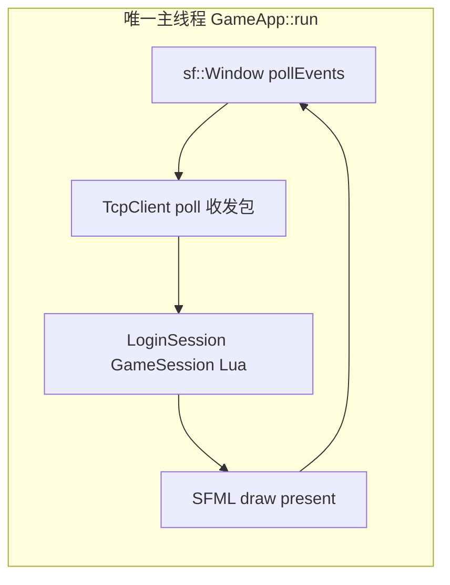
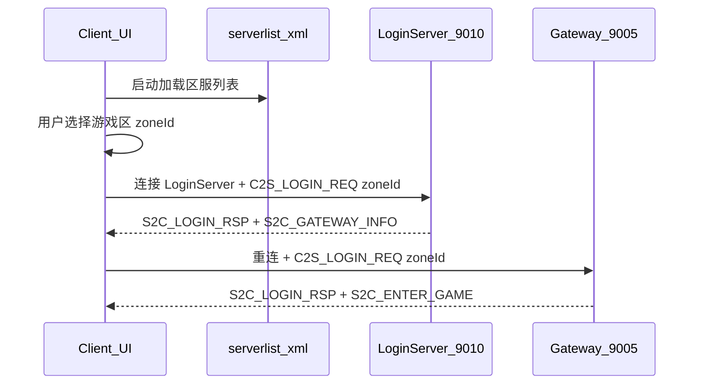
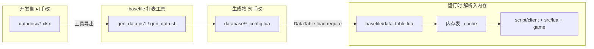
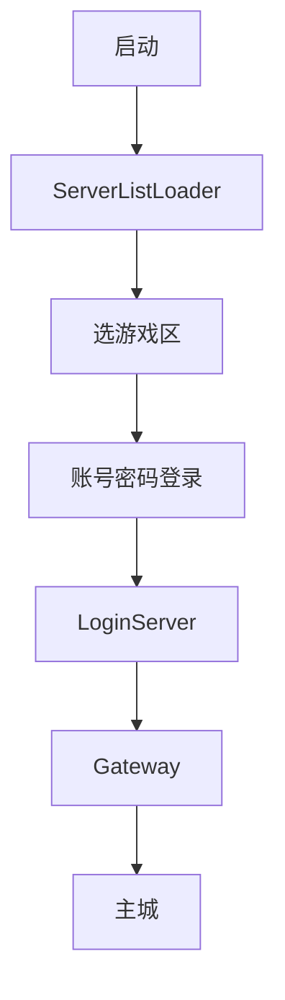
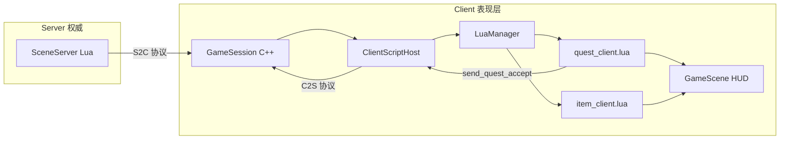
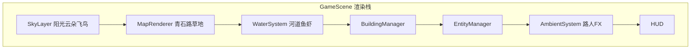

# MMORPG 2D 客户端（C++17 + SFML）实施计划

## 现状与约束

| 路径 | 状态 |
|------|------|
| [`d:\Study\RPG_Client\Client`](d:\Study\RPG_Client\Client) | 空目录 |
| [`d:\Study\RPG_Client\Common`](d:\Study\RPG_Client\Common) | 尚未创建 |
| [`d:\Study\RPG_Client\Client\sdk`](d:\Study\RPG_Client\Client\sdk) | 尚未创建（客户端底层库封装） |
| [`d:\Study\RPG_Client\Client\map`](d:\Study\RPG_Client\Client\map) | 尚未创建（地图资源） |
| [`d:\Study\RPG_Client\Client\datadosc`](d:\Study\RPG_Client\Client\datadosc) | 尚未创建（策划 Excel 原始表） |
| [`d:\Study\RPG_Client\Client\database`](d:\Study\RPG_Client\Client\database) | 尚未创建（打表工具生成的 `.lua`，勿手改） |
| [`d:\Study\RPG_Client\Client\basefile`](d:\Study\RPG_Client\Client\basefile) | 尚未创建（打表/配表加载工具） |
| [`d:\Study\RPG_Client\3Party`](d:\Study\RPG_Client\3Party) | 尚未创建（SFML、Lua 等第三方库） |
| [`d:\Study\RPG_Server`](d:\Study\RPG_Server) | 实际服务端（C++17，9 进程 TCP 架构） |

你已选择：**Client 用 C++17 + SFML**；**Server 保持外部路径**，本仓库只建 `Client/` + `Common/`。

### 运行与交付约束（强制）

| 约束 | 说明 |
|------|------|
| **交付形态** | CMake 构建产出 **Windows `.exe` 可执行文件**（如 `Client/build/bin/RPGClient.exe`），双击即可启动游戏 |
| **目标平台** | **现阶段仅 PC（Windows）**；不做 Android/iOS/Web/macOS/Linux 移植；CMake/脚本/路径均按 Win32 编写 |
| **线程模型** | **单线程**：仅一个主线程；渲染、输入、网络轮询、Lua、逻辑更新全在 `GameApp::run()` 主循环内顺序执行 |





线上帧格式（与 Server 一致，见 [`RPG_Server/sdk/net/NetDefine.h`](d:\Study\RPG_Server\sdk\net\NetDefine.h)）：

```
[bodyLen:uint16][module:uint8][sub:uint8][body...]  // 头 6 字节
```

---

## 第一阶段目标（本次范围）

- 仙侠风 **登录界面**：**先选游戏区**（读 `serverlist.xml`，与 LoginServer **ZoneInfo** 一致）→ 账号、密码、记住账号、注册
- 仙侠风 **注册界面**：账号、密码、确认密码、注册/返回
- 登录成功后进入 **仙侠风 2D 主城**（mapID=1002）：**青石路为主、草地点缀**；**阳光与云朵**天象；**穿城河道**（流水、鱼、虾）；建筑、摆摊 NPC、路人、飞鸟等
- **仙侠风人物**：本地玩家与远端实体使用统一仙侠精灵（道袍/发髻/轻甲等多套占位）
- 基础玩法壳：WASD/方向键移动、视野内其他实体显示、心跳保活
- **Lua 脚本层**：内嵌 Lua 5.4，前期由脚本驱动**任务**与**道具**的客户端逻辑（接取/进度/奖励展示、道具增删与本地背包模型）
- **不做完整 UI 面板**：背包、商城、拍卖行、任务面板的正式界面后续再加；首版通过 Lua + HUD/日志提示验证脚本链路

---

## 0. 客户端编码规范（强制）

### 0.1 头文件注释

Client 目录下**每一个 `.h` 文件**必须包含详细注释，风格对齐 Server 侧 [`LuaManager.h`](d:\Study\RPG_Server\SceneServer\LuaManager.h)：

- 文件头：`@file`、`@brief`、职责说明、与哪些模块协作
- 每个 **class/struct/enum**：`@brief` 及必要时的 `@note`
- 每个 **public 方法/成员**：`@brief`、`@param`、`@return`（有返回值时）
- 非显而易见的协议字段、状态机转移、线程/生命周期约束需 `@note`

示例结构：

```cpp
/**
 * @file    TcpClient.h
 * @brief   客户端 TCP 连接与非阻塞收发
 *
 * 职责：
 * - 维护 WinSock 连接与接收缓冲
 * - 按 MsgHeader.bodyLen 切帧并回调上层
 *
 * 线程：仅在 GameApp 主线程调用，非线程安全。
 */
```

### 0.2 声明与实现分离

Client 内**每一个类**必须成对存在：

| 文件 | 内容 |
|------|------|
| `Foo.h` | 类声明、public 接口、必要 inline 仅限 trivial getter |
| `Foo.cpp` | 全部方法实现 |

约束：

- **禁止**在 `.h` 中写非 trivial 的方法体（除 `= default` / `= delete` / 简单 getter）
- **禁止** header-only 类（`TextInput`、`LuaManager` 等都必须 `.h + .cpp`）
- 纯枚举/常量（如 `AppState.h` 仅含 `enum class AppState`）可只有 `.h`，不算类
- `main.cpp` 仅入口，不含业务类实现

### 0.3 命名与目录

- 头文件统一 `.h`（不用 `.hpp`）
- 一个类一个翻译单元，文件名与类名一致（`GameApp.h` / `GameApp.cpp`）

### 0.4 日志目录（强制）

- 客户端**所有**日志（网络、Lua、UI、场景、错误栈）统一写入 **`Client/logs/`**（运行时相对工作目录 `./logs/`）
- 启动时若目录不存在则自动创建
- 实现 `ClientLogger`（位于 **`sdk/log/`**，`.h + .cpp`）：按日滚动文件 `logs/client_YYYYMMDD.log`，同时可选控制台 INFO 以上级别
- C++ 与 Lua（`log_info` / `log_warn` / `log_err` 绑定）均走同一 Logger，**禁止**散落 `std::cout` 或写其他路径
- `client_config.json` 可配置 `logLevel`、`logToConsole`，但**路径固定**为 `./logs/`

### 0.5 单线程架构（强制）

- **禁止** `std::thread`、`std::async`、线程池、独立网络线程、SFML 多窗口多线程渲染
- **禁止** 在模块内启动后台定时器线程；心跳/重连计时用主循环 `deltaTime` 或帧计数
- **网络**：`TcpClient` 使用 **非阻塞 WinSock** + 主循环每帧 `poll()` 读/写；LoginSession/GameSession 为**状态机**，在 `update()` 中推进，不用阻塞 `connect`/`recv`
- **Lua**：`lua_State` 仅在主线程调用；`OnTick` 由主循环驱动
- 所有 `.h` 文件头注释中注明：**「线程：仅主线程，非线程安全」**（除非未来明确变更）
- 工作目录：以 **`.exe` 所在目录** 为基准解析 `./logs/`、`map/`、`database/`、`basefile/`、`assets/`、`script/`、`config/`

---

## 1. 建立 Common 共享层

在 [`Common/`](d:\Study\RPG_Client\Common) 放置 Client 与 Server 必须一致的 wire 定义：

| 文件 | 来源 | 作用 |
|------|------|------|
| `ClientMsg.h` | 复制 [`RPG_Server/common/ClientMsg.h`](d:\Study\RPG_Server\common\ClientMsg.h) | 模块号、消息 ID、C2S/S2C 结构体 |
| `NetDefine.h` | 复制 [`RPG_Server/sdk/net/NetDefine.h`](d:\Study\RPG_Server\sdk\net\NetDefine.h) | `MsgHeader`、`MSG_HEADER_SIZE` |
| `MsgId.h` | 复制 [`RPG_Server/sdk/net/MsgId.h`](d:\Study\RPG_Server\sdk\net\MsgId.h) | `makeMsgId` / `msgModule` / `msgSub` |

**协议补全（Common 内新增，需同步到外部 Server）：**

当前 `C2S_REGISTER_REQ` / `S2C_REGISTER_RSP` 仅有枚举、无结构体；LoginServer 也未处理注册子消息。在 `ClientMsg.h` 中补充：

```cpp
struct Msg_C2S_RegisterReq {
    char account[32];
    char password[32];
};
struct Msg_S2C_RegisterRsp {
    int32_t code;      // 0=成功, 1=账号已存在, -1=服务器错误
    char    msg[64];
};
```

> 改协议后需将同一份 `ClientMsg.h` 手动同步到 `d:\Study\RPG_Server\common\ClientMsg.h`（Server 仍引用其本地 copy）。

---

## 2. 外部 Server 需配合的改动（不在 RPG_Client 仓库内）

为满足「注册界面」与「主城出生」，需在 [`d:\Study\RPG_Server`](d:\Study\RPG_Server) 做最小改动（可单独 PR/提交）：

### 2.1 注册流程（LoginServer）

在 [`LoginServer/LoginAuthService.cpp`](d:\Study\RPG_Server\LoginServer\LoginAuthService.cpp) 增加 `onClientRegister`：

- `sub == 0x03` 时处理 `Msg_C2S_RegisterReq`
- 账号已存在 → `S2C_REGISTER_RSP code=1`
- 不存在 → `INSERT INTO CharBase (name, map_id, pos_x, pos_y, pos_z) VALUES (...)` → `code=0`
- **不**下发 `S2C_GATEWAY_INFO`（注册成功后客户端回到登录页）

[`LoginServer/LoginServer.cpp`](d:\Study\RPG_Server\LoginServer\LoginServer.cpp) 的 `onClientMessage` 按 `sub` 分发 login/register。

### 2.2 主城出生点（map 1002）

当前 [`tables/init.sql`](d:\Study\RPG_Server\tables\init.sql) 默认 `map_id=1001`（新手村），与需求「主城出生」不符。

建议改动：

- `CharBase.map_id` 默认值改为 **1002**
- 新建角色 INSERT 时显式写入 `map_id=1002, pos_x=10, pos_y=0, pos_z=8`（与 [`seed_test_data.sql`](d:\Study\RPG_Server\tables\seed_test_data.sql) 中 test002 一致）
- 同步修改 LoginAuthService 自动建号、RecordServer 建号 fallback（`mapID ? mapID : 1001` → `1002`）

### 2.3 密码（可选但建议）

`CharBase` 目前无密码列，[`RecordServer.cpp`](d:\Study\RPG_Server\RecordServer\RecordServer.cpp) 注释写明 password 不参与校验。若要做真实登录校验：

- `init.sql` 增加 `password_hash VARCHAR(64)` 列
- Register 写入 hash；Login/LoginVerify 比对 hash
- 客户端仍传 32 字节明文（与现有 `Msg_C2S_LoginReq` 兼容），Server 侧 hash 后比较

若暂不改 DB，客户端 UI 仍保留密码框，Server 继续「仅按角色名存在性登录」——需在 Client README 标明为临时行为。

### 2.4 游戏区选择与 ZoneInfo 对齐（LoginServer）

当前 LoginServer [`LoginAuthService::sendGatewayInfo`](d:\Study\RPG_Server\LoginServer\LoginAuthService.cpp) 使用 **`ZoneInfoStore::pickRoundRobin`**，客户端无法指定区服。需配合改造：

**（1）Common 扩展 `Msg_C2S_LoginReq`：**

```cpp
struct Msg_C2S_LoginReq {
    char     account[32];
    char     password[32];
    uint32_t zoneId;    /**< 客户端所选游戏区号，对应 ZoneInfo.zone_id */
    uint8_t  gameType;  /**< 游戏类型，对应 ZoneInfo.game_type，默认 0 */
    uint8_t  reserved[3];
};
```

**（2）LoginServer `onClientLogin`：**

- 校验 `zoneInfoStore().isZoneEnabled(gameType, zoneId)`
- 用 **`gatewayRegistry().pickByServerId(zoneId, gw)`** 替代轮询（与 [`ZoneInfoStore.h`](d:\Study\RPG_Server\LoginServer\ZoneInfoStore.h) 注释「gatewayServerId 与 zone_id 对齐」一致）
- 区服维护中（enabled=0）→ `S2C_LOGIN_RSP code!=0`

**（3）ZoneInfo 数据源：**

- MySQL 表 [`ZoneInfo`](d:\Study\RPG_Server\tables\init.sql)（`zone_id`, `game_type`, `name`, `ip`, `super_port`, `enabled`）
- LoginServer 启动 `ZoneInfoStore::loadFromDb` 加载；**客户端 `serverlist.xml` 区列表须与此表字段一一对应**

> 注意：Server 内部还有 DB 表 `ServerList`（区内进程拓扑）与根目录 **`loginserverlist.xml`**（Super 外联），与客户端 **`serverlist.xml`** 不是同一文件，勿混淆。

---

## 3. 仓库目录与 Client 工程结构

### 3.0 仓库根目录（目标）

```
RPG_Client/
  Common/                 # 共享 wire 协议（ClientMsg.h 等，Server/Client 对齐）
  3Party/                 # 第三方库 SFML、Lua（见 §3a）
  Client/                 # 客户端全部内容（代码 + 资源 + 配表）
    sdk/                  # 底层库封装（见 §3b）
    datadosc/             # 策划 Excel 原始表（源数据，见 §3c）
    map/                  # 地图资源（见 §3c）
    database/             # 打表输出 *.lua（生成物，见 §3c）
    basefile/             # 打表工具 + 运行时解析加载（见 §3c）
    src/                  # 业务逻辑（app/ui/game/lua）
    script/               # 客户端 Lua 脚本
    assets/               # UI/角色/特效等非地图美术
    config/
      client_config.json
      serverlist.xml            # 游戏区列表 + LoginServer 入口（见 §3e、§5）
    CMakeLists.txt
    README.md
```

**目录职责一览：**

| 目录 | 职责 | 与 Server 对齐 |
|------|------|----------------|
| `Client/sdk/` | 时间、随机数、协议封解包、TCP、日志等 C++ 底层 API | 对标 [`RPG_Server/sdk/`](d:\Study\RPG_Server\sdk) 子集 |
| `Client/datadosc/` | **策划 Excel 原始表**（唯一可手改源） | 对标 Server [`DataDoc/`](d:\Study\RPG_Server\DataDoc)（目录名 Client 用 `datadosc`） |
| `Client/basefile/` | **打表工具** + **运行时解析**（`data_table.lua` 等） | 对标 [`RPG_Server/basefile/`](d:\Study\RPG_Server\basefile) |
| `Client/database/` | **打表输出** `*.lua`（工具生成，**禁止手改**） | 对标 [`RPG_Server/database/`](d:\Study\RPG_Server\database) |
| `Client/map/` | 全部地图资源 | 对标 Server `map/` |
| `Client/assets/` | 登录 UI、人物精灵、飞鸟特效等**非地图**资源 | Client 独有 |
| `Client/config/serverlist.xml` | **客户端游戏区配置**（区列表 + LoginServer 地址） | 字段对齐 LoginServer **ZoneInfo** 表 |

### 3.1 Client 源码与资源树

```
Client/
  sdk/                          # 底层封装（每模块 .h + .cpp，详细注释）
    net/
      TcpClient.h / TcpClient.cpp
      ProtocolCodec.h / ProtocolCodec.cpp   # MsgHeader 组包/拆包
      ClientMsgHandler.h / ClientMsgHandler.cpp  # module/sub 分发、与 Common 结构体绑定
    time/
      TimeUtil.h / TimeUtil.cpp               # 毫秒时钟、deltaTime、心跳间隔
    math/
      Random.h / Random.cpp                   # 随机整数/浮点（氛围 NPC、飞鸟用）
    log/
      ClientLogger.h / ClientLogger.cpp       # 统一写 ./logs/
    util/
      PathUtil.h / PathUtil.cpp
      ServerListLoader.h / ServerListLoader.cpp  # 解析 config/serverlist.xml
  datadosc/                     # Excel 源表（开发期，不随 exe 分发）
    item.xlsx
    quest.xlsx
    building.xlsx
    README.md
  map/                          # 全部地图资源
    1002/                       # 主城 mapID
      tileset.png
      ground.json               # 地面：青石路为主 + 草地点缀（tile 类型比例见 §6.6）
      river.json                # 河道中心线与宽度
      water.json                # 水面动画/流向配置
      river_fauna.json          # 鱼、虾等水生动物刷新点
      collision.json            # 碰撞（含河岸，玩家不可入水）
      buildings.json
      buildings/
      water/                    # 水面帧、波纹、河岸贴图
      fauna/                    # 鱼、虾精灵与动画
      ambient.json
    README.md
  database/                     # gen_data 输出 *.lua（AUTO-GENERATED，勿手改）
    item_config.lua
    quest_config.lua
    building_config.lua
  basefile/                     # 打表工具 + 运行时解析入内存
    data_table.lua              # DataTable.load → _cache 内存表
    init.lua
    gen_data.ps1                # datadosc/*.xlsx → database/*_config.lua
    gen_data.sh
    README.md
  config/
    client_config.json
    serverlist.xml
  src/
    fonts/
    ui/
    characters/
    effects/
  script/client/...
  src/
    main.cpp
    app/...
    net/                        # 业务会话（调用 sdk/net）
      LoginSession.h / LoginSession.cpp
      GameSession.h / GameSession.cpp
    lua/...
    ui/...
    game/
      MapRenderer.h / MapRenderer.cpp       # 青石路/草地瓦片层
      WaterSystem.h / WaterSystem.cpp       # 河道水面、鱼/虾游动
      AmbientSystem.h / AmbientSystem.cpp   # 阳光天象、云朵、飞鸟、路人
    util/
      LocalSettings.h / LocalSettings.cpp
      ConfigLoader.h / ConfigLoader.cpp
  CMakeLists.txt
  logs/
  assets/                       # 非地图美术
```

CMake：

- 源码：`file(GLOB_RECURSE SDK_SRC sdk/*.cpp)` + `src/*.cpp`
- `include_directories` → `../Common`、`sdk/`、`3Party/...`
- POST_BUILD 复制到 exe 同目录：`map/`、`database/`、`basefile/`、`script/`、`assets/`、`config/`（含 **serverlist.xml**）
- **`datadosc/` 不复制**（仅开发/打表；运行时通过 `database/` + `data_table.lua` 加载内存）
- Lua `package.path` 含 `database/?.lua`、`basefile/?.lua`、`script/?.lua`（见 §3c）

---

## 3b. 底层库 sdk/（Client 专用）

`Client/sdk/` 封装所有可复用底层能力；**业务层（`src/`）禁止直接 WinSock / 手写 MsgHeader / 裸文件 IO 写日志**，统一走 sdk API。

| 子模块 | 主要类 | 职责 |
|--------|--------|------|
| `sdk/net/` | `TcpClient` | 非阻塞 TCP（单线程 poll） |
| | `ProtocolCodec` | 基于 [`Common/NetDefine.h`](d:\Study\RPG_Client\Common\NetDefine.h) 组包/拆包 |
| | `ClientMsgHandler` | 按 `ClientModule`/`ClientMsgID` 注册回调；`encodeLoginReq` 等 typed 辅助 |
| `sdk/time/` | `TimeUtil` | `nowMs()`、`deltaSeconds(frame)`、心跳/超时判断 |
| `sdk/math/` | `Random` | `randInt(min,max)`、`randFloat()`；飞鸟/NPC 氛围用 |
| `sdk/log/` | `ClientLogger` | 写 `./logs/client_YYYYMMDD.log` |
| `sdk/util/` | `PathUtil` | `getExeDir()`、`mapPath(mapId)`、`databasePath()` |

与 [`Common/`](d:\Study\RPG_Client\Common) 的分工：

- **Common**：协议号、结构体定义（与 Server 字节级一致）
- **sdk/net**：运行时封解包、发送、连接管理
- **src/net**：LoginSession/GameSession 状态机（业务编排，调用 sdk）

---

## 3c. 配表管线：datadosc/ → database/ → basefile/ → 应用

策划数据遵循 **三阶段、单向流动**；与 Server「DataDoc → gen_data → database → DataTable.load」一致，Client 目录名使用 **`datadosc/`**。



### datadosc/ — Excel 原始表（唯一数据源）

- 路径：**`Client/datadosc/`**
- 存放策划 **`.xlsx` 源文件**，如 `item.xlsx`、`quest.xlsx`、`building.xlsx`
- **仅在此目录修改策划数值**；改表后必须重新跑打表工具
- 可与 Server [`DataDoc/`](d:\Study\RPG_Server\DataDoc) 共用同一份 Excel（复制或 symlink），保证双端 ID/字段一致
- 提供 `datadosc/README.md`：sheet 名、主键列、导出模块名映射（如 `item.xlsx` → `item_config`）

### basefile/ — 打表工具 + 运行时解析

**（1）打表工具（开发期，`datadosc/` → `database/`）**

| 文件 | 作用 |
|------|------|
| `gen_data.ps1` | Windows 主入口：扫描 `datadosc/*.xlsx`，输出 `database/*_config.lua` |
| `gen_data.sh` | 可选；调用 `tools/gen_datadoc.py` 或与 Server 同脚本 |
| `README.md` | 打表命令、依赖（Python/openpyxl 等）、输出命名规则 |

输出约定：

- 每个 Excel 对应一个 **`database/{name}_config.lua`**
- 文件头注释 `-- AUTO-GENERATED from datadosc/xxx.xlsx`，**禁止手改**
- 内容格式：`return { [id] = { field = value, ... }, ... }`

**（2）运行时解析（`database/` → 内存）**

对齐 Server [`basefile/data_table.lua`](d:\Study\RPG_Server\basefile\data_table.lua)：

| 文件 | 作用 |
|------|------|
| `data_table.lua` | `DataTable.load(moduleName)`：`require` `database` 模块并 **缓存到 `_cache` 内存表** |
| `init.lua` | 启动时 `require("data_table")` |
| API | `getById` / `forEach` / `filter` / `clearCache`（热更前清缓存） |

**内存加载流程：**

1. `LuaManager` 初始化时设置 `package.path` 含 `database/?.lua`
2. 业务首次 `DataTable.load("item_config")` → `require("item_config")` → 解析 Lua 表 → 写入 **`_cache["item_config"]`**
3. 后续查询命中内存缓存，不再读盘
4. `script/client/*.lua`（任务/道具/建筑文案）与 `ScriptBindings`（C++ 经 Lua 查表）均通过 **DataTable API** 访问，不直接 `dofile` database 文件

C++ 侧（可选）：`ScriptBindings.get_config(id, field)` 内部调 Lua `DataTable.getById`，保持**单一内存数据源**。

### database/ — 打表输出 `.lua`（生成物）

- 路径：**`Client/database/`**
- 全部由 **`basefile/gen_data.*`** 从 `datadosc/` 导出，后缀 **`.lua`**
- 首版：`item_config.lua`、`quest_config.lua`、`building_config.lua`
- **禁止**在 `database/` 手改；需改数值请编辑 `datadosc/*.xlsx` 后重新 `gen_data`
- 随 exe 分发（POST_BUILD 复制），供运行时 `DataTable.load` 加载

### map/ — 全部地图资源

- 按 **mapID** 分子目录：`map/1002/`、`map/1001/`（后续扩展）
- 每图至少：`ground.json`、`collision.json`、`buildings.json`、瓦片/建筑贴图
- `MapRenderer` / `BuildingManager` 通过 `PathUtil::mapPath(1002)` 加载，**禁止**从 `assets/` 读地图
- 与 Server [`config/server_info.xml`](d:\Study\RPG_Server\config\server_info.xml) 中 mapID 一致；Client 首版 JSON+PNG，不解析 Server 二进制 `.map`

**Lua `package.path`（`LuaManager` 初始化）：**

```text
{exeDir}/script/?.lua
{exeDir}/script/client/?.lua
{exeDir}/database/?.lua          # 供 require("item_config") 加载生成 lua
{exeDir}/basefile/?.lua          # 供 require("data_table")
```

**与 Server 配表同步：**

- 推荐：`datadosc/` 与 Server `DataDoc/` 同源 Excel → 分别跑 Client/Server 的 `gen_data` → 两端 `database/*.lua` 字段一致
- 或：Server 生成后复制 `*_config.lua` 到 `Client/database/`（仍需 Client 侧 `datadosc` 留档溯源）

---

## 3e. 游戏区配置 serverlist.xml 与选区登录

### 与 Server ZoneInfo 的对应关系

| Client `serverlist.xml` | LoginServer MySQL `ZoneInfo` | 说明 |
|---------------------------|------------------------------|------|
| `Zone@id` | `zone_id` | 游戏区号 |
| `Zone@gameType` / 父节点 `GameType@id` | `game_type` | 游戏产品类型 |
| `Zone@name` | `name` | 区服显示名 |
| `Zone@ip` | `ip` | 入口 IP |
| `Zone@superPort` | `super_port` | Super 端口 |
| `Zone@enabled` | `enabled` | 1=可选，0=维护 |
| `LoginServer@ip/port` | — | 客户端连 LoginServer（默认 9010） |

运维修改 ZoneInfo 后须**同步** `serverlist.xml`；与 Server 根目录 **`loginserverlist.xml`**（Super 外联）不是同一文件。

### serverlist.xml 示例

路径：**`Client/config/serverlist.xml`**（运行时 `./config/serverlist.xml`）

```xml
<?xml version="1.0" encoding="UTF-8"?>
<ClientServerList>
    <LoginServer ip="127.0.0.1" port="9010"/>
    <GameType id="0" name="RPG">
        <Zone id="1" name="RPG一区" ip="127.0.0.1" superPort="9000" enabled="1"/>
    </GameType>
</ClientServerList>
```

须与 [`init.sql` ZoneInfo INSERT](d:\Study\RPG_Server\tables\init.sql) 一致（示例：`zone_id=1`, `name='RPG一区'`）。

### sdk：`ServerListLoader`

- **`sdk/util/ServerListLoader.h/.cpp`**：解析 `serverlist.xml`（**3Party/tinyxml2**）
- 结构 `GameZoneEntry` + API：`load()`、`loginHost/Port()`、`zones()`、`findZone()`
- `GameApp` 启动时加载；失败则无法登录

### 登录 UI 与 LoginSession

- **`ZoneSelectPanel.h/.cpp`**（或集成 `LoginPanel`）：仙侠风区服列表，**必选一区**后登录按钮才可用；`enabled=0` 显示维护
- `LocalSettings` 记住 `lastZoneId`
- `LoginSession`：`C2S_LOGIN_REQ` 携带 `zoneId`、`gameType`；LoginServer/Gateway 二段登录均带区服字段
- 连接地址优先 `serverlist.xml` 的 `LoginServer`，`client_config.json` 仅 fallback



---

## 3d. 第三方库（3Party/）

对齐 Server [`3Party/`](d:\Study\RPG_Server\3Party) 的自包含策略：**所有 Client 需要的第三方库放在仓库根 [`3Party/`](d:\Study\RPG_Client\3Party)**，CMake 只引用该目录。

| 子目录 | 用途 | 说明 |
|--------|------|------|
| `3Party/lua/` | Lua 5.4 静态库 | 与 Server 同版本 |
| `3Party/sfml/` | SFML 2.6+ | Graphics / Window / System |
| `3Party/tinyxml2/` | XML 解析 | 读 `serverlist.xml` |
| `3Party/versions.env` | 版本 pin | 记录 SFML、Lua 版本号 |
| `3Party/download_and_build.ps1` | Windows 构建脚本 | 下载/编译 SFML、Lua 到 3Party |
| `3Party/download_and_build.sh` | Linux 可选 | 与 Server 脚本风格一致 |
| `3Party/README.md` | 说明 | 依赖列表、构建步骤、目录约定 |

**不包含** MySQL/MariaDB（Client 不需要 DB 客户端）。

构建流程（README 中说明）：

1. 进入 `3Party/`，执行 `download_and_build.ps1`（首次）
2. 再 `cmake -B Client/build` + `cmake --build`

---

## 4. 网络层设计要点

> 实现位于 **`Client/sdk/net/`**；`src/net/LoginSession`、`GameSession` 仅编排业务流程。

### TcpClient（sdk/net）

- Windows WinSock：**非阻塞** socket，**无独立 IO 线程**
- 主循环每帧调用 `TcpClient::poll()`：`select`/非阻塞 `recv`/`send`，按 `bodyLen` 切帧回调 `onMessage`
- 断线/超时在 `poll()` 或 Session `update()` 中检测并上报

### ProtocolCodec / ClientMsgHandler（sdk/net）

- `ProtocolCodec::encode(module, sub, body)` / `decode(buffer)` → 完整帧
- `ClientMsgHandler`：对 `Msg_C2S_LoginReq`、`Msg_S2C_EnterGame` 等提供类型安全的 pack/unpack，避免业务层手动偏移

### LoginSession（src/net，主线程状态机）

状态机在 `LoginSession::update()` 中推进（由 `GameApp` 每帧调用）：

1. `ConnectLoginServer`（地址来自 **`serverlist.xml`** 的 `LoginServer`）
2. 发送 `C2S_LOGIN_REQ`（含 **zoneId、gameType**、账号密码）
3. 等待 `S2C_LOGIN_RSP` + `S2C_GATEWAY_INFO`
4. 断开 LoginServer，连接 `gatewayIP:gatewayPort`
5. 再次发送 `C2S_LOGIN_REQ`（**相同 zoneId**）
6. 等待 `S2C_LOGIN_RSP` + `S2C_ENTER_GAME` → 交给 `GameSession`

Register 流程：仅连 LoginServer，发 `C2S_REGISTER_REQ`，收 `S2C_REGISTER_RSP`，成功后切回 Login 状态。

### GameSession

- 解析 `S2C_SPAWN_ENTITY` / `S2C_DESPAWN_ENTITY` / `S2C_MOVE_NOTIFY`
- 每 10s 发 `C2S_HEARTBEAT`（Server 60s 超时）
- 本地移动：插值 + 节流发送 `C2S_MOVE_REQ`（如 10~20 次/秒）
- 收到 `S2C_QUEST_INFO` / `S2C_BAG_INFO_RSP` 等 → 委托 `ClientScriptHost` 更新 C++ Model 并回调 Lua

---

## 4b. Lua 脚本交互层

### 设计原则



- **Server Lua**（[`RPG_Server/script/`](d:\Study\RPG_Server\script)）：任务结算、道具发放等**权威逻辑**
- **Client Lua**（`Client/script/client/`）：接收 Server 同步数据后的**展示与本地流程**——任务追踪文案、HUD 提示、背包槽位更新、快捷键触发发协议
- C++ 负责：网络、SFML 渲染、Model 缓存；Lua 负责：可热更的业务表现规则

### C++ 模块

| 类 | 职责 |
|----|------|
| `LuaManager` | 创建 `lua_State`、加载 `script/client/init.lua`、`callGlobalVoid/Bool`（参考 Server [`LuaManager`](d:\Study\RPG_Server\SceneServer\LuaManager.h) 精简版） |
| `ScriptBindings` | 注册全局函数：`log_info`、`get_user_id`、`send_packet(module,sub,bytes)`、`get_quest_config(id)` 等 |
| `ClientScriptHost` | 统一入口：`onEnterGame`、`onQuestInfo`、`onBagInfo`、`onTick`；内部调 Lua 全局函数 |
| `QuestModel` / `ItemBagModel` | C++ 数据结构；通过 `ScriptBindings` 以 userdata 或 table 暴露给 Lua |

### Lua 脚本（首版范围）

**`script/client/init.lua`**

- `require("client.event_bus")`、`quest_client`、`item_client`
- 定义 `OnClientInit()`、`OnEnterGame(userId, mapId)`、`OnTick(nowMs)`

**`script/client/quest_client.lua`**

- `QuestClient.onInfo(questId, name, progress, target, done)` — 更新追踪列表
- `QuestClient.requestAccept(questId)` — 调 C++ `send_quest_accept` → `C2S_QUEST_ACCEPT_REQ`
- `QuestClient.requestSubmit(questId)` — → `C2S_QUEST_SUBMIT_REQ`
- 首版无任务面板时：`log_info` + HUD 单行任务摘要（由 `GameScene` 读 Model 渲染）

**`script/client/item_client.lua`**

- `ItemClient.onBagSync(slots)` — 解析 Server `S2C_BAG_INFO_RSP` 写入本地 Model
- `ItemClient.addItem(itemId, count)` — Server 推送或测试用增道具（更新 Model + 飘字提示）
- `ItemClient.getItemName(itemId)` — `DataTable.load("item_config")`（[`database/item_config.lua`](d:\Study\RPG_Client\Client\database\item_config.lua)）
- `QuestClient` 同理读 `quest_config.lua`
- `map_ambient.lua` 可读 `database/building_config.lua`、`map/1002/ambient.json`、`river_fauna.json`（鱼/虾密度）

**`script/client/event_bus.lua`**

- 轻量 pub/sub：`EventBus.on("quest_complete", fn)`，供 quest/item 模块解耦

### C++ ↔ Lua 调用约定

| 时机 | C++ → Lua | Lua → C++ |
|------|-----------|-----------|
| 游戏进入 | `OnEnterGame(userId, mapId)` | — |
| 收到任务同步 | `OnQuestInfo(jsonOrTable)` | `send_quest_accept(id)` |
| 收到背包同步 | `OnBagInfo(...)` | — |
| 每帧/每秒 | `OnTick(nowMs)` | — |
| 调试 GM | — | `ItemClient.addItem(1001, 1)`（仅 dev） |

### 与 Server 脚本的关系

- Client **不**直接 `require` Server 的 `quest_mgr.lua`
- Client 与 Server **共用配表约定**：`datadosc/`（源）→ `database/`（lua）→ `basefile/data_table.lua`（内存）；业务只调 `DataTable.load`
- 协议字段以 [`Common/ClientMsg.h`](d:\Study\RPG_Client\Common\ClientMsg.h) 为准，Lua 只处理已解码后的 table

---

## 5. 仙侠风 UI 方案（SFML）

**视觉规范（`UiTheme`）：**

- 背景：深青/墨绿径向渐变 + 半透明云山遮罩 (`cloud_overlay.png`)
- 面板：深色半透明底 + 金色描边（九宫格 `panel_bg.png`）
- 标题：大号衬线中文字体 + 淡金色 `#D4AF37`
- 输入框：细金边、placeholder「请输入道号」等文案
- 按钮：注册/登录用金边圆角矩形，hover 提亮

**LoginPanel / ZoneSelectPanel 控件：**

- **游戏区列表**（来自 `serverlist.xml`，与 ZoneInfo 一致）：单选列表/卡片，维护区灰显；**未选区禁用登录**
- `TextInput` 账号 / 密码（密码掩码 `*`）
- `Checkbox` 记住账号 → `LocalSettings`
- `Button` 登录（触发 `LoginSession`）
- `Button` 注册账号 → 切 `AppState::Register`

**RegisterPanel 控件：**

- 账号、密码、确认密码
- 本地校验：非空、密码一致、长度 ≤31
- 注册成功提示后返回登录页

布局：居中竖排面板，窗口建议 **1280×720**，`sf::View` 固定 UI 坐标系。

---

## 6. 仙侠风 2D 游戏场景（主城 1002）

进入 `S2C_ENTER_GAME` 且 `mapID==1002` 时加载主城；整体视觉与 UI 统一**水墨仙侠**基调。

### 6.1 地图与分层渲染

| 层级 | 内容 | 实现 |
|------|------|------|
| Sky | **阳光**（暖色天光、可选斜射光晕）、**云朵**（2~3 层视差慢移）、远山剪影、**飞鸟**（2~4 只，15~45s 飞过） | `AmbientSystem`（天象层） |
| Ground | **大部分青石路** + **草地点缀**（广场缘、河岸、建筑间隙）；见 §6.6 | `MapRenderer` |
| Water | **穿城河道**：流动水面、**鱼/虾**等水生动物 | `WaterSystem` |
| Building | 功能性建筑 + 招牌 | `BuildingManager` |
| Entity | 玩家、Server NPC、氛围路人/摊主 | `EntityManager` |
| FX | 灯笼、水波高光、摊位烟雾 | `AmbientSystem` / `WaterSystem` |
| UI/HUD | 血条、任务摘要、建筑名 | `GameScene` |

- 坐标：2D 使用 **x/z 平面**（y 作绘制深度/Z-order；水面与河岸 Z 在草地之上、建筑之下或按 JSON 指定）
- 碰撞：`map/1002/collision.json` 含**河岸硬边**，玩家沿青石路行走，**不可进入河道水体**（首版纯表现）
- 建筑：`buildings.json` + 可选 `database/building_config.lua`
- Client 自建 JSON+PNG，不依赖 Server 二进制 `.map`

### 6.6 主城自然环境（河道、地面、天象）

#### 地面：青石路 + 草地点缀

- **青石路**占地面 **约 70%~85%**（主街、广场、建筑间通道），瓦片 key：`bluestone` / `bluestone_crack`
- **草地**为**点缀**（约 15%~30%）：河岸两侧、旗幡广场缘、建筑夹缝、桥头小片，`grass` / `grass_flower`
- `map/1002/ground.json` 定义 tile 类型与 layer；`MapRenderer` 按层绘制，Z-order 低于水面与建筑

#### 河道：流水 + 鱼/虾

- 主城布局含 **一条穿城河**（`river.json` 定义中心线/宽度/桥段）
- **水面**（`water.json` + `map/1002/water/`）：
  - 半透明蓝绿水面，**UV 滚动或帧动画**模拟流向（单线程每帧 update）
  - 河岸用 `water/shore.png` 与 ground 草地衔接
- **水生动物**（`river_fauna.json` + `map/1002/fauna/`，`WaterSystem` 驱动）：

| 类型 | 数量（首版） | 行为 |
|------|--------------|------|
| 鱼 | 6~12 | 河道内随机游动、转向；多种剪影（锦鲤、白条等占位） |
| 虾 | 4~8 | 近岸浅水区爬行/短跳；较小体型，低速 |

- 鱼/虾为**客户端氛围实体**（不进 Server AOI），配置可放 `map_ambient.lua` 或 `river_fauna.json`
- 可选：近河时 HUD 无交互，仅视觉；后续可扩展钓鱼玩法

#### 天象：阳光 + 云朵

- **阳光**（`AmbientSystem`）：
  - 天空渐变：上浅蓝 → 下暖黄（仙侠「日暖风和」）
  - 可选：斜向 **light shaft** 半透明贴图，极低 alpha 缓慢漂移
  - 建筑/人物精灵可统一乘 **warm tint**（轻微，避免过曝）
- **云朵**：
  - 2~3 层 **parallax** 云贴图（`assets/effects/cloud_*.png` 或 `map/1002/sky/`）
  - 各层不同速度横向漂移（如 3 / 8 / 15 px/s），循环 wrap
  - 与登录界面「云山」视觉统一，主城为**明亮白天**版本（非暗色 UI 背景）

**`map/1002/` 环境相关文件汇总：**

```
map/1002/
  ground.json       # 青石 + 草地 tilemap
  river.json        # 河道几何
  water.json        # 水面动画参数
  river_fauna.json  # 鱼/虾种类、数量、活动范围
  water/            # 水面、河岸贴图
  fauna/            # fish_*.png, shrimp_*.png
  sky/              # 可选：云朵层贴图
```

### 6.2 主城功能性建筑（首版静态可交互占位）

建筑配置 **`map/1002/buildings.json`** + **`database/building_config.lua`** + Lua `map_ambient.lua`：

| 建筑 | 资源 key | 交互（首版） |
|------|----------|--------------|
| 商店 | `shop` | 靠近显示「杂货铺」浮字；点击 log + 预留打开商城 |
| 拍卖行 | `auction` | 浮字「拍卖行」；预留界面入口 |
| 当铺 | `pawn` | 浮字「当铺」 |
| 武行 | `martial` | 浮字「武行」；预留技能/修炼 |
| 客栈/酒楼 | `inn` | 氛围建筑，可选休息点 |
| 广场旗幡 | `plaza` | 出生点附近地标 |

每栋建筑：仙侠飞檐瓦片精灵 + 竖匾招牌（中文）。

### 6.3 NPC 与氛围角色

**Server 同步实体**（`S2C_SPAWN_ENTITY`）：

- 按 `entityType` 选用仙侠精灵（PLAYER / NPC / MONSTER）
- 显示头顶名字、等级

**客户端本地氛围 NPC**（不进 Server AOI，纯表现）：

| 类型 | 数量 | 行为 |
|------|------|------|
| 摆摊 NPC | 4~6 | 固定摊位 + 简易 idle 动画；招牌「符箓」「丹药」等 |
| 路人 | 8~12 | 预设路径点巡逻（慢走）；随机换 2~3 套路人外观 |
| 站岗/闲聊 | 2~4 | 固定点 idle |

配置由 `map_ambient.lua` 驱动，`AmbientSystem` 负责 spawn/update；与 Server NPC 分层渲染（Server 实体优先）。

### 6.4 仙侠风人物精灵

`assets/characters/` 目录规范：

- `player/` — 本地玩家：4 方向行走帧（道袍默认款）
- `npc_vendor/` — 摊主
- `npc_civilian/` — 路人甲/乙/丙（不同发色/衣色）
- `npc_guard/` — 武行/城卫（可选）

首版可用 **程序化占位 + 简单像素仙侠剪影**（青白配色、飘带），后续替换为正式美术；动画至少 **idle + walk** 两套。

### 6.5 玩法与同步（保留）

- **移动**：WASD → 本地预测 + 节流 `C2S_MOVE_REQ`；远端 `S2C_MOVE_NOTIFY` 插值
- **HUD**：角色名、等级、HP/MP（`EnterGame`）
- **任务/道具**：Lua + HUD 飘字（见 §4b）
- 正式背包/商城/拍卖 UI 仍后续；建筑点击仅 log + Lua 事件 `EventBus.fire("open_shop")` 预留



---

## 7. 配置与本地存储

[`Client/config/client_config.json`](d:\Study\RPG_Client\Client\config\client_config.json)：

```json
{
  "windowWidth": 1280,
  "windowHeight": 720,
  "logLevel": "info",
  "logToConsole": true,
  "loginHost": "127.0.0.1",
  "loginPort": 9010
}
```

- **LoginServer 地址优先读 [`config/serverlist.xml`](d:\Study\RPG_Client\Client\config\serverlist.xml)**；`loginHost/loginPort` 仅 fallback
- 日志路径**不可配置**，固定 `./logs/`（见 §0.4）
- `LocalSettings`：记住 `lastAccount`、`lastZoneId`；**不保存密码**

---

## 8. 构建、交付与联调

### 8.1 构建产物（.exe）

| 项 | 约定 |
|----|------|
| 可执行文件名 | `RPGClient.exe`（CMake target `RPGClient`） |
| 典型输出路径 | `Client/build/bin/RPGClient.exe` |
| 运行方式 | 双击 exe，或命令行 `RPGClient.exe`；工作目录为 exe 所在目录 |
| 同目录资源 | `map/`、`database/`、`basefile/`、`assets/`、`script/`、`config/`、`logs/` |
| 平台 | **Windows PC only**（Win10+）；暂不支持其他 OS |

构建命令示例（README 详述）：

```powershell
cd d:\Study\RPG_Client\3Party
.\download_and_build.ps1
cd ..\Client
cmake -B build -G "Visual Studio 17 2022" -A x64
cmake --build build --config Release
# 产物: Client\build\bin\Release\RPGClient.exe
```

### 8.2 依赖（均来自 [`3Party/`](d:\Study\RPG_Client\3Party)）

- CMake ≥ 3.16
- SFML 2.6+（`3Party/sfml`）
- Lua 5.4（`3Party/lua`）
- MSVC（Visual Studio 2022）或 MinGW-w64（**Windows 专用**）

### 8.3 联调步骤

1. 执行 `3Party/download_and_build.ps1` 构建第三方库
2. 启动外部 Server 全套进程
3. 确认 LoginServer `9010`、Gateway `9005` 可达
4. 编译 Release，**双击 `RPGClient.exe`** 启动 → 登录后进主城
5. 检查 `Client/logs/client_YYYYMMDD.log` 有登录与进场景记录
6. 开第二个 Client 验证 `S2C_SPAWN_ENTITY` 互相可见

---

## 9. 风险与降级策略

| 风险 | 处理 |
|------|------|
| Server 未实现 REGISTER | 客户端注册按钮不可用并提示；或临时 fallback 为「仅 UI 演示」 |
| 出生点仍为 1001 | Client README 说明需 Server DB/建号逻辑改 1002；EnterGame 仍按 Server 返回值渲染 |
| SFML / Lua 未构建 | README 指向 `3Party/download_and_build.ps1`；CMake 报错明确 |
| 河道/水面性能 | 限制鱼/虾数量；水面用 1~2 层动画，避免过多 draw call |
| 仙侠美术资源不足 | 首版青石/草地/鱼/虾/云用程序化占位色块；目录结构预留正式贴图替换 |
| logs 目录无写权限 | 启动失败并写 stderr；ClientLogger 初始化时检测 |
| Lua 脚本路径找不到 | exe 同目录需含 `script/`、`basefile/`、`database/`；CMake POST_BUILD 复制 |
| serverlist.xml 与 ZoneInfo 不一致 | README 规定改 DB 后同步 xml；登录失败提示「区服不可用」 |
| 误用 loginserverlist.xml | 客户端只用 **config/serverlist.xml**，与 Super 外联配置无关 |
| 配表与 Server 不一致 | `datadosc/` 与 Server `DataDoc/` 同源；双端各跑 gen_data |
| Server 尚未推送任务/背包协议 | Client Lua 提供本地 `dev_add_quest` / `dev_add_item` 调试入口验证脚本链 |
| 误用多线程导致竞态 | Code review 禁止 thread；TcpClient/Session 头文件 @note 标明单线程 |
| 非 Windows 环境编译 | 现阶段不支持；CMake 可 `if(NOT WIN32) message(FATAL_ERROR)` |

---

## 实施顺序建议

1. **3Party/** + **Client/sdk/** 骨架（net/time/math/log/util）
2. **datadosc/** 示例 Excel + **basefile/gen_data** → **database/** + **map/1002/**
3. **Common** 三头文件 + Register 结构体
4. **ClientLogger** + **Client CMake** → `RPGClient.exe`
5. **sdk/net** + **src/net** LoginSession + GameSession
6. **ServerListLoader + ZoneSelectPanel + LoginSession 选区登录**
7. **UiTheme + LoginPanel + RegisterPanel**
8. **GameScene + MapRenderer + WaterSystem + AmbientSystem**（青石路/草地、河道鱼虾、阳光云朵）
9. **README** + 打表/联调文档
10. （并行）外部 **RPG_Server** 注册 + 主城出生

```mermaid
flowchart TB
    subgraph repo [RPG_Client]
        TP[3Party SFML Lua]
        common [Common]
        subgraph client [Client]
            SDK[sdk net time math log]
            Datadosc[datadosc/ xlsx]
            MapDir[map/]
            DB[database/ lua]
            BF[basefile/ parse]
            Logs[logs/]
            Net[src/net]
            Lua[lua script]
            UI[ui/]
            Game[game/]
            App[GameApp]
        end
    end
    subgraph extServer [RPG_Server external]
        LS[LoginServer]
        GW[GatewayServer]
    end
    TP --> SDK
    common --> SDK
    SDK --> Net
    MapDir --> Game
    Datadosc -.->|gen_data 开发期| DB
    BF -->|DataTable.load 入内存| Lua
    DB --> BF
    Net --> App
    Lua --> App
    UI --> App
    Game --> App
    App --> Logs
    App -->|TCP| LS
    App -->|TCP| GW
```
