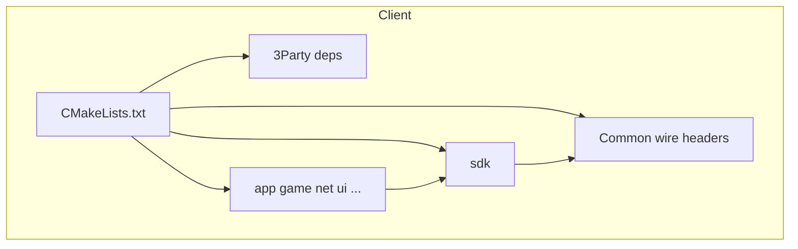

# 将 3Party / Common 移入 Client

## 目标结构

当前：

```
RPG_Client/
  3Party/
  Common/
  Client/
    app/ sdk/ config/ CMakeLists.txt ...
```

目标：

```
RPG_Client/
  Client/
    3Party/          # SFML、Lua、tinyxml2 构建产物
    Common/          # ClientMsg.h、NetDefine.h、MsgId.h
    app/ sdk/ config/ ...
    CMakeLists.txt
    build_client.ps1
    README.md
  .gitignore
```

源码 `#include "ClientMsg.h"` **无需修改**（仍由 CMake include 目录提供）。

## 1. 物理移动

| 源 | 目标 |
|---|---|
| [`3Party/`](3Party/) | [`Client/3Party/`](Client/3Party/) |
| [`Common/`](Common/) | [`Client/Common/`](Client/Common/) |

使用 `git mv` 或等效移动，保留 `3Party/sfml`、`3Party/lua`、`3Party/_build` 内容不变。

## 2. 更新 [`Client/CMakeLists.txt`](Client/CMakeLists.txt)

删除 `REPO_ROOT`，改为相对 `CMAKE_SOURCE_DIR`（即 `Client/`）：

```cmake
# 旧
set(REPO_ROOT ${CMAKE_SOURCE_DIR}/..)
set(THIRD_PARTY_DIR ${REPO_ROOT}/3Party)
target_include_directories(... ${REPO_ROOT}/Common ...)

# 新
set(THIRD_PARTY_DIR ${CMAKE_SOURCE_DIR}/3Party)
set(COMMON_DIR ${CMAKE_SOURCE_DIR}/Common)
target_include_directories(RPGClient PRIVATE
    ${COMMON_DIR}
    ${CMAKE_SOURCE_DIR}
    ...
)
```

同步更新 SFML 缺失时的提示文案：

```cmake
message(FATAL_ERROR "SFML not found. Run Client\\3Party\\download_and_build.ps1")
```

`LUA_DIR`、`SFML_ROOT`、`TINYXML2_DIR` 等仍基于 `${THIRD_PARTY_DIR}/...`，逻辑不变。

## 3. 修复 [`Client/3Party/download_and_build.ps1`](3Party/download_and_build.ps1)（移动后路径）

当前脚本用 `Split-Path -Parent $PSScriptRoot` 作为 `$root`，会把 SFML/Lua 解压到 **3Party 的上一级**；移动后应改为以脚本所在目录为 3Party 根：

```powershell
$thirdPartyRoot = $PSScriptRoot
$sfmlDir = Join-Path $thirdPartyRoot "sfml"
$luaDir  = Join-Path $thirdPartyRoot "lua"
```

zip 临时文件也放在 `$thirdPartyRoot` 下。

## 4. 可选简化 [`Client/build_client.ps1`](Client/build_client.ps1)

脚本已在 `Client/` 内，可将：

```powershell
$clientDir = Join-Path $repoRoot "Client"
```

简化为 `$clientDir = $PSScriptRoot`（非必须，但减少一层 repo 假设）。

## 5. 更新文档

**不修改** [`.cursor/plans/*.plan.md`](.cursor/plans/)（历史计划文档保持原样）。

需更新的用户文档：

### [`Client/README.md`](Client/README.md)

- 增加 **目录结构** 小节，说明 `3Party/`、`Common/`、`sdk/`、应用层模块同级位于 `Client/` 下
- **首次构建** 增加依赖准备步骤：

```powershell
cd Client
.\3Party\download_and_build.ps1
.\build_client.ps1
```

- **与 Server 联调**：协议头位于 `Client/Common/`，变更时需手动同步到外部 `RPG_Server/common/`（Server 不在本仓库）

### [`Client/3Party/README.md`](3Party/README.md)（随目录移动）

- 修正构建说明：先 `.\download_and_build.ps1`（在 `Client/3Party` 内），再回 `Client/` 执行 `build_client.ps1`
- 删除过时的 `cmake -B build -G "Visual Studio 17 2022"` 作为主流程描述（与现有一致使用 `build_client.ps1`）

### 新建 [`README.md`](README.md)（仓库根，简短）

仓库根除 `Client/` 外几乎无其他内容，增加 1 段说明：本仓库客户端工程在 `Client/`，详见 [`Client/README.md`](Client/README.md)。

### [`.gitignore`](.gitignore)

```gitignore
# 旧
3Party/_build/
3Party/sfml/
3Party/lua/

# 新
Client/3Party/_build/
Client/3Party/sfml/
Client/3Party/lua/
```

## 6. 清理重建与验证

- 删除 [`Client/build/`](Client/build/)（CMakeCache 中仍含旧绝对路径 `D:/Study/RPG_Client/3Party/...`）
- 运行 `Client/build_client.ps1`
- 确认 `Client/build/bin/RPGClient.exe` 生成且可启动

## 影响范围说明

| 类别 | 是否需改 |
|------|---------|
| C++ `#include` | 否 |
| [`Client/sdk/*.h`](Client/sdk/) 注释中的 `Common/...` 文字 | 可选，非编译必需 |
| 外部 `RPG_Server` | 否（仍从 `Client/Common/` 手动同步） |
| `.cursor/plans/` | 否 |


