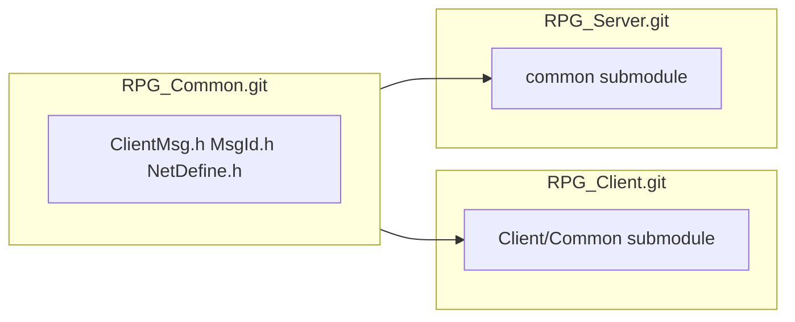

# RPG_Common 共享协议：Git Submodule 方案

## 现状

| 仓库 | Common 现状 |
|------|-------------|
| [RPG_Client](d:/Study/RPG_Client) | [`Client/Common/`](Client/Common/) 三文件（`ClientMsg.h`、`MsgId.h`、`NetDefine.h`）**直接提交在主仓库**，无 `.gitmodules` |
| [RPG_Server](d:/Study/RPG_Server) | 文档与代码引用 `common/ClientMsg.h`；本地 `common/` **已删除**；已有 remote `Common` → `https://github.com/hechuangguo/RPG_Common.git`，但未用 submodule |
| RPG_Common | 目标独立仓库（remote 已存在，需确认是否已有初始提交） |

当前 [`Client/README.md`](Client/README.md) 仍写「手动同步到 RPG_Server/common/」，需替换为 submodule 流程。

---

## 推荐方案：Git Submodule（双仓库各挂一份）



- **唯一源码**：协议改动只在 `RPG_Common` 提交
- **双端路径**（保持现有 include/CMake 不变）：
  - Client：`Client/Common/`（你已确认）
  - Server：`common/`（与现有 `#include "../common/ClientMsg.h"` 一致）
- **父仓库记录 submodule 指针**（commit SHA），`git pull` 后配合 `git submodule update` 即可对齐

不采用 subtree / 手动 copy：subtree 回推麻烦；手动 copy 正是当前要淘汰的方式。

---

## 实施步骤

### 1. 初始化 RPG_Common 仓库

在 `https://github.com/hechuangguo/RPG_Common` 建立内容（若仓库为空）：

```
RPG_Common/
  ClientMsg.h
  MsgId.h
  NetDefine.h
  README.md          # 协议说明 + 修改/同步流程
```

- 初始内容以当前 [`Client/Common/`](Client/Common/) 为准（含已加的 `C2S_ZONE_LIST_REQ` 等）
- Server 侧旧 `common/ClientMsg.h` 若与 Client 不一致，以 Client 最新版为权威合并后再 push

### 2. RPG_Client：改为 submodule

在 `RPG_Client` 根目录执行（示意）：

```powershell
# 1) 从主仓库移除已跟踪的 Common 文件（保留工作区内容）
git rm -r Client/Common
git commit -m "chore: remove vendored Common before submodule"

# 2) 添加 submodule（Windows PowerShell / Git Bash 均可）
git submodule add https://github.com/hechuangguo/RPG_Common.git Client/Common
git commit -m "chore: add RPG_Common as submodule at Client/Common"
```

生成 [`.gitmodules`](.gitmodules)：

```ini
[submodule "Client/Common"]
    path = Client/Common
    url = https://github.com/hechuangguo/RPG_Common.git
    branch = main
```

**CMake 无需改动**：[`Client/CMakeLists.txt`](Client/CMakeLists.txt) 已 `set(COMMON_DIR ${CMAKE_SOURCE_DIR}/Common)`。

可选：在 [`Client/build_client.ps1`](Client/build_client.ps1) 开头增加 submodule 检查（未 init 时提示并 `git submodule update --init`）。

### 3. RPG_Server：恢复 common 为 submodule

```bash
git submodule add https://github.com/hechuangguo/RPG_Common.git common
git commit -m "chore: add RPG_Common as submodule at common"
```

- 现有 8 处 `#include "../common/ClientMsg.h"` **无需修改**
- [`CMakeLists.txt`](d:/Study/RPG_Server/CMakeLists.txt) 已含 `${CMAKE_SOURCE_DIR}` include，一般无需改
- 可删除多余的 `Common` remote（submodule 自带 URL），避免与 submodule 混淆

### 4. 日常协作流程

#### 4.1 首次克隆（Windows Client 开发）

```powershell
git clone --recurse-submodules https://github.com/hechuangguo/RPG_Client.git
cd RPG_Client\Client
.\build_client.ps1
```

若已 clone 但未拉 submodule：

```powershell
git submodule update --init --recursive
```

#### 4.2 修改协议（任一方）

在 **submodule 目录内**改文件并推到 RPG_Common：

```powershell
# Client 侧示例
cd Client/Common
# 编辑 ClientMsg.h ...
git add .
git commit -m "feat: add C2S_XXX"
git push origin main

cd ../..
git add Client/Common
git commit -m "chore: bump Common submodule"
git push origin main
```

Server 侧同理：`cd common` → commit → push RPG_Common → 在 RPG 主仓库 commit submodule 指针。

#### 4.3 对方拉取更新

**方式 A（推荐，跟随对方锁定的 SHA）**：

```powershell
git pull
git submodule update --init --recursive
```

**方式 B（直接跟踪 RPG_Common 最新 main）**：

```powershell
git submodule update --remote Client/Common   # Server 则为 common
git add Client/Common
git commit -m "chore: sync Common to latest"
```

#### 4.4 原则

- 协议改动 **必须先 push RPG_Common**，再在 Client/Server 主仓库更新 submodule 指针
- 只 `git pull` 主仓库而不 `submodule update` 时，Common 目录会停在旧 SHA（常见踩坑，文档中需强调）

---

## 文档更新清单

| 文件 | 更新内容 |
|------|----------|
| [`RPG_Common/README.md`](https://github.com/hechuangguo/RPG_Common)（新建） | 仓库职责、文件列表、修改/推送/拉取流程、与 Client/Server 路径对应关系 |
| [`README.md`](README.md)（RPG_Client 根） | 增加 `--recurse-submodules` 克隆说明；Common 为 submodule |
| [`Client/README.md`](Client/README.md) | 目录树注明 `Common/` 为 submodule；删除「手动同步到 RPG_Server」；增加 `git submodule update` 小节 |
| [`RPG_Server/README.md`](d:/Study/RPG_Server/README.md) | `common/` 为 submodule；克隆与更新命令 |
| [`RPG_Server/docs/DEVELOPMENT.md`](d:/Study/RPG_Server/docs/DEVELOPMENT.md) | 协议修改流程改为 RPG_Common submodule |
| [`Client/README.md` Server 联调节](Client/README.md) | 改为「同步 Common submodule，无需手 copy」 |

可选辅助脚本（Windows）：

- `Client/scripts/init_common.ps1`：`git submodule update --init --recursive`
- `Client/scripts/sync_common.ps1`：`git submodule update --remote Client/Common`

---

## 验证

1. 新机器 `git clone --recurse-submodules RPG_Client` → `Client/Common/*.h` 存在 → `build_client.ps1` 成功
2. 新机器 clone RPG_Server → `common/*.h` 存在 → Server 编译通过
3. 在 RPG_Common 改一行注释 → push → Client/Server 各 `submodule update --remote` → 双方看到同一变更
4. `.gitmodules` 与两处 submodule 指针已提交到各自主仓库

---

## 不在本次范围

- 修改协议内容本身（仅建立共享与同步机制）
- 将 Server 的 `protocal/InternalMsg.h` 迁入 RPG_Common（仍属 Server 专用）
- CI/CD 自动 submodule init（可后续加）
