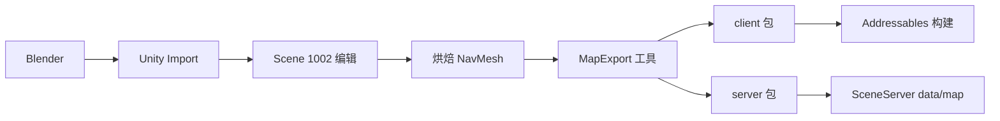
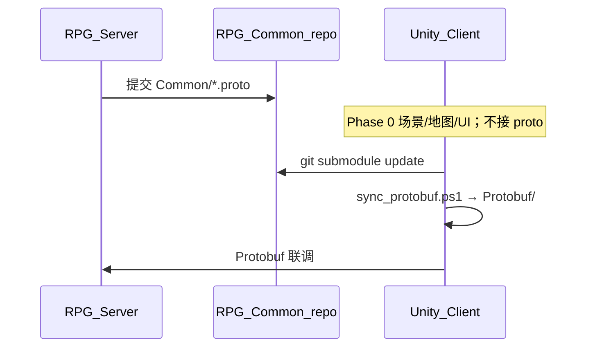
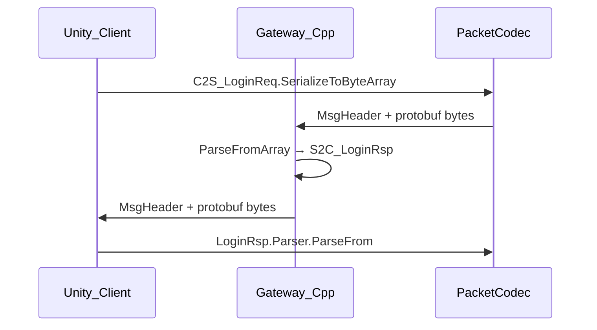
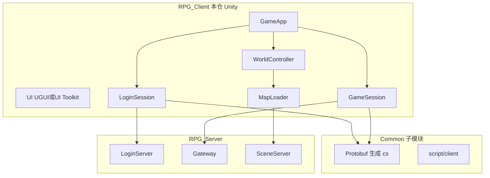

# RPG 客户端 Unity 3D 迁移完整方案

## 需求变更说明

- **实施范围（重要）**：**仅修改本仓 `RPG_Client` 的客户端代码与文档**。`RPG_Server`、LoginServer/Gateway/SceneServer 代码 **不在本计划内**，由服务端仓库自行改动；客户端通过更新 **`Common/` 子模块** + **`sync_protobuf.ps1`** 跟进协议。
- **工程形态**：本仓就地 **C++ SFML → Unity（C#）** 整体迁移（已有 `ProjectSettings/`）。
- **Unity 环境（已确认）**：**Unity Personal**；**本机 Windows 已安装 Unity**（Hub + Editor）。Phase 0 **无需安装 Unity**，Unity Hub 直接打开本仓 `RPG_Client/` 即可；工程版本见 [`ProjectSettings/ProjectVersion.txt`](d:\Study\RPG_Client\ProjectSettings\ProjectVersion.txt)（当前 **2022.3.62f3c1**）。
- **协议**：`.proto` 在 **`Common/` 子模块**（服务端维护）；本仓 **不提交** `.proto` 修改；只生成根目录 **`Protobuf/*.cs`**。
- **注释与文档**：**所有本计划新增、修改的文件**（C#、Editor 脚本、`scripts/*.ps1`、README 等）须加 **相应中文注释/说明**；`Protobuf/` 内生成 `.cs` **除外**（只改 README）。后续维护同规。
- **不变项**：TCP + TLS、`MsgHeader` 帧头、`module/sub` 路由语义、`mapId` 分包（客户端行为对齐现 C++）。

---

## 二、实施范围：仅客户端

| 包含（本仓改动） | 不包含（服务端自行） |
|------------------|----------------------|
| `Assets/_Project/` C#、场景、Prefab、Editor | `RPG_Server/` 任意代码与部署 |
| 根目录 `Protobuf/` + `scripts/sync_protobuf.ps1` | `Common/` 内新增/修改 `*.proto`（本仓 **只读** submodule，仅 `git pull`） |
| 移除本仓 C++ / CMake / SFML | 服务端 `gen_proto.ps1`、`generated/cpp`、Gateway 编解码改造 |
| [`README.md`](d:\Study\RPG_Client\README.md)、`.gitignore`、`.cursor/rules/` | 服务端 `SceneServer/data/map/` 部署（客户端 MapExport 可产出 **server 包文件** 交给服务端，但不改服务端仓库） |
| `config/`、`map/`、`script/`、`StreamingAssets` 客户端侧 | Common 子模块内 `Common.txt` 文案（随服务端 Common 更新即可） |

**联调前提**：服务端完成 Protobuf 并推送 **RPG_Common** 后，本仓执行 `git submodule update` → `sync_protobuf.ps1` → 再开发/联调 `Net/`。

---

## 三、注释与文档规范（强制）

与现有 C++ 头文件（如 [`net/GameSession.h`](d:\Study\RPG_Client\net\GameSession.h)）风格对齐；日志仍遵守 [`.cursor/rules/log-language.mdc`](d:\Study\RPG_Client\.cursor\rules\log-language.mdc)。

### 3.0.1 必须加注释的文件

| 类型 | 要求 |
|------|------|
| **新建/修改的 `.cs`** | 文件头：`/// <summary>` 说明职责、协作类、线程/生命周期；public 类与方法 XML 注释；非显然逻辑用中文行注释 |
| **Editor 脚本** | 同上；菜单项 `[MenuItem]` 加 Tooltip 或 summary |
| **`scripts/*.ps1`** | 文件顶块注释：用途、参数、示例命令、依赖（protoc 路径等） |
| **`Protobuf/*.cs`** | **不手改**；说明写在 `Protobuf/README.md` |
| **删除 C++ 文件** | 无需注释；在 README「迁移说明」记录对应 C# 路径 |

### 3.0.2 C# 文件头示例

```csharp
/// <summary>
/// 游戏内网络会话（对标原 net/GameSession）。
/// 职责：Gateway 连接、心跳、移动同步、离世界、消息分发。
/// 协作：WorldController、PacketCodec、ClientScriptHost。
/// 线程：仅 Unity 主线程。
/// </summary>
public sealed class GameSession { ... }
```

### 3.0.3 文档同步（与代码同 PR / 同批次提交）

任意 **新增目录、构建步骤、协议 sync 流程** 变更时，必须同步更新：

- [`README.md`](d:\Study\RPG_Client\README.md)
- 根目录或模块 `README.md`（如 `Protobuf/README.md`、`Assets/_Project/Scripts/Net/README.md` 可选）
- 计划执行后新增 [`.cursor/rules/code-comments.mdc`](d:\Study\RPG_Client\.cursor\rules\code-comments.mdc)（持久约束后续 AI/人工提交）

---

## 四、引擎选型：Unity 及费用

### 为何选 Unity（相对原 C++ 方案）

| 维度 | Unity | 原 bgfx 自研 |
|------|-------|--------------|
| 3D 渲染/动画/地形 | 内置成熟 | 需自建 render/ 模块 |
| 关卡编辑 | **Editor 即地图编辑器** | 需自研 Map Editor |
| 团队技能 | C# 上手快 | 延续 C++ 但工作量大 |
| 与现有 C++ 代码 | **需移植网络/UI**（非嵌入 SFML） | 可直接复用 net/lua |
| MMORPG 协议 | 禁用 Unity Netcode，**自写 TcpClient + Protobuf** | 天然契合 |

### Unity 版本与许可（已确认）

| 项 | 结论 |
|----|------|
| **许可** | **Unity Personal（个人免费版）**，费用 **$0** |
| **本机环境** | **Windows 已安装 Unity**（用户已确认）；执行时 **跳过安装**，Hub 打开本仓即可 |
| **Editor 版本** | 与本仓 [`ProjectVersion.txt`](d:\Study\RPG_Client\ProjectSettings\ProjectVersion.txt) 一致：**2022.3.62f3c1**（2022.3 LTS）；若 Hub 未装该修订版，仅补装对应 Editor，**不升级大版本** |
| **渲染** | URP（Personal 可用） |
| **平台** | 首期 **Windows PC Standalone** |

**Personal 版说明（开发期足够）**：

- 可完整使用 URP、Terrain、AI Navigation、Addressables、Input System。
- 发行时显示 Unity 启动画面（可接受）；若将来收入超过 [Unity 定价页](https://unity.com/pricing) 门槛再考虑升级 Pro。
- **不需要** Unity Pro、Industry 或 Unity Netcode 订阅。

**Phase 0 环境核对（替代「安装 Unity」）**：

1. Unity Hub → **打开** 本仓 `RPG_Client/`（已有 `ProjectSettings/` 时直接进 Editor）。
2. 确认 Hub 已安装 **2022.3.62f3c1**（与 [`ProjectVersion.txt`](d:\Study\RPG_Client\ProjectSettings\ProjectVersion.txt) 一致）；已激活 **Personal** 许可证。
3. 确认已安装模块：**Windows Build Support (IL2CPP/Mono)**、**Visual Studio** 或 Rider 集成。
4. 若 Hub 缺少该修订版，仅 **Add modules / 安装对应 2022.3.62f3c1**，不主动升级大版本。

**软件许可合计（本项目）**：Unity Personal **$0** + Blender **$0** + Recast **$0** + Google.Protobuf **$0**；无引擎订阅成本。

| 阶段 | 2 人团队参考周期 |
|------|------------------|
| POC：登录 → 进 1002 → 行走同步 | **6–8 周** |
| 完整 UI 流程 + 退出 + Lua/任务 | **+8–12 周** |
| 多地图 + 热更新 + 表现打磨 | **+8 周** |

---

## 五、地图编辑器与工作流

Unity 路线下 **不再优先自研 Map Editor**；以 Unity Editor 为主，Blender 为辅。

| 环节 | 工具 | 说明 |
|------|------|------|
| 场景/地形/光照/雾 | **Unity Editor + Terrain Tools** | 主关卡编辑环境 |
| 建筑/角色/道具 | **Blender** → FBX/glTF 导入 Unity | 标准 DCC 流水线 |
| NavMesh | **Unity AI Navigation** | Editor 烘焙；再 **导出** 给 SceneServer |
| 触发区/出生点/NPC 点 | Unity 空物体 + **自定义组件** `MapLogicMarker` | 导出为 `logic/*.json` |
| 2D 数据迁移 | 脚本读取旧 [`map/1002/buildings.json`](d:\Study\RPG_Client\map\1002\buildings.json) | 批量生成 Prefab 实例坐标 |
| 服务端碰撞对齐 | Editor 菜单 **RPG → Export Map Package** | 一次导出 client + server 包 |

### 推荐工作流



### `MapExport` Editor 脚本（必做）

从场景 `World_1002.unity` 导出：

- `manifest.json`（mapId、版本、资源引用）
- `scene/buildings.json`（prefab 路径 + Transform）
- `logic/spawn_points.json`、`logic/npc_spawns.json`、`logic/triggers.json`
- `collision/navmesh.bin`（从 Unity NavMesh 数据转换，格式与服务端约定）
- `environment/lighting.json`（雾、环境光、后处理参数）

---

## 六、目录结构详细设计

### 3.1 仓库总览（本仓 Unity 化 + Common + Protobuf）

```text
RPG_Client/                         # 本仓：Unity C# 客户端（由原 C++ 整体迁移）
  Protobuf/                         # 根目录：消息协议 .cs（由 Common/*.proto 生成）
  Common/                           # Submodule：*.proto 源 + NetDefine.h
  Assets/_Project/                  # Unity 脚本、场景、Prefab
  ProjectSettings/ Packages/
  config/ script/ database/ map/    # 运行时数据（保留）
  scripts/sync_protobuf.ps1
  logs/

  # 迁移完成后删除：
  app/ game/ net/ ui/ util/ lua/ sdk/ main.cpp CMakeLists.txt build_client.ps1 3Party/sfml/

RPG_Server/                         # 服务端（Common/generated/cpp）
RPG_WorldData/                      # 地图烘焙真源（可选）
```

### 3.2 根目录 `Protobuf/`（消息协议 .cs）

| 项 | 说明 |
|----|------|
| **位置** | 仓库根 **`Protobuf/`**（与 `Common/`、`Assets/` 同级） |
| **内容** | 仅 **`*.cs` 生成文件**；按 proto `package` 分子目录（如 `Protobuf/Rpg/Login/`） |
| **来源** | **`Common/*Common.proto` + `Common/*Msg.proto`**（服务端维护；客户端 `git submodule update` 后生成） |
| **生成** | `scripts/sync_protobuf.ps1` → `protoc -I Common --csharp_out=Protobuf Common/*.proto` |
| **禁止** | 手改 `Protobuf/`；业务代码在 `Assets/_Project/Scripts/Net/` 引用生成类型 |

**Unity 编译**：根目录脚本需通过 **`Assets/_Project/Protobuf/` 目录联接（junction）** 指向 `../../Protobuf`，或 sync 脚本双写（见 §3.3 树）。

**客户端更新协议（服务端提交后）**：

```powershell
git submodule update --remote Common
.\scripts\sync_protobuf.ps1
```

### 3.3 Unity 工程目录（`RPG_Client/` 本仓）

```text
RPG_Client/
├── Protobuf/                              # §3.2：proto 生成的 .cs（根目录权威）
│   └── Rpg/Login/ ...
├── Common/                                # Submodule：*.proto 源
├── Assets/
│   ├── _Project/
│   │   ├── Scenes/                        # Boot / Login / CharacterSelect / World
│   │   ├── Scripts/
│   │   │   ├── App/                       # GameApp.cs（对标 app/GameApp.cpp）
│   │   │   ├── Net/                       # TcpClient、PacketCodec、*Session
│   │   │   ├── World/                     # WorldController（对标 game/GameScene）
│   │   │   ├── UI/                        # 对标 ui/*
│   │   │   ├── Config/                    # ClientConfig、LocalSettings
│   │   │   ├── Log/                       # ClientLogger（中文日志规则不变）
│   │   │   └── Editor/                    # MapExportWindow 等
│   │   ├── Protobuf/                      # junction → ../../Protobuf（编译用）
│   │   ├── Prefabs/ Art/ Audio/ Settings/
│   │   └── ...
│   └── StreamingAssets/                   # config、database、script、basefile
├── ProjectSettings/
├── Packages/
├── config/ script/ database/ map/         # 可与 StreamingAssets 同步或合并
├── assets/                                # 旧 2D 资源，逐步迁移
├── scripts/
│   ├── sync_protobuf.ps1
│   └── sync_common.ps1
└── logs/
```

#### 目录职责说明

| 路径 | 是否入库 | 运行时加载方式 | 职责 |
|------|----------|----------------|------|
| `Protobuf/` | 是（生成物） | C# 编译引用 | 消息协议 `.cs`，由 `sync_protobuf.ps1` 从 Common 生成 |
| `Common/` | Submodule | — | `*.proto` 源（服务端维护） |
| `Assets/_Project/Scenes/` | 是 | `SceneManager` | 流程场景 |
| `Assets/_Project/Art/` | 是（大文件 LFS） | Addressables | 可复用模型、贴图、动画 |
| `Assets/_Project/Prefabs/` | 是 | Addressables / 直接引用 | 玩法实体模板 |
| `Assets/StreamingAssets/` | 是 | `Application.streamingAssetsPath` | 配置、Lua、表数据；小、常改 |
| `Addressables/Maps/{mapId}/` | 构建产物 | `Addressables.LoadSceneAsync` | 按 mapId 分包的大场景 |
| `Build/` | 否 | — | CI 输出 |

### 3.3 Addressables 分组策略（按 mapId）

```text
Addressables Groups:
  Shared_Characters     # 全地图复用
  Shared_Buildings      # shop/inn 等 Prefab
  Shared_UI
  Map_1002              # World_1002 场景 + 本地光照 + 地表
  Map_1003              # 未来地图
```

**标签约定**：`map:1002`、`shared:buildings`，供 [`MapLoader`](d:\Study\RPG_Client\game\GameScene.cpp) 对标逻辑按 `enter.mapID` 加载。

**构建输出**（本地/CDN）：

```text
ServerData/                    # Addressables 远程 catalog（可放 CDN）
  Windows/
    catalog_1.0.json
    map_1002_assets_*.bundle
```

### 3.4 运行时玩家本机目录（安装后）

```text
{InstallDir}/
  RPGClient.exe
  RPGClient_Data/
    StreamingAssets/           # 构建时打入
      config/
      database/
      script/
  MonoBleedingEdge/ ...        # Unity 运行时
  logs/                        # 建议：仍写项目式 client_YYYYMMDD.log（自定义 Logger）

%APPDATA%/RPGClient/           # 用户偏好（对齐现有 LocalSettings）
  settings.json
```

日志规范：继续中文固定文案，类名改为 `GameSession`、`LoginSession`（与现规则一致）。

### 3.5 消息协议：Protobuf 迁移（服务端先行，客户端消费 Common）

#### 协作边界（已确认）

| 角色 | 职责 | 本计划是否实施 |
|------|------|----------------|
| **服务端（RPG_Server / RPG_Common）** | 维护 `Common/*.proto`、服务端 Protobuf 编解码 | **否**（自行改动） |
| **Unity 客户端（本仓）** | `submodule update` → `sync_protobuf.ps1` → `Net/`；C# 移植与注释 | **是** |
| **C++ 遗留** | Phase 4 删除本仓 C++ | **是** |



**客户端更新 Common 的标准步骤**（服务端通知就绪后执行一次）：

```powershell
cd d:\Study\RPG_Client
git submodule update --remote Common
.\scripts\sync_protobuf.ps1    # Common/*.proto → Protobuf/*.cs
```

此后引入 `Google.Protobuf`，在 `Assets/_Project/Scripts/Net/` 实现 `PacketCodec` / `LoginSession` / `GameSession`（**引用 `Protobuf/` 生成类型**）。

#### 为何改用 Protobuf

| 现状（`#pragma pack(1)`） | Protobuf |
|---------------------------|----------|
| C++ 头文件手写，Unity 需镜像或 P/Invoke | **`.proto` 单源**，`protoc` 生成 C# / C++ |
| 字段增删易破坏对齐与版本兼容 | `optional` / `reserved` / 字段号演进 |
| `char[32]` 定长字符串 | `string` / `bytes` 自然表达 |
| 与 C++ 服务端共用困难 | **Gateway/SceneServer 直接链接 libprotobuf** |

**禁止**使用 Unity Netcode / Mirror 替代 Gateway 会话；Protobuf 仅替换**载荷编码**，传输仍为自研 TCP。

#### 线上帧格式（保留 MsgHeader，最小改动）

延续 [`NetDefine.h`](d:\Study\RPG_Client\Common\NetDefine.h) 定长帧头，**仅 body 由定长结构体改为 Protobuf 字节流**：

```text
┌──────────────────────────────────────────────────┐
│ MsgHeader (6 bytes, little-endian)               │
│   bodyLen : uint16   — Protobuf 字节长度          │
│   module  : uint8    — ClientModule（路由）       │
│   sub     : uint8    — XxxMsgSub（路由）          │
├──────────────────────────────────────────────────┤
│ Body: protobuf serialized message                │
│   （不再包含 body 内 module/sub 前缀）            │
└──────────────────────────────────────────────────┘
```

- `bodyLen` 上限仍为 `MAX_PACKET_SIZE`（65535）。
- **路由规则不变**：服务端 `OnMessage(conn, module, sub, data, len)` 先读 header，再对 `data` 做 `ParseFromArray` 到对应消息类型。
- **版本切换**：联调/测试环境 **一刀切** 启用 Protobuf v2（无线上存量玩家时推荐）；不做双栈时无需在 body 内兼容旧定长格式。



#### Common 子模块内 Protobuf 目录（沿用既有成对规则）

Protobuf **放在 `Common/` 根目录**，与现有 `LoginCommon.h` + `LoginMsg.h` **同仓、同域、同名配对**；权威分类表见 [`Common.txt`](d:\Study\RPG_Client\Common\Common.txt)。

```text
Common/                              # RPG_Common submodule
  Common.txt                         # 增补 .proto 成对表与新建消息 checklist
  NetDefine.h                        # 保留：MsgHeader、MAX_PACKET_SIZE（定长帧头，不进 proto）
  ClientTypes.h                      # 保留：ClientModule 指令编号
  MsgId.h                            # 保留（若有跨域消息 ID）
  ClientMsgBody.h                    # 标记废弃：Protobuf body 不含 module/sub 前缀

  # --- 按域成对（与 Common.txt 表一一对应）---
  LoginCommon.proto                  # LoginMsgSub、LogoutAction、LoginResultCode 等
  LoginMsg.proto                     # C2S_LoginReq、S2C_LoginRsp、S2C_EnterGame ...
  ZoneCommon.proto
  ZoneMsg.proto
  MapDataCommon.proto                # 移动、视野实体（原 MapData 域，非 login 域）
  MapDataMsg.proto
  ChatCommon.proto
  ChatMsg.proto
  PropertyCommon.proto / PropertyMsg.proto
  EquipCommon.proto / EquipMsg.proto
  SpellCommon.proto / SpellMsg.proto
  RelationCommon.proto / RelationMsg.proto
  GoldCommon.proto / GoldMsg.proto

  generated/
    cpp/                             # *.pb.h / *.pb.cc
    csharp/                          # *.cs
  scripts/
    gen_proto.ps1                    # 扫描 Common/*.proto → 双端生成
  legacy/                            # 迁移完成后移入归档
    LoginMsg.h
    LoginCommon.h
    ...
```

**文件职责（对齐现有 `.h` 规则）**

| 文件 | 职责 | 对标现有 |
|------|------|----------|
| **`XxxCommon.proto`** | 域内 `enum`（子编号语义、结果码、LogoutAction 等）、公共 message（如 `Vec3f`）、常量注释 | `XxxCommon.h` |
| **`XxxMsg.proto`** | `import "XxxCommon.proto"`；定义 C2S/S2C **message** | `XxxMsg.h` 中 `struct Msg_*` |
| **`NetDefine.h`** | 线上帧头 `MsgHeader`、缓冲区大小 | 不变 |
| **`ClientTypes.h`** | `ClientModule` 全局 module 编号 | 不变 |

**新建消息文件规范（写入 `Common.txt` 增补）**

1. 确定所属域（登录/区服/地图/聊天…），查 `Common.txt` 表；**禁止**新建跨域大杂烩 `messages.proto`。
2. 若域已存在：在对应 **`XxxMsg.proto`** 追加 `message`；子编号/错误码追加在 **`XxxCommon.proto`**。
3. 若域为新增：同时创建 **`NewDomainCommon.proto` + `NewDomainMsg.proto`**，并在 `ClientTypes.h` 分配 `ClientModule`。
4. 消息命名与现 wire 一致：`C2S_LoginReq` / `S2C_LoginRsp`（与旧 struct 名相同，便于对照迁移）。
5. 在 `XxxCommon.proto` 用注释标明 **处理方**（LoginServer / Gateway / SceneServer），延续现有头文件注释风格。
6. **服务端**在 RPG_Common 运行 `gen_proto.ps1`，提交 `.proto` + `generated/cpp`（C++ 用）。
7. **客户端**在 submodule 更新后运行 **`scripts/sync_protobuf.ps1`**，输出到 **根 `Protobuf/`**（不手改）。

**包名约定**：`LoginMsg.proto` 使用 `package rpg.login;` → C# `Rpg.Login`、C++ `rpg::login`（域名与文件名去 `Common`/`Msg` 后缀）。

#### `.proto` 示例（Login 域成对文件）

`LoginCommon.proto`：

```protobuf
syntax = "proto3";
package rpg.login;

// 子编号语义与 LoginCommon.h LoginMsgSub 一致（路由仍走 MsgHeader.sub）
enum LoginMsgSub {
  LOGIN_MSG_SUB_UNSPECIFIED = 0;
  C2S_LOGIN_REQ = 1;
  S2C_LOGIN_RSP = 2;
  // ...
  C2S_LOGOUT_REQ = 14;
  S2C_LOGOUT_RSP = 15;
}

enum LoginResultCode {
  LOGIN_RESULT_OK = 0;
  LOGIN_RESULT_BAD_CREDENTIALS = 1;
  LOGIN_RESULT_SERVER_ERROR = -1;
}

enum LogoutAction {
  LOGOUT_ACTION_UNSPECIFIED = 0;
  RETURN_CHAR_SELECT = 1;
  RETURN_LOGIN = 2;
}
```

`LoginMsg.proto`：

```protobuf
syntax = "proto3";
package rpg.login;

import "LoginCommon.proto";

// C→S: 账号登录；处理方 LoginServer
message C2S_LoginReq {
  string account = 1;
  string password = 2;
  uint32 zone_id = 3;
}

// S→C: 登录结果；处理方 LoginServer
message S2C_LoginRsp {
  LoginResultCode code = 1;
  uint64 acc_id = 2;
  uint64 user_id = 3;
  uint64 token_expire_ms = 4;
  string login_token = 5;
}

// S→C: 进入游戏；处理方 Gateway
message S2C_EnterGame {
  uint64 user_id = 1;
  uint32 map_id = 2;
  float x = 3;
  float y = 4;
  float z = 5;
  float dir = 6;
}
```

地图移动、Spawn 等归属 **`MapDataMsg.proto`**（非 `LoginMsg.proto`），与 [`Common.txt`](d:\Study\RPG_Client\Common\Common.txt) 地图域一致。

`module/sub` 与消息类型映射表维护在 `MessageDispatcher`（C#）与服务端 `MessageRegistry`（C++），**数值与现有 [`LoginMsgSub`](d:\Study\RPG_Client\Common\LoginCommon.h) 枚举一致**，避免改网关分发逻辑。

#### 代码生成与依赖

| 端 | 工具 | 依赖 |
|----|------|------|
| **C++ Server** | `protoc` + `--cpp_out` | `libprotobuf`（vcpkg / 3Party） |
| **Unity C#** | `protoc` + `--csharp_out` | NuGet **`Google.Protobuf`**（建议 3.25+）；放入 `Packages` 或 `Assets/Plugins` |

`gen_proto.ps1`（**服务端**，`Common/scripts/`）：

1. `protoc --cpp_out=Common/generated/cpp` …
2. 提交 RPG_Common

**客户端** `scripts/sync_protobuf.ps1`：

1. `protoc -I Common --csharp_out=Protobuf Common/*.proto`
2. 可选：同步 junction 目标 `Assets/_Project/Protobuf/`

#### C# 编解码示例

```csharp
// 发送
var req = new C2S_LoginReq { Account = account, Password = pwd, ZoneId = zoneId };
byte[] body = req.ToByteArray();
var header = new MsgHeader { BodyLen = (ushort)body.Length, Module = LoginModule, Sub = C2SLoginReq };
socket.Send(header.ToBytes().Concat(body).ToArray());

// 接收
var rsp = S2C_LoginRsp.Parser.ParseFrom(bodySpan);
```

封装为 `PacketCodec.TryParseLoginRsp(module, sub, ReadOnlySpan<byte> body, out S2C_LoginRsp rsp)`，供 `LoginSession` 状态机调用。

#### 与旧 C++ 头文件迁移对照

| 旧文件（Common/） | 新文件（Common/） | 备注 |
|-------------------|-------------------|------|
| [`LoginCommon.h`](d:\Study\RPG_Client\Common\LoginCommon.h) | `LoginCommon.proto` | 子编号、结果码、`LogoutAction` |
| [`LoginMsg.h`](d:\Study\RPG_Client\Common\LoginMsg.h) | `LoginMsg.proto` | 登录/注册/鉴权/选角/进游戏/离世界 |
| [`ZoneCommon.h`](d:\Study\RPG_Client\Common\ZoneCommon.h) | `ZoneCommon.proto` | 区列表枚举 |
| `ZoneMsg.h` | `ZoneMsg.proto` | 区列表 message |
| `MapDataCommon.h` / `MapDataMsg.h` | `MapDataCommon.proto` / `MapDataMsg.proto` | 移动、Spawn、Despawn |
| Chat / Property / Equip 等 | 同名 `.proto` 成对 | 按 [`Common.txt`](d:\Study\RPG_Client\Common\Common.txt) 表 |
| [`NetDefine.h`](d:\Study\RPG_Client\Common\NetDefine.h) | **保留 .h** | `MsgHeader` 定长帧头 |
| [`ClientMsg.h`](d:\Study\RPG_Client\Common\ClientMsg.h) | **废弃** | 新代码按域引用生成类 |

**字符串字段**：旧 wire `char[N]` 定长 → proto `string`；解析后由服务端 `Validate` 限制最大长度（如角色名 31 字节 UTF-8）。

**安全**：日志仍禁止打印 `password`、`login_token` 全文（与现 [`log-language`](d:\Study\RPG_Client\.cursor\rules\log-language.mdc) 一致）。

#### C++ 全仓迁移与清理

本计划目标为 **整个 RPG_Client 由 C++ 换为 Unity C#**，非长期双栈。

| 阶段 | C++ | Unity C# |
|------|-----|----------|
| Phase 0–1 | 暂留（对照移植） | 新建 `Assets/_Project`、根 `Protobuf/` |
| Phase 2–3 | 停止功能开发 | 网络/世界/UI 主路径 |
| **Phase 4** | **删除** 见下表 | 唯一客户端 |

**Phase 4 删除清单**：

```text
app/ game/ net/ ui/ util/ lua/ sdk/
main.cpp CMakeLists.txt CMakePresets.json CppProperties.json
build_client.ps1 3Party/sfml/ 3Party/lua/（若 Unity 不用原生 Lua）
build/ out/ .vs/（构建产物与 IDE）
```

**保留**：

```text
Common/  Protobuf/  config/ script/ database/ map/ basefile/
assets/（逐步迁入 Assets）  scripts/  logs/  README.md
ProjectSettings/ Packages/ Assets/
```

#### 过渡期（Phase 0–3）

- C++ 代码 **仅只读对照**，不跟 Protobuf wire 联调新服务端。
- Unity 联调门槛：**服务端 Protobuf 已上线** + `Common` 已更新 + **`Protobuf/` 已 sync**。

### 3.6 服务端地图目录（`RPG_Server`）

SceneServer **不部署** Unity 场景与贴图，仅权威数据：

```text
RPG_Server/
  SceneServer/
    data/
      map/
        1002/
          manifest.json          # 与客户端同源 baked，version 字段一致
          collision/
            navmesh.bin          # MapExport 从 Unity NavMesh 导出
          logic/
            spawn_points.json    # 出生点、传送门
            npc_spawns.json
            triggers.json        # 任务/安全区触发
            safe_zones.json
          meta/
            bounds.json          # 地图 AABB，反作弊/加载范围
      database/
        map_config.lua           # mapId、名称、推荐等级、资源版本号
```

#### `manifest.json` v1（Unity 导出）

```json
{
  "mapId": 1002,
  "version": 3,
  "unityScene": "Map_1002",
  "addressablesLabel": "map:1002",
  "coordSystem": "y-up-left-handed-unity",
  "tileSize": 1.0,
  "terrainSize": { "widthMeters": 128, "heightMeters": 128 },
  "packages": {
    "client": {
      "addressables": ["Map_1002", "Shared_Buildings"],
      "streamingAssets": []
    },
    "server": {
      "collision": "collision/navmesh.bin",
      "logic": "logic/"
    }
  },
  "exports": {
    "buildings": "scene/buildings.json",
  "environment": "environment/lighting.json",
    "water": "water/river.json"
  }
}
```

> **坐标系**：Unity 为左手系 Y-up；服务端若仍为右手系，在 `MapExport` 中统一转换并写入 `meta/coord_transform.json`，避免角色位置镜像。

### 3.7 现有 2D 资源迁移对照

| 现有 [`map/1002/`](d:\Study\RPG_Client\map\1002) | Unity 演进 |
|----------|------------|
| `ground.json` | Unity Terrain + TerrainLayer；语义进 `terrain/splat.json` |
| `buildings.json` | Prefab 实例 + `scene/buildings.json` |
| `buildings/*.png` | 3D Prefab + PBR 贴图 |
| `river.json` / `water.json` | Unity Water（URP）或水面 Mesh + `water/river.json` |
| `collision.json` | Unity NavMesh → `collision/navmesh.bin` |
| `ambient.json` | Volume Profile + `environment/ambient.json` |

### 3.8 CDN / 热更新目录（Phase 3+）

```text
cdn.rpg.example.com/
  client/
    Windows/
      {appVersion}/
        catalog.json
        bundles/
          map_1002_*.bundle
          shared_characters_*.bundle
  server/
    map/
      1002/
        manifest.json          # version 与客户端一致才允许进图
        collision/navmesh.bin
        logic/*.json
```

客户端启动：比对 `map_config.lua` 中 `resourceVersion` 与本地 catalog，差量下载。

---

## 七、架构：Unity 客户端与现有系统关系



### 从 C++ 模块到 C# 映射

| C++ [`RPG_Client`](d:\Study\RPG_Client) | Unity C# |
|----------|----------|
| `app/GameApp` | `GameApp.cs` |
| `net/LoginSession` | `LoginSession.cs` |
| `net/GameSession` | `GameSession.cs` |
| `net/ZoneListSession` | `ZoneListSession.cs` |
| `game/GameScene` | `WorldController.cs` |
| `ui/*` | `Assets/_Project/UI/`（UGUI 或 UI Toolkit） |
| `lua/ClientScriptHost` | `LuaScriptHost.cs`（XLua）或 C# `QuestModel` |
| `sdk/log/ClientLogger` | `ClientLogger.cs`（文件日志 + 中文文案） |
| SFML 渲染 | Unity Camera + URP |

**不迁移**：`MapRenderer`、`CharacterSprite`、`WaterSystem`（2D 专用），由 Unity 场景/Prefab 替代。

---

## 八、关联文档与构建更新清单

迁移完成后，**整仓以 Unity C# 为准**，需同步修改：

| 文件 | 更新内容 |
|------|----------|
| [`README.md`](d:\Study\RPG_Client\README.md) | Unity 3D 客户端说明；目录含 `Protobuf/`、`Assets/_Project/`；`sync_protobuf.ps1`；**注释规范摘要** |
| [`.cursor/rules/code-comments.mdc`](d:\Study\RPG_Client\.cursor\rules\code-comments.mdc) | **新建**：C#/脚本/README 注释要求（与 §三 一致） |
| [`.gitignore`](d:\Study\RPG_Client\.gitignore) | Unity `Library/`、`Temp/`、`UserSettings/` 等 |
| `Protobuf/README.md` | 生成物说明、禁止手改、sync 命令 |
| `scripts/sync_protobuf.ps1` | 文件头注释 + 参数说明 |
| `.vscode/` | 移除 C++ 任务；可选 Unity 构建任务 |

**构建方式变更**：

| 旧 | 新 |
|----|-----|
| `build_client.ps1` + CMake + SFML | Unity Editor **Build Settings → Windows Standalone** 或 Unity CLI `-batchmode -buildWindows64Player` |
| `POST_BUILD` 拷贝 config/map | `StreamingAssets` + Addressables 打包脚本 |

---

## 九、分阶段迁移路线（仅客户端任务）

### Phase 0：Unity 工程基建（2–3 周，与 proto 解耦）

**本阶段客户端不接 Protobuf 联调**；等待服务端更新 **Common** 子模块（本仓不改 Common 内 proto）。

**Unity 工程**（**本机已装 Unity，无安装环节**）

- Unity Hub 打开本仓 → 核对 Editor **2022.3.62f3c1** → 完善 **URP + Addressables + Navigation**
- Package Manager：URP、Input System、Addressables、AI Navigation
- `Boot` / `Login` / `World` 空场景；`ClientLogger`；`StreamingAssets/config`
- 新建 **`Protobuf/`**、`scripts/sync_protobuf.ps1`（含文件头注释）、`Protobuf/README.md`
- 新增 **`.cursor/rules/code-comments.mdc`**
- **不做**：改 Common/*.proto、改 RPG_Server、PacketCodec 联调

### Phase 1：网络与 UI（4–6 周，**依赖 Common 子模块更新**）

- 执行 `unity-common-sync`：`submodule update` + **`sync_protobuf.ps1`** + `Google.Protobuf`
- `Assets/_Project/Scripts/Net/` 引用 **`Protobuf/`**；**所有新建 .cs 带 §三 规定注释**
- 实现 `TcpClient` + TLS + `MsgHeader` + `PacketCodec`；`LoginSession` / `ZoneListSession`
- 登录、选区、选角、创角 UI；**里程碑：与服务端 Protobuf 联调能登录到选角**

### Phase 2：世界与地图 1002（4–6 周）

- `World_1002` 场景：Terrain + 建筑 Prefab + 第三人称相机
- `GameSession` 心跳、移动同步（启用 **y** 轴）
- `MapExport` 导出 **client 包**；可选产出 **server 包文件** 供服务端自行部署（**不改 RPG_Server 仓库**）
- 游戏中退出：返回选角 / 返回登录 / 退出（`C2S_LogoutReq`，对标 [`LogoutAction`](d:\Study\RPG_Client\Common\LoginCommon.h)）
- **里程碑：登录 → 1002 行走 → 网络同步 → 返回选角**

### Phase 3：玩法与资源管线（6–8 周）

- Lua（XLua）或 C# 移植任务/背包/聊天
- Addressables 按 mapId 热更新；多地图 `Map_1003`
- 角色动画状态机、LOD、阴影；HUD 与任务追踪
- `validate_map_package` CI：manifest 版本、NavMesh 与 server 一致性强校验

### Phase 4：移除 C++ 并更新文档（2–4 周）

- 删除 §6.2 迁移清单中的 C++ 目录与 CMake/SFML 构建链
- **文档更新**（见 **§八**）：README、`.gitignore`、`code-comments.mdc`；**不修改** Common 子模块与 RPG_Server
- 抽查：新增 C# / 脚本均有文件头与 public API 注释
- 功能对照：登录 → 进世界 → 退出 与旧 C++ 行为一致

> **说明**：Common 内 proto 全量域、服务端 SceneServer 部署由 **服务端仓库自行完成**；本仓仅在 submodule 更新后重新 `sync_protobuf.ps1`。

---

## 十、风险与缓解

| 风险 | 缓解 |
|------|------|
| 服务端 proto 未提交，Unity 阻塞联调 | Phase 0 先做场景/地图/UI；`unity-net` 显式依赖 `unity-common-sync` |
| Protobuf 与旧定长 wire 不兼容 | 2D 客户端暂停联调；Unity 等 Common 更新后再接服务 |
| `bodyLen` 与 proto 长度不一致 | `PacketCodec` 统一封装；发送前断言 `bodyLen == body.Length` |
| Unity 左手系 vs 服务端坐标 | MapExport 统一转换；进游戏时用服务端 `x,y,z` 为准 |
| NavMesh 双端不一致 | 同一 baked 源；服务端只信导出 bin |
| Lua 脚本大量存在 | Phase 1 不阻塞；Phase 3 XLua 或逐步 C# 化 |
| 资产体积与加载时间 | Addressables 按 mapId；Terrain 分块；压缩纹理 ASTC/BC |
| 注释遗漏 | Phase 1 起 PR 自查；`code-comments.mdc` 约束后续提交 |
| 误改 Common/proto | 本仓 Common 只读；仅 `submodule update` + sync |

---

## 十一、验收标准

1. Unity 客户端在 **Protobuf wire** 下完成：区列表 → 登录 → 选角 → 进 `map 1002` → 移动同步
2. 服务端提交 Common 后，客户端 **`sync_protobuf.ps1`** 生成 **`Protobuf/*.cs`**，双端联调通过
3. `MapExport` 一键生成 client + server 包，`manifest.version` 一致
4. 返回选角 / 返回登录 / 退出游戏日志与流程对齐现 C++ 客户端
5. 1080p 中端 GPU 主城帧率 ≥ 60（URP 合理画质）
6. **本计划内**新增/修改的 C#、`.ps1`、README 均含 **§三** 规定注释；存在 `code-comments.mdc`
7. 仓库根 **`Protobuf/`** 与 Common 版本一致；README / `.gitignore` 已更新
8. 本仓 C++ 与 `build_client.ps1` 已移除；**无 RPG_Server 改动**

---

## 十二、决策摘要

| 问题 | 结论 |
|------|------|
| **实施范围** | **仅 RPG_Client 客户端**；服务端与 Common/.proto **自行维护** |
| **注释** | 所有新增/修改代码与脚本 **必须中文注释**；生成 `Protobuf/*.cs` 除外 |
| 引擎 | **Unity Personal**；**本机已安装**；Editor **2022.3.62f3c1**；本仓 **C++→C#** 就地迁移 |
| **消息协议** | **`Common/*.proto`（服务端）→ 根 `Protobuf/*.cs`（sync 生成）→ Net 引用** |
| 地图编辑 | **Unity Editor** + Blender + `MapExport` |
| 客户端目录 | **`Protobuf/`** + **`Assets/_Project/`** + **StreamingAssets** + **Addressables** |
| 服务端目录 | **`SceneServer/data/map/{id}/`** + Common `generated/cpp` |
| C++ 遗留 | Phase 4 **删除**；文档按 **§五** 全面更新 |
