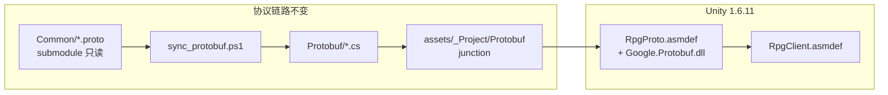

# RPG_Client 团结引擎 1.6.11 重构

## 现状与目标差距

| 项 | 当前 | 目标 |
|----|------|------|
| Editor | [`ProjectSettings/ProjectVersion.txt`](ProjectSettings/ProjectVersion.txt) 为 **1.9.2 / 2022.3.62f3c1** | **1.6.11 / 2022.3.61t12** |
| Packages | [`Packages/manifest.json`](Packages/manifest.json) 含 Hub 注入的 ads/analytics/purchasing/IDE 等 20+ 包，URP **14.1.0** | 仅客户端实际依赖 + **`-t1`** 包（InputSystem `1.14.4-t1`、URP `14.2.0-t1`） |
| C++ 源码 | 工作区已删（`app/`、`sdk/`、`CMakeLists.txt` 等 ~250 文件 `git status D`），**未提交** | 正式删除并清理引用 |
| 文档 | [`README.md`](README.md) L72+ 仍为 SFML/CMake 大段 | Unity 1.6.11 单一工作流 |
| Common 保护 | 无 | sync/commit **检测 `.proto` 本地变更即中止**；Common 推送需 `-AllowCommonEdit` |
| 脚本 | [`sync_all.ps1`](scripts/sync_all.ps1) 仅 4 步；[`commit_push_all.ps1`](scripts/commit_push_all.ps1) 默认 push Common | 完整同步流水线 + 你选择的 **guard_only** 策略 |



**前置条件**：Hub 须安装 **团结引擎 1.6.11**（Editor 目录 `2022.3.61t12`）。若本机仅有 62f3c1，须在 Hub 安装 1.6.11 后再打开工程（不再维护 62/1.9.2 对齐路径）。

---

## 1. 固定 Tuanjie 1.6.11 与 Package

### 1.1 版本文件

更新 [`ProjectSettings/ProjectVersion.txt`](ProjectSettings/ProjectVersion.txt)：

```
m_EditorVersion: 2022.3.61t12
m_EditorVersionWithRevision: 2022.3.61t12
m_TuanjieEditorVersion: 1.6.11
```

### 1.2 精简 manifest

重写 [`Packages/manifest.json`](Packages/manifest.json) 为**最小依赖**（移除 Hub 自动注入且未使用的包）：

- 保留：`com.unity.addressables`、`com.unity.ai.navigation`、`com.unity.inputsystem@1.14.4-t1`、`com.unity.render-pipelines.universal@14.2.0-t1`、`cn.tuanjie.codely.bridge@1.0.62`、各 `com.unity.modules.*`
- 删除：`ads`、`analytics`、`purchasing`、`2d.sprite/tilemap`、IDE 插件、`collab-proxy`、`test-framework`、`textmeshpro`、`timeline`、`ugui`（由 URP 依赖链带入即可）
- 删除 [`Packages/packages-lock.json`](Packages/packages-lock.json)，由 1.6.11 Editor 首次打开再生

### 1.3 共享 Tuanjie 工具模块

新建 [`scripts/_tuanjie_common.ps1`](scripts/_tuanjie_common.ps1)（当前不存在，逻辑 duplicated 于多个脚本）：

- 常量：`$RequiredEditorVersion = '2022.3.61t12'`、`$RequiredTuanjieVersion = '1.6.11'`
- `Get-ProjectUnityVersion` / `Resolve-UnityExe`（Hub 路径扫描）
- `Assert-Tuanjie1611Installed`：未安装则抛错并提示 Hub 安装步骤

### 1.4 替换 align 脚本

将 [`scripts/align_tuanjie_editor.ps1`](scripts/align_tuanjie_editor.ps1) 改为 **verify-only**（或删除）：仅检查 Hub 是否安装 1.6.11 + manifest 是否匹配，**不再**自动对齐到 newest Hub 版本。避免再次漂移到 1.9.2。

### 1.5 更新构建脚本

[`scripts/build_unity_client.ps1`](scripts/build_unity_client.ps1)、[`scripts/setup_boot_scene.ps1`](scripts/setup_boot_scene.ps1)、[`scripts/clean_unity_library.ps1`](scripts/clean_unity_library.ps1)：

- dot-source `_tuanjie_common.ps1`
- 移除 62f3c1 / 1.9.2 引用与 dual-version 表
- `build_unity_client.ps1` 构建前调用 `Assert-Tuanjie1611Installed`

### 1.6 Protobuf 编译配置（保持，已正确）

[`Protobuf/RpgProto.asmdef`](Protobuf/RpgProto.asmdef) 已配置 `overrideReferences` + `precompiledReferences: ["Google.Protobuf.dll"]`；[`assets/_Project/Scripts/RpgClient.asmdef`](assets/_Project/Scripts/RpgClient.asmdef) 引用 RpgProto。**无需改 Common 内容**。

---

## 2. 删除遗留代码与文档

### 2.1 提交已删 C++ 树

将工作区中所有 `D` 的 C++ 路径正式纳入删除提交：`app/`、`sdk/`、`game/`、`net/`、`ui/`、`util/`、`lua/`、`main.cpp`、`CMakeLists.txt`、`CMakePresets.json`、`CMakeSettings.json`、`CppProperties.json`、`build_client.ps1`、`scripts/build_debug.ps1`、`3Party/openssl/` 等。

### 2.2 删除 3Party C++ 残留

| 删除 | 保留 |
|------|------|
| [`3Party/download_and_build.ps1`](3Party/download_and_build.ps1) | [`3Party/protoc/`](3Party/protoc/) |
| `3Party/SFML-2.6.1-win64.zip` | [`scripts/sync_protobuf.ps1`](scripts/sync_protobuf.ps1) |
| 重写 [`3Party/README.md`](3Party/README.md) 为 protoc-only | |

### 2.3 删除/替换 VS C++ 调试配置

删除 [`.vscode/launch.json`](.vscode/launch.json)、[`tasks.json`](.vscode/tasks.json)、[`settings.json`](.vscode/settings.json)、[`extensions.json`](.vscode/extensions.json) 中的 CMake/cppvsdbg 配置；可选改为 Unity/C# 最小推荐（或整目录删除若不用 Cursor F5）。

### 2.4 文档精简

| 文件 | 操作 |
|------|------|
| [`README.md`](README.md) | 删除 L72–244 C++ Build/Run/SFML/struct 章节；全文统一 **1.6.11**；移除「align 到 62f3c1」说明 |
| [`assets/fonts/README.md`](assets/fonts/README.md)、[`assets/ui/README.md`](assets/ui/README.md) | 删除 `build_client.ps1` / SFML 路径引用 |
| [`Protobuf/README.md`](Protobuf/README.md) | 更新链接（`WireCommon.proto` / `MsgHeader.cs`，非已删 `NetDefine.h`） |
| [`docs/SCOPE.md`](docs/SCOPE.md) | 更新为 Unity-only 范围；删除「遗留 C++ 客户端」长段 |
| [`docs/LUA_BRIDGE.md`](docs/LUA_BRIDGE.md) | 保留 Phase 3 占位（仍有效） |
| [`docs/RPG_WorldData.md`](docs/RPG_WorldData.md)、[`docs/manifest_v1.example.json`](docs/manifest_v1.example.json) | 审阅后删 C++ 专有引用 |

### 2.5 删除无用脚本

- [`scripts/gen_char_sprites.ps1`](scripts/gen_char_sprites.ps1)、[`scripts/gen_map_assets.ps1`](scripts/gen_map_assets.ps1) — C++ 2D 占位资源生成，Unity 3D 不用
- 保留：[`setup_config.ps1`](scripts/setup_config.ps1)、[`smoke_login_server.ps1`](scripts/smoke_login_server.ps1)（联调仍有用）

### 2.6 清理 `.cursor/plans/`

- 删除 15 个 C++/SFML 计划（引用 `GameApp.cpp`、`build_client.ps1` 等）
- 删除/归档 [`unity_1.9.2_重构_5366c79c.plan.md`](.cursor/plans/unity_1.9.2_重构_5366c79c.plan.md)（目标已改为 1.6.11）
- 保留 Unity 相关 plan（Boot、编译修复、3D 迁移等）

### 2.7 `.gitignore`

- 移除 `3Party/sfml/`、`3Party/lua/` 等 C++ 条目
- 保留 `Library/`、`3Party/protoc/bin/`、Unity 构建输出

---

## 3. Common 只读保护（不修改 Common 内容）

新建 [`scripts/_common_guard.ps1`](scripts/_common_guard.ps1)：

```powershell
function Get-CommonProtoChanges { git -C Common diff --name-only HEAD -- '*.proto' }
function Assert-CommonProtoReadonly {
    param([switch]$AllowCommonEdit)
    $dirty = git -C Common status --porcelain -- '*.proto'
    if ($dirty -and -not $AllowCommonEdit) {
        throw "Common/*.proto 有本地变更。客户端不应修改协议源，请先在服务端 RPG_Common 评审；若你已判定可改，加 -AllowCommonEdit。"
    }
}
```

**实施时不在 `Common/` 内改任何 `.proto` 文件**；若 sync 过程中发现 submodule 缺文件，仅 `git submodule update --init`。

---

## 4. 脚本优化

### 4.1 [`scripts/sync_all.ps1`](scripts/sync_all.ps1) + [`sync_all.bat`](sync_all.bat)

扩展为完整客户端同步（`-Offline` 行为不变）：

1. `Assert-CommonProtoReadonly`（无 `-AllowCommonEdit`）
2. （在线）`git fetch/pull` + `submodule sync/update`
3. （在线）`submodule update --remote Common` — 仍 **只 pull**，不写 proto
4. [`sync_protobuf.ps1`](scripts/sync_protobuf.ps1)
5. [`sync_streaming_assets.ps1`](scripts/sync_streaming_assets.ps1)（**新增步骤**）
6. [`fetch_google_protobuf.ps1`](scripts/fetch_google_protobuf.ps1)（DLL 缺失时）

修复 submodule init 逻辑：不再因 `Common\LoginMsg.proto` 存在就跳过 `submodule update --init`（fresh clone 会卡住）。

更新 [`sync_all.bat`](sync_all.bat) 帮助：列出完整步骤、`-Offline`、Common 只读说明。

### 4.2 [`scripts/commit_push_all.ps1`](scripts/commit_push_all.ps1) + [`commit_push_all.bat`](commit_push_all.bat)

按你选择的 **guard_only**：

- **默认**：只 `Commit-And-Push` **主仓**（`Protobuf/`、`Common` 指针 bump、`assets/`、`ProjectSettings/`、`Packages/`、`scripts/` 等）
- **Common 子模块**：默认 **跳过** commit/push
- 若 `Common/` 有未提交变更且含 `*.proto` → **中止**，输出 `git diff` 摘要，提示需你判定
- 仅当显式 `-AllowCommonEdit` 时，才执行现有 Common commit/push 流程

更新 bat 帮助文本说明上述策略。

### 4.3 其他

- [`scripts/sync_common.ps1`](scripts/sync_common.ps1)：调用 `Assert-CommonProtoReadonly`
- [`scripts/build_unity_client.ps1`](scripts/build_unity_client.ps1)：构建前 `sync_streaming_assets` + `fetch_google_protobuf`（若缺失）+ 版本断言

---

## 5. Unity C# 最小适配（1.6.11 Editor 下验证）

当前 [`assets/_Project/Scripts/`](assets/_Project/Scripts/) 已用 UGUI + 网络层 C#，**预计改动很小**。实施时在 1.6.11 Editor 中：

- 全量编译，修复 API 差异（若有）
- 确认 [`Boot.unity`](assets/_Project/Scenes/Boot.unity) + [`BootSceneSetup.cs`](assets/_Project/Scripts/Editor/BootSceneSetup.cs) 可 Play
- 确认 `Library/Bee/.../RpgProto.rsp` 含 `-r:"Assets/_Project/Plugins/Google.Protobuf.dll"`

**不修改** [`Common/`](Common/) 内任何文件。

---

## 6. 验证清单

1. Hub 安装 **团结引擎 1.6.11**（`2022.3.61t12`）
2. `.\sync_all.bat`（或 `-Offline`）→ 生成 `Protobuf/*.cs`，Common proto 无本地 diff
3. 关闭其他 Editor/Hub 实例 → `.\scripts\clean_unity_library.ps1 -Full` → Hub 打开工程
4. Package Manager 无 EBUSY；Console **零 CS 错误**
5. Play Boot；`.\scripts\build_unity_client.ps1` → `build/unity/bin/RPGClient.exe`
6. `commit_push_all.bat -m "..."` 在 Common 有 proto 改动时**应中止**；主仓-only 提交正常

---

## 风险

- **Hub 再次改写 manifest**：首次打开后若被注入冗余包，再次提交精简版；README 注明勿 Upgrade 无关包
- **EBUSY**：仍依赖关 Editor + clean Library；[`.cursorignore`](.cursorignore) 已含 `Library/`
- **本机无 1.6.11**：必须先 Hub 安装，无法用 62f3c1 替代（`-t1` 包与版本字符串不兼容）
