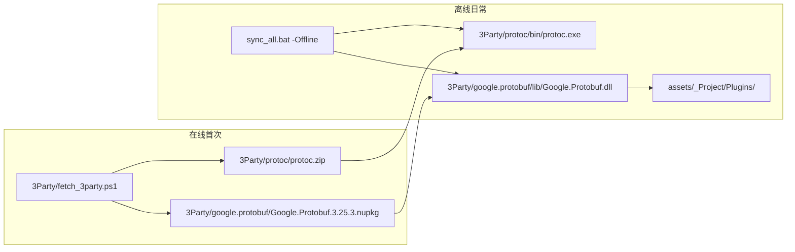

# RPG_Client 团结引擎 1.6.11 重构（含 3Party 离线）

## 补充约束（新增）

| 要求 | 处理方式 |
|------|----------|
| 第三方库 **全部在 `3Party/`** | 构建期依赖：`protoc`、`Google.Protobuf.dll`；Unity UPM 包仍由 Hub 解析到 `Library/PackageCache`（首次在线或预缓存） |
| **离线编译、运行** | `sync_all.bat -Offline`、`build_unity_client.ps1` 在无网络时仅读本地 `3Party/` + 已生成 `Protobuf/`；缺 bundle 时明确报错而非静默下载 |



**说明**：Unity Editor 本身（Tuanjie 1.6.11）与 URP/Addressables 等 UPM 包不属于 `3Party/`；离线运行 Unity 工程需 Hub 已安装 Editor，且 `Library/` 曾成功解析过 Package（或团队共享 PackageCache 快照）。本补充只保证 **协议生成 + C# 插件 DLL** 完全离线。

---

## 3Party 目录结构（目标）

```
3Party/
  README.md                    # 离线/在线 fetch 说明
  fetch_3party.ps1             # 统一入口：下载或从 zip 解压
  protoc/
    protoc.zip                 # 可提交仓库（~3MB）或首次在线下载
    bin/protoc.exe             # gitignore，由 fetch 解压
    include/                   # gitignore，由 fetch 解压
  google.protobuf/
    Google.Protobuf.3.25.3.nupkg   # 可提交或首次在线下载
    lib/netstandard2.0/Google.Protobuf.dll  # 真源副本（gitignore 或提交其一）
```

**删除**：[`3Party/download_and_build.ps1`](3Party/download_and_build.ps1)、`3Party/SFML-*.zip` 等 C++ 残留。

---

## 脚本改动（在原有计划上追加）

### 新建 [`scripts/3Party/fetch_3party.ps1`](3Party/fetch_3party.ps1)（或 [`scripts/fetch_3party.ps1`](scripts/fetch_3party.ps1)）

- **protoc**：若 `3Party/protoc/bin/protoc.exe` 不存在 → 从 `3Party/protoc/protoc.zip` 解压；zip 不存在且 **非 Offline** → 下载 v25.3 win64 到 zip 再解压；**Offline 且无 zip** → 抛错
- **Google.Protobuf**：若 `3Party/google.protobuf/lib/Google.Protobuf.dll` 不存在 → 从本地 `.nupkg` 解压；nupkg 不存在且 **非 Offline** → 从 NuGet 下载到 `3Party/`；**Offline** → 抛错
- 参数：`-Offline`、`-ProtocOnly`、`-GoogleProtobufOnly`

### 重构 [`scripts/fetch_google_protobuf.ps1`](scripts/fetch_google_protobuf.ps1)

- 改为薄封装：调用 `fetch_3party.ps1 -GoogleProtobufOnly`，再将 `3Party/google.protobuf/lib/Google.Protobuf.dll` **复制**到 [`assets/_Project/Plugins/Google.Protobuf.dll`](assets/_Project/Plugins/Google.Protobuf.dll)（Unity 仍从 Plugins 引用，真源在 3Party）

### 更新 [`scripts/sync_protobuf.ps1`](scripts/sync_protobuf.ps1)

- `Ensure-Protoc`：**仅**使用 `3Party/protoc/bin/protoc.exe`（去掉 PATH 回退，避免环境差异）
- 缺 protoc 时调用 `fetch_3party.ps1`；支持传入 `-Offline`（由 `sync_all -Offline` 传递）

### 更新 [`scripts/sync_all.ps1`](scripts/sync_all.ps1)

离线流水线（与原有 6 步合并）：

1. Common 只读检测
2. git / submodule（`-Offline` 跳过 remote）
3. **`fetch_3party.ps1 -Offline`**（或在线时不带 Offline）
4. `sync_protobuf.ps1`
5. `sync_streaming_assets.ps1`
6. 复制 Google.Protobuf.dll → Plugins（若 fetch 未自动复制）

### 更新 [`scripts/build_unity_client.ps1`](scripts/build_unity_client.ps1)

- 构建前：`fetch_3party.ps1` + sync 步骤；**不依赖** `$env:TEMP` 或 NuGet 在线

### [`.gitignore`](.gitignore)

- 移除 `3Party/sfml/`、`3Party/lua/`、`3Party/_build/`
- **策略二选一**（实施时采用 **A**，团队可改 B）：
  - **A（推荐离线 clone）**：**提交** `3Party/protoc/protoc.zip` + `3Party/google.protobuf/*.nupkg`；继续 ignore `bin/`、`include/`、解压后的 dll
  - **B（小仓库）**：全部 ignore，离线前必须在一台联网机器运行一次 `fetch_3party.ps1` 并打包 `3Party/` 目录共享

---

## 文档（[`3Party/README.md`](3Party/README.md)、[`README.md`](README.md)）

- 首次在线：`.\3Party\fetch_3party.ps1` 或 `.\sync_all.bat`
- 日常离线：`.\sync_all.bat -Offline` → Hub 打开工程 → Play / `build_unity_client.ps1`
- 列出各 bundle 版本：protoc **25.3**、Google.Protobuf **3.25.3**（与 Common proto 生成一致）

---

## 与原有 6 项 todo 的关系

| 原 todo | 追加内容 |
|---------|----------|
| pin-1611 | `build/setup` 调用 `fetch_3party` 而非直接 NuGet |
| delete-legacy | 删 C++ 3Party；新增 `3Party/fetch_3party.ps1` 结构 |
| sync-commit | `sync_all -Offline` 传递至 fetch + sync_protobuf |
| docs-trim | 3Party/README + 根 README 离线章节 |
| verify-1611 | 断网执行 `sync_all.bat -Offline` + batchmode 构建仍成功 |

**新增 todo**：`3party-offline` — 实现 fetch_3party、迁移 Google.Protobuf 至 3Party、更新 sync/build 与 .gitignore/README。

---

## 验证（离线专项）

1. 联网机器执行一次 `.\3Party\fetch_3party.ps1`（或提交 zip/nupkg 后跳过）
2. **断网**（或 `-Offline`）：`.\sync_all.bat -Offline` → 生成 `Protobuf/*.cs`，Plugins 含 DLL
3. Tuanjie 1.6.11 打开工程，Console 无 CS 错误
4. `.\scripts\build_unity_client.ps1` → `build/unity/bin/RPGClient.exe`（无需网络）

其余项（1.6.11 固定、Common 只读、遗留删除、commit guard）仍按 [`.cursor/plans/tuanjie_1.6.11_重构_a4559495.plan.md`](.cursor/plans/tuanjie_1.6.11_重构_a4559495.plan.md) 执行。
