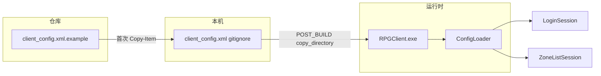

# client_config JSON → XML 迁移计划

## 目标

- 用 XML 替代 JSON，支持注释，便于多人各自维护 `loginHost` 等本机差异。
- 采用你选择的策略：**仓库提交模板，本地文件 gitignore**。

## 配置文件布局

| 文件 | 版本库 | 说明 |
|------|--------|------|
| [`config/client_config.xml.example`](config/client_config.xml.example) | 提交 | 模板，含中文注释 |
| [`config/client_config.xml`](config/client_config.xml) | **gitignore** | 每人本地复制并修改 |

首次使用（在 README 中说明）：

```powershell
Copy-Item config/client_config.xml.example config/client_config.xml
# 编辑 loginHost / loginPort 为本机可访问的 LoginServer
```

可选：新增 [`scripts/setup_config.ps1`](scripts/setup_config.ps1)，若本地 `client_config.xml` 不存在则从 example 复制（与 `sync_all.ps1` 风格一致）。

## XML 结构（与现有字段 1:1 对应）

保持与当前 JSON 相同的键名，降低解析与迁移成本；XML 注释可写在本机 IP 说明：

```xml
<?xml version="1.0" encoding="UTF-8"?>
<!--
  复制为 client_config.xml 后按本机修改。
  loginHost：可访问的 LoginServer IP（虚拟机/局域网地址因机器而异）
-->
<ClientConfig>
    <windowWidth>1280</windowWidth>
    <windowHeight>720</windowHeight>
    <logLevel>info</logLevel>
    <logToConsole>false</logToConsole>
    <loginHost>127.0.0.1</loginHost>
    <loginPort>9010</loginPort>
</ClientConfig>
```

## 代码改动

### 1. [`util/ConfigLoader.h`](util/ConfigLoader.h) / [`util/ConfigLoader.cpp`](util/ConfigLoader.cpp)

- 将注释与 `parseJsonContent` 改为 XML 解析；**移除 JSON 逻辑**（不保留双格式，避免长期维护两套）。
- 解析策略（延续现有“轻量、无第三方库”风格）：
  - 读入全文，去掉 `<!-- ... -->` 注释块
  - 用简单正则/扫描匹配 `<tag>value</tag>`，按 tag 名赋值
  - 未知 tag 忽略；缺失字段保留 `applyDefaults()` 默认值
- 错误信息改为中文（符合 [`.cursor/rules/log-language.mdc`](.cursor/rules/log-language.mdc)），例如：
  - `无法打开配置文件：...`
  - `XML 解析失败：...`（格式非法时）

公共 API（`windowWidth()`、`loginHost()` 等）**不变**，[`LoginSession`](net/LoginSession.cpp)、[`ZoneListSession`](net/ZoneListSession.cpp) 无需修改。

### 2. [`app/GameApp.cpp`](app/GameApp.cpp)

将配置路径从：

```cpp
PathUtil::joinPath(exeDir, "config/client_config.json")
```

改为：

```cpp
PathUtil::joinPath(exeDir, "config/client_config.xml")
```

建议在 `load()` 失败时用 `ClientLogger::warn` 输出 `lastError()` 并继续使用默认值（当前静默 fallback，不利于排查）。

### 3. [`.gitignore`](.gitignore)

```diff
-config/client_config.json
+config/client_config.xml
```

### 4. 删除/迁移

- 不再提交 [`config/client_config.json`](config/client_config.json)（当前已在 gitignore，本地可手动删除或保留作参考）。
- 新增 [`config/client_config.xml.example`](config/client_config.xml.example) 作为仓库内唯一配置模板。

**CMake 无需改动**：现有 POST_BUILD 已复制整个 `config/` 目录到 exe 旁；本地 `client_config.xml` 构建后会一并复制。



## 文档更新

### [`README.md`](README.md) — Config 节

- 将所有 `client_config.json` 引用改为 `client_config.xml`。
- 增加「首次配置」步骤（复制 example → 修改 `loginHost`/`loginPort`）。
- 用 XML 片段替换原 JSON 字段表；字段含义表保留（`loginHost`、`loginPort`、`logToConsole`、`logLevel` 等）。
- 登录流程第 2 步中的配置文件名同步更新。

不修改 [`.cursor/plans/`](.cursor/plans/) 下的历史计划文档（非运行文档）。

## 验证

1. 从 example 生成本地 `config/client_config.xml`，设置本机 `loginHost`。
2. Debug 构建（`scripts/build_debug.ps1` 或 VS F5）。
3. 确认 `out/build/x64-Debug/bin/config/client_config.xml` 存在。
4. 启动客户端，日志中窗口尺寸与 LoginServer 连接地址与 XML 一致；故意删掉 xml 时应出现中文 warn 并使用默认值。

## 影响范围小结

| 文件 | 操作 |
|------|------|
| `util/ConfigLoader.*` | 改 XML 解析 |
| `app/GameApp.cpp` | 改路径 + 可选加载失败日志 |
| `config/client_config.xml.example` | 新增 |
| `.gitignore` | json → xml |
| `README.md` | 更新 Config / 登录流程说明 |
| `scripts/setup_config.ps1` | 可选新增 |

**不改**：`CMakeLists.txt`、`LoginSession`、`ZoneListSession`、`ConfigLoader` 对外 getter 接口。
