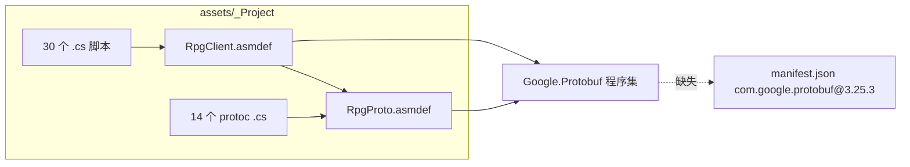

# 修复 Unity 客户端编译（Tuanjie 1.6.11）

## 诊断结论

**不是「大量源码缺失」**，而是 **依赖未接通**：



| 项 | 状态 |
|----|------|
| 游戏逻辑脚本 | 齐全：[`assets/_Project/Scripts/`](assets/_Project/Scripts/) 含 `GameApp`、`LoginSession`、`GameSession`、`GameUiController` 等 30 文件 |
| 协议生成物 | 齐全：[`assets/_Project/Protobuf/*.cs`](assets/_Project/Protobuf/)（与根目录 [`Protobuf/`](Protobuf/) 同步） |
| **编译阻塞** | [`Packages/manifest.json`](Packages/manifest.json) 声明 `com.google.protobuf@3.25.3`，但 OpenUPM **无此包 ID**（`packages-lock.json` 中也无记录） |
| 离线脚本缺陷 | [`scripts/fetch_google_protobuf.ps1`](scripts/fetch_google_protobuf.ps1) 写到 `Assets\_Project\Plugins`（大写），仓库实际为 `assets\_Project\Plugins`；且未配套 asmdef |
| 场景未就绪 | [`assets/_Project/Scenes/Boot.unity`](assets/_Project/Scenes/Boot.unity) 仅占位（仅 Main Camera），需 **RPG → Setup Boot Scene** |
| 引擎版本 | 工程已绑定 **Tuanjie 1.6.11 / 2022.3.61t12**（[`ProjectSettings/ProjectVersion.txt`](ProjectSettings/ProjectVersion.txt)），与本地安装一致；但 [`scripts/build_unity_client.ps1`](scripts/build_unity_client.ps1) 仍硬编码 `2022.3.62f3c1` |

---

## 修复方案（本地 DLL，你已选择）

### 1. 接入 Google.Protobuf.dll

- 运行并修正 [`scripts/fetch_google_protobuf.ps1`](scripts/fetch_google_protobuf.ps1)：
  - 输出目录改为 `assets\_Project\Plugins\Google.Protobuf.dll`
  - 下载后生成 Unity `.meta`（或由 Editor 首次导入自动生成）
- **新增** [`assets/_Project/Plugins/Google.Protobuf.asmdef`](assets/_Project/Plugins/Google.Protobuf.asmdef)：

```json
{
    "name": "Google.Protobuf",
    "overrideReferences": true,
    "precompiledReferences": ["Google.Protobuf.dll"],
    "autoReferenced": false
}
```

- 现有 [`RpgProto.asmdef`](Protobuf/RpgProto.asmdef) / [`RpgClient.asmdef`](assets/_Project/Scripts/RpgClient.asmdef) 中的 `"references": ["Google.Protobuf"]` **无需改名**，会直接解析到上述 asmdef。

### 2. 清理无效 UPM 依赖

- 从 [`Packages/manifest.json`](Packages/manifest.json) **删除** `com.google.protobuf` 及 OpenUPM scoped registry（仅服务于该无效包）
- 避免 UPM 与 Plugins DLL **重复引用** 导致 `Multiple precompiled assemblies named Google.Protobuf.dll`

### 3. 对齐 Tuanjie 1.6.11 构建脚本

- [`scripts/build_unity_client.ps1`](scripts/build_unity_client.ps1)：改为读取 `ProjectVersion.txt` 的 `2022.3.61t12`，并搜索 `Tuanjie\Hub\Editor` 路径（与 [`scripts/setup_boot_scene.ps1`](scripts/setup_boot_scene.ps1) 同一套 `Resolve-UnityExe` 逻辑）
- [`README.md`](README.md)：Editor 版本改为 `2022.3.61t12（Tuanjie 1.6.11）`

### 4. 更新 Plugins README

- [`assets/_Project/Plugins/README.md`](assets/_Project/Plugins/README.md)：说明主路径为 **DLL + asmdef**，UPM 方案已废弃

---

## 你在本机验证的步骤（修复后）

1. **关闭** 团结 Editor（避免 PackageCache EBUSY）
2. 仓库根目录执行：

```powershell
.\scripts\fetch_google_protobuf.ps1
git submodule update --init Common   # 若未初始化
.\scripts\sync_protobuf.ps1          # 确保 assets/_Project/Protobuf 联接/同步
```

1. 用 **Tuanjie 1.6.11** 打开 `RPG_Client` → 等待 Package Manager 解析 URP / InputSystem / Addressables（`-t1` 包走 `packages.tuanjie.cn`）
2. Console **无红色编译错误** 后，菜单 **RPG → Setup Boot Scene**
3. Play：Hierarchy 应有 `GameRoot`、`Canvas`、`EventSystem`

---

## 预期结果

- **编译**：`RpgProto` + `RpgClient` + `RpgClient.Editor` 全部通过
- **运行**：Boot 场景可 Play，区列表/登录 UI 可显示（联调 LoginServer 为后续步骤）
- **非本次范围**：`WorldController` / `EntityManager` 为 Phase 进世界占位实现，不影响登录链路编译
