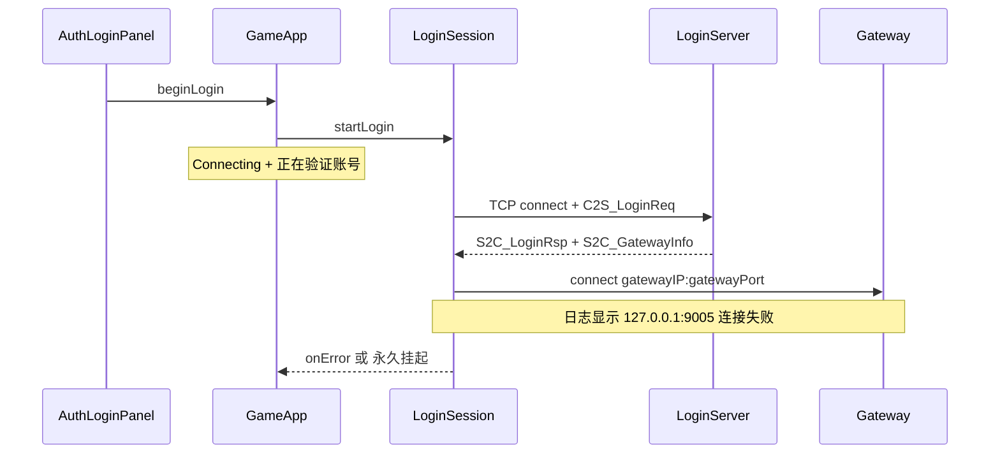

# 修复登录卡在「正在验证账号...」

## 问题定位

用户点击登录后，`GameApp::beginLogin` 进入 `AppState::Connecting`，底部显示 [`m_statusMessage = "正在验证账号..."`](app/GameApp.cpp)（`switchState(Connecting)` 设置）。界面**只有收到 `onUserList` 切到选角页，或 `onError` 回到登录页**才会离开该状态。



### 日志证据（[`logs/client_20260616.log`](logs/client_20260616.log)）

```
LoginSession：连接 LoginServer 192.168.65.128:9010，区服=1
LoginSession：连接 Gateway 127.0.0.1:9005
LoginSession：连接已断开
```

说明：账号在 LoginServer 侧已通过，但 Gateway 地址是**服务端本机回环地址**，客户端在宿主机/另一台机器上无法连上 `127.0.0.1:9005`。

### 代码缺口（对比 [`net/ZoneListSession.cpp`](net/ZoneListSession.cpp)）

| 能力 | ZoneListSession | LoginSession |
|------|-----------------|--------------|
| `connect()` 返回值检查 | 有，`fail("无法连接...")` | **无**，失败时状态机挂死 |
| 连接超时（10s） | 有 | **无** |
| 等待响应超时 | 有 | **无** |
| 断线细分错误 | 有 | 统一 `连接已断开` |

[`LoginSession::startLogin`](net/LoginSession.cpp) 与 [`tryConnectGateway`](net/LoginSession.cpp) 均直接调用 `m_tcp->connect(...)` 不检查返回值；若 TCP 层静默失败或长时间 pending，`update()` 里 `poll()` 空转，UI 永远停在「正在验证账号...」。

## 修复方案

### 1. 网关地址回环重写（核心功能修复）

在 [`LoginSession::handleGatewayInfo`](net/LoginSession.cpp) 解析 `gatewayIP` 后增加重写逻辑：

```cpp
m_gatewayHost = info.gatewayIP;
if (m_gatewayHost == "127.0.0.1" || m_gatewayHost == "localhost" || m_gatewayHost == "::1")
{
    m_gatewayHost = loginHost();  // 与 LoginServer 同机可达地址，如 192.168.65.128
    ClientLogger::instance().info(
        "LoginSession：网关地址为回环，已替换为 %s", m_gatewayHost.c_str());
}
```

这样 VM/局域网部署时，即使服务端 `S2C_GatewayInfo` 填了 `127.0.0.1`，客户端也会连到 [`config/client_config.xml`](config/client_config.xml) 中的 `loginHost`。

### 2. 为 LoginSession 补齐超时与连接失败处理

参照 `ZoneListSession`，在 [`net/LoginSession.h`](net/LoginSession.h) / [`.cpp`](net/LoginSession.cpp) 增加：

- 常量：`kConnectTimeoutMs = 10000`、`kResponseTimeoutMs = 15000`（登录链路比区列表多一步，响应超时略放宽）
- 成员：`m_connectStartMs`、`m_waitResponseStartMs`
- **`startLogin` / `startRegister` / `tryConnectGateway`**：`connect()` 返回 `false` 时立即 `fail(u8"无法连接服务器，请检查 loginHost/loginPort")` 或网关专用文案
- **`update()`**：
  - 处于 `ConnectLogin` / `ConnectGateway` / `RegisterConnect` 且连接超时 → `fail(u8"连接超时，请检查网络与配置")`
  - 处于 `WaitLoginRsp` / `RegisterWaitRsp` / `WaitUserList` / `WaitEnterGame` 且响应超时 → 对应阶段 `fail(...)` 文案
- **`onTcpConnected()`**：进入等待响应态时记录 `m_waitResponseStartMs`
- **`resetToIdle()` / `fail()`**：清零计时器
- **`onTcpDisconnected()`**：在 `ConnectGateway` 阶段失败时使用更明确文案：`fail(u8"无法连接游戏网关，请确认 Gateway 已启动")`

### 3. 阶段性状态文案（改善体验，非必须但建议）

在 `LoginSession` 增加可选 `StatusCallback`（与 `ZoneListSession::setOnStatus` 同模式），或在 `GameApp::wireCallbacks` 里根据会话阶段更新 `m_statusMessage`：

| 阶段 | 文案 |
|------|------|
| 连 LoginServer | 正在连接登录服务器... |
| 等 LoginRsp | 正在验证账号... |
| 连 Gateway | 正在连接游戏网关... |
| 等角色列表 | 正在获取角色列表... |

确保 `onError` 时 [`GameApp`](app/GameApp.cpp) 已有逻辑：`switchState(AuthLogin)` + `setErrorMessage(err)`，用户能看到红色错误而非无限 loading。

### 4. 服务端建议（可选，不在本仓库内改）

若可改 RPG_Server：让 `S2C_GatewayInfo.gatewayIP` 下发**客户端可达的局域网 IP**，而非 `127.0.0.1`。客户端回环重写是兼容兜底，服务端修正更彻底。

## 验证清单

1. 正常登录（Gateway 可达）→ 3 秒内进入选角页，不再长时间停在「正在验证账号...」
2. Gateway 原为 `127.0.0.1` → 日志出现「网关地址为回环，已替换为 192.168.65.128」，能连上网关
3. LoginServer 未启动 / 错误 IP → 10 秒内报错并回到登录页，显示中文错误
4. Gateway 端口未监听 → 明确「无法连接游戏网关」错误，不永久卡住
5. Debug 编译通过

## 涉及文件

| 文件 | 变更 |
|------|------|
| [`net/LoginSession.h`](net/LoginSession.h) | 超时计时成员；可选 `StatusCallback` |
| [`net/LoginSession.cpp`](net/LoginSession.cpp) | 回环网关重写、`connect` 失败处理、超时、`update` 增强 |
| [`app/GameApp.cpp`](app/GameApp.cpp) | 可选：绑定 `setOnStatus` 更新 `m_statusMessage` |
