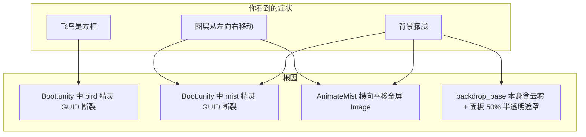

# 修复登录界面背景朦胧、方框飞鸟与漂移图层

## 问题诊断

你描述的三个现象，对应同一套 `LoginFlowBackdrop` 背景系统，根因如下：



### 1. 背景朦胧

多重叠加，并非单一滤镜：

| 来源 | 说明 |
|------|------|
| [`backdrop_base.png`](assets/_Project/Art/UI/LoginFlowBackdrop/backdrop_base.png) | 仙侠底图自带光晕、云雾，风格上偏「朦胧」 |
| `MistNear` / `MistFar` | 两层全屏半透明 Image；精灵引用断裂时 Unity 退化为**纯色半透明矩形**，进一步发白 |
| [`AuthPanel` 等面板](assets/_Project/Scenes/Boot.unity) | 全屏遮罩 `Color(0.08, 0.1, 0.14, 0.5)`，再盖一层暗色半透明 |

### 2. 飞鸟是方框

[`Boot.unity`](assets/_Project/Scenes/Boot.unity) 中 `_birdSprite` 指向占位 GUID `f6a7b8c9...`，与 [`bird.png.meta`](assets/_Project/Art/UI/LoginFlowBackdrop/bird.png.meta) 真实 GUID 不一致。

[`LoginFlowBackdrop.RentBirdImage`](assets/_Project/Scripts/UI/LoginFlowBackdrop.cs) 在 `_birdSprite == null`（缺失引用）时仍会创建 `Image`，Unity 默认渲染为**白色矩形**（48×24），看起来就是「方框在飞」。

> 注：磁盘上的 `bird.png` 本身是正常飞鸟剪影，资源没问题，是场景没绑上。

### 3. 一层图从左到右慢慢移动

[`AnimateMist`](assets/_Project/Scripts/UI/LoginFlowBackdrop.cs) 每帧执行：

```csharp
pos.x += driftSpeed * dt;  // MistNear: 18, MistFar: 10
```

对**全屏拉伸**的 Image 做 `anchoredPosition` 平移。薄雾精灵断裂时，看到的是**半透明色块在横移**；即使引用修好，当前 [`backdrop_mist.png`](assets/_Project/Art/UI/LoginFlowBackdrop/backdrop_mist.png) 是完整山景而非可平铺雾条，平移仍会像「整张图在滑」。

---

## 修复方案（按你的选择：关闭薄雾层）

### A. 修复 Boot 场景精灵引用（核心）

[`Boot.unity`](assets/_Project/Scenes/Boot.unity) 中背景层使用了手工占位 GUID（`f1`~`f6`），仅 `backdrop_base`（`f1`）与 meta 一致，**bird / mist / water / trees / waterfall 均断裂**。

在 [`BootSceneSetup.cs`](assets/_Project/Scripts/Editor/BootSceneSetup.cs) 新增 `RefreshLoginFlowBackdropAssets(LoginFlowBackdrop backdrop)`：

- 按子节点名（`Base`/`Water`/…/`MistNear`）找到各 `Image`
- 用现有 `LoadBackdropSprite(fileName)` 重新赋值 `sprite`
- 调用 `backdrop.BindLayers(...)` 写回 `_birdSprite` 等序列化字段
- 在 [`AddLoginFlowBackdrop`](assets/_Project/Scripts/Editor/BootSceneSetup.cs) 检测到已有 backdrop 时，**除 Wire 外也执行 Refresh**（当前只 re-wire，不修复资源，这是修不好的原因）

执行方式：Unity 菜单 **RPG → Add Login Flow Backdrop**（或 batchmode 同名方法）一次即可写回场景。

### B. 关闭薄雾层（你已确认）

扩展 [`ApplyCompositeBaseLayerPolicy`](assets/_Project/Scripts/UI/LoginFlowBackdrop.cs)（或新增 `_hideMistOnCompositeBase` 开关，默认 true）：

```csharp
SetLayerActive(_mistNear, false);
SetLayerActive(_mistFar, false);
```

理由：`backdrop_base` 已含云雾；[`_hideRedundantLayersOnCompositeBase`](assets/_Project/Scripts/UI/LoginFlowBackdrop.cs) 已对 water/waterfall/trees 做了同样处理，薄雾层应一并关闭。

同步在 [`CreateLoginFlowBackdrop`](assets/_Project/Scripts/Editor/BootSceneSetup.cs) 创建时默认 `mistNear/mistFar.SetActive(false)`，保持编辑器与运行时一致。

### C. 飞鸟显示优化（小改）

在 `RentBirdImage` 中补充：

- `img.preserveAspect = true`
- 绑定 `_birdSprite` 后调用 `SetNativeSize()`，再按需缩放到约 24~40px 宽

避免剪影被固定 48×24 拉伸变形。

### D. 可选：减轻面板朦胧感

若修完 A/B 后仍觉得偏暗，可将 [`PanelOverlayColor`](assets/_Project/Scripts/Editor/BootSceneSetup.cs) 的 alpha 从 `0.5` 降到 `0.35~0.4`，并跑一次 `SoftenLoginFlowPanels` 写回各 Panel。

此项为微调，**不强制**；优先完成 A/B/C 后再目视决定。

---

## 不涉及的范围

- 不重做 `backdrop_base` 美术（底图本身的仙侠雾气是设计意图）
- 不启用 water/waterfall/trees 滚动层（当前 composite base 策略下本已关闭）
- 不替换 `backdrop_mist.png`（薄雾层将关闭，暂不需要可平铺雾条）

---

## 验证清单

1. 运行 Boot 场景 → 登录页：底图清晰可辨，无明显「整张图在滑」
2. 等待 3~5 秒：飞鸟为黑色剪影，**不是白色方框**
3. `MistNear` / `MistFar` 节点为 inactive
4. 区服首页 → 登录 → 注册 → 选角：背景连续、不闪烁
5. 进入 `Game` 状态后 backdrop 隐藏正常
