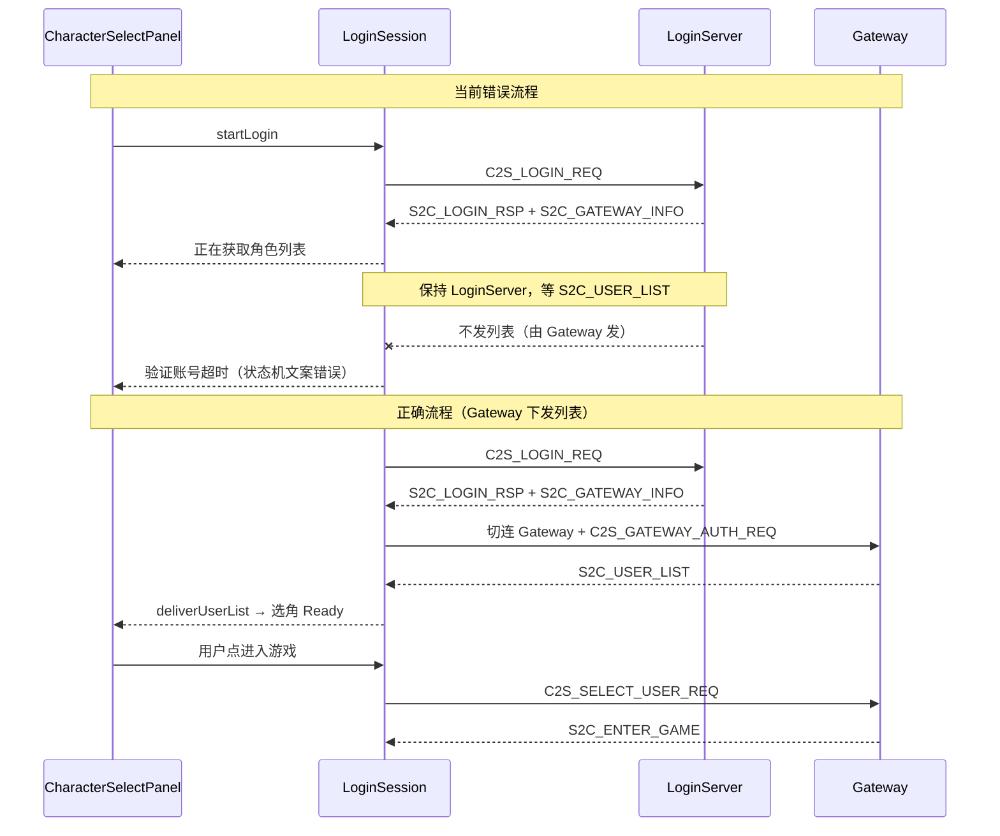

# 修复「正在获取角色列表」后「验证账号超时」

## 现象解读

| 界面文案 | 实际含义 |
|----------|----------|
| 正在获取角色列表... | `handleLoginRsp` 已成功（`S2C_LOGIN_RSP code=0`），客户端进入等列表阶段 |
| 验证账号超时，服务器未响应 | **误导性文案**：超时来自 [`WaitLoginRsp`](net/LoginSession.cpp) 状态，而非「验证账号」失败 |

关键代码：

```468:494:net/LoginSession.cpp
void LoginSession::handleLoginRsp(const Msg_S2C_LoginRsp& rsp)
{
    // ... 登录成功 ...
    if (!m_gotUserList)
    {
        notifyStatus(u8"正在获取角色列表...");
    }
    // 问题：m_state 仍为 WaitLoginRsp，m_waitResponseStartMs 未重置
}
```

```693:702:net/LoginSession.cpp
case State::WaitLoginRsp:
    return u8"验证账号超时，服务器未响应";
case State::WaitUserList:
    return u8"获取角色列表超时，服务器未响应";
```

因此：**账号已验证通过，是角色列表一直没收到**；报错文案不对是因为状态机未从 `WaitLoginRsp` 切走。

---

## 根因（你已确认）

协议与实现对照：

- [`Common/LoginCommon.h`](Common/LoginCommon.h)：`S2C_USER_LIST` 处理方 **GatewayServer（鉴权后推送）**
- 当前客户端（选角流程修复后）：登录成功后**保持 LoginServer 连接**，在 LoginServer 上等 `S2C_USER_LIST`
- 你的服务端：列表从 **Gateway** 下发

**客户端在错误的连接上等包 → 永远收不到 → 15s 超时。**



历史日志（[`logs/client_20260618.log`](logs/client_20260618.log)）也印证：旧版客户端**会**切 Gateway，但在 Gateway 上 `获取角色列表超时`——说明当时 Gateway 也未正确回列表（需一并排查服务端 Gateway 鉴权后是否真发了 `0x0006`）。

---

## 修复方案

改动集中在 [`net/LoginSession.cpp`](net/LoginSession.cpp)，[`app/GameApp.cpp`](app/GameApp.cpp) 与 [`ui/CharacterSelectPanel.cpp`](ui/CharacterSelectPanel.cpp) 无需大改。

### 1. 登录成功后主动连 Gateway 取列表

调整 [`tryConnectGateway`](net/LoginSession.cpp) 触发条件：

- **删除** `!m_gotUserList` 作为前置（当前要求已有列表才连 Gateway，与 Gateway 下发列表矛盾）
- **保留** `m_gotLoginRsp && m_gotGatewayInfo` 前置（避免过早切连）
- 触发时机：
  - `handleLoginRsp` 成功且 `!m_gotUserList` 时调用（取列表）
  - `selectCharacter` 时若已连 Gateway 则直接 `sendSelectUserReq`（已有逻辑）

```cpp
void LoginSession::tryConnectGateway()
{
    if (!m_tcp || !m_gotLoginRsp || !m_gotGatewayInfo || m_gotUserList)
        return;
    if (m_gatewayConnected || m_state == SwitchingGateway || ...)
        return;
    // 登录后首次：为拉列表切 Gateway（m_pendingSelectUserId 可为 0）
    ...
}
```

### 2. Gateway 连接后进入 WaitUserList

[`onTcpConnected(ConnectGateway)`](net/LoginSession.cpp)：

- 鉴权发送后：`m_state = WaitUserList`，`m_waitResponseStartMs = now`
- `notifyStatus(u8"正在获取角色列表...")`
- **不要**在鉴权完成前调用 `onGatewayAuthSent` / `sendSelectUserReq`（仅用户已选角时才发选角包）

[`onGatewayAuthSent`](net/LoginSession.cpp)：

- 仅当 `m_pendingSelectUserId != 0` 时 `sendSelectUserReq`（进游戏路径）

### 3. handleLoginRsp 修正状态与计时

登录成功且尚未收列表时：

```cpp
m_state = State::WaitUserList;  // 或先 SwitchingGateway，连上后再 WaitUserList
m_waitResponseStartMs = TimeUtil::nowMs();
notifyStatus(u8"正在获取角色列表...");
tryConnectGateway();
```

这样超时文案会正确显示「获取角色列表超时」。

### 4. handleUserList 在 Gateway 上交付

保持现有 Gateway 分支：`!m_gatewayConnected` 时仅在 LoginServer 兼容路径交付；主路径在 `m_state == WaitUserList && m_gatewayConnected` 时 `deliverUserList`。

### 5. 创角改走 Gateway（与协议一致）

[`createCharacter`](net/LoginSession.cpp) 当前 `if (m_gatewayConnected) return;` 与 [`LoginCommon.h`](Common/LoginCommon.h)（`C2S_CREATE_USER_REQ` 处理方 Gateway）冲突。

- 移除「必须未连 Gateway」限制
- 创角请求在已建立的 Gateway 连接上发送（登录后拉列表时连接应保持）

### 6. 文档对齐

更新 [`README.md`](README.md) §登录流程：

- `S2C_USER_LIST`：**Gateway 鉴权后**下发（与 `LoginCommon.h` 一致）
- 创角在 **Gateway** 完成
- LoginServer 职责：登录/注册、`S2C_GATEWAY_INFO`

---

## 服务端需同步确认

即使修好客户端切连时机，若 Gateway 鉴权后仍不发 `S2C_USER_LIST`，仍会超时。请在 Gateway 日志/抓包确认：

1. 收到 `C2S_GATEWAY_AUTH_REQ` 后是否回复鉴权成功
2. 是否发送 `module=LOGIN sub=0x06` 变长包（header 8B + count×entry）
3. `gatewayIP` 是否为客户端可达地址（历史日志曾出现 `127.0.0.1:9005` 导致连不上；现有回环替换逻辑应保留）

---

## 验证清单

1. 登录 → 选角 Loading → 文案「正在获取角色列表...」→ 几秒内 Ready（不再 15s 超时）
2. 若列表迟迟不来 → 报错应为「**获取**角色列表超时」，而非「验证账号超时」
3. 无角色：`count=0` 列表 → 选角页「暂无角色」
4. 创角、选角进游戏、进地图全链路
5. Debug 编译通过

## 涉及文件

| 文件 | 变更 |
|------|------|
| [`net/LoginSession.cpp`](net/LoginSession.cpp) | `tryConnectGateway`、`handleLoginRsp`、`onTcpConnected`、`onGatewayAuthSent`、`createCharacter` |
| [`README.md`](README.md) | 登录流程与 `LoginCommon.h` 对齐 |
