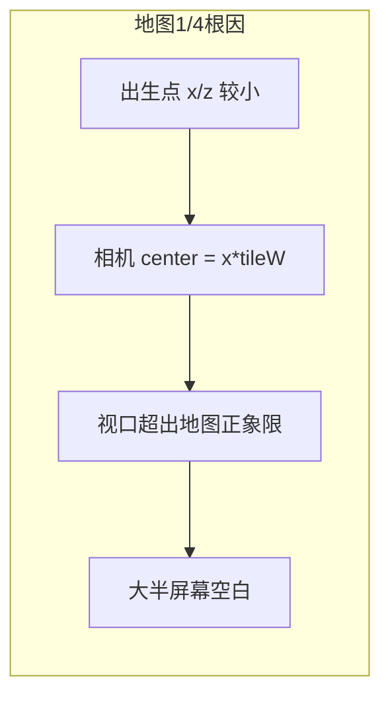
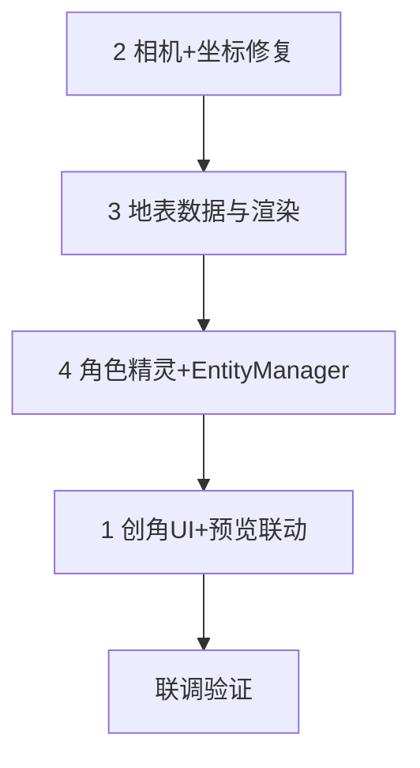

# 创角界面与主城视觉补全

## 现状诊断

| 诉求 | 根因 |
|------|------|
| 创角界面不好看 | [`CharacterSelectPanel`](ui/CharacterSelectPanel.cpp) Create 模式仅为左栏表单 + 右栏列表，无预览区、无分区装饰、职业/性别为普通按钮 |
| 地图只占画面约 1/4 | 相机中心 `local->x * tileW, local->z * tileW` 未限制在地图边界内；出生点靠近 (0,0) 时，视口大半为空白；[`AmbientSystem::drawSky`](game/AmbientSystem.cpp) 固定在世界原点，随相机移动后天空也消失 |
| 没有草地/青石路 | [`map/1002/ground.json`](map/1002/ground.json) 缺 `tiles` 数组，解析失败后回退色块；[`MapRenderer`](game/MapRenderer.cpp) 仅用 `sf::RectangleShape` 纯色，无 `tileset.png`；日志常见 **map=1001** 但仓库仅有 `map/1002/` |
| 没有角色模型 | [`EntityManager::draw`](game/EntityManager.cpp) 用蓝色矩形；`dir`/`vocation`/`sex` 未参与绘制；`assets/characters/` 不存在 |



---

## 1. 创角界面美化（CharacterSelectPanel Create 模式）

**目标文件：** [`ui/CharacterSelectPanel.cpp/h`](ui/CharacterSelectPanel.cpp)

**布局改造（保持 720×520 面板）：**

- Create 模式切换为**双栏布局**：
  - **左栏（约 320px）**：分区标题 + 角色名输入 + 职业/性别 **卡片式选项**（非并排小按钮）
  - **右栏（约 340px）**：**角色预览区**（仙侠侠客剪影/精灵 idle 动画）+ 规则提示（2–12 码点）
- Select 模式保持现有列表 + 底部三按钮不变

**视觉增强（复用 [`UiTheme`](ui/UiTheme.h)，少引入新依赖）：**

- 为 Create 模式增加内部分区底框（淡色 `drawPanel` 子矩形 + 左侧金色竖线装饰）
- 职业卡片：战士/法师各一块，选中时 `Button::setSelected` + 副标题（近战/法术）
- 性别卡片：男/女图标化文字 + 选中描边
- 主按钮层级：`确认创建` 用 accent 强调，`取消` 降为次要样式
- 右栏预览：调用下文 **CharacterSprite** 的 idle 帧（随 vocation/sex 切换配色）

**可选小改：** Create 模式下右栏角色列表改为半透明/缩小，避免与表单抢视觉焦点。

---

## 2. 修复主城地图显示过小（铺满主画面）

**目标文件：** [`game/GameScene.cpp/h`](game/GameScene.cpp)

**相机与视口：**

- 在 `updateCamera()` 中根据地图像素尺寸钳制中心：

```cpp
const float mapPxW = m_map.mapWidthTiles() * m_map.tileWidth();
const float mapPxH = m_map.mapHeightTiles() * m_map.tileHeight();
const float halfW = m_viewSize.x * 0.5f;
const float halfH = m_viewSize.y * 0.5f;
float cx = local->x * m_map.tileWidth();
float cz = local->z * m_map.tileHeight(); // 修复：Y 轴用 tileHeight
cx = clamp(cx, halfW, max(halfW, mapPxW - halfW));
cz = clamp(cz, halfH, max(halfH, mapPxH - halfH));
m_worldView.setCenter(cx, cz);
```

- **统一坐标系**：`EntityManager`、`WaterSystem`、`BuildingManager` 的屏幕 Y 均改为 `z * tileHeight()`（X 仍 `x * tileWidth()`），与 [`MapRenderer::rebuildTileShapes`](game/MapRenderer.cpp) 一致。

**天空与背景：**

- [`AmbientSystem::drawSky`](game/AmbientSystem.cpp)：改为**屏幕空间**绘制（在 `GameScene::draw` 中于 `setView(m_uiView)` 前用 UI 视口绘制），或按 `worldView.getCenter()` 偏移，保证始终铺满窗口上部。
- 世界空白区填充：在 `MapRenderer::draw` 之前铺一层大地色矩形（草地底色），避免地图边缘外纯黑。

**地图 ID 兜底（客户端）：**

- `GameScene::enter` 加载前：若 `{exe}/map/{mapID}/ground.json` 不存在且存在 `1002`，记录中文 warn 并**回退加载 1002**（避免 server 仍发 1001 时完全错位）。长期仍建议 Server DB 出生点改为 1002。

---

## 3. RPG 主城地表：青石路 + 草地

**目标文件：** [`game/MapRenderer.cpp/h`](game/MapRenderer.cpp)、[`map/1002/ground.json`](map/1002/ground.json)、新增 `map/1002/tileset.png`

**数据层：**

- 补全 `ground.json`：
  - `tiles` 数组（40×30）：主街/广场 `bluestone`，河岸/建筑间隙 `grass`，符合计划 §6.6（青石 70–85%，草地点缀）
  - 保留 `defaultTile`/`grassRatio`；扩展 `parseGroundJson`：无 `tiles` 时按 `grassRatio` **程序化生成**主城路网（十字主街 + 广场 + 河宽 5 列），避免再次回退空地图
- 统一瓦片尺寸为 **64×32**（与 JSON 一致），保证一屏约 20×22 格，场景尺度合适

**渲染层（两阶段，本迭代完成阶段 A，阶段 B 可选增强）：**

- **阶段 A（必做）**：在纯色块上增加程序化纹理感
  - `bluestone`：石板网格线 + 轻微色差
  - `grass`：点状草屑 + 边缘羽化
  - 比纯矩形更接近 RPG 地表，不依赖外部美术即可交付
- **阶段 B（推荐）**：加载 `map/1002/tileset.png`（2×2 或 4 格：青石/青石裂纹/草地/花草），`MapRenderer` 用 `sf::Sprite` 按 tile 类型切 `textureRect`

**关联修复：**

- [`BuildingManager`](game/BuildingManager.cpp)：解析 `buildings.json` 的 `id` 字段（当前只找 `label` 导致始终用硬编码默认建筑）
- [`WaterSystem`](game/WaterSystem.cpp)：读取 `river.json` 河道走向（现为硬编码竖条，与 JSON 横河不一致）

---

## 4. 2D 仙侠风格侠客角色模型

**新增模块：**

| 文件 | 职责 |
|------|------|
| `game/CharacterSprite.h/cpp` | 加载精灵表、4 方向帧、idle/walk 状态机 |
| `assets/characters/player/warrior_male.png` | 4 方向 × N 帧行走 + idle（可先程序生成仙侠剪影：青白道袍、束发、佩剑） |
| `assets/characters/player/warrior_female.png` | 女侠变体（衣色/发型差异） |
| `assets/characters/player/mage_*.png` | 法师袍变体（可选首版共用 warrior 底图改色） |
| `assets/characters/player/anim.json` | 帧宽、行=方向、列=帧、fps（参照 [`LoginBackgroundAnim`](ui/LoginBackgroundAnim.cpp)） |

**EntityManager 改造：**

- `GameEntity` 增加 `vocation`、`sex`、`facing`（4 向）、`animState`（idle/walk）
- 本地玩家：`vocation`/`sex` 从创角缓存或 `EnterGame` 后本地记录注入（`GameScene::enter` 时由 `GameApp` 传入 `CharacterEntry`）
- `draw()`：`sf::Sprite` 替换 `RectangleShape`；根据 `dir` 算 facing；移动时播 walk，静止 idle；本地玩家保留金色描边/脚下阴影
- 按 `z` 排序绘制，解决遮挡

**创角预览联动：** `CharacterSelectPanel` Create 模式右栏调用同一 `CharacterSprite` 渲染 idle 动画。

---

## 5. 验证清单

1. 创角：Create 模式双栏 + 预览；战士/男女性别切换预览变化；确认创建流程不受影响
2. 进游戏：无论出生点在 (0,0) 或地图中部，**地砖始终铺满 1280×720 主视口**（边缘钳制相机）
3. 地图：可见青石主街、草地斑块、河道与建筑位置与 JSON 一致；日志无 `地图 1001 加载失败` 或已回退 1002
4. 角色：本地玩家显示仙侠 2D 侠客精灵，WASD 四向走路有帧动画；非纯色矩形
5. Debug 编译通过；`map/`、`assets/characters/` 随 POST_BUILD 复制到 `bin/`

---

## 实施顺序建议



先修视口/坐标（立竿见影解决「1/4 屏」），再补地表与角色，最后创角 UI 对接预览资源。

## 范围外（本迭代不做）

- Server 改 DB 出生 mapID（仅客户端兜底 1002）
- 完整鱼虾/云朵贴图动画（Water/Ambient JSON 全量接入可后续迭代）
- 协议扩展 `EnterGame` 携带 appearance（首版本地玩家用创角缓存）
