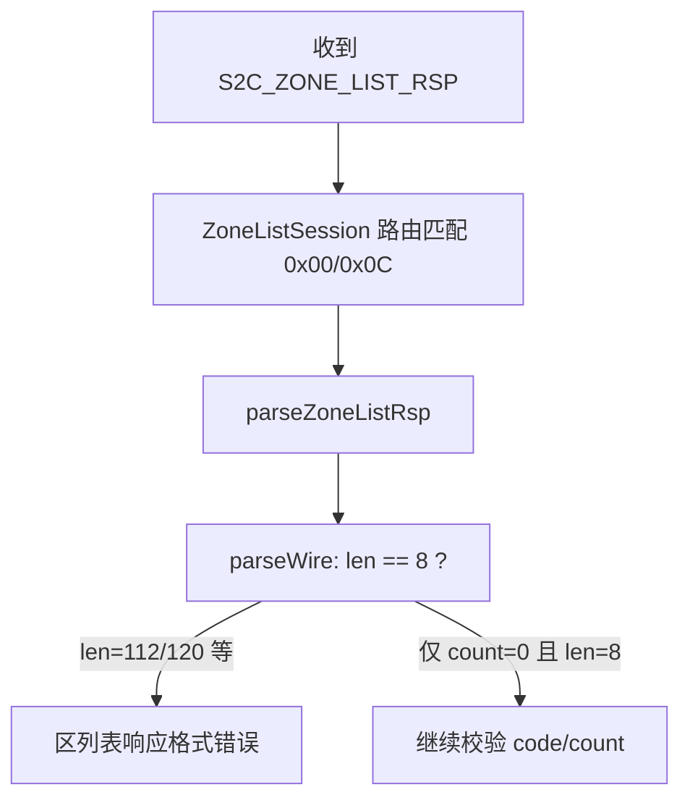

# 区列表「响应格式错误」根因与修复

## 结论：**客户端问题（高置信度）**

该文案只在 [`sdk/net/ClientMsgHandler.cpp`](sdk/net/ClientMsgHandler.cpp) 的 `parseZoneListRsp` 中，当 `parseWire(data, len, hdr)` 返回 `false` 时设置：

```131:136:sdk/net/ClientMsgHandler.cpp
    Msg_S2C_ZoneListRspHeader hdr{};
    if (!parseWire(data, len, hdr))
    {
        errMsg = u8"区列表响应格式错误";
        return false;
    }
```

而 `parseWire` 是为**定长包**设计的，要求 `len == sizeof(MsgT)`：

```42:52:sdk/net/ClientMsgHandler.cpp
bool parseWire(const char* data, uint16_t len, MsgT& out)
{
    if (!data || len != sizeof(MsgT))
    {
        ClientLogger::instance().warn(
            "ClientMsgHandler：固定包长度不符 module=%u sub=%u len=%u expected=%zu",
            ...
        return false;
    }
```

区列表响应是**变长包**（[`Common/ZoneMsg.h`](Common/ZoneMsg.h)）：

- Header：`Msg_S2C_ZoneListRspHeader` = **8 字节**（module/sub + code + count）
- Body：`count × Msg_S2C_ZoneEntryWire`（v2 每条 112B）或 v1 兼容（104B）

只要有 1 个区服，整包长度至少是 `8 + 104 = 112` 或 `8 + 112 = 120`，**永远不等于 8**，因此 `parseWire` 必然失败 → 显示「区列表响应格式错误」。

这与服务端是否正常无关；旧日志中曾出现「收到 1 个区服」说明服务端此前能正确响应，问题出在对齐 wire v2 后引入的解析逻辑。



## 错误文案对照（便于二次排查）

| 用户看到的文案 | 失败阶段 | 更可能原因 |
|---|---|---|
| **区列表响应格式错误** | `parseWire` 失败 | **客户端 bug**（当前情况）；或 body 前两字节 module/sub 与帧头不一致 |
| 区列表响应过短 | `len < 8` | 服务端截断 / 网络异常 |
| 区列表服务器错误 | `hdr.code != 0` | 服务端业务错误 |
| 区列表数据不完整 | `len != zoneListBodyLen(count)` | 服务端 body 长度与 count 不符，或 v1 条目与 `zoneListBodyLen`（按 v2 计算）不一致 |
| 区列表条目格式未知 | entry 单条大小非 104/112 | 服务端条目结构与 Common 不一致 |

当前报错落在第一行，**优先修客户端**。

## 修复方案（单文件为主）

在 [`sdk/net/ClientMsgHandler.cpp`](sdk/net/ClientMsgHandler.cpp) 增加专用于变长包 header 的解析辅助（与 wire v2 计划中的 `parseFixedMsg` 意图一致，但只读 header、不校验整包长度）：

```cpp
template<typename MsgT>
bool parseMsgHeader(const char* data, uint16_t len, MsgT& out)
{
    if (!data || len < sizeof(MsgT))
        return false;
    if (!clientMsgBodyMatches(MsgT::kModule, MsgT::kSub, data, len))
        return false;
    std::memcpy(&out, data, sizeof(MsgT));
    return true;
}
```

将以下 4 处变长解析中的 `parseWire(data, len, hdr)` 替换为 `parseMsgHeader`：

- `parseZoneListRsp`（区列表）
- `parseUserList`（角色列表，同样 bug，联调时也会踩）
- `parseQuestInfo`
- `parseBagInfo`（或同类变长 header 函数）

**保留** `parseWire` 仅用于真正定长的消息（`parseLoginRsp`、`parseHeartbeat` 等）。

## 修复后若仍失败，再查服务端

1. 确认 LoginServer 已发 wire v2 header（body 前两字节为 `0x00, 0x0C`），与 [`Common/ClientMsgBody.h`](Common/ClientMsgBody.h) 一致
2. 确认 `Common` 子模块与 RPG_Server 同一 commit（`git submodule status Common`）
3. 若出现「数据不完整」且服务端仍发 v1 条目（104B），需让 `zoneListBodyLen` 在 v1/v2 分支分别计算，或服务端升级到 v2 `Msg_S2C_ZoneEntryWire`

## 验证步骤

1. 重新编译 `out/build/x64-Debug/bin/RPGClient.exe`
2. 请求区列表，日志应出现 `ZoneListSession：收到 N 个区服` 而非格式错误
3. 若失败，查看日志中 `ClientMsgHandler：固定包长度不符` 是否消失；根据上表新文案判断下一步
