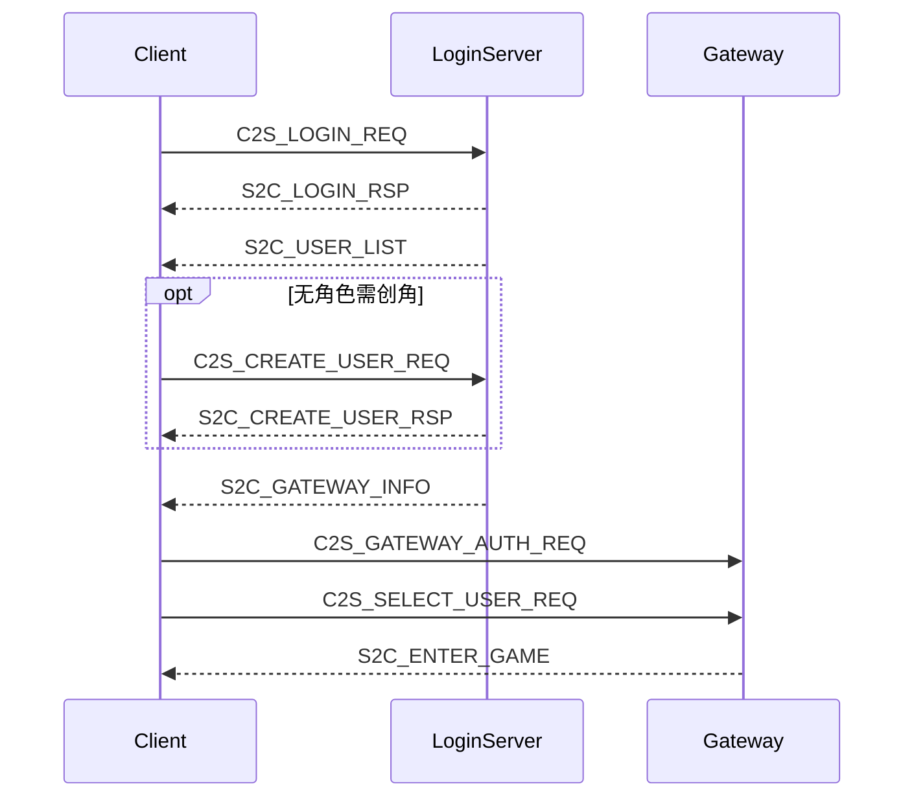

# 登录域协议 wire v2 对齐与流程优化

## 背景（Common `c074c57` 变更）

[`Common/Common.txt`](Common/Common.txt) 明确：

- **废弃** 聚合头 [`ClientMsg.h`](Common/ClientMsg.h)（子模块已删除）；新代码按域 include：`LoginMsg.h`、`ZoneMsg.h`、`LoginCommon.h` 等
- **wire v2（破坏性）**：线上帧仍为 `MsgHeader(6B) + body`，但 **body 前两字节必须与 header 的 module/sub 一致**（见 [`ClientMsgBody.h`](Common/ClientMsgBody.h)）
- 所有 wire struct 增大 2 字节前缀，发送前须 `initClientMsg(msg)`

当前客户端问题：

| 问题 | 影响 |
|------|------|
| 仍 `#include "ClientMsg.h"` / 使用已删除的 `ClientMsgID` | **无法编译**（子模块无此文件） |
| `ClientMsgHandler` 组包未 `initClientMsg`，解析未 `clientMsgBodyMatches` | 与新 Server **包长/校验不一致** |
| `Msg_S2C_UserListHeader` 由 6B→8B，区列表头同理 | 角色/区列表解析错位 |
| `S2C_ERROR` 归属 **SYSTEM(0x0F)** 非 LOGIN | [`LoginSession`](net/LoginSession.cpp) 在 LOGIN 模块下监听 ERROR，**收不到网关错误** |
| 创角/角色列表协议注释指向 **LoginServer**；选角在 **Gateway 鉴权后** | 当前在 Gateway 上收列表/创角，与权威定义不符 |



---

## 1. 协议头迁移（编译基础）

### 新增 [`sdk/net/ClientProtocol.h`](sdk/net/ClientProtocol.h)

聚合客户端常用域头（不复制 Common，仅转发 include）：

```cpp
#include "LoginMsg.h"
#include "LoginCommon.h"
#include "ZoneMsg.h"
#include "ZoneCommon.h"
#include "MapDataMsg.h"
#include "MapDataCommon.h"
#include "ClientMsgBody.h"
#include "ClientTypes.h"
#include "MsgId.h"
#include "NetDefine.h"
```

将所有 `#include "ClientMsg.h"` 替换为 `#include "ClientProtocol.h"`（约 6 处：[`GameApp.h`](app/GameApp.h)、[`LoginSession.h`](net/LoginSession.h)、[`GameSession.h`](net/GameSession.h)、[`ClientMsgHandler.h`](sdk/net/ClientMsgHandler.h)、[`GameScene.h`](game/GameScene.h)、[`EntityManager.h`](game/EntityManager.h)）。

### 消息 ID 迁移

删除对 `ClientMsgID::` 的依赖，改用：

- 发送/匹配：`MsgT::kModule` / `MsgT::kSub` 或 `clientMsgFlatId<MsgT>()`
- 域枚举：`LoginMsgSub`、`ZoneMsgSub`、`SystemMsgSub`、`SceneMsgSub` 等

涉及文件：[`ClientMsgHandler.cpp`](sdk/net/ClientMsgHandler.cpp)、[`LoginSession.cpp`](net/LoginSession.cpp)、[`ZoneListSession.cpp`](net/ZoneListSession.cpp)、[`GameSession.cpp`](net/GameSession.cpp)（场景/心跳同属 wire v2，须一并修正否则联调进图后移动/心跳失败）。

---

## 2. ClientMsgHandler 重构（核心）

修改 [`sdk/net/ClientMsgHandler.h`](sdk/net/ClientMsgHandler.h) / [`.cpp`](sdk/net/ClientMsgHandler.cpp)：

### 私有工具

```cpp
template<typename MsgT>
static std::vector<char> encodeMsg(MsgT& body);  // initClientMsg + ProtocolCodec::encode

template<typename MsgT>
static bool parseFixedMsg(const char* data, uint16_t len, MsgT& out, std::string& errMsg);
// 校验 clientMsgBodyMatches + len >= sizeof(MsgT)
```

### 登录域 build（每个函数内 `initClientMsg`）

| 函数 | 结构体 |
|------|--------|
| `buildLoginReq` | `Msg_C2S_LoginReq` |
| `buildRegisterReq` | `Msg_C2S_RegisterReq` |
| `buildGatewayAuthReq` | `Msg_C2S_GatewayAuthReq` |
| `buildSelectUserReq` | `Msg_C2S_SelectUserReq` |
| `buildCreateUserReq` | `Msg_C2S_CreateUserReq` |
| `buildZoneListReq` | `Msg_C2S_ZoneListReq`（`gameType` 默认 `ZONE_LIST_ALL_GAME_TYPES`） |
| `buildHeartbeat` | `Msg_C2S_Heartbeat` |
| `buildMoveReq` | `Msg_C2S_MoveReq` |

### 登录域 parse

- 定长：`parseLoginRsp`、`parseGatewayInfo`、`parseEnterGame`、`parseCreateUserRsp`、`parseRegisterRsp`（从 LoginSession 迁入）
- 变长：
  - `parseUserList`：用 [`userListBodyLen(count)`](Common/LoginCommon.h) 校验总长；header 为 8B `Msg_S2C_UserListHeader`
  - `parseZoneListRsp`：用 [`zoneListBodyLen(count)`](Common/ZoneCommon.h)；header 为 8B `Msg_S2C_ZoneListRspHeader`；保留 104B v1 entry 兼容

---

## 3. LoginSession 流程与状态机

修改 [`net/LoginSession.h`](net/LoginSession.h) / [`.cpp`](net/LoginSession.cpp)：

### 新增标志

- `m_gotUserList`：是否在 LoginServer 阶段收到 `S2C_USER_LIST`
- `m_pendingGatewaySwitch`：已具备 gateway 信息但等待创角完成

### LoginServer 阶段（`WaitLoginRsp`）

同时处理：

- `S2C_LOGIN_RSP`（已有）
- `S2C_USER_LIST` → 缓存 `m_characters`，`m_gotUserList=true`
- `S2C_CREATE_USER_RSP` → 在 **LoginServer 连接**上处理（`WaitLoginUserAction` 子状态）
- `S2C_GATEWAY_INFO` → 缓存网关地址

**切 Gateway 条件**（`tryConnectGateway()`）：

- `m_gotLoginRsp && m_gotGatewayInfo`
- 且（`m_gotUserList` 为 true 且角色列表非空 **或** 用户已完成创角 **或** 兼容旧服未发列表）

若 `m_gotUserList && m_characters.empty()`：先 `onUserList(empty)` 进入创角 UI，**保持 LoginServer 连接**，`createCharacter` 在 LoginServer 发送；创角成功后刷新列表，用户点「进入游戏」前再 `tryConnectGateway()`。

### Gateway 阶段

- `onTcpConnected` → `sendGatewayAuthOrLogin()`（优先 `loginToken`）
- `WaitUserList`：兼容旧 Gateway 在此下发 `S2C_USER_LIST`（若 LoginServer 未下发）
- Gateway 鉴权成功后：若已有缓存列表 → `deliverUserList`；否则继续等 `S2C_USER_LIST`
- `selectCharacter` → `C2S_SELECT_USER_REQ` → `WaitEnterGame`
- `S2C_ENTER_GAME` → `onEnterGame`（不变）

### 系统消息

`onTcpMessage` 增加 **SYSTEM 模块**分支，处理 `Msg_S2C_Error`（`GatewayValidateCode`），映射中文提示（如 `BAD_PAYLOAD` → 「请求参数非法」）。

移除 Gateway 阶段的 `C2S_LOGIN_REQ` 回退为**最后兼容**（仅 `loginToken` 为空时），并打 warn 日志。

---

## 4. UI 与校验

### [`ui/CharacterSelectPanel.cpp`](ui/CharacterSelectPanel.cpp)

- 创角名校验改用 [`MIN_ROLE_NAME_LEN`](Common/LoginCommon.h)（2）/ [`MAX_ROLE_NAME_LEN`](16)
- 创角进行中若仍在 LoginServer 阶段，状态文案区分「正在创建角色…」/「正在连接网关…」

### [`app/GameApp.cpp`](app/GameApp.cpp)

- `beginLogin`：重置选角 panel
- `setOnUserList`：若 LoginSession 仍在 LoginServer 且列表为空 → 进入创角模式；若已连 Gateway → 进入选角
- 创角成功后若尚未连 Gateway，提示「正在进入网关…」并由 LoginSession 自动 `tryConnectGateway()`

---

## 5. ZoneListSession

[`net/ZoneListSession.cpp`](net/ZoneListSession.cpp)：

- 消息匹配改用 `clientMsgFlatId<Msg_S2C_ZoneListRspHeader>()`
- `fetchZoneList(0xFF)` 改为 `ZONE_LIST_ALL_GAME_TYPES`

---

## 6. 文档更新

### [`README.md`](README.md)

- **共享协议**节：说明 Common 按域拆分、`ClientProtocol.h` 聚合 include、wire v2 body 前缀规则
- **登录流程**：按上文 sequence 更新（角色列表/创角在 LoginServer，选角/进图在 Gateway）
- **Server 联调**协议表：补充 `module/sub` 列；注明 `S2C_ERROR` 为 SYSTEM 0x0F/0x05
- 角色名长度、创角错误码（0 成功 / 1 重名 / -1 系统错误）

### 代码注释

- 更新 [`ClientMsgHandler.h`](sdk/net/ClientMsgHandler.h)、[`LoginSession.h`](net/LoginSession.h) 文件头：引用 `LoginMsg.h` / wire v2

---

## 7. 验证

1. `scripts/build_debug.ps1` 编译通过（确认无 `ClientMsg.h` / `ClientMsgID` 引用）
2. 联调新 Server：
   - 注册 → 登录 → LoginServer 下发角色列表 →（可选）创角 → Gateway 鉴权 → 选角 → `S2C_ENTER_GAME`
3. 兼容：旧 Gateway 直发 `S2C_ENTER_GAME` 仍可进图
4. 日志可见中文错误（网关 `S2C_ERROR`、创角失败等）

---

## 影响文件

| 文件 | 变更 |
|------|------|
| `sdk/net/ClientProtocol.h` | 新增 |
| `sdk/net/ClientMsgHandler.*` | wire v2 encode/parse 重构 |
| `net/LoginSession.*` | 流程对齐 + SYSTEM 错误 |
| `net/ZoneListSession.cpp` | wire v2 区列表 |
| `net/GameSession.cpp` | wire v2 场景/心跳（编译联调必需） |
| `ui/CharacterSelectPanel.cpp` | 角色名校验 |
| `app/GameApp.cpp` | 创角/网关切换 UI 衔接 |
| `README.md` | 协议与流程文档 |
| 若干 `*.h` | `ClientMsg.h` → `ClientProtocol.h` |

**不改 Common 子模块内容**（仅消费最新协议定义）。
