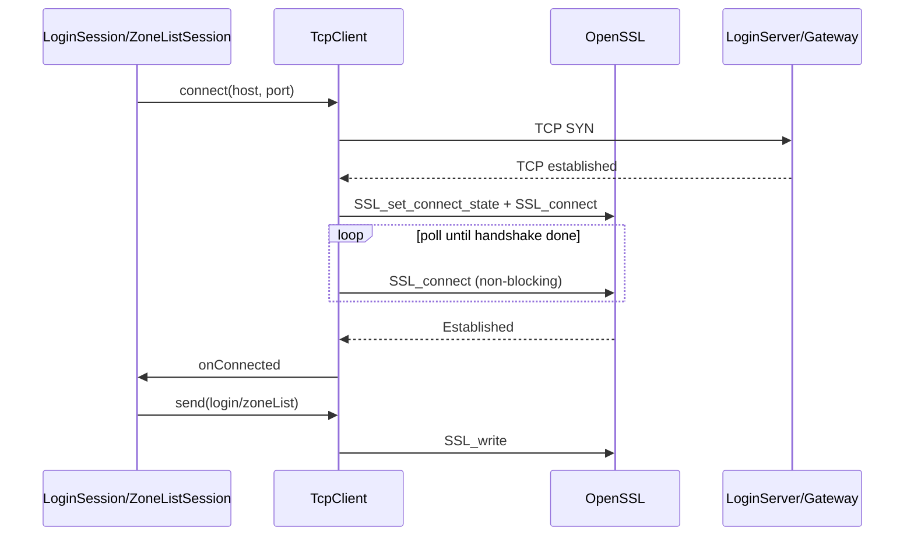

# 客户端 TLS 加密实现计划

## 背景与差距

服务端（[`RPG_Server/docs/TLS.md`](d:\Study\RPG_Server\docs\TLS.md)）在 `Tls enabled=1` 时，**9010（Login）与 9005（Gateway）均要求 TLS**，应用层帧格式不变（6 字节 `MsgHeader` + body，见 [`Common/NetDefine.h`](Common/NetDefine.h)）。

客户端当前 [`sdk/net/TcpClient.cpp`](sdk/net/TcpClient.cpp) 为明文 WinSock，`onConnected` 在 **TCP 完成时** 立即触发，Session 随即发包——与 TLS 语义冲突（须握手完成后再发游戏帧）。



**关键约束**：`LoginSession` → `GameSession` → `resumeGatewayForCharSelect()` 会**移交同一 `TcpClient` 实例**而不重连；TLS 的 `SSL*` 对象须随 socket 一起保留，移交后仅重绑回调。

---

## 实现方案

### 1. 引入 OpenSSL（3Party 预编译）

按你的选择，扩展 [`3Party/download_and_build.ps1`](3Party/download_and_build.ps1)：

- 下载 Windows x64 VC 预编译 OpenSSL（建议 3.x LTS，与服务器 `minVersion=1.2` 兼容）到 `3Party/openssl/`
- 目录结构：`include/openssl/*.h`、`lib/libssl.lib`、`lib/libcrypto.lib`（及运行所需的 `bin/*.dll`）
- [`CMakeLists.txt`](CMakeLists.txt)：`find_path`/`find_library` 指向 `3Party/openssl`，链接 `libssl` + `libcrypto`；构建后将 DLL 复制到 `build/bin/`（与 SFML DLL 复制逻辑并列）
- [`3Party/README.md`](3Party/README.md)、[`README.md`](README.md) 补充 TLS 依赖说明

### 2. 客户端 TLS 配置层

新增精简配置（不必照搬服务端 mTLS 字段）：

| 文件 | 职责 |
|------|------|
| [`sdk/net/ClientTlsConfig.h`](sdk/net/ClientTlsConfig.h) | `enabled`、`caPath`、`insecureSkipVerify`、`minVersion`（默认 `1.2`） |
| [`sdk/net/ClientTlsContext.h/.cpp`](sdk/net/ClientTlsContext.h) | 进程级单例 `SSL_CTX`：`OPENSSL_init_ssl`、`TLS_client_method`、加载 CA、`SSL_VERIFY_PEER`（dev 可 `SSL_VERIFY_NONE`）、**不加载客户端证书**（外联 9010/9005 无需 mTLS） |

[`util/ConfigLoader.h/.cpp`](util/ConfigLoader.h) 解析 XML 新段（与现有轻量 regex 风格一致）：

```xml
<Tls enabled="1"
     ca="config/tls/ca.crt"
     insecureSkipVerify="0"
     minVersion="1.2"/>
```

[`config/client_config.xml.example`](config/client_config.xml.example) 与 [`README.md`](README.md) Config 表同步更新；默认 `enabled=1`，`ca` 指向 `config/tls/ca.crt`（从服务端 `scripts/gen_tls_certs.sh` 产物复制）。

[`app/GameApp.cpp`](app/GameApp.cpp) `init()` 在 `setConfig` 之前调用 `ClientTlsContext::init(m_config.tls())`；失败时中文日志 + 启动中止。

### 3. 改造 TcpClient（核心）

修改 [`sdk/net/TcpClient.h/.cpp`](sdk/net/TcpClient.h)：

**状态机**（`enabled=0` 时保持现有三态）：

```
Disconnected → Connecting(TCP) → TlsHandshaking → Connected
```

- TCP `connect` 完成后：若 TLS 启用，创建 `SSL*`（`ClientTlsContext::newSsl(fd)`）、`SSL_set_connect_state`、`SSL_set1_host(ssl, host.c_str())`（SNI），进入 `TlsHandshaking`；**不触发 `onConnected`**
- `poll()`：
  - `Connecting`：沿用现有 `select` + `SO_ERROR` 检测
  - `TlsHandshaking`：`SSL_connect` 循环，处理 `SSL_ERROR_WANT_READ/WRITE`；成功 → `Connected` 并触发 `onConnected`；失败 → `notifyDisconnected`
  - `Connected`：`SSL_read` / `SSL_write` 替代 `recv` / `send`（`WANT_READ/WRITE` 与现有 `select` 配合）
- `isConnecting()`：在 `Connecting` **或** `TlsHandshaking` 时返回 true（保证 [`LoginSession`](net/LoginSession.cpp) / [`ZoneListSession`](net/ZoneListSession.cpp) 的 `connectTimeoutMs` 覆盖完整握手）
- `disconnect()`：`SSL_shutdown` + `SSL_free` 后再 `closesocket`
- `connect(host, port)` 保存 `m_peerHost` 供 SNI

**Session 层无需改动**（4 处 `m_tcp->connect()` 保持不变）；`ProtocolCodec` / `ClientMsgHandler` 不变。

### 4. 错误文案与日志

[`sdk/net/ClientErrorText.cpp`](sdk/net/ClientErrorText.cpp) 补充 TLS 握手失败场景（可复用 `ConnectFailed + LoginServerConnect/GatewayConnect`，或新增 `ClientLocalError::TlsHandshakeFailed` 若需与 TCP 拒绝区分）。

固定 `ClientLogger` 文案使用中文，例如：`ClientTlsContext：TLS 初始化失败`、`TcpClient：TLS 握手失败`。

### 5. 资源与部署

- 新增 `config/tls/README.md`（说明从 RPG_Server 复制 `ca.crt`）
- 可选 `config/tls/ca.crt.example` 占位；构建脚本将 `config/` 同步到 `build/bin/config/`（若已有 copy 逻辑则只补 tls 目录）
- dev 联调：`insecureSkipVerify=1` 等价服务端 E2E 的 `TLS_INSECURE=1`（仅调试）

### 6. 验证

| 步骤 | 期望 |
|------|------|
| 服务端 `Tls enabled=1`，执行 `gen_tls_certs.sh`，启动 Login + Gateway | 9010/9005 TLS 监听 |
| 客户端复制 `ca.crt`，`tls enabled=1` | 区列表、登录、进游戏全流程成功 |
| 服务端 TLS 开、客户端 `enabled=0` | 握手失败，UI 显示连接失败（确认破坏性变更可见） |
| 客户端 `insecureSkipVerify=1`（无 ca.crt） | dev 可连通（可选冒烟） |
| `openssl s_client -connect 127.0.0.1:9010 -CAfile config/tls/ca.crt` | 服务端自检仍通过 |

参考服务端 E2E：[`RPG_Server/scripts/test_login_gateway_e2e.py`](d:\Study\RPG_Server\scripts\test_login_gateway_e2e.py)（`wrap_socket` + 同帧协议）。

---

## 主要改动文件

| 区域 | 文件 |
|------|------|
| 依赖 | [`3Party/download_and_build.ps1`](3Party/download_and_build.ps1)、[`CMakeLists.txt`](CMakeLists.txt) |
| TLS SDK | 新建 `sdk/net/ClientTlsConfig.h`、`ClientTlsContext.h/.cpp` |
| 传输 | [`sdk/net/TcpClient.h`](sdk/net/TcpClient.h)、[`sdk/net/TcpClient.cpp`](sdk/net/TcpClient.cpp) |
| 配置 | [`util/ConfigLoader.h/.cpp`](util/ConfigLoader.h)、[`config/client_config.xml.example`](config/client_config.xml.example) |
| 启动 | [`app/GameApp.cpp`](app/GameApp.cpp) |
| 文案 | [`sdk/net/ClientErrorText.cpp`](sdk/net/ClientErrorText.cpp)（可选 [`ClientLocalError.h`](sdk/net/ClientLocalError.h)） |
| 文档 | [`README.md`](README.md)、`config/tls/README.md` |

**明确不改动**：`LoginSession` / `ZoneListSession` / `GameSession` 状态机、`Common/` 协议定义、应用层消息编解码。
