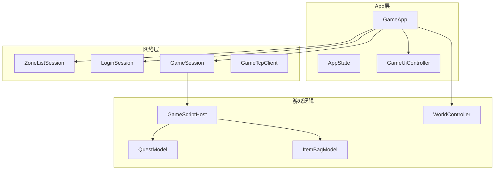

# RPG 客户端代码审查与修改建议

## 审查范围

- **技术栈**：Tuanjie/Unity C# 客户端（无 C++ 源码），TCP + Protobuf 网络，UGUI 登录流程，C# 游戏模型 + Lua 脚本（尚未接入 VM）
- **核心入口**：[GameApp.cs](assets/_Project/Scripts/App/GameApp.cs)、[LoginSession.cs](assets/_Project/Scripts/Net/LoginSession.cs)、[GameSession.cs](assets/_Project/Scripts/Net/GameSession.cs)、[GameScriptHost.cs](assets/_Project/Scripts/Script/GameScriptHost.cs)
- **已有优点**：分层清晰（Session → ScriptHost → Model → UI）、`TryParse` 协议解析、`ClientErrorText` 中文错误文案、移动/心跳节流、实体与列表项对象池

---

## P0 — 功能缺陷（应尽快修复）

### 1. 返回选角后可能长时间无响应

[`LoginSession.ResumeGatewayForCharSelect`](assets/_Project/Scripts/Net/LoginSession.cs)（L195-208）仅重置状态为 `WaitUserList`，**未发送** `C2SGatewayAuthReq` 或角色列表请求；而 [Net/README.md](assets/_Project/Scripts/Net/README.md) L79 声称超时会重发鉴权，**代码未实现**。

[`CheckTimeouts`](assets/_Project/Scripts/Net/LoginSession.cs)（L232-277）在超时后直接 `Fail`，无重试逻辑。

**建议修改**：
- 在 `ResumeGatewayForCharSelect` 内：重置 `_gotGatewayAuthRsp = false`，若 TCP 已连接则立即 `SendRaw(BuildGatewayAuthReq(...))`；或发送已有的 user-list 请求（若协议支持）
- 在 `CheckTimeouts` 的 `WaitUserList` 分支：TCP 仍连接且未收到列表时，允许 **一次** 重发鉴权后再超时失败
- 同步更新 README 与实现

### 2. 选角/创角失败无 UI 反馈

[`LoginSession.SelectCharacter`](assets/_Project/Scripts/Net/LoginSession.cs) / `CreateCharacter` 在 `CanSendUserAction()` 为 false 时仅 `Warn` 日志（L117-137），不触发 `OnError`。

**建议修改**：调用 `OnError` 或专用 `OnSelectCharacterFailed`，由 `GameApp` 走 `_ui.ShowError(...)`。

### 3. `SetConfig` 未调用时的空引用风险

[`LoginSession`](assets/_Project/Scripts/Net/LoginSession.cs) L90、L105 等处直接访问 `_config.LoginHost`，未像其他路径使用 `_config?.`。

**建议修改**：`Connect`/`Register` 入口增加 `_config == null` 守卫，记录中文错误并 `Fail`。

---

## P1 — 安全与配置

### 4. TLS 自定义 CA 与 minVersion 配置无效

[`ClientConfigLoader`](assets/_Project/Scripts/Config/ClientConfigLoader.cs) 解析 `Tls.CaPath`、`MinVersion`，但 [`GameTcpClient.ValidateCert`](assets/_Project/Scripts/Net/GameTcpClient.cs)（L290-297）仅检查 `InsecureSkipVerify` 或系统信任链，**未加载 `ca.crt`**。

**建议修改**：
- 在 `AuthenticateAsClient` 前从 `StreamingAssets` 加载 CA，构造 `X509ChainPolicy` 或 `X509Certificate2Collection` 注入 `SslStream`
- 按 `MinVersion` 设置 `SslProtocols`（如 TLS 1.2+）
- 若短期不实现自定义 CA，从 example 配置中移除误导性的 `ca` 属性说明

### 5. 示例配置鼓励跳过证书校验

[`client_config.xml.example`](assets/StreamingAssets/config/client_config.xml.example) L27：`insecureSkipVerify="1"`。

**建议修改**：示例默认 `insecureSkipVerify="0"`，并注释说明仅本地调试可开启。

### 6. 明文密码驻留内存

[`LoginSession`](assets/_Project/Scripts/Net/LoginSession.cs) L29-31、[`GameApp`](assets/_Project/Scripts/App/GameApp.cs) L38-39 在登录流程中保留 `_password` / `_pendingPassword`，成功后未清零。

**建议修改**：
- 登录成功进入 Gateway 后 `Array.Clear` 或置空密码字段
- 考虑仅在需要发送 digest 的瞬间持有密码（`SecureString` 在 Unity 中收益有限，至少缩短生命周期）
- 协议层 SHA-256 无盐为服务端约定（见 [docs/SECURITY.md](docs/SECURITY.md)），客户端可在文档中标注为已知限制

### 7. `logToConsole` 配置未生效

[`ClientConfigLoader`](assets/_Project/Scripts/Config/ClientConfigLoader.cs) 解析 `LogToConsole`，[`ClientLogger`](assets/_Project/Scripts/Log/ClientLogger.cs) 始终写 Unity Console。

**建议修改**：读取配置，为 false 时跳过 `Debug.Log*` 镜像。

---

## P2 — 性能（algorithmic-complexity-review 视角）

### 8. HUD 状态每帧分配字符串

[`GameApp.UpdateHudStatus`](assets/_Project/Scripts/App/GameApp.cs)（L436-447）在 `Game` 状态每帧 `Update` 调用，拼接坐标/RTT/FPS 新字符串。

**建议修改**：节流至 200-500ms，或仅在坐标/RTT 变化超过阈值时刷新。

### 9. 聊天日志全量重建

[`GameHudPanel.RefreshChatLog`](assets/_Project/Scripts/UI/GameHudPanel.cs) 每次追加行时 `string.Join` 重建全文。

**建议修改**：TMP 追加单行、环形缓冲 + 对象池，或限制可见行数后增量更新。

### 10. 背包同步重复分配

[`GameScriptHost.OnBagInfo`](assets/_Project/Scripts/Script/GameScriptHost.cs) 每次全量同步 `new List<BagSlotEntry>()`。

**建议修改**：复用成员级 `List`，`Clear()` 后 refill。

### 11. 任务模型批量更新抖动

`OnQuestInfo` 先 `_quests.Clear()` 再逐条 `Upsert`，每条触发 `OnChanged`。

**建议修改**：增加 `BeginBatch`/`EndBatch` 或 `ReplaceAll`，结束时单次 `OnChanged`。

### 12. Lua 侧重复加载配置表

[`item_client.lua`](assets/StreamingAssets/script/client/item_client.lua) 在 `addItem`/`getItemName` 中反复 `DataTable.load("item_config")`。

**建议修改**：模块级缓存 `local itemConfig = DataTable.load(...)`（Lua 接入后生效）。

### 13. NPC 销毁无池化

[`MapAmbientController.Clear`](assets/_Project/Scripts/World/MapAmbientController.cs) 对 NPC 使用 `Destroy`，与 [`EntityManager`](assets/_Project/Scripts/World/EntityManager.cs) 池化策略不一致。

**建议修改**：统一轻量 GameObject 池或标记为 Phase 2 优化项。

---

## P3 — 架构与可维护性

### 14. C# 与 Lua 双栈漂移（最大长期风险）

| 能力 | C# 路径 | Lua 路径 | 状态 |
|------|---------|----------|------|
| 任务 | `QuestModel` | `quest_client.lua` | C# 收包，Lua 未调用 |
| 背包 | `ItemBagModel` | `item_client.lua` | 数据结构不一致（slot vs itemId 计数） |
| 事件 | C# `event Action` | `event_bus.lua` | Lua EventBus 未被引用 |
| Tick | `GameScriptHost.OnTick` 空 | `init.lua OnTick` | Phase 3 占位 |

**建议修改（二选一，需产品决策）**：
- **A. 推进 Phase 3**：接入 XLua，`GameScriptHost` 转发 `OnEnterGame`/`OnTick`/`OnQuestInfo`/`OnBagInfo`；Lua `send_quest_*` 桥接到 `GameSession`
- **B. 暂缓 Lua**：在 README/docs 标明 Lua 为设计稿；删除或 `#if false` 未使用 Lua 模块，避免双份维护；`script/` 与 `StreamingAssets/script/` 仅保留一份源 + sync 脚本

### 15. 任务/背包数据未接 UI

[`QuestModel.OnChanged`](assets/_Project/Scripts/Game/QuestModel.cs) / [`ItemBagModel.OnChanged`](assets/_Project/Scripts/Game/ItemBagModel.cs) **无订阅者**；[`GameHudPanel`](assets/_Project/Scripts/UI/GameHudPanel.cs) 注释中的 Phase 2/3 未实现。

**建议修改**：HUD 订阅 `OnChanged` 刷新任务追踪/背包条；`GameApp` 将 `_scriptHost` 暴露给 HUD 或通过小型 `GameHudPresenter`。

### 16. `GameApp` 职责膨胀

~500 行，集中 WireCallbacks、区服选择、登录、进世界、退出对话框。

**建议修改**：拆分为 `LoginFlowCoordinator`、`InGameCoordinator`（或 partial class），不改变行为，降低后续功能（战斗/NPC）接入成本。

### 17. 未知协议消息静默丢弃

[`GameSession.OnMessage`](assets/_Project/Scripts/Net/GameSession.cs) 对未注册 `(module, sub)` 无日志。

**建议修改**：`ClientLogger.WarnFormat` 记录 module/sub（开发构建可更详细）。

### 18. 工程依赖与构建

- `Protobuf/` 被 gitignore，克隆后必须跑 `sync_protobuf.ps1`
- Addressables 在 manifest 中但地图仍走 JSON/手动场景
- EditorBuildSettings 仅 Boot.unity

**建议**：在 [README.md](README.md) 增加「首次构建检查清单」；世界场景加载策略列入 roadmap。

---

## 推荐修复顺序

| 阶段 | 项目 | 预估工作量 |
|------|------|-----------|
| 1 | P0-1 返回选角鉴权重发 + README 对齐 | 小 |
| 2 | P0-2/3 选角错误提示 + config 空守卫 | 小 |
| 3 | P1-4/5 TLS CA 加载或配置文档修正 | 中 |
| 4 | P1-6/7 密码清零 + logToConsole | 小 |
| 5 | P2-8~11 HUD/背包/任务性能小改 | 小-中 |
| 6 | P3-15 任务/背包 UI 接线 | 中 |
| 7 | P3-14 Lua 路线决策与整理 | 大 |

---

## 不建议现阶段改动

- 重写 `GameTcpClient` 线程模型（当前 main-thread queue 设计合理）
- 大规模引入 DI 框架
- 为尚未落地的 NPC/战斗模块预先抽象

---

## 验证建议

修复 P0 后手动回归：

1. 区服首页 → 区列表 → 登录 → 选角 → 进世界
2. 游戏中 ESC → 返回选角 → **角色列表应在超时前出现**
3. 快速重复点击选角/创角 → 应有错误提示
4. TLS 开启 + 自签 CA → 连接成功（修复 P1-4 后）

性能改动可用 Unity Profiler 对比 `GameApp.Update` 与 `GameHudPanel` GC Alloc。
