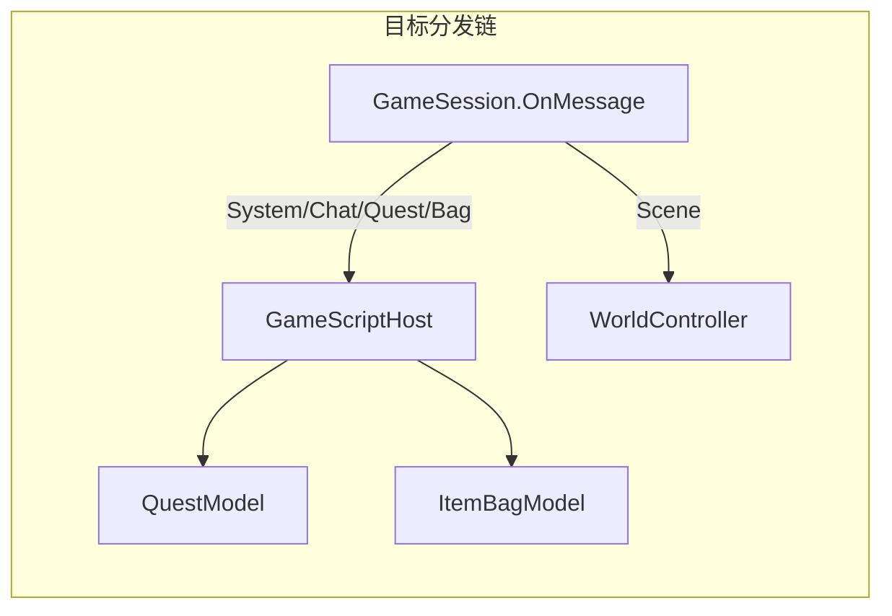
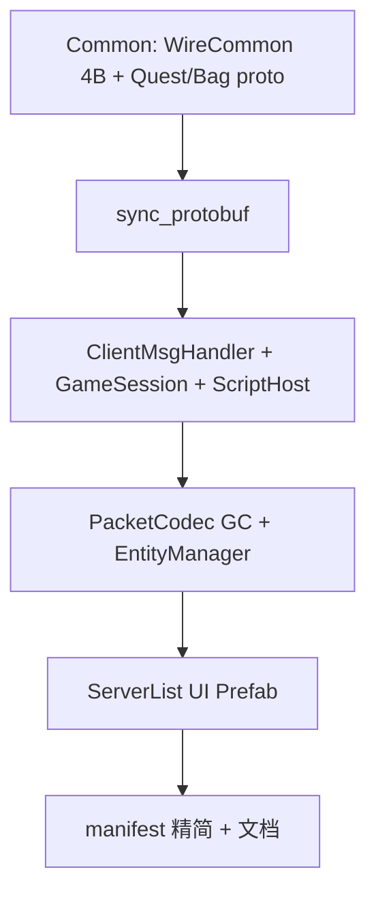

# RPG_Client 六项优化计划

## 现状摘要

| # | 问题 | 根因 |
|---|------|------|
| 1 | `ShowServerList` 自动选第一个区 | [`GameUiController.cs`](assets/_Project/Scripts/UI/GameUiController.cs) L152-165 为 MVP stub；[`BootSceneSetup.cs`](assets/_Project/Scripts/Editor/BootSceneSetup.cs) 仅生成 Hint + Cancel |
| 2 | MsgHeader 注释 6B / 代码 4B | [`MsgHeader.cs`](assets/_Project/Scripts/Net/MsgHeader.cs) `Size=4`；[`WireCommon.proto`](Common/WireCommon.proto) `MSG_HEADER_SIZE=6`；根 [`README.md`](README.md) 写 6 字节 |
| 3 | `TryDecode` GC | [`PacketCodec.cs`](assets/_Project/Scripts/Net/PacketCodec.cs) L52/L66 双次 `buffer.ToArray()`；[`GameTcpClient.ReadAvailable`](assets/_Project/Scripts/Net/GameTcpClient.cs) L198 每 Poll 分配 8KB |
| 4 | 冗余 UPM 包 | [`Packages/manifest.json`](Packages/manifest.json) 含 ads/analytics/purchasing/IDE 等 Hub 注入包 |
| 5 | EntityManager 静默 Capsule | [`EntityManager.CreateEntity`](assets/_Project/Scripts/World/EntityManager.cs) L124-129 |
| 6 | GameSession 缺 Chat/Quest/Bag | 仅 Scene + 部分 System；[`LuaScriptHost.cs`](assets/_Project/Scripts/Script/LuaScriptHost.cs) 空壳 |

**MsgHeader 权威结论**：[`Common/README.md`](Common/README.md) L12 已写明 wire 为 **4 字节**（`bodyLen 2B + module 1B + sub 1B`），C# 实现正确，需修正 proto/文档中的过时「6 字节」表述。



---

## 1. 区服列表完整 UI

### 新增文件

- [`assets/_Project/Scripts/UI/ZoneListItemView.cs`](assets/_Project/Scripts/UI/ZoneListItemView.cs) — 单行绑定：`Name`、`LoadStatus` 标签、`OnlineCount`、选中高亮、可点击状态
- [`assets/_Project/Scripts/UI/ServerListPanel.cs`](assets/_Project/Scripts/UI/ServerListPanel.cs) — 管理 ScrollView 内容、选中项、`确认`/`取消`

### Prefab 与场景

- 新建 `assets/_Project/Prefabs/UI/ZoneListItem.prefab`（行模板）
- 扩展 [`BootSceneSetup.cs`](assets/_Project/Scripts/Editor/BootSceneSetup.cs) 的 `ServerListPanel`：
  - ScrollView + Content + VerticalLayoutGroup
  - `ConfirmBtn`（确认选区）、保留 `CancelServerListBtn`
  - 动态 Hint（拉取中 / 无可用区）
- 更新 [`WireUiController`](assets/_Project/Scripts/Editor/BootSceneSetup.cs) 绑定新 SerializeField

### 重写 `ShowServerList`

[`GameUiController.ShowServerList`](assets/_Project/Scripts/UI/GameUiController.cs) 改为：

1. 清空并实例化 `ZoneListItem` prefab 填充列表
2. 用 `selectedZoneId` 预高亮（来自 `LocalSettings.LastZoneId`）
3. **可选规则**（对齐旧 C++）：`Enabled && LoadStatus != Maintenance` 才可点；维护/爆满显示状态标签
4. 用户点「确认」后才 `OnZoneConfirmed?.Invoke(...)` — **不再自动选第一个**
5. 列表为空或无可选区时 `ShowError("没有可用区服")`，停留 `AppState.ServerList`

[`GameApp`](assets/_Project/Scripts/App/GameApp.cs) 回调不变；`_zoneList.OnSuccess` 仍调用 `ShowServerList`。

---

## 2. MsgHeader 文档统一为 4 字节

### Common 子模块（需 `-AllowCommonEdit`）

修改 [`Common/WireCommon.proto`](Common/WireCommon.proto)：

- 文件头注释、`MSG_HEADER_SIZE`：`6` → `4`
- `WireMsgHeader` 注释改为「4 字节 packed」

同步 [`Common/README.md`](Common/README.md) 中任何残留 6 字节表述（L8 表格行）。

### Client 侧

- [`MsgHeader.cs`](assets/_Project/Scripts/Net/MsgHeader.cs)：删除矛盾注释；`WriteTo` 摘要改为「写入小端 4 字节」
- 根 [`README.md`](README.md) L3、`Protobuf/README.md` L25 → **4 字节 MsgHeader**
- [`assets/_Project/Scripts/Net/README.md`](assets/_Project/Scripts/Net/README.md) 已正确，保持不变

### 重新生成

```powershell
.\scripts\sync_all.bat -AllowCommonEdit
```

刷新 [`Protobuf/WireCommon.cs`](Protobuf/WireCommon.cs)（`MsgHeaderSize = 4`）。

---

## 3. PacketCodec / GameTcpClient 零额外分配拆帧

### GameTcpClient 接收缓冲

[`GameTcpClient.cs`](assets/_Project/Scripts/Net/GameTcpClient.cs)：

- `List<byte> _recvBuffer` → `byte[] _recvBuf` + `int _recvLen`（不足时按 2x 扩容）
- 实例字段 `byte[] _readScratch = new byte[8192]`（复用，消除每帧 new）
- `ReadAvailable`：`Buffer.BlockCopy` 批量追加，替代逐字节 `Add`

### PacketCodec.TryDecode

[`PacketCodec.cs`](assets/_Project/Scripts/Net/PacketCodec.cs) 签名改为基于数组+长度：

```csharp
public static bool TryDecode(byte[] buffer, ref int length, out byte module, out byte sub, out byte[] body)
```

- 用 `MsgHeader.TryRead(buffer.AsSpan(0, length), ...)` 读头 — **无 ToArray**
- 帧不完整时 early return — **不分配**
- body 仍 `new byte[bodyLen]`（每消息一次，不可避免）；用单次 `Buffer.BlockCopy` 拷贝
- 消费后：`Buffer.BlockCopy` 前移剩余字节或维护 read offset

[`DecodeFrames`](assets/_Project/Scripts/Net/GameTcpClient.cs) 适配新 API。

> Encode 路径（`ToByteArray` + `new frame[]`）为发送侧低频分配，本阶段不改动。

---

## 4. 精简 Packages/manifest.json

按 [`.cursor/plans/tuanjie_1.6.11_重构_a4559495.plan.md`](.cursor/plans/tuanjie_1.6.11_重构_a4559495.plan.md) §1.2：

**保留**：

- `cn.tuanjie.codely.bridge`
- `com.unity.addressables`、`com.unity.ai.navigation`
- `com.unity.inputsystem@1.14.4-t1`
- `com.unity.render-pipelines.universal@14.2.0-t1`
- 全部 `com.unity.modules.*`

**删除**（代码库无引用）：

- `com.unity.ads`、`analytics`、`purchasing`
- `com.unity.2d.sprite`、`2d.tilemap`
- IDE 插件（rider/visualstudio/vscode）
- `collab-proxy`、`test-framework`、`textmeshpro`、`timeline`
- 显式 `ugui`（由 URP 依赖链带入）

删除 [`Packages/packages-lock.json`](Packages/packages-lock.json)，由 Tuanjie 1.6.11 Editor 首次打开再生。

验证：Hub 打开工程 Console 无 CS 错误；`build_unity_client.ps1` 通过。

---

## 5. EntityManager 移除 Primitive 回退

[`EntityManager.CreateEntity`](assets/_Project/Scripts/World/EntityManager.cs)：

```csharp
if (_playerPrefab == null || _entityRoot == null)
{
    ClientLogger.Instance.Err("EntityManager：缺少 PlayerPrefab 或 EntityRoot，无法创建实体");
    return null;
}
```

- `SpawnLocalPlayer` / `SpawnRemote`：收到 `null` 时提前 return
- [`BootSceneSetup`](assets/_Project/Scripts/Editor/BootSceneSetup.cs) 文档注释：Setup 后须在 Inspector 指定 `_playerPrefab`（可继续用 Capsule prefab 资产，但不再运行时隐式 CreatePrimitive）

---

## 6. GameSession 消息分发 + ScriptHost 链

### 6.1 Common 新增 Quest/Bag proto（Protobuf 路线，用户已确认）

在 Common 子模块新增（字段对齐旧 C++ wire + [`init.lua`](script/client/init.lua) 回调）：

**[`Common/QuestCommon.proto`](Common/QuestCommon.proto)**

```protobuf
enum QuestMsgSub {
  C2S_QUEST_ACCEPT = 1;
  C2S_QUEST_SUBMIT = 2;
  S2C_QUEST_INFO = 3;
}
```

**[`Common/QuestMsg.proto`](Common/QuestMsg.proto)**

- `C2SQuestAcceptReq { uint32 quest_id }`
- `C2SQuestSubmitReq { uint32 quest_id }`
- `S2CQuestInfo { int32 code; repeated QuestEntry entries; }`
- `QuestEntry { uint32 quest_id; string name; uint32 progress; uint32 target; bool done; }`

**[`Common/BagCommon.proto`](Common/BagCommon.proto)** + **[`Common/BagMsg.proto`](Common/BagMsg.proto)**

- `C2SBagInfoReq { uint64 user_id }`
- `S2CBagInfoRsp { int32 code; repeated BagSlot slots; }`
- `BagSlot { uint32 item_id; uint32 count; }`

更新 [`ClientCommon.proto`](Common/ClientCommon.proto) BAG/QUEST 注释为「已实现」；[`Common/Common.txt`](Common/Common.txt) 表格补两行。

> **Server 对齐**：需在 RPG_Server 同步生成并部署对应 handler；本计划仅覆盖 Client 侧。若联调前 Server 未更新，Quest/Bag 消息会被忽略但不影响 Scene 流程。

### 6.2 ClientMsgHandler 扩展

[`ClientMsgHandler.cs`](assets/_Project/Scripts/Net/ClientMsgHandler.cs) 新增：

| 方向 | 方法 |
|------|------|
| C→S | `BuildChatReq`、`BuildQuestAcceptReq`、`BuildQuestSubmitReq`、`BuildBagInfoReq` |
| S→C | `TryParseChatNotify`、`TryParseNotice`、`TryParseKick`、`TryParseQuestInfo`、`TryParseBagInfoRsp` |

（System Heartbeat 已有 `TryParseHeartbeat`，补使用即可。）

### 6.3 C# 模型 + ScriptHost

新建：

- [`assets/_Project/Scripts/Game/QuestModel.cs`](assets/_Project/Scripts/Game/QuestModel.cs) — `Upsert`/`Clear`/`Entries`
- [`assets/_Project/Scripts/Game/ItemBagModel.cs`](assets/_Project/Scripts/Game/ItemBagModel.cs) — `SetSlots`
- 扩展 [`LuaScriptHost.cs`](assets/_Project/Scripts/Script/LuaScriptHost.cs) → 重命名或别名 **`GameScriptHost`**：
  - `OnEnterGame(userId, mapId)`、`OnTick(nowMs)`
  - `OnChat(S2CChatNotify)`、`OnNotice(string)`、`OnQuestInfo(S2CQuestInfo)`、`OnBagInfo(S2CBagInfoRsp)`
  - 更新 C# Model + `ClientLogger` 中文日志（XLua 调用点预留，见 [`docs/LUA_BRIDGE.md`](docs/LUA_BRIDGE.md)）

### 6.4 GameSession 分发

扩展 [`GameSession.cs`](assets/_Project/Scripts/Net/GameSession.cs) `OnMessage`：

| Module | Sub | 行为 |
|--------|-----|------|
| System | S2CKick | 日志 + `OnError` + `Disconnect` |
| System | S2CHeartbeat | 存 `_serverTimeMs` |
| System | S2CNotice | → `GameScriptHost.OnNotice` |
| System | S2CError | 已有 |
| Chat | S2CChatNotify | → `GameScriptHost.OnChat` |
| Quest | S2CQuestInfo | → `GameScriptHost.OnQuestInfo` |
| Bag | S2CBagInfoRsp | → `GameScriptHost.OnBagInfo` |
| Scene | Spawn/Move/Despawn | 已有 |

新增 outbound API：`SendChat`、`SendQuestAccept`、`SendQuestSubmit`、`RequestBagInfo`、`ServerTimeMs`。

### 6.5 GameApp 接线

[`GameApp.cs`](assets/_Project/Scripts/App/GameApp.cs)：

- 持有 `GameScriptHost _scriptHost`
- `_login.OnEnterGame`：`_scriptHost.OnEnterGame(enter.UserId, enter.MapId)`
- `_game.Update` 末尾：`_scriptHost.OnTick(now)`（可用 `TimeUtil.NowMs()`）
- `_game.SetScriptHost(_scriptHost)`

---

## 7. 文档更新

| 文件 | 变更 |
|------|------|
| [`README.md`](README.md) | MsgHeader 4B；区服列表 UI 说明 |
| [`assets/_Project/Scripts/Net/README.md`](assets/_Project/Scripts/Net/README.md) | GameSession 消息表；PacketCodec 无 ToArray |
| [`assets/_Project/Scenes/README.md`](assets/_Project/Scenes/README.md) | ServerListPanel 交互流程；Prefab 路径 |
| [`docs/LUA_BRIDGE.md`](docs/LUA_BRIDGE.md) | GameScriptHost 已接 Chat/Quest/Bag；XLua 仍为 Phase 3 |
| [`Common/README.md`](Common/README.md) + `Common.txt` | Quest/Bag 域；MsgHeader 4B |

---

## 验证清单

1. **Boot 场景**：`RPG → Setup Boot Scene` → Play → 选区服 → 列表可滚动、确认/取消、维护区不可选
2. **MsgHeader**：`sync_protobuf` 后 `WireCommon.MsgHeaderSize == 4`；文档无 6 字节残留
3. **GC**：Unity Profiler 进世界后 `PacketCodec.TryDecode` / `ReadAvailable` 无每帧 `byte[]` 大块分配（body 按消息分配除外）
4. **EntityManager**：未配置 Prefab 时 Console 中文错误，无 Capsule 静默生成
5. **GameSession**：联调 Server 后 Chat/Notice/Kick/Quest/Bag 有中文日志；Scene 移动不受影响
6. **Packages**：删 lock 后 Editor 解析成功，`build_unity_client.ps1` 无编译错误

---

## 实施顺序建议



Common proto 变更需全程使用 `-AllowCommonEdit`，并在 Server 仓同步后再做 Quest/Bag 联调。
