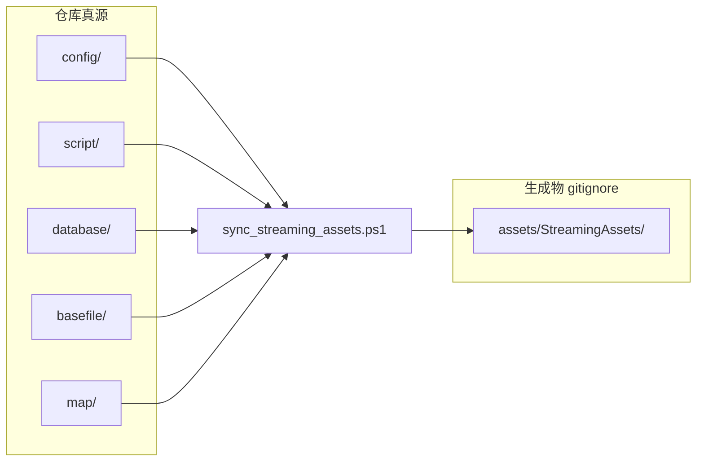

# 客户端冗余代码与文档清理

## 背景

当前实现与文档存在明显漂移：

- 运行时 [`LoginFlowBackdrop.cs`](assets/_Project/Scripts/UI/LoginFlowBackdrop.cs) 已是 **仅静态 `backdrop_base`**，但分层动效 C#/Shader/文档/计划仍大量残留。
- [`docs/Product-Spec.md`](docs/Product-Spec.md) L23 写「分层动效」，L35 写「仅静态底图」——自相矛盾。
- `config/`、`script/` 等与 [`assets/StreamingAssets/`](assets/StreamingAssets/) 双份提交，易漂移（你已选择 **真源 + sync** 策略）。
- Lua 保留 Phase 3 脚手架，但 [`event_bus.lua`](script/client/event_bus.lua) 无任何 `on/fire` 调用，可安全删除。



---

## 阶段 1：删除登录背景动效遗留（高置信、零运行时影响）

**删除以下文件**（grep 已确认无场景/Prefab/C# 引用）：

| 类别 | 路径 |
|------|------|
| C# | [`LoginFlowBoatFx.cs`](assets/_Project/Scripts/UI/LoginFlowBoatFx.cs)、[`UiSpriteSequenceFx.cs`](assets/_Project/Scripts/UI/UiSpriteSequenceFx.cs) 及 `.meta` |
| Shader | [`UI_WaterFlow.shader`](assets/_Project/Shaders/UI_WaterFlow.shader)、[`UI_WindSway.shader`](assets/_Project/Shaders/UI_WindSway.shader)、[`UI_ScrollUV.shader`](assets/_Project/Shaders/UI_ScrollUV.shader) 及 `.meta` |
| Material | [`UI_WaterFlow.mat`](assets/_Project/Materials/UI_WaterFlow.mat)、[`UI_WindSway.mat`](assets/_Project/Materials/UI_WindSway.mat)、[`UI_ScrollUV.mat`](assets/_Project/Materials/UI_ScrollUV.mat) 及 `.meta` |
| 废弃 UI 目录 | 整个 [`assets/ui/`](assets/ui/)（仅含旧 sprite-sheet README + orphan `.meta`/`login_bg_anim.json`） |
| 未绑定美术 meta | `LoginFlowBackdrop/` 下除 `backdrop_base.png.meta` 外的 7 个 orphan `.meta`（`bird`、`backdrop_mist/water/trees/waterfall`、`fx_bird_sheet`、`fx_boat_fisherman`） |

**精简 [`LoginFlowBackdrop.cs`](assets/_Project/Scripts/UI/LoginFlowBackdrop.cs)**：

- 删除 `LegacyLayerNames`、`DisableLegacyLayers()`、`RemoveForegroundFxLayer()` 及 `SetVisible` 中对应分支。
- 保留：`TryBindFromChildren`、`ApplyBaseOnlyPolicy`（仅启用 `_base`）、`EnsureBehindUiPanels`、`DisableAllSubtreeRaycasts`、`BindBase`。
- 类注释保持「静态底图」表述。

[`BootSceneSetup.cs`](assets/_Project/Scripts/Editor/BootSceneSetup.cs) 已只创建 `Base` 层，**无需改动**。

---

## 阶段 2：Lua 死代码清理（保留脚手架）

按你的选择，**保留** `init.lua`、`quest_client.lua`、`item_client.lua`、`map_ambient.lua`。

- 删除 [`script/client/event_bus.lua`](script/client/event_bus.lua)
- 从 [`script/client/init.lua`](script/client/init.lua) 移除 `require("client.event_bus")`
- 更新 [`docs/LUA_BRIDGE.md`](docs/LUA_BRIDGE.md)：去掉 EventBus 预留描述，注明 C# `Action` 事件为当前真源

---

## 阶段 3：StreamingAssets 真源化

### 3.1 扩展同步脚本

更新 [`scripts/sync_streaming_assets.ps1`](scripts/sync_streaming_assets.ps1)：

```powershell
foreach ($dir in @("config", "script", "database", "basefile", "map")) { ... }
```

`map/` 纳入同步后，打包/真机也能从 `StreamingAssets/map/` 读到 ambient（与 [`MapAmbientController`](assets/_Project/Scripts/World/MapAmbientController.cs) 第二候选路径一致）。

### 3.2 更新 `.gitignore`

在 [`.gitignore`](.gitignore) 追加（保留已有 `client_config.xml` 规则）：

```
assets/StreamingAssets/config/
assets/StreamingAssets/script/
assets/StreamingAssets/database/
assets/StreamingAssets/basefile/
assets/StreamingAssets/map/
```

新增 [`assets/StreamingAssets/README.md`](assets/StreamingAssets/README.md)（**提交**）：说明内容由 `sync_streaming_assets.ps1` 生成，Play/打包前须执行。

### 3.3 从 Git 索引移除已跟踪镜像

执行（不删本地文件，仅停止跟踪）：

```powershell
git rm -r --cached assets/StreamingAssets/config assets/StreamingAssets/script assets/StreamingAssets/database assets/StreamingAssets/basefile assets/StreamingAssets/map
```

### 3.4 更新引用脚本与文档

| 文件 | 改动 |
|------|------|
| [`scripts/smoke_login_server.ps1`](scripts/smoke_login_server.ps1) | 优先读 `config/client_config.xml`，再 fallback StreamingAssets |
| [`README.md`](README.md) | 标明 StreamingAssets 子目录为生成物；`sync_streaming_assets.ps1` 为 Play 前置步骤 |
| [`docs/CONFIG.md`](docs/CONFIG.md) | 真源路径表 + 运行时加载路径说明 |
| [`docs/SCOPE.md`](docs/SCOPE.md) | 与 README 一致，强调 map 也经 sync |
| [`docs/LUA_BRIDGE.md`](docs/LUA_BRIDGE.md) | 编辑 `script/` 后 sync，不再维护 StreamingAssets 副本 |

[`ClientConfigLoader.cs`](assets/_Project/Scripts/Config/ClientConfigLoader.cs) 已支持 StreamingAssets → `config/` 回退，**无需改逻辑**。

---

## 阶段 4：文档与工具对齐静态背景策略

### 4.1 产品规格

[`docs/Product-Spec.md`](docs/Product-Spec.md)：

- L23「一套仙侠分层动效」→「共用静态仙侠底图 `backdrop_base`」
- 登录背景节已与 L35 一致，微调措辞即可

### 4.2 UI 提示词与 skill 约束

- 重写 [`docs/ui-prompts/UI-Prompts.md`](docs/ui-prompts/UI-Prompts.md)：仅描述 **单张 `backdrop_base.png`** 出图提示词（16:9、仙侠远景、下部可渐变透明），删除 Water/Trees/Bird/Boat/Shader 表格
- 更新 [`.cursor/skills/ui-prompt-generator/references/rpg-client-constraints.md`](.cursor/skills/ui-prompt-generator/references/rpg-client-constraints.md)：背景规范改为「仅 `backdrop_base` 静态 PNG」
- 删除或归档 [`.cursor/skills/ui-prompt-generator/templates/unity-layered-backdrop-template.md`](.cursor/skills/ui-prompt-generator/templates/unity-layered-backdrop-template.md)（与当前实现不符）

### 4.3 占位图脚本

精简 [`scripts/generate_login_backdrop_placeholders.py`](scripts/generate_login_backdrop_placeholders.py)：

- 仅保留生成 `backdrop_base.png` 占位逻辑
- 删除 `--split-layers`、`fx_bird_sheet`、`fx_boat_fisherman` 相关代码

---

## 阶段 5：清理过时计划与低优先级项

**删除** 4 份已完成且描述已废弃分层方案的 plan（避免后续 AI/开发者误用）：

- [`.cursor/plans/登录流程仙侠动效背景_6844bd2a.plan.md`](.cursor/plans/登录流程仙侠动效背景_6844bd2a.plan.md)
- [`.cursor/plans/登录背景动效升级_380ff963.plan.md`](.cursor/plans/登录背景动效升级_380ff963.plan.md)
- [`.cursor/plans/登录背景近视图重构_2a88c463.plan.md`](.cursor/plans/登录背景近视图重构_2a88c463.plan.md)
- [`.cursor/plans/修复登录背景显示_1fb9d72b.plan.md`](.cursor/plans/修复登录背景显示_1fb9d72b.plan.md)

**保留** [`客户端代码审查`](.cursor/plans/客户端代码审查_dae54f5d.plan.md) 等仍有参考价值的历史计划。

**本次不做**（避免范围膨胀）：

- `.cursor/skills/unity-skills/` 大包与 `unity-script` 重复 skill
- `GameApp` 拆分、`GameScriptHost.OnTick` 空桩
- `skills-lock.json` 中未安装 skill 条目

---

## 验收清单

1. Unity 编译通过，Boot 场景 Play：登录流程背景为静态 `backdrop_base`，切换 ZoneHome/AuthLogin/CharacterSelect 正常，进 Game 后隐藏。
2. 菜单 **RPG → Add Login Flow Backdrop** 仍可重新绑定底图。
3. 全新 clone 后：`sync_streaming_assets.ps1` → 复制 `client_config.xml` → Play 可加载配置与 map ambient。
4. `git status` 不再跟踪 `assets/StreamingAssets/{config,script,database,basefile,map}/` 内容。
5. `docs/Product-Spec.md` 与 `UI-Prompts.md` 均描述静态背景，无分层动效矛盾表述。
6. `script/client/init.lua` 无 `event_bus` 引用，Lua 模块仍可被未来 XLua 加载。

---

## 风险与注意

- **首次 pull 本改动后**：须执行 `.\scripts\sync_streaming_assets.ps1`，否则 Editor Play 可能缺配置/Lua/地图数据。
- **已本地修改 StreamingAssets 副本的用户**：改动应迁回 `config/` 等真源后再 sync。
- 删除 Shader/Material 后若 Unity 报 Missing 引用，对 Boot 场景执行一次 **RPG → Add Login Flow Backdrop** 即可（当前场景应无引用）。
