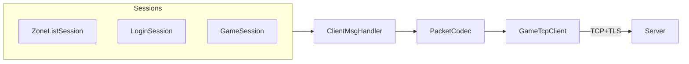

# 客户端协议 Protobuf 统一优化

## 现状结论（已满足）

经代码审计，**所有已实现的服务器通讯消息均已使用 Protobuf**，帧格式为 `MsgHeader(4B) + Protobuf body`（body **不含** module/sub 前缀），与 [`Common/README.md`](Common/README.md) 一致。



| 域 | C→S（Build*） | S→C（TryParse*） | 状态 |
|----|--------------|-----------------|------|
| Login | Login/Register/GatewayAuth/SelectUser/CreateUser/Logout | LoginRsp/GatewayInfo/UserList/CreateUserRsp/EnterGame/LogoutRsp | Protobuf |
| Zone | ZoneListReq | ZoneListRsp | Protobuf |
| System | Heartbeat | Error/Kick/Heartbeat/Notice | Protobuf |
| Scene | MoveReq | Spawn/Move/Despawn | Protobuf |
| Chat/Quest/Bag | Chat/QuestAccept/QuestSubmit/BagInfo | 对应 Notify/Rsp | Protobuf |
| NPC | — | — | **未实现**（[`NpcMsg.proto`](Common/NpcMsg.proto) 暂无客户端 handler，不在本次范围） |

[`C2SGatewayAuthReq`](Common/LoginMsg.proto) 已在 [`ClientMsgHandler.BuildGatewayAuthReq`](assets/_Project/Scripts/Net/ClientMsgHandler.cs) 中通过 `PacketCodec.Encode` 发送，并携带 `ProtocolVersion`；[`LoginSession`](assets/_Project/Scripts/Net/LoginSession.cs) 侧响应均走 `TryParseLoginRsp` / `TryParseUserList` 等 Protobuf 解析。**WireV2Codec 已删除**，无定长 struct 编解码路径。

---

## 待清理遗留（本次改动重点）

### 1. 删除 dead code：`PacketCodec.EncodeRaw`

[`PacketCodec.cs`](assets/_Project/Scripts/Net/PacketCodec.cs) L32–51 仍保留 wire v2 注释与 `EncodeRaw` 方法，**全仓无调用方**。删除该方法及相关注释，避免后续误用定长 body。

保留：`Encode(IMessage)`、`TryDecode`、`TryParse<T>`——帧头 `MsgHeader` 仍为 4 字节 packed struct（非 Protobuf），这是协议设计，不是 legacy body。

### 2. 收敛 Protobuf 解析样板代码

[`ClientMsgHandler.cs`](assets/_Project/Scripts/Net/ClientMsgHandler.cs) 中 15+ 个 `TryParse*` 方法均为同一模式（`ParseFrom` + catch → false）。提取小型内部 helper，例如：

```csharp
// 新建 ProtoParse.cs 或作为 PacketCodec 私有扩展
internal static bool TryParse<T>(byte[] body, MessageParser<T> parser, out T message)
    where T : IMessage<T>
```

各 `TryParseLoginRsp` 等保留为语义化薄包装（对外 API 不变），减少重复、统一异常处理。

### 3. 注释与命名对齐

- [`PasswordDigest.cs`](assets/_Project/Scripts/Util/PasswordDigest.cs) 文件头「登录 wire 密码摘要」→「登录 Protobuf 密码摘要」
- [`ClientMsgHandler.cs`](assets/_Project/Scripts/Net/ClientMsgHandler.cs) 文件头补充：**全部 Build/TryParse 均对应 `Common/*Msg.proto`，禁止手写定长 struct**
- [`PacketCodec.cs`](assets/_Project/Scripts/Net/PacketCodec.cs) 文件头明确：仅帧头定长，payload  exclusively Protobuf

### 4. 可选小优化（低优先级，同批次可做）

- `BuildGatewayAuthReq` / `BuildLoginReq` 的 `gameType` 参数由 `byte` 改为 `uint`，与 proto `uint32 game_type` 字段类型一致（调用方 [`GameApp`](assets/_Project/Scripts/App/GameApp.cs) 传 `_selectedGameType` 无需逻辑变更）
- Session 层继续通过 `ClientMsgHandler.Build*` + `SendRaw` 发送（已有 [`GameTcpClient.Send(module, sub, IMessage)`](assets/_Project/Scripts/Net/GameTcpClient.cs) 可用，但改动面大、收益小，**不建议**本批次替换

---

## 文档更新

### [`assets/_Project/Scripts/Net/README.md`](assets/_Project/Scripts/Net/README.md)

增补两节：

1. **协议约定**：线上帧 = 4B MsgHeader + Protobuf body；LoginServer 与 Gateway **同一套** Protobuf wire；首包鉴权类消息须带 `ProtocolVersion`（Login/GatewayAuth/Register）
2. **消息清单表**：按域列出已实现 C2S/S2C 与对应 `.proto` message 名（便于联调对照）

### [`README.md`](README.md)（根目录）

在「共享协议」小节加一句：**客户端不再使用旧定长 struct（`LoginMsg.h` 等已归档）**；更新协议仅通过 `git submodule update` + `sync_protobuf.ps1`。

### [`Protobuf/README.md`](Protobuf/README.md)

补充「新增消息 checklist」：在 `ClientMsgHandler` 增加 Build/TryParse → Session 分发 → Net/README 登记。

### 新增 Cursor 规则（可选，推荐）

[`.cursor/rules/protocol-protobuf.mdc`](.cursor/rules/protocol-protobuf.mdc)：

- 禁止新增定长 body / `EncodeRaw` / 手工 `BinaryPrimitives` 业务字段
- 新消息必须来自 `Common/*.proto` 生成类型
- 日志规范仍遵守现有 [`log-language.mdc`](.cursor/rules/log-language.mdc)

---

## 不在范围

- **不修改** `Common/` 子模块 `.proto`（只读；由服务端维护）
- **不实现** NPC 域（`C2SNpcTalkReq`）——proto 已有，客户端未接线
- **不改动** RPG_Server Gateway 校验逻辑（客户端已与 Protobuf 对齐）

---

## 验证步骤

1. Unity Editor 编译通过（无 `EncodeRaw` / `WireV2Codec` 引用）
2. Play 联调完整链路：区列表 → 登录 → **Gateway 鉴权（C2SGatewayAuthReq Protobuf）** → 角色列表 → 选角进世界
3. 期望日志：`LoginSession：Gateway 鉴权成功` → `收到角色列表 数量=N`；**不应再出现**「包长非法」
4. 全文搜索确认无 `wire v2` / `WireV2` / `EncodeRaw` 业务引用
