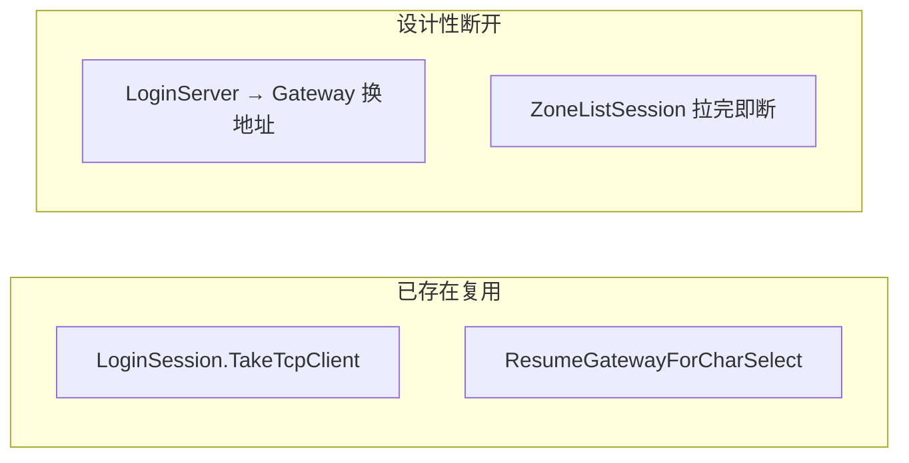

# 客户端 14 项问题审计与修复计划

## 审计结论总览

| # | 问题 | 是否存在 | 处理策略 |
|---|------|----------|----------|
| 1 | 接收缓冲区增长 | **是**（突发扩容 + 不收缩；单帧上限 65535B） | 修复 |
| 2 | 日志每行刷盘 | **是**（`File.AppendAllText` 逐行开写关） | 修复 |
| 3 | FlushSend 阻塞主线程 | **是**（`Poll()` 内同步 `_stream.Write` 循环） | 修复 |
| 4 | 密码无盐/nonce | **是**（`SHA256(UTF-8 pwd)`，见 [`PasswordDigest.cs`](assets/_Project/Scripts/Util/PasswordDigest.cs)） | **全链路修复**（Common + 客户端 + 文档） |
| 5 | Task.Run / IL2CPP | **是**（[`GameTcpClient.cs:61`](assets/_Project/Scripts/Net/GameTcpClient.cs) 唯一用法） | 修复 |
| 6 | SslStream 泄漏 | **是**（连接失败 `catch` 未 dispose） | 修复 |
| 7 | 登录阶段无心跳 | **是**（仅 [`GameSession.Update`](assets/_Project/Scripts/Net/GameSession.cs) 发心跳） | 修复 |
| 8 | 委托循环引用 | **是**（Session/UI 无 teardown；TCP 回调不清理） | 修复 |
| 9 | 移动过度发送 | **部分**（100ms 节流已有；缺位置 delta） | 优化 |
| 10 | 列表无对象池 | **是**（`Instantiate`/`Destroy`） | 修复 |
| 11 | ProtoParse 吞异常 | **是**（裸 `catch`） | 修复 |
| 12 | TimeUtil 时间包装 | **是**（裸 `now - start`；`WallNowMs` 未用） | 修复 |
| 13 | XML vs JSON 配置 | **是**（按域分格式，无统一说明） | 文档 + 轻量整理 |
| 14 | 连接复用缺失 | **部分** | 文档澄清；不强行改 Login→Gateway 换 host 流程 |



---

## 1. 接收缓冲区（[`GameTcpClient.cs`](assets/_Project/Scripts/Net/GameTcpClient.cs) + [`PacketCodec.cs`](assets/_Project/Scripts/Net/PacketCodec.cs)）

**现状**：`EnsureRecvCapacity` 无上限倍增；`Disconnect` 只清 `_recvLen` 不收缩；`TryDecode` 不校验非法 `bodyLen`。

**方案**：
- 常量 `RecvBufInitial = 8192`，`RecvBufMax = MsgHeader.Size + MsgHeader.MaxPacketSize`（65539）。
- `EnsureRecvCapacity`：`required` 超过 `RecvBufMax` → 记录错误并 `NotifyDisconnected()`（防恶意/损坏帧）。
- `TryDecode`：若 `header.BodyLen > MsgHeader.MaxPacketSize` → 返回 false 并由 `GameTcpClient` 断连。
- `DecodeFrames` 后：若 `_recvLen == 0 && _recvBuf.Length > RecvBufInitial` → 收缩回 8192（避免长连接内存驻留）。

---

## 2. 日志 IO（[`ClientLogger.cs`](assets/_Project/Scripts/Log/ClientLogger.cs)）

**方案**：
- 持有 `StreamWriter`（`FileStream` + `AutoFlush=false`）。
- 批量刷盘：`FlushIntervalMs = 1000` 或 `Err` 级别立即 `Flush`。
- 实现 `IDisposable` / `Shutdown()`，在 `GameApp` 退出或域卸载时关闭 writer。
- 保持中文固定日志文案规范。

---

## 3. FlushSend 主线程阻塞（[`GameTcpClient.cs`](assets/_Project/Scripts/Net/GameTcpClient.cs)）

**方案**（最小侵入、符合现有 poll 模型）：
- 每帧 `Poll` 限制发送预算：`MaxFlushBytesPerPoll = 16384`（可写入 [`ClientTimingDefaults.cs`](assets/_Project/Scripts/Config/ClientTimingDefaults.cs) + `client_config.xml`）。
- `FlushSend` 在预算内 dequeue 并 `Write`；超额留队下帧继续。
- 可选：`PollAvailable` 检查 `_tcp.Available` 前先 `FlushSend`，避免 recv 饥饿（保持现有顺序亦可）。

---

## 4. 密码安全 — 全链路 nonce 挑战（Common + 客户端）

**现状 wire**：[`LoginMsg.proto`](Common/LoginMsg.proto) `password_digest = SHA-256(UTF-8 密码)`，无 replay 防护。

**协议设计**（在 [`LoginCommon.proto`](Common/LoginCommon.proto) / [`LoginMsg.proto`](Common/LoginMsg.proto)）：

1. 新增 `S2C_LOGIN_CHALLENGE = 16`（LoginMsgSub）。
2. 新增消息：
   ```protobuf
   message S2CLoginChallenge {
     bytes nonce = 1; // 16 字节随机数，单次连接有效
   }
   ```
3. `C2SLoginReq` / `C2SRegisterReq` 增加：
   ```protobuf
   bytes login_nonce = 7; // 回显服务端 nonce
   ```
4. **语义变更**：`password_digest = SHA-256(nonce || UTF-8(password))`（32 字节）；注册时 `confirm_password_digest` 同理。
5. `ProtocolVersion` minor **0 → 1**（[`WireConstants.cs`](assets/_Project/Scripts/Net/WireConstants.cs)）。

**客户端流程**（[`LoginSession.cs`](assets/_Project/Scripts/Net/LoginSession.cs)）：
- 连接 LoginServer 后等待 `S2CLoginChallenge`（超时沿用 `ConnectTimeoutMs`）。
- 缓存 `_loginNonce`；`StartLogin`/`StartRegister` 在收到 challenge 后再发请求。
- [`PasswordDigest.cs`](assets/_Project/Scripts/Util/PasswordDigest.cs) 新增 `Sha256NoncePassword(byte[] nonce, string password)`。
- [`ClientMsgHandler.BuildLoginReq/BuildRegisterReq`](assets/_Project/Scripts/Net/ClientMsgHandler.cs) 传入 nonce。
- [`ZoneListSession`](assets/_Project/Scripts/Net/ZoneListSession.cs) 若也连 LoginServer，同样处理 challenge（或抽 `LoginChallengeMixin` 小 helper）。

**文档**：更新 [`Net/README.md`](assets/_Project/Scripts/Net/README.md)、新增 `docs/SECURITY.md`（nonce 流程、服务端对接清单、旧版 minor=0 废弃说明）。

**依赖**：Common submodule 提交 + 服务端 LoginServer 实现 challenge 推送与校验（本仓同步 `sync_protobuf.ps1`）。

---

## 5. Task.Run → 专用连接线程（[`GameTcpClient.cs`](assets/_Project/Scripts/Net/GameTcpClient.cs)）

**方案**：
- 用 `Thread`（`IsBackground = true`，`Name = "GameTcpClient.Connect"`）替代 `Task.Run`。
- 连接代次 `_connectGeneration` 逻辑不变；`Disconnect` 不 join 线程（连接失败/成功后线程自然结束）。
- 在 [`Net/README.md`](assets/_Project/Scripts/Net/README.md) 注明：阻塞 IO 在后台线程，状态变更仅经 `_mainThreadQueue` 回主线程（IL2CPP 友好）。

---

## 6. SslStream 连接失败泄漏（[`GameTcpClient.cs`](assets/_Project/Scripts/Net/GameTcpClient.cs)）

**方案**：
- `ConnectBackground` 中 `TcpClient`/`SslStream`/`Stream` 提升为 try 外局部变量。
- `catch` 中 `DisposeConnectResources(tcp, ssl, stream)`；成功路径仅在 `EnqueueMain` 的 stale-generation 分支 dispose（已有）。
- `FinishConnect` 仅 `_stream = stream`（TLS 时 `_ssl = ssl as SslStream`），`Disconnect` 只 dispose 一次 stream。

---

## 7. 登录阶段心跳（[`LoginSession.cs`](assets/_Project/Scripts/Net/LoginSession.cs)）

**方案**：
- 在 Gateway 已连接状态（`ConnectGateway` 成功后至 `TakeTcpClient` 前）复用心跳间隔配置。
- `Update` 中：`_gatewayConnected && state != Idle` 时按 [`ClientTimingDefaults.HeartbeatIntervalMs`](assets/_Project/Scripts/Config/ClientTimingDefaults.cs) 发送 `C2SHeartbeat`。
- 处理 `S2CHeartbeat`（更新可选 `_serverTimeMs`，与 `GameSession` 一致）。
- 更新 [`Net/README.md`](assets/_Project/Scripts/Net/README.md) 登录五步表：Gateway 阶段有心跳。

---

## 8. 委托清理（Session / TCP / UI）

**方案**：
- [`GameTcpClient`](assets/_Project/Scripts/Net/GameTcpClient.cs)：`ClearCallbacks()` 在 `Disconnect()` 末尾置空三个 delegate。
- [`LoginSession`](assets/_Project/Scripts/Net/LoginSession.cs) / [`GameSession`](assets/_Project/Scripts/Net/GameSession.cs) / [`ZoneListSession`](assets/_Project/Scripts/Net/ZoneListSession.cs)：新增 `ClearHandlers()` 清空 public `Action` 字段；`Cancel()`/`ReleaseTcpClient()` 调用。
- [`WorldController.Leave`](assets/_Project/Scripts/World/WorldController.cs)：调用 `session.ClearHandlers()`。
- [`GameApp`](assets/_Project/Scripts/App/GameApp.cs)：场景切换/退出时清理 session 与 UI 回调。
- UI 面板（[`GameUiController`](assets/_Project/Scripts/UI/GameUiController.cs) 等）：`OnDestroy` 移除 `Button.onClick` 监听。

---

## 9. 移动同步优化（[`GameSession.SendMove`](assets/_Project/Scripts/Net/GameSession.cs) + [`WorldController`](assets/_Project/Scripts/World/WorldController.cs)）

**方案**：
- `GameSession` 记录 `_lastSentX/Y/Z` 与 `_lastSentDir`。
- 发送条件：距上次发送 ≥ `MoveSendIntervalMs` **且**（位移平方距 ≥ `MoveMinDeltaSq` 默认 0.01² 或方向变化）。
- 新增 `moveMinDelta` 到 [`ClientConfigLoader`](assets/_Project/Scripts/Config/ClientConfigLoader.cs) + `client_config.xml.example`。
- `WorldController`：仅在本地位置实际变化后调用 `SendMove`（减少每帧空转）。

---

## 10. 列表项对象池（[`ServerListPanel`](assets/_Project/Scripts/UI/ServerListPanel.cs) + [`CharacterSelectPanel`](assets/_Project/Scripts/UI/CharacterSelectPanel.cs)）

**方案**：
- 新增轻量 [`UiViewPool<T>`](assets/_Project/Scripts/UI/UiViewPool.cs)：`Rent()` / `ReleaseAll()`，隐藏而非 `Destroy`。
- `ClearItems` 改为 `ReleaseAll`；不足时再 `Instantiate`。
- 保持 `ZoneListItemView.Bind` / `CharacterListItemView.Bind` 现有 `RemoveAllListeners` 逻辑。

---

## 11. ProtoParse 异常可见（[`ProtoParse.cs`](assets/_Project/Scripts/Net/ProtoParse.cs)）

**方案**：
- `catch (InvalidProtocolBufferException ex)` → `ClientLogger.Instance.WarnFormat("ProtoParse：解析失败 {0}：{1}", context, ex.Message)`。
- 增加可选参数 `string context`（如 `"S2CSpawnEntity"`）；[`ClientMsgHandler.TryParse*`](assets/_Project/Scripts/Net/ClientMsgHandler.cs) 传入消息名。
- `GameSession` 对关键路径（logout rsp）检查 `TryParse` 返回值并 `Warn`。

---

## 12. TimeUtil 安全间隔（[`TimeUtil.cs`](assets/_Project/Scripts/Util/TimeUtil.cs)）

**方案**：
- 新增 `ElapsedMs(long nowMs, long startMs)`：`var d = nowMs - startMs; return d < 0 ? 0 : d;`（时钟回拨/域重载时超时仍可触发）。
- 注释明确：`NowMs()` 为 Unity 单调启动时间，用于超时/节流；**不**用于跨会话持久化。
- 替换 [`LoginSession`](assets/_Project/Scripts/Net/LoginSession.cs)、[`GameSession`](assets/_Project/Scripts/Net/GameSession.cs)、[`ZoneListSession`](assets/_Project/Scripts/Net/ZoneListSession.cs) 中所有 `now - _xxxMs` 比较。
- `Cancel()`/`Start()` 时重置相关时间戳。
- 删除或标注 `WallNowMs` 仅供未来墙钟场景使用。

---

## 13. 配置格式文档（不强行统一格式）

**现状**：客户端网络配置 XML、用户偏好 JSON、策划表 Lua、地图 JSON — 各司其职。

**方案**：
- 新增 [`docs/CONFIG.md`](docs/CONFIG.md)：各格式路径、加载器、何时修改、示例链接。
- [`README.md`](README.md) 联调节增加指向 `docs/CONFIG.md`。
- 确认 [`config/client_config.xml.example`](config/client_config.xml.example) 含新增项（`moveMinDelta`、flush 相关若暴露）。

---

## 14. 连接复用 — 文档澄清（无代码强改）

**已存在**：
- `LoginSession.TakeTcpClient` → `GameSession` 移交 Gateway TCP。
- `ResumeGatewayForCharSelect` 返回选角复用 Gateway。

**设计性断开**（保持）：
- LoginServer → Gateway 必须换 host/port。
- `ZoneListSession` 短连接拉列表。

**文档**：在 [`Net/README.md`](assets/_Project/Scripts/Net/README.md) 增加「连接生命周期」小节，说明上述策略，避免误判为缺陷。

---

## 文件变更清单（主要）

| 区域 | 文件 |
|------|------|
| 网络核心 | `GameTcpClient.cs`, `PacketCodec.cs`, `LoginSession.cs`, `GameSession.cs`, `ZoneListSession.cs` |
| 协议 | `Common/LoginCommon.proto`, `Common/LoginMsg.proto` → `sync_protobuf.ps1` |
| 工具 | `ClientLogger.cs`, `TimeUtil.cs`, `PasswordDigest.cs`, `ClientMsgHandler.cs` |
| 配置 | `ClientConfigLoader.cs`, `ClientTimingDefaults.cs`, `client_config.xml.example` |
| UI | `UiViewPool.cs`, `ServerListPanel.cs`, `CharacterSelectPanel.cs` |
| 编排 | `GameApp.cs`, `WorldController.cs` |
| 文档 | `Net/README.md`, `README.md`, `docs/CONFIG.md`, `docs/SECURITY.md` |

---

## 验证计划

1. `.\scripts\sync_protobuf.ps1` 后 Unity 编译通过（RpgProto + Net 程序集）。
2. 登录流程：收到 `S2CLoginChallenge` → 带 nonce 的 `C2SLoginReq`；Gateway 阶段有心跳包。
3. 压力：快速 recv 不使 `_recvBuf` 超过 65539；断连后缓冲收缩。
4. 日志：连续 100 条 `Info` 仅周期性 flush；`Err` 立即落盘。
5. 移动：站立抖动不发包；匀速移动约 10 包/秒。
6. 区服/角色列表反复刷新：Profiler 中 GC Alloc 下降（无重复 Destroy/Instantiate 风暴）。
7. 故意损坏 protobuf body：`ProtoParse` 产生中文 WARN 日志。

---

## 风险与顺序

- **协议 minor 升级（#4）** 须与服务端同步上线；客户端在未收到 challenge 时应有明确超时错误（不回落旧 digest）。
- 建议实施顺序：**6 → 1 → 3 → 5 → 7 → 11 → 12 → 2 → 8 → 9 → 10 → 4（Common bump）→ 13/14 文档**。
