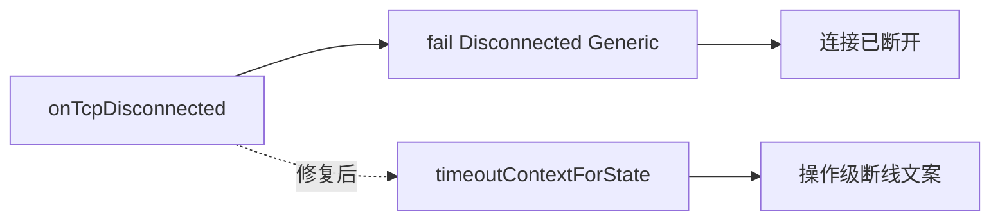

# 断线无上下文文案修复

## 问题确认

**存在。** 两处兜底调用未传 context，默认 `LoginTimeoutContext::Generic`，一律显示「连接已断开」：

| 位置 | 代码 | 可达状态 |
|------|------|----------|
| [`net/LoginSession.cpp`](net/LoginSession.cpp) L452 | `fail(ClientLocalError::Disconnected)` | `WaitLoginRsp`、`RegisterWaitRsp`、`WaitUserList`、`WaitEnterGame`、`WaitCreateUserRsp`、`WaitUserAction` |
| [`net/ZoneListSession.cpp`](net/ZoneListSession.cpp) L185 | `fail(ClientLocalError::Disconnected)` | `WaitResponse`（区列表请求进行中） |

[`timeoutContextForState()`](net/LoginSession.cpp) 已能将等待状态映射到 `Login/Register/UserList/EnterGame/CreateCharacter`，但 [`ClientErrorText::localErrorText`](sdk/net/ClientErrorText.cpp) 的 `Disconnected` 分支**仅**处理 `ZoneList`、`GatewayConnect`、`LoginServerConnect`（均为连接阶段文案），操作等待态仍落回 Generic。



## 修复方案

### 1. LoginSession：传入状态上下文

[`net/LoginSession.cpp`](net/LoginSession.cpp) L452 改为：

```cpp
fail(ClientLocalError::Disconnected, timeoutContextForState());
```

复用现有 `timeoutContextForState()`，不新增 helper。`WaitUserAction` 仍映射 `Generic` →「连接已断开」（选角界面被动断线，合理）。

### 2. ZoneListSession：区分连接阶段与响应阶段

避免 `ZoneList` 上下文在 Connecting / WaitResponse 共用同一文案：

| 状态 | context | 目标文案 |
|------|---------|----------|
| `Connecting` | `LoginServerConnect`（改自 `ZoneList`） | 保持现有：「无法连接 LoginServer，请确认服务器已启动并监听 9010 端口」 |
| `WaitResponse` | `ZoneList` | 新增：「获取区列表时连接已断开」 |

改动：

- Connecting 分支：`fail(..., LoginTimeoutContext::LoginServerConnect)`
- 兜底：`fail(ClientLocalError::Disconnected, LoginTimeoutContext::ZoneList)`

### 3. ClientErrorText：补充 Disconnected 操作态

在 [`sdk/net/ClientErrorText.cpp`](sdk/net/ClientErrorText.cpp) `ClientLocalError::Disconnected` 的 `switch(ctx)` 中增加：

| context | 文案 |
|---------|------|
| `Login` | 验证账号时连接已断开 |
| `Register` | 注册时连接已断开 |
| `UserList` | 获取角色列表时连接已断开 |
| `EnterGame` | 进入游戏时连接已断开 |
| `CreateCharacter` | 创建角色时连接已断开 |
| `ZoneList` | 获取区列表时连接已断开 |

保留现有 `GatewayConnect`、`LoginServerConnect` 连接阶段文案；`Generic` 仍为「连接已断开」。

### 4. 验证

- `build_client.ps1` 编译通过
- 语义核对：LoginSession 各 `Wait*` 断线不再一律显示 Generic；ZoneList `WaitResponse` 断线显示区列表专用文案，Connecting 断线文案不变
