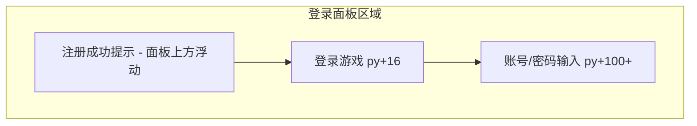

# 注册成功提示：上移 + 3 秒渐隐

## 现状

[`ui/AuthLoginPanel.cpp`](ui/AuthLoginPanel.cpp) 中成功提示绘制在 `py + 48`，位于标题（`py + 16`）与账号输入框（`py + 100`）之间，容易与标题/输入区视觉重叠：

```149:158:ui/AuthLoginPanel.cpp
    if (!m_successMessage.empty())
    {
        m_theme->drawTextCentered(
            target,
            m_successMessage,
            px + panelW / 2.f,
            py + 48.f,
            18,
            sf::Color(120, 220, 170, 255),
            false);
    }
```

`update()` 目前只更新输入框光标，**没有计时/淡出逻辑**。

## 目标布局



- 提示绘制在面板顶边**之上**（约 `py - 44` ~ `py - 4`），水平仍与面板居中
- 「登录游戏」标题与输入框位置**不变**

## 实现方案（仅改 AuthLoginPanel）

文件：[`ui/AuthLoginPanel.h`](ui/AuthLoginPanel.h)、[`ui/AuthLoginPanel.cpp`](ui/AuthLoginPanel.cpp)

### 1. 新增计时状态

```cpp
float m_successElapsed = 0.f;  // 自 setSuccessMessage 非空起累计秒数
```

常量（文件内 `namespace` 或 `constexpr`）：

| 常量 | 值 | 含义 |
|------|-----|------|
| `kSuccessHoldSec` | `3.f` | 全不透明停留时间 |
| `kSuccessFadeSec` | `1.f` | 渐隐时长（「慢慢退出」） |

### 2. `setSuccessMessage` / `setErrorMessage`

- `setSuccessMessage(msg)`：`m_successElapsed = 0.f`（非空时重置计时；清空时一并归零）
- `setErrorMessage` 清空成功文案时同步 `m_successElapsed = 0.f`

[`app/GameApp.cpp`](app/GameApp.cpp) **无需改动**——仍调用 `setSuccessMessage(u8"注册成功！账号已填入，可直接登录")` 即可触发计时。

### 3. `update(float dt)` 驱动淡出

```cpp
if (m_successMessage.empty()) return;

m_successElapsed += dt;
if (m_successElapsed >= kSuccessHoldSec + kSuccessFadeSec)
{
    m_successMessage.clear();
    m_successElapsed = 0.f;
}
```

### 4. `draw()` 上移 + 按 alpha 绘制

**位置**（面板宽 420，左边 `px`）：

- 横幅：`sf::RectangleShape`，`y = py - 44`，高 `40`，宽 `panelW - 80`，水平居中于面板
- 文字：`drawTextCentered`，`y = py - 34`，字号 `18`

**透明度**（根据 `m_successElapsed` 计算）：

```cpp
float alpha = 1.f;
if (m_successElapsed > kSuccessHoldSec)
{
    alpha = 1.f - (m_successElapsed - kSuccessHoldSec) / kSuccessFadeSec;
    alpha = std::max(0.f, alpha);
}
const auto a = static_cast<sf::Uint8>(alpha * 255.f);
```

- 横幅填充/描边、文字颜色均乘以 `a`（如填充 `(35,110,85,a*0.63)`，文字 `(200,255,220,a)`）
- 绘制顺序：先 `drawPanel` + 标题 + 控件，**最后**绘制成功提示（保证浮在面板上方、不被遮挡）

可抽私有方法 `successToastAlpha() const` 避免 `draw` 重复计算。

### 5. 清除时机（保持既有行为）

- 用户点击「登录」→ `beginLogin` 已调用 `setSuccessMessage("")`，计时归零
- 渐隐结束 → `update` 自动清空
- 错误提示 → `setErrorMessage` 互斥清空

## 验证清单

1. 注册成功 → 提示出现在「登录游戏」**上方**，账号/密码输入框不被遮挡
2. 提示全显约 3 秒后开始变淡，约 1 秒内消失
3. 淡出期间可正常操作输入框与登录按钮
4. 点击「登录」可立即清除提示
5. Debug 编译通过

## 涉及文件

| 文件 | 变更 |
|------|------|
| [`ui/AuthLoginPanel.h`](ui/AuthLoginPanel.h) | 增加 `m_successElapsed`；可选私有辅助 `successToastAlpha()` |
| [`ui/AuthLoginPanel.cpp`](ui/AuthLoginPanel.cpp) | 计时、`update` 淡出、提示上移至标题上方并按 alpha 绘制 |
