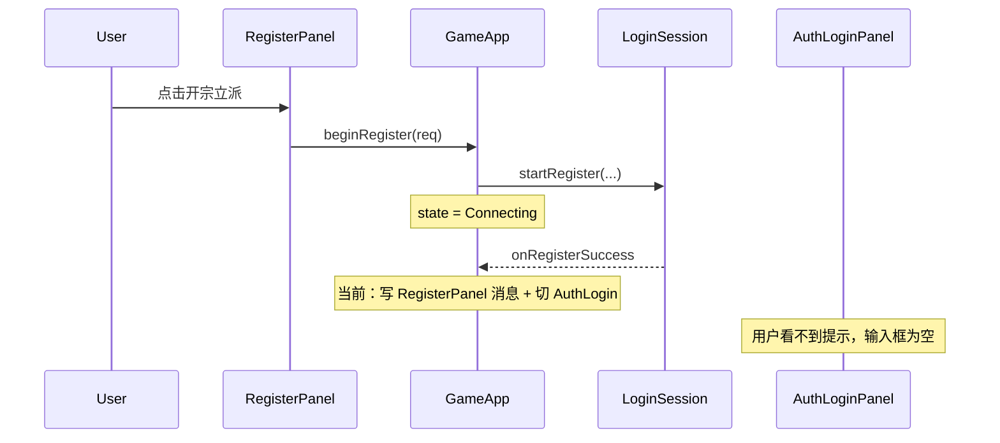

# 注册成功提示与自动回填登录

## 现状与问题

当前注册成功处理在 [`app/GameApp.cpp`](app/GameApp.cpp)：

```204:207:app/GameApp.cpp
    m_loginSession.setOnRegisterSuccess([this]() {
        m_registerPanel.setMessage(u8"注册成功，请返回登录", false);
        switchState(AppState::AuthLogin);
    });
```

存在两处缺口：

1. **成功提示不可见**：`setMessage` 写在 `RegisterPanel`，但 `switchState(AuthLogin)` 后立即渲染登录页，用户看不到注册页底部的小字提示。
2. **未自动回填**：[`AuthLoginPanel`](ui/AuthLoginPanel.h) 只有 `applyLocalSettings()`（读本地「记住账号」），没有写入账号/密码的 API；注册请求里的凭据在 `beginRegister` 后未被保留给成功回调使用。



## 实现方案

改动集中在 **UI 层 + GameApp 编排**，无需改协议或 `LoginSession`。

### 1. 扩展 AuthLoginPanel：成功提示 + 凭据回填

文件：[`ui/AuthLoginPanel.h`](ui/AuthLoginPanel.h)、[`ui/AuthLoginPanel.cpp`](ui/AuthLoginPanel.cpp)

新增公开方法：

| 方法 | 作用 |
|------|------|
| `prefillCredentials(account, password)` | `m_accountInput.setText` / `m_passwordInput.setText`，调用 `refreshLoginButtonState()`，焦点落到密码框（方便用户确认后直接点登录或按 Enter） |
| `setSuccessMessage(msg)` | 设置成功提示文案；与 `m_errorMessage` 互斥（设成功时清空错误） |
| `clearSuccessMessage()` | 可选，或在 `setErrorMessage` / `beginLogin` 时顺带清空 |

**醒目绘制**（在 `draw()` 中，标题下方、输入框上方）：

- 使用 `UiTheme::drawTextCentered`，水平居中于面板
- 字号 **20**（错误提示为 14）
- 颜色：明亮成功色，如 `sf::Color(120, 230, 160)`（与错误红 `(255,120,100)` 形成对比，不新增 theme API）
- 文案建议：`u8"注册成功！账号已自动填入，可直接登录"`

位置参考（面板宽 420，标题在 `py + 16`）：成功提示约在 `py + 52`，输入框仍在 `py + 100` 起，不挤占布局。

**清除时机**（避免旧提示残留）：

- `beginLogin` 调用前：`setSuccessMessage("")` 或 `clearSuccessMessage()`
- `setErrorMessage` 时清空成功文案
- 用户再次点击「注册账号」进入注册页时可不清（回到登录页时仍可见）；若从注册页手动「返回」则可选清空（非必须）

### 2. GameApp：注册时缓存凭据，成功时编排 UI

文件：[`app/GameApp.h`](app/GameApp.h)、[`app/GameApp.cpp`](app/GameApp.cpp)

在 `GameApp` 增加两个成员（仅用于注册成功回填，生命周期短）：

```cpp
std::string m_pendingRegisterAccount;
std::string m_pendingRegisterPassword;
```

**`beginRegister`**：在 `switchState(Connecting)` 之前写入上述成员。

**`setOnRegisterSuccess` 回调**改为：

```cpp
m_authLoginPanel.setErrorMessage("");
m_authLoginPanel.prefillCredentials(m_pendingRegisterAccount, m_pendingRegisterPassword);
m_authLoginPanel.setSuccessMessage(u8"注册成功！账号已自动填入，可直接登录");
m_statusMessage.clear();
switchState(AppState::AuthLogin);
// 删除对 m_registerPanel.setMessage 的调用（无效且误导）
```

**`beginLogin`**：在现有 `setErrorMessage("")` 旁增加清空成功提示。

注册失败路径（`setOnError`）保持不变；失败时不会调用 `prefillCredentials`，缓存的 pending 凭据可留到下次注册覆盖，无副作用。

### 3. 不改动部分

- **`LoginSession`**：回调仍为 `VoidCallback`；`m_account`/`m_password` 在 `resetToIdle()` 后仍保留，但为减少网络层与 UI 耦合，优先用 GameApp 在 `beginRegister` 时缓存。
- **`RegisterPanel`**：无需新增成功 UI；注册中 `Connecting` 状态本就显示登录页背景（既有行为）。
- **本地设置**：不回写 `LocalSettings` 的「记住账号」，除非用户勾选后自行登录（避免未经同意的持久化）。

## 验证清单

1. 正常注册成功 → 自动回到「登录游戏」页，账号/密码已填入，标题下显示绿色大字成功提示，登录按钮可点。
2. 注册成功后直接点「登录」→ 成功提示消失，进入连接流程。
3. 注册失败（重复账号等）→ 仍显示错误信息，登录框**不**被填入刚注册的凭据（若错误回调切到 AuthLogin，输入框应为空或旧值，而非本次注册值——当前 `setOnError` 未调用 prefill，符合预期）。
4. 窗口缩放后成功提示仍居中显示（`setup` 重算布局时成功区 Y 与 `draw` 使用同一 `py` 公式）。
5. Debug 编译通过。

## 涉及文件

| 文件 | 变更 |
|------|------|
| [`ui/AuthLoginPanel.h`](ui/AuthLoginPanel.h) | 声明 `prefillCredentials`、`setSuccessMessage`；成员 `m_successMessage` |
| [`ui/AuthLoginPanel.cpp`](ui/AuthLoginPanel.cpp) | 实现回填与醒目成功文案绘制 |
| [`app/GameApp.h`](app/GameApp.h) | `m_pendingRegisterAccount` / `m_pendingRegisterPassword` |
| [`app/GameApp.cpp`](app/GameApp.cpp) | `beginRegister` 缓存凭据；重写 `onRegisterSuccess`；`beginLogin` 清成功提示 |
