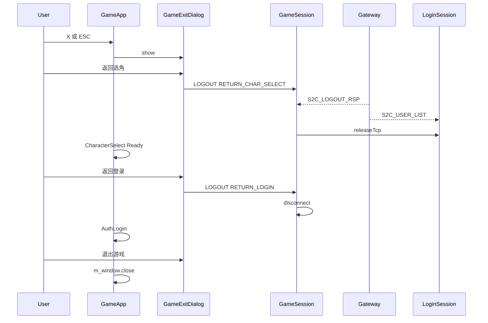

# 游戏中退出二级弹窗

## 现状

| 入口 | 当前行为 |
|------|----------|
| 窗口右上角 X（`sf::Event::Closed`） | [`GameApp::processEvents`](app/GameApp.cpp) 直接 `m_window.close()` |
| ESC | [`GameScene::handleEvent`](game/GameScene.cpp) 未处理 |
| 登录前底部「退出游戏」 | [`LoginChrome`](ui/LoginChrome.cpp) 仍直接关窗（**仅 pre-game**，本需求不改） |

协议已就绪（[`Common/LoginCommon.h`](Common/LoginCommon.h)、[`Common/LoginMsg.h`](Common/LoginMsg.h)）：

- `C2S_LOGOUT_REQ` / `S2C_LOGOUT_RSP`
- `LogoutAction::RETURN_CHAR_SELECT = 1`：回选角，**保持 Gateway 账号会话**
- `LogoutAction::RETURN_LOGIN = 2`：回登录 UI，客户端断 Gateway

客户端**尚未**实现 `buildLogoutReq` / 解析 `S2C_LOGOUT_RSP`，[`GameSession`](net/GameSession.cpp) 也不处理 LOGIN 模块退出包。



---

## 一、新增 UI：[`ui/GameExitDialog.h/cpp`](ui/GameExitDialog.h)

玻璃风格模态二级弹窗（复用 `UiTheme::drawPanel`）：

- 半透明全屏遮罩
- 标题：如「退出游戏」
- 说明文案（可选一行）
- 三个主按钮（自上而下或 2+1 布局）：
  1. **返回选角** — 离世界，保持账号会话，回选角并刷新角色列表
  2. **返回登录** — 离世界并退出账号状态，回账号密码登录页（[`AuthLoginPanel`](ui/AuthLoginPanel.cpp)）
  3. **退出游戏** — 关闭整个客户端
- **取消**（或再次 ESC）：仅关闭弹窗，继续游戏

API：

```cpp
void setup(UiTheme*, sf::Vector2u viewSize);
void show() / hide();
bool isVisible() const;
void setOnReturnCharSelect(std::function<void()>);
void setOnReturnLogin(std::function<void()>);
void setOnQuitClient(std::function<void()>);
void handleEvent(...);  // 弹窗可见时优先消费事件
void draw(sf::RenderTarget&);
```

---

## 二、触发入口：[`app/GameApp.cpp`](app/GameApp.cpp)

### 拦截 X（窗口关闭）

`AppState::Game` 且弹窗未显示时，`sf::Event::Closed` **不**调用 `m_window.close()`，改为 `m_gameExitDialog.show()`。

仅用户点「退出游戏」或 shutdown 时才真正关窗。

### 拦截 ESC

在 `Game` 分支：

- 弹窗已显示 → `hide()`（取消）
- 弹窗未显示 → `show()`

[`GameScene::handleEvent`](game/GameScene.cpp) 中对 `Escape` **不**处理移动，由 `GameApp` 在 `gameScene.handleEvent` 之前/之后统一处理（推荐在 `GameApp` 处理，避免场景层耦合）。

### 渲染与事件顺序

- `render`：`Game` 时先 `m_gameScene.draw`，若 `m_gameExitDialog.isVisible()` 再 `draw` 遮罩+弹窗
- `processEvents`：弹窗可见时 **先** `m_gameExitDialog.handleEvent`，命中则 `continue`（阻止 WASD 等穿透）

---

## 三、网络：[`sdk/net/ClientMsgHandler`](sdk/net/ClientMsgHandler.cpp)

新增：

- `buildLogoutReq(LogoutAction action)`
- `parseLogoutRsp(const char* data, uint16_t len, Msg_S2C_LogoutRsp& out)`

---

## 四、GameSession 退出流程：[`net/GameSession.h/cpp`](net/GameSession.h)

新增：

```cpp
using LogoutCallback = std::function<void(LogoutAction action)>;
void requestLogout(LogoutAction action, LogoutCallback onSuccess, ErrorCallback onError);
std::unique_ptr<TcpClient> releaseTcpClient();
void leaveWorld();  // 停止心跳/移动，不清连接（供返回选角）
```

实现要点：

- `requestLogout` 发送 `C2S_LOGOUT_REQ`，进入 `WaitLogoutRsp` 短暂状态
- `onTcpMessage` 增加 `S2C_LOGOUT_RSP` 解析；`code!=0` 走 `onError`
- `releaseTcpClient()`：与 LoginSession 对称，`std::move(m_tcp)` 并清理 GameSession 状态（不 `disconnect`）
- `RETURN_LOGIN` 成功回调后由 GameApp 调用 `disconnect()`

---

## 五、LoginSession 接管 Gateway：[`net/LoginSession.h/cpp`](net/LoginSession.h)

进游戏时 TCP 已交给 GameSession（[`onEnterGame`](app/GameApp.cpp) `releaseTcpClient`）。返回选角需**接回**同一条 Gateway 连接并等列表。

新增：

```cpp
void resumeGatewayForCharSelect(std::unique_ptr<TcpClient> tcp);
```

行为：

- 重新绑定 `TcpClient` 回调到 LoginSession
- `m_gatewayConnected = true`，`m_gotLoginRsp = true`，`m_gotGatewayInfo = true`，`m_gotUserList = false`
- `m_state = WaitUserList`，重置 `m_waitResponseStartMs`
- `notifyStatus(u8"正在获取角色列表...")`
- 收到 `S2C_USER_LIST` 后现有 `deliverUserList` → `GameApp::onUserList`

若服务端在 `S2C_LOGOUT_RSP` 后立即推送列表，LoginSession 接管后 `poll()` 即可收到。

---

## 六、GameApp 三档退出编排

新增私有方法：

| 方法 | 行为 |
|------|------|
| `showGameExitDialog()` | 显示弹窗 |
| `exitToCharacterSelect()` | `requestLogout(RETURN_CHAR_SELECT)` → `releaseTcp` → `resumeGatewayForCharSelect` → `gameScene.leave()` → `CharacterSelect` Loading |
| `exitToAuthLogin()` | `requestLogout(RETURN_LOGIN)` 或失败时强制 `disconnect` → `gameSession.disconnect()` → `loginSession.cancel()` → `gameScene.leave()` → `AuthLogin`（保留 LocalSettings 账号回填） |
| `quitClient()` | `m_window.close()` |

注意：

- 设置 `m_suppressGameDisconnectNav` 标志，避免 [`setOnDisconnected`](app/GameApp.cpp) 误切 `ZoneHome`（当前断线会回选区首页，需与主动退出区分）
- 退出过程中弹窗显示 Loading 文案（如「正在离开世界...」），禁用重复点击

[`GameScene`](game/GameScene.h) 新增 `leave()`：`m_active=false`，清空实体/输入状态，释放场景资源引用。

---

## 七、文档

更新 [`README.md`](README.md) 新增「游戏中退出」小节：

- X / ESC → 二级弹窗
- 三按钮含义与对应协议 `LogoutAction`
- 返回选角：Gateway 保持、刷新 `S2C_USER_LIST`
- 返回登录：断 Gateway、回 AuthLogin
- 退出游戏：关闭客户端

更新 [`net/GameSession.h`](net/GameSession.h)、[`net/LoginSession.h`](net/LoginSession.h) 文件头职责说明。

---

## 验证清单

1. 游戏中按 ESC → 弹出二级框；再按 ESC → 关闭弹窗，仍在场景
2. 点窗口 X → 弹窗，不直接退出
3. **返回选角** → Loading → 选角列表刷新，账号未重新输入
4. **返回登录** → 回到账号密码页，可再次登录
5. **退出游戏** → 客户端关闭
6. 服务端未实现 LOGOUT 时：超时/失败给出中文错误，仍可强制回登录（降级断开）
7. Debug 编译通过

## 涉及文件

| 文件 | 变更 |
|------|------|
| [`ui/GameExitDialog.h/cpp`](ui/GameExitDialog.h) | 新建二级弹窗 |
| [`app/GameApp.h/cpp`](app/GameApp.h) | 弹窗生命周期、X/ESC 拦截、三档退出 |
| [`game/GameScene.h/cpp`](game/GameScene.h) | `leave()`；ESC 不在场景内处理 |
| [`net/GameSession.h/cpp`](net/GameSession.h) | `requestLogout`、`releaseTcpClient` |
| [`net/LoginSession.h/cpp`](net/LoginSession.h) | `resumeGatewayForCharSelect` |
| [`sdk/net/ClientMsgHandler.h/cpp`](sdk/net/ClientMsgHandler.h) | logout 组包/解包 |
| [`README.md`](README.md) | 游戏中退出说明 |
| CMake 源文件列表（若未 GLOB） | 加入 `GameExitDialog.cpp` |
