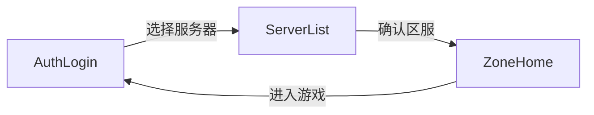

# 登录/注册 UI 优化计划

## 现状

- 登录/注册密码框已在 [`BootSceneSetup.cs`](assets/_Project/Scripts/Editor/BootSceneSetup.cs) 中创建为 `ContentType.Password`（`CreateInputField(..., password: true)`）。
- [`GameUiController.cs`](assets/_Project/Scripts/UI/GameUiController.cs) 持有 `_passwordInput`、`_regPassword`、`_regConfirm`，无显示/隐藏逻辑。
- 区服选择流程已在 [`GameApp.cs`](assets/_Project/Scripts/App/GameApp.cs) 的 `OnSelectServerClicked` 实现：拉取区列表 → `AppState.ServerList`。



## 实现方案

### 1. 密码显示/隐藏（登录 + 注册）

在 [`GameUiController.cs`](assets/_Project/Scripts/UI/GameUiController.cs) 增加：

| 字段 | 用途 |
|------|------|
| `_showLoginPasswordToggle` | 登录页「显示密码」 |
| `_showRegisterPasswordToggle` | 注册页「显示密码」（同时控制两个框） |

**行为**（`Awake` 绑定 `Toggle.onValueChanged`）：

- `isOn == true` → `InputField.contentType = Standard`（明文）
- `isOn == false` → `InputField.contentType = Password`（掩码）
- 切换后调用 `input.ForceLabelUpdate()` 刷新显示（Unity 旧版 InputField 惯例）

抽取私有方法避免重复：

```csharp
private static void ApplyPasswordVisibility(InputField field, bool visible)
{
    if (field == null) return;
    field.contentType = visible ? InputField.ContentType.Standard : InputField.ContentType.Password;
    field.ForceLabelUpdate();
}
```

注册页 toggle 一次更新 `_regPassword` 与 `_regConfirm`。

**不新增独立脚本文件**——逻辑简单，放在 `GameUiController` 内即可，与现有 `_rememberToggle` 风格一致。

### 2. 登录页「选择服务器」按钮

在 [`GameUiController.cs`](assets/_Project/Scripts/UI/GameUiController.cs) 增加：

- `[SerializeField] Button _authSelectServerBtn`
- `public Action OnAuthSelectServerClicked`（或复用已有 `OnSelectServerClicked`）

**推荐**：直接复用 `OnSelectServerClicked`，少一个回调字段；`Awake` 中：

```csharp
_authSelectServerBtn?.onClick.AddListener(() => OnSelectServerClicked?.Invoke());
```

[`GameApp.cs`](assets/_Project/Scripts/App/GameApp.cs) **无需改动**——现有 handler 已满足「返回区列表并重新拉取」：

```195:201:assets/_Project/Scripts/App/GameApp.cs
            _ui.OnSelectServerClicked = () =>
            {
                _ui.SetStatus("正在连接 LoginServer...");
                _ui.SetServerListHint("正在拉取区列表…");
                _ui.ShowError(string.Empty);
                _zoneList.FetchZoneList();
                SetState(AppState.ServerList);
            };
```

从登录页进入区列表后，用户确认区服仍走 `OnZoneConfirmed` → `ZoneHome` → 再点「进入游戏」回登录，流程与现有一致。

**Connecting 状态**：`ApplyConnectingLock` 已禁用登录按钮；顺带将 `_authSelectServerBtn.interactable = !connecting`，避免登录进行中跳走。

### 3. Boot 场景布局（[`BootSceneSetup.cs`](assets/_Project/Scripts/Editor/BootSceneSetup.cs)）

**AuthPanel**（自上而下微调锚点）：

| 控件 | 锚点 Y | 文案 |
|------|--------|------|
| AccountInput | 0.60 | （不变） |
| PasswordInput | 0.52 | （不变） |
| ShowLoginPasswordToggle | 0.45 | **显示密码** |
| RememberToggle | 0.38 | 记住账号 |
| LoginBtn | 0.30 | 登录 |
| GotoRegisterBtn | 0.22 | 注册账号 |
| AuthSelectServerBtn | 0.14 | **选择服务器** |

**RegisterPanel**：

| 控件 | 锚点 Y | 文案 |
|------|--------|------|
| RegAccount | 0.60 | |
| RegPassword | 0.52 | |
| RegConfirm | 0.44 | |
| ShowRegisterPasswordToggle | 0.37 | **显示密码** |
| RegisterBtn | 0.28 | 提交注册 |
| BackToLoginBtn | 0.20 | 返回登录 |

更新 `WireUiController(...)` 签名，写入新 SerializeField：

- `_showLoginPasswordToggle`
- `_showRegisterPasswordToggle`
- `_authSelectServerBtn`

### 4. OnDestroy 清理

在 [`GameUiController.OnDestroy`](assets/_Project/Scripts/UI/GameUiController.cs) 中：

- `_authSelectServerBtn?.onClick.RemoveAllListeners()`
- 两个 password toggle 的 `onValueChanged` 使用具名 handler 或 `RemoveAllListeners()` 清理

## 文件变更清单

| 文件 | 变更 |
|------|------|
| [`GameUiController.cs`](assets/_Project/Scripts/UI/GameUiController.cs) | 新字段、密码可见性、按钮监听、Connecting 锁定 |
| [`BootSceneSetup.cs`](assets/_Project/Scripts/Editor/BootSceneSetup.cs) | 创建 Toggle/Button、布局、`WireUiController` |
| [`Boot.unity`](assets/_Project/Scenes/Boot.unity) | 需重新生成场景后自动更新（见下） |

**不修改**：`GameApp.cs`（复用 `OnSelectServerClicked`）、网络/协议代码。

## 验证步骤

1. 菜单 **RPG → Setup Boot Scene**（或 `.\scripts\setup_boot_scene.ps1`）覆盖生成 Boot 场景并绑定引用。
2. 登录页：输入密码 → 勾选「显示密码」可见明文 → 取消勾选恢复 `*`。
3. 注册页：一个复选框同时切换密码/确认密码可见性。
4. 登录页点「选择服务器」→ 进入区列表、拉取列表；选区确认后回首页，再进登录页。
5. 登录进行中（Connecting）时「选择服务器」按钮不可点。

## 风险

- 仅改代码不改场景时，SerializeField 为 null，功能静默不生效；**必须重跑 Boot Scene Setup** 或手动在 Inspector 拖引用。
