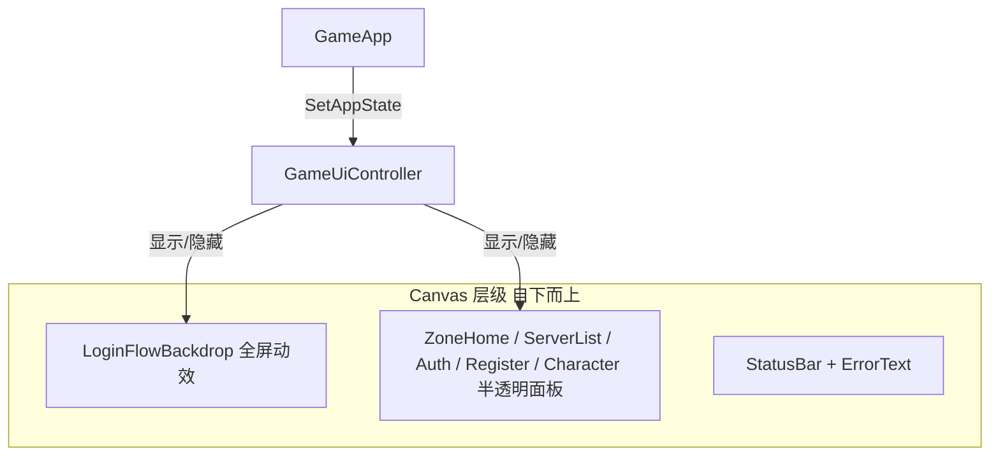

# 登录流程共用仙侠动效背景

## 目标界面（共用一套背景）

| AppState | 面板 | 说明 |
|----------|------|------|
| `ZoneHome` | `_zoneHomePanel` | 区服首页（用户要求一并加上） |
| `ServerList` | `_serverListPanel` | 区列表 |
| `AuthLogin` / `Connecting` | `_authPanel` | 登录 |
| `Register` | `_registerPanel` | 注册 |
| `CharacterSelect` | `_characterPanel` | 角色列表 + 创角（同屏，一张背景即可） |
| `Game` | — | **隐藏背景**，仅 HUD |

状态切换逻辑集中在 [`GameUiController.SetAppState`](assets/_Project/Scripts/UI/GameUiController.cs)（约 L150–181）。

## 技术方案：分层静态图 + 轻量动效

不引入 VideoPlayer；在 UI Canvas 下新建全屏 `LoginFlowBackdrop` 节点，子层结构建议：

1. **Base** — 远山 + 天空 + 近景山体（1 张 1920×1080 仙侠横图，`Image` stretch）
2. **Water** — 水面半透明叠层，`UI/ScrollUV` 材质横向缓慢滚动
3. **Waterfall** — 瀑布条带叠层，纵向 `ScrollUV` 或 `RectTransform` 位移动画
4. **Trees** — 近景树木静态层（增强景深，可选与 Base 合并减少 draw call）
5. **Mist** — 1~2 层半透明白雾，`anchoredPosition` 缓慢平移 + 轻微 alpha 呼吸
6. **Birds** — 3~5 个小鸟 `Image`，对象池横向飞过（随机高度、速度、间隔）

新建脚本 [`LoginFlowBackdrop.cs`](assets/_Project/Scripts/UI/LoginFlowBackdrop.cs)：
- `Play()` / `Stop()` 控制 Update 动效与飞鸟协程
- 序列化引用各层 `Image`/`RectTransform`，参数可配（滚动速度、鸟生成间隔）
- 使用 `Time.unscaledDeltaTime`，Connecting 时动画不卡顿

新建轻量 Shader [`UI_ScrollUV.shader`](assets/_Project/Shaders/UI_ScrollUV.shader)（基于 `UI/Default`，增加 `_ScrollSpeed` XY），供水面/瀑布 `Image.material` 使用；避免引入第三方插件。

## 美术资源

目录：`assets/_Project/Art/UI/LoginFlowBackdrop/`

| 文件 | 用途 |
|------|------|
| `backdrop_base.png` | 山、天空、远景 |
| `backdrop_water.png` | 可平铺水面（alpha 通道） |
| `backdrop_waterfall.png` | 瀑布竖条（可平铺） |
| `backdrop_trees.png` | 近景树（可选） |
| `backdrop_mist.png` | 雾气（可平铺） |
| `bird.png` | 小鸟剪影（16~32px 级） |

实现阶段用 AI/占位图生成仙侠风格静态分层（宽高比 16:9，色调青绿 + 金霞），后续你可直接替换 PNG 不改代码。

## UI 可读性调整

当前 [`BootSceneSetup.CreatePanel`](assets/_Project/Scripts/Editor/BootSceneSetup.cs) 使用全屏色块 `Color(0.08, 0.1, 0.14, 0.85)`，会几乎盖住背景。

调整策略（最小改动）：
- 将各流程面板底色 alpha 降至 **0.45~0.55**，让山水动效可见
- 保留 `StatusBar` 顶部条；表单控件区域维持现有布局
- 若对比度不足，可在面板内增加 **居中半透明卡片**（仅包输入区，不挡全屏背景）——优先试降 alpha，不够再加卡片

## 场景与编辑器集成

修改 [`BootSceneSetup.cs`](assets/_Project/Scripts/Editor/BootSceneSetup.cs)：
- `CreateCanvasRoot()` 后首先 `CreateLoginFlowBackdrop(canvas.transform)`，**SetAsFirstSibling** 保证在最底层
- 新增 `WireLoginFlowBackdrop(GameUiController ui, LoginFlowBackdrop backdrop)`
- 调整 `CreatePanel` 默认透明度

修改 [`GameUiController.cs`](assets/_Project/Scripts/UI/GameUiController.cs)：
- 增加 `[SerializeField] LoginFlowBackdrop _loginFlowBackdrop`
- 在 `SetAppState` 末尾：`backdrop.SetActive(state != AppState.Game)`
- `SetAppState` / `ShowServerList` / `ShowCharacterSelect` 时确保背景已显示（防止仅调 ShowXxx 时遗漏）

对**已有** `Boot.unity`（未重跑 Setup）：
- 扩展已有菜单 [`RPG/Fix Boot Scene Missing Scripts`](assets/_Project/Scripts/Editor/BootSceneSetup.cs)，或新增 `RPG/Add Login Flow Backdrop`，向现有 Canvas 注入 Backdrop 并绑定 `GameUiController`（避免强制覆盖整场景）

## 性能与兼容

- 目标：额外 6~8 个 UI Image，1 个简单 shader；移动端可承受
- 飞鸟池固定上限（如 5），离开屏幕回收
- `Stop()` 在进 `Game` 时停协程，避免 HUD 阶段空转
- 团结/Unity URP 项目下 shader 使用 `Canvas` 兼容写法，不依赖额外 URP UI 包

## 验证清单

1. 区服首页 → 选区列表 → 登录 → 注册 → 选角/创角：背景**连续显示、不闪烁**，切换仅前景面板变
2. 可见：山、水流动、瀑布下落、鸟飞过、薄雾飘动
3. 进入游戏后背景隐藏，HUD 正常
4. 1280×720 与宽屏下 `CanvasScaler` 无黑边裁切异常（背景 `anchor stretch`）
5. Play 模式下不调用 Editor 场景菜单（已有 `GuardNotPlaying`）

## 不在本次范围

- 游戏内 HUD / 3D 世界场景背景
- 每屏独立 5 套不同美术（已确认共用一套）
- 视频循环背景（已确认分层动效方案）
