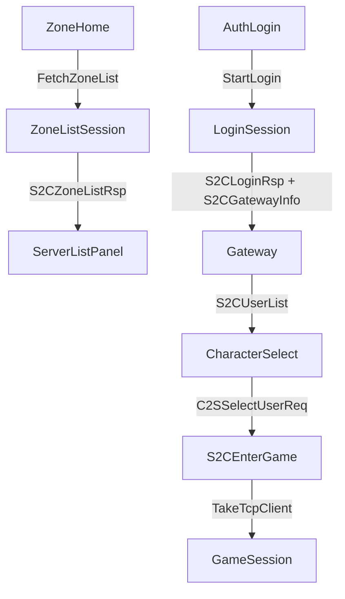
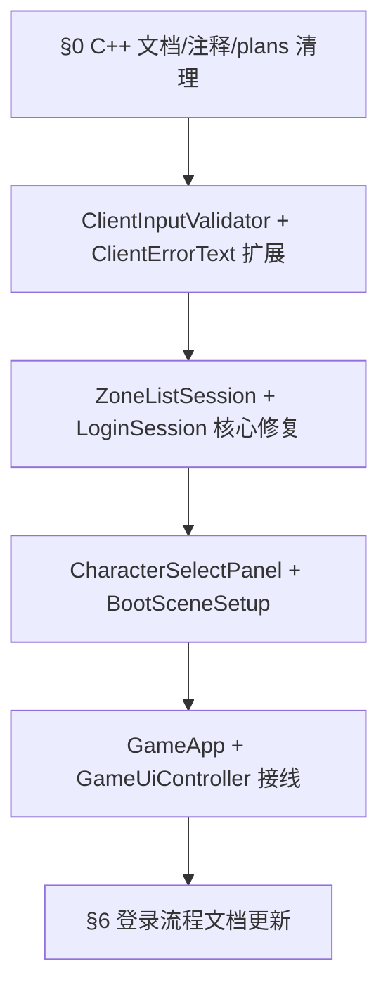

# 登录流程排查与修复计划

## 现状与问题总览

登录链路由 [`GameApp.cs`](assets/_Project/Scripts/App/GameApp.cs) 编排，网络分三层短/长会话：



排查结论（按严重度）：

| 严重度 | 区域 | 问题 |
|--------|------|------|
| 高 | 区列表 | [`ZoneListSession`](assets/_Project/Scripts/Net/ZoneListSession.cs) 未校验 `S2CZoneListRsp.code`，服务端错误被当作空列表 |
| 高 | 选角/进世界 | 无角色时 `_selectedUserId=0` 仍可发 `C2SSelectUserReq(0)` |
| 高 | 登录 | Gateway 连接上收到 `S2CLoginRsp code!=0` 时被静默忽略（[`HandleLoginRsp` L261-264](assets/_Project/Scripts/Net/LoginSession.cs)），真实鉴权失败表现为 15s「角色列表超时」 |
| 中 | 选角 | `S2CUserList.code` 未校验 |
| 中 | 注册/登录 | 未选区（`zoneId=0`）、空账号/密码、密码不一致等无客户端拦截 |
| 中 | 创角 | 无状态守卫（`WaitEnterGame` 等仍可发创角）；角色名 2–12 码点未校验 |
| 中 | 注册 | 无 loading 锁，可重复提交 |
| 中 | 选角 UI | 仅 Text 展示，无法切换多角色（用户确认需完整 Panel） |
| 低 | 区列表 | `Connecting` 状态无连接超时（仅 `WaitResponse` 有） |
| 低 | 返回选角 | `ResumeGatewayForCharSelect` 依赖服务端推送 `S2CUserList`，无推送则超时 |

**不在本次范围**（已知占位/服务端依赖）：Addressables 地图加载、XLua 回调、`token_expire_ms` 本地过期校验（C# 不做本地过期比较）、TLS `insecureSkipVerify` 开发配置。

---

## 0. 旧 C++ 遗留清理（用户补充）

**现状**：工作区与 `main` 分支均已无 C++ 源码（`app/`、`sdk/`、`game/`、`net/`、`ui/`、`util/`、`lua/`、`main.cpp`、`CMakeLists.txt`、`build_client.ps1` 等不存在）。本次重点是**删除文档与注释中的 C++ 引用**，避免误导维护者。

### 0.1 C# 文件头注释（约 28 个文件）

将所有 `/// 对标 xxx.cpp / sdk/net/...` 改为**纯 C# 职责描述**，不再引用已删除的 C++ 路径。涉及目录：

- [`assets/_Project/Scripts/Net/`](assets/_Project/Scripts/Net/)（LoginSession、GameSession、PacketCodec 等）
- [`assets/_Project/Scripts/App/`](assets/_Project/Scripts/App/)（GameApp、AppState、GameBootstrap）
- [`assets/_Project/Scripts/UI/`](assets/_Project/Scripts/UI/)（GameUiController）
- [`assets/_Project/Scripts/World/`](assets/_Project/Scripts/World/)（WorldController、EntityManager）
- [`assets/_Project/Scripts/Config/`](assets/_Project/Scripts/Config/)、[`Util/`](assets/_Project/Scripts/Util/)、[`Log/`](assets/_Project/Scripts/Log/)、[`Game/`](assets/_Project/Scripts/Game/)、[`Script/`](assets/_Project/Scripts/Script/)

示例：

```csharp
// 改前：/// 登录/注册/选角网络会话（对标 net/LoginSession）。
// 改后：/// 登录/注册/选角网络会话。职责：LoginServer 登录 → Gateway 鉴权 → 角色列表 → 进世界。
```

### 0.2 文档清理

| 文件 | 操作 |
|------|------|
| [`assets/_Project/Scripts/Net/README.md`](assets/_Project/Scripts/Net/README.md) | 删除「对标原 net/、sdk/net/」及 C++ 映射表；改为 Unity C# 模块职责 + 登录五步流程 |
| [`docs/LUA_BRIDGE.md`](docs/LUA_BRIDGE.md) | 删除「旧 C++ 客户端 + ClientScriptHost」历史段；仅保留 GameScriptHost / Phase 3 方案 |
| [`assets/characters/README.md`](assets/characters/README.md) | 删除 `CharacterSprite.cpp` 程序化精灵说明；改为 Unity 3D 角色 Prefab 占位说明，或整文件删除若目录无用途 |
| [`assets/fonts/README.md`](assets/fonts/README.md) | 删除 `build_client.ps1`、`build/bin/`、`UiTheme` 等 C++ 构建路径 |
| [`assets/ui/README.md`](assets/ui/README.md) | 删除 `build/bin/assets/ui/` 拷贝说明；改为 Unity 工程内 `assets/ui/` 直接使用 |

[`docs/SCOPE.md`](docs/SCOPE.md) 已是 Unity-only，无需大改。

### 0.3 删除过时 `.cursor/plans/`（C++ 诊断 / 已完成迁移）

以下 9 份计划文件主体引用 `net/LoginSession.cpp`、`sdk/net/`、`ui/ServerListPanel.cpp` 等已删除路径，或迁移任务已完成，**整文件删除**：

- [`gateway票据过期诊断_55fb3cae.plan.md`](.cursor/plans/gateway票据过期诊断_55fb3cae.plan.md)
- [`gateway鉴权与列表超时_bbf66daa.plan.md`](.cursor/plans/gateway鉴权与列表超时_bbf66daa.plan.md)
- [`登录账号不存在诊断_91886e80.plan.md`](.cursor/plans/登录账号不存在诊断_91886e80.plan.md)
- [`区列表维护中诊断_8842d3b3.plan.md`](.cursor/plans/区列表维护中诊断_8842d3b3.plan.md)
- [`rpg客户端3d迁移_fa1e8445.plan.md`](.cursor/plans/rpg客户端3d迁移_fa1e8445.plan.md)
- [`tuanjie_1.6.11_重构_a4559495.plan.md`](.cursor/plans/tuanjie_1.6.11_重构_a4559495.plan.md)
- [`tuanjie_1.6.11_重构_f1144093.plan.md`](.cursor/plans/tuanjie_1.6.11_重构_f1144093.plan.md)
- [`boot场景与loginserver_33a00c47.plan.md`](.cursor/plans/boot场景与loginserver_33a00c47.plan.md)
- [`客户端六项优化_889e85e4.plan.md`](.cursor/plans/客户端六项优化_889e85e4.plan.md)

**保留**：本计划 [`登录流程排查修复_8824087c.plan.md`](.cursor/plans/登录流程排查修复_8824087c.plan.md)、[`修复_unity_编译_612d058d.plan.md`](.cursor/plans/修复_unity_编译_612d058d.plan.md)（纯 Unity 编译相关）。

### 0.4 验证

- 全仓 `rg "对标|build_client|\.cpp|SFML|CMakeLists|旧 C\\+\\+"` 在 `assets/`、`docs/`、`assets/_Project/Scripts/` 中无命中（`.cursor/plans/` 仅保留本计划）
- C# 文件头注释均为 Unity C# 职责说明

---

## 1. 区列表逻辑修复

**文件**：[`ZoneListSession.cs`](assets/_Project/Scripts/Net/ZoneListSession.cs)、[`ClientErrorText.cs`](assets/_Project/Scripts/Net/ClientErrorText.cs)

**改动**：

1. 解析 `S2CZoneListRsp` 后先检查 `code == 0`；非 0 调用 `Fail("区列表失败：" + msg)`，不展示 entries。
2. `Update()` 中为 `State.Connecting` 增加连接超时（复用 `ConnectTimeoutMs`，与 `LoginSession.CheckTimeouts` 一致）。
3. 新增 `ClientErrorText.ZoneListResultText(int code, string serverMsg)`。

**UI 侧**（已有逻辑基本正确）：[`ServerListPanel`](assets/_Project/Scripts/UI/ServerListPanel.cs) 维护区不可选 + 自动选第一个可选区；[`GameUiController.ShowServerList`](assets/_Project/Scripts/UI/GameUiController.cs) 在无可用区时提示错误——保持不变。

---

## 2. 创建账号逻辑修复

**文件**：新建 [`ClientInputValidator.cs`](assets/_Project/Scripts/Util/ClientInputValidator.cs)、[`GameApp.cs`](assets/_Project/Scripts/App/GameApp.cs)、[`GameUiController.cs`](assets/_Project/Scripts/UI/GameUiController.cs)

**ClientInputValidator**（静态工具，无过度抽象）：

- `TryValidateAccount(string)` — 非空、长度 4–32、可打印 ASCII
- `TryValidatePassword(string)` — 非空、长度 6–32
- `TryValidatePasswordMatch(password, confirm)`
- `TryValidateZoneSelected(uint zoneId)` — zoneId != 0
- `TryValidateCharacterName(string)` — UTF-8 码点 2–12（用 `StringInfo.LengthInTextElements`）

**GameApp.OnRegisterClicked** 流程：

1. 校验区服、账号、密码、确认密码；失败则 `_ui.ShowError(...)` 并 return。
2. 设 `_ui.SetRegisterBusy(true)` + `SetState(AppState.Connecting)`（复用 Connecting 锁 UI）。
3. 调用 `_login.StartRegister(...)`。

**LoginSession** 侧：注册失败时 `OnError` 回调；**GameApp** 扩展 `_login.OnError`：若当前为 `Register`/`Connecting` 且来自注册流程，回 `AppState.Register` 而非 AuthLogin。

**GameUiController**：注册按钮在 `Connecting` 时 `interactable=false`（与登录按钮一致）。

---

## 3. 登录账号逻辑修复

**文件**：[`LoginSession.cs`](assets/_Project/Scripts/Net/LoginSession.cs)、[`GameApp.cs`](assets/_Project/Scripts/App/GameApp.cs)

**Gateway 鉴权错误（核心 bug）** — 修改 `HandleLoginRsp`：

```csharp
// 当前（有漏洞）：Gateway 上收到 S2CLoginRsp 一律 return
if (_gatewayConnected && _state == State.WaitUserList) { ... return; }

// 修复后：Gateway 上仍解析 code，非 0 则 Fail(loginResultText)
if (_gatewayConnected && _state == State.WaitUserList)
{
    var err = ClientErrorText.LoginResultText(rsp.Code, rsp.Msg);
    if (!string.IsNullOrEmpty(err)) { Fail(err); return; }
    ClientLogger.Instance.Info("LoginSession：Gateway 鉴权成功");
    return;
}
```

**GameApp.OnLoginClicked**：

- 调用前 `ClientInputValidator` 校验区服 + 账号 + 密码。
- `_selectedZoneId == 0` 时提示「请先选择区服」并 return。

**SwitchingGateway 误断连（防御性）**：

- 增加 `_intentionalDisconnect` 标志；`TryConnectGateway` 断开 LoginServer 前置 true，`OnDisconnected` 中若为 intentional 则忽略 Fail。

---

## 4. 创建角色逻辑修复

**文件**：[`LoginSession.cs`](assets/_Project/Scripts/Net/LoginSession.cs)、[`GameApp.cs`](assets/_Project/Scripts/App/GameApp.cs)、[`GameUiController.cs`](assets/_Project/Scripts/UI/GameUiController.cs)

**LoginSession**：

1. `HandleUserList` — 校验 `S2CUserList.code == UserListOk`；失败 `Fail(UserListResultText(...))`。
2. `CreateCharacter` / `SelectCharacter` — 仅允许 `_state == WaitUserAction && _gatewayConnected`；否则 warn 日志并 return。
3. 新增 `ClientErrorText.UserListResultText`。

**GameApp.OnCreateCharacter**：

- 客户端校验角色名；失败 ShowError。
- 创角进行中 `_ui.SetCharacterBusy(true)`。

**职业/性别**：本次在 [`CharacterSelectPanel`](assets/_Project/Scripts/UI/CharacterSelectPanel.cs)（新建）增加 Dropdown 或两个 Toggle（战士/法师、男/女），默认值保持 `CharacterDef.VocationWarrior` + `SexMale`；[`BootSceneSetup`](assets/_Project/Scripts/Editor/BootSceneSetup.cs) 生成对应控件。

---

## 5. 角色进入游戏逻辑修复

**文件**：新建 [`CharacterSelectPanel.cs`](assets/_Project/Scripts/UI/CharacterSelectPanel.cs)、[`CharacterListItemView.cs`](assets/_Project/Scripts/UI/CharacterListItemView.cs)、[`GameUiController.cs`](assets/_Project/Scripts/UI/GameUiController.cs)、[`LoginSession.cs`](assets/_Project/Scripts/Net/LoginSession.cs)、[`GameApp.cs`](assets/_Project/Scripts/App/GameApp.cs)

**CharacterSelectPanel**（对标 `ServerListPanel` 模式）：

- ScrollView + 角色行 prefab（`CharacterListItemView`：名称、等级、选中高亮）
- 「进入世界」按钮：仅 `_selectedUserId != 0` 时可点
- 「创建角色」区：名称 Input + 职业/性别选择 + 创建按钮
- 回调：`OnCharacterSelected(ulong)`、`OnEnterWorld()`、`OnCreateCharacter(name, voc, sex)`

**GameUiController** 重构：

- 移除 `_charListText` 直写逻辑，改委托 `CharacterSelectPanel`
- `ShowCharacterSelect` → `_characterPanel.ShowCharacters(chars, highlightUserId)`
- `SetCharacterBusy(bool)` — 创角/进世界期间禁用按钮

**LoginSession.SelectCharacter**：

- `userId == 0` 时直接 Fail 或 return（双重守卫）

**GameApp.OnEnterGame**：

- 增加 `enter.UserId == 0` 或 `enter.MapId == 0` 的防御性日志/错误（S2CEnterGame 无 code 字段，异常包不应 silently 进世界）

**返回选角超时优化**（[`ResumeGatewayForCharSelect`](assets/_Project/Scripts/Net/LoginSession.cs)）：

- 若 `WaitUserList` 超时且 TCP 仍连接，尝试重发 `C2SGatewayAuthReq`（`_loginRsp` 与 `_account` 在 `TakeTcpClient` 后仍保留）一次；仍失败则 Fail 并回 AuthLogin。

---

## 6. 文档更新（登录流程 + Unity-only）

| 文件 | 变更 |
|------|------|
| [`assets/_Project/Scripts/Net/README.md`](assets/_Project/Scripts/Net/README.md) | §0 已删 C++ 映射；新增 LoginSession/ZoneListSession 五步流程表、code 校验点、Gateway 鉴权说明 |
| [`assets/_Project/Scenes/README.md`](assets/_Project/Scenes/README.md) | CharacterSelectPanel 交互；创角字段校验；进世界前置条件 |
| [`README.md`](README.md) | 登录流程小节：区服必选、客户端校验规则、Gateway 鉴权错误不再表现为列表超时；确认无 C++ 构建说明 |

---

## 实施顺序



## 验证清单

1. **C++ 清理**：`assets/`、`docs/`、`Scripts/` 无 C++ 路径/构建引用；9 份过时 plan 已删
2. **区列表**：Mock/联调 `S2CZoneListRsp code!=0` → 显示「区列表失败」而非空列表
3. **未选区**：区服首页未选区点「进入游戏/注册」→ 客户端拦截
4. **注册**：密码不一致、空字段 → 客户端拦截；提交后按钮禁用
5. **Gateway 鉴权失败**：应秒级显示登录失败文案，非 15s 列表超时
6. **选角**：0 角色时「进入世界」不可点；多角色可点击切换；创角名 1 字/13 字被拦截
7. **进世界**：`S2CEnterGame` 正常 → GameSession 接管 TCP，WASD 可移动
8. **返回选角**：ESC → 返回选角 → 列表刷新或重鉴权成功
