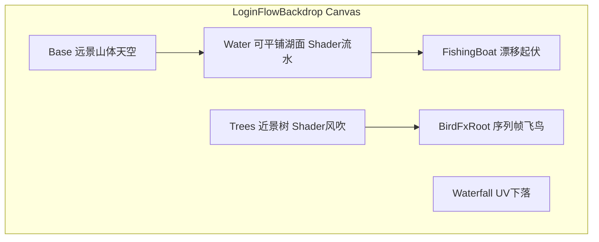

# 登录背景动效升级（拆分底图 + 特效层）

## 目标

| 需求 | 实现方式 |
|------|----------|
| 飞鸟换特效 | 序列帧翅膀动画 + 可选轻量粒子拖尾，移除当前 `Image` 方框飞鸟池 |
| 流水 + 树木风吹 | 启用 `Water`/`Trees` 独立层；新 Shader 驱动水面滚动波纹与树冠顶点摇摆 |
| 渔船渔夫移动 | 新增 `FishingBoat` 层，湖面缓慢漂移 + 上下起伏（可选渔夫挥竿序列帧） |

你已确认采用 **拆分模式**：[`backdrop_base.png`](assets/_Project/Art/UI/LoginFlowBackdrop/backdrop_base.png) 去掉湖面与近景树，由动效层完全承担。



---

## 一、美术资源（需替换/新增）

目录：[`assets/_Project/Art/UI/LoginFlowBackdrop/`](assets/_Project/Art/UI/LoginFlowBackdrop/)

| 文件 | 说明 |
|------|------|
| `backdrop_base.png` | **重做**：仅天空+远山+瀑布远景；下方 30~35% 透明或柔和渐变，不含湖面与左侧近景松 |
| `backdrop_water.png` | **可横向平铺**湖面纹理（青绿波纹，带 alpha），1024×512 级 |
| `backdrop_trees.png` | **仅左侧近景树木**剪影/松枝，透明底，与 base 山体衔接 |
| `fx_bird_sheet.png` | 飞鸟 **4~6 帧**横版序列（展翅循环），单格约 64×32，透明底 |
| `fx_boat_fisherman.png` | 渔船+渔夫合成或分层；船体约 120~180px 宽，透明底 |

实现阶段可用 AI 按 [`docs/ui-prompts/UI-Prompts.md`](docs/ui-prompts/UI-Prompts.md) 扩展提示词生成占位图；导入设置：`Sprite Mode = Multiple`（鸟序列）/ `Single`（船），`Alpha Is Transparency = on`。

同步更新 [`docs/ui-prompts/UI-Prompts.md`](docs/ui-prompts/UI-Prompts.md) 中 base/water/trees/bird 提示词为拆分版（便于后续换图）。

---

## 二、Shader（基于现有 [`UI_ScrollUV.shader`](assets/_Project/Shaders/UI_ScrollUV.shader)）

### 1. `UI/WaterFlow`（水面）

- 继承 ScrollUV 横向 `_ScrollSpeed`
- Fragment 增加简易 ripple：`sin(uv.x*K + time) * sin(uv.y*K2 + time)` 微调 UV，模拟流水起伏
- 参数：`_RippleStrength`、`_RippleSpeed`

### 2. `UI/WindSway`（树木）

- Vertex 阶段按 `texcoord.y`（越高摆动越大）做 `sin(time + uv.x) * _SwayAmount` 水平位移
- 保持 UI Stencil/Clip 兼容

水面层 `Image.type = Tiled`（或 Simple + 足够宽 Rect），树木层 `Simple` 左下锚定 band。

---

## 三、脚本结构

### 1. 重构 [`LoginFlowBackdrop.cs`](assets/_Project/Scripts/UI/LoginFlowBackdrop.cs)

- 将 `_hideRedundantLayersOnCompositeBase` 改为 `_useSplitBaseArt`（默认 `true`）
  - `true`：启用 `Water`/`Waterfall`/`Trees`，关闭 `MistNear`/`MistFar`（延续上一版决策）
  - `false`：保留旧 composite 兼容路径
- **删除** 飞鸟 `Image` 池、`SpawnBirdsLoop`、`RentBirdImage` 等逻辑
- 新增序列化引用：
  - `UiSpriteSequenceFx _birdFx`（或 `BirdFxRoot` 子节点）
  - `RectTransform _fishingBoat`
  - `Image _fishingBoatImage`
- `Update` 中：
  - 更新 Shader `_ScrollSpeed` / ripple 参数（`unscaledDeltaTime`）
  - `AnimateFishingBoat(dt)`：湖面区域 X 轴 ping-pong + `sin` 起伏
- `Play()`/`Stop()` 控制鸟特效与船动画启停

### 2. 新增 [`UiSpriteSequenceFx.cs`](assets/_Project/Scripts/UI/UiSpriteSequenceFx.cs)

通用 UGUI 序列帧播放器：

- `Sprite[]` 或从 `Sprite` 图集切片
- `frameRate`、`loop`、可选 `randomStartFrame`
- 支持 **飞行路径**：`SpawnFlyAcross(RectTransform root, yRange, speed)` — 替代原飞鸟池
- 对象池上限（如 4 只），飞出屏回收

### 3. 新增 [`LoginFlowBoatFx.cs`](assets/_Project/Scripts/UI/LoginFlowBoatFx.cs)（可选独立组件挂船节点）

- 参数：`driftMinX/MaxX`、`bobAmplitude`、`bobSpeed`、`driftSpeed`
- 绑定 `Image` + 可选 `UiSpriteSequenceFx`（渔夫挥竿 2~3 帧慢循环）

不引入 DOTween（项目未依赖）；全部用 `Update` + `Coroutine`。

---

## 四、场景层级与编辑器

修改 [`BootSceneSetup.CreateLoginFlowBackdrop`](assets/_Project/Scripts/Editor/BootSceneSetup.cs)：

```
LoginFlowBackdrop
├── Base          (stretch full)
├── Water         (anchor bottom 0~32%, active, WaterFlow material)
├── Waterfall     (anchor right band, active, ScrollUV)
├── Trees         (anchor left bottom 0~45% width 0~38%, active, WindSway material)
├── FishingBoat   (anchor ~lake center, size ~160×80)
├── BirdFxRoot    (stretch full, 挂 UiSpriteSequenceFx spawner)
└── (MistNear/Far 保持 inactive)
```

新增辅助：

- `SetAnchorLeftBottomBand(rt, xmin, xmax, ymin, ymax)` — 树木左下区域
- `CreateFxLayer(...)` — 创建带自定义 Shader Material 的 Image
- `SliceBirdSprites()` — Editor 下从 `fx_bird_sheet` 切帧赋给 `UiSpriteSequenceFx`

扩展 [`RefreshLoginFlowBackdropAssets`](assets/_Project/Scripts/Editor/BootSceneSetup.cs)：绑定新精灵、`fx_boat_fisherman.png`、`fx_bird_sheet` 切片。

执行 **RPG → Add Login Flow Backdrop** 写回 [`Boot.unity`](assets/_Project/Scenes/Boot.unity)。

---

## 五、与现有流程衔接

- [`GameUiController.SetAppState`](assets/_Project/Scripts/UI/GameUiController.cs) 无需改：仍通过 `_loginFlowBackdrop.SetVisible` 控制
- `Connecting` 状态动画继续用 `Time.unscaledDeltaTime`
- 进 `Game` 时 `Stop()` 停鸟/船协程，避免 HUD 阶段空转

---

## 六、性能预算

- 额外 2 个轻量 UI Shader（WaterFlow、WindSway）
- 鸟池 ≤4，`ParticleSystem` 可选 1 个（拖尾，≤30 particles）
- 渔船 1 个 Image + 可选序列帧
- 目标：登录页额外 draw call 8~12，PC 可承受

---

## 七、验证清单

1. base 底图下方无「重复湖面/双树」；水面与树木由独立层呈现
2. 水面可见横向流动 + 细微波纹；树木持续风吹摇摆
3. 渔船在湖面缓慢来回移动并有起伏；渔夫剪影正常（非方框）
4. 飞鸟为序列帧展翅特效，间歇飞过天空，非静态方框
5. 区服首页 → 登录 → 选角背景连续；进游戏后 backdrop 隐藏
6. 1280×720 / 宽屏下锚点 band 无错位（`CanvasScaler` stretch）

---

## 不在本次范围

- 3D 粒子/VFX Graph 重型特效包
- Spine/Live2D
- 游戏内 HUD / 世界场景
- 重新启用薄雾漂移层（仍保持关闭）
