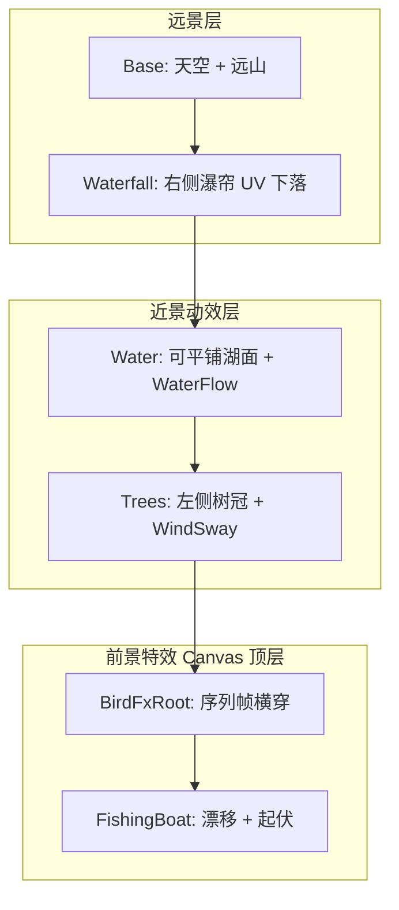

# 登录界面背景重构（仙侠近视图）

## 目标对照

| 需求 | 实现 |
|------|------|
| 仙侠风格、近视图 | 新美术构图：近景水面/树冠占屏约 40%，远景山体压缩在上部；分层锚点重调 |
| 天空飞鸟 | [`UiSpriteSequenceFx`](assets/_Project/Scripts/UI/UiSpriteSequenceFx.cs) + `fx_bird_sheet.png`，挂在 Canvas 顶层 `LoginFlowForegroundFx` |
| 远处有山 | [`backdrop_base.png`](assets/_Project/Art/UI/LoginFlowBackdrop/backdrop_base.png) 仅含天空+远山+右侧远景瀑布崖，下部透明渐变 |
| 近处流水 | [`Water`](assets/_Project/Scenes/Boot.unity) 层 + [`UI/WaterFlow`](assets/_Project/Shaders/UI_WaterFlow.shader) |
| 近处树叶风吹 | [`Trees`](assets/_Project/Scenes/Boot.unity) 层 + [`UI/WindSway`](assets/_Project/Shaders/UI_WindSway.shader)（沿用 Trees 整体摇摆，不新增 Foliage 层） |
| 渔夫渔船移动 | [`LoginFlowBoatFx`](assets/_Project/Scripts/UI/LoginFlowBoatFx.cs) + `fx_boat_fisherman.png`，湖面水平往返 + 起伏 |

---

## 一、美术：更新 AI 提示词并出图（你后续可替换正式稿）

更新 [`docs/ui-prompts/UI-Prompts.md`](docs/ui-prompts/UI-Prompts.md)，核心变化是 **「近视图」构图约束**：

- **backdrop_base**：低机位/略仰视，远山占上部 50~55%，**不含湖面与近景树冠**；下部 40~45% 透明或青绿渐变，供水面层衔接；16:9 1920×1080。
- **backdrop_water**：可横向平铺的近景湖面纹理，俯视波纹感更强，1024×512，无缝左右拼接。
- **backdrop_trees**：**仅左侧近景松枝/树冠**（含可摇摆的枝叶剪影），透明底，高度约覆盖屏高下 55%，与 base 山体左缘对齐。
- **backdrop_waterfall**：右侧崖壁瀑帘，竖向可平铺，256×512。
- **fx_bird_sheet**：4 帧横条（建议 384×48），浅色鸟影便于在霞光天空可见。
- **fx_boat_fisherman**：船+渔夫侧视合成，约 200×100，透明底；渔夫与船一体，靠船体起伏体现「人在船上」。

落盘目录不变：`assets/_Project/Art/UI/LoginFlowBackdrop/`。

**废弃误用**：[`bird.png`](assets/_Project/Art/UI/LoginFlowBackdrop/bird.png)（1536×1024 全景图）不再作为飞鸟资源；代码与 Editor 绑定统一只用 `fx_bird_sheet.png`。

导入设置（[`BootSceneSetup`](assets/_Project/Scripts/Editor/BootSceneSetup.cs) 或 `.meta`）：
- 分层 PNG：`Sprite Mode = Single`，`Alpha Is Transparency = on`，`Mesh Type = Full Rect`
- 鸟序列：`isReadable = true`（运行时可切帧），`Wrap = Repeat`（可选）

---

## 二、场景构图：近视图锚点

在 [`BootSceneSetup.cs`](assets/_Project/Scripts/Editor/BootSceneSetup.cs) 与 [`Boot.unity`](assets/_Project/Scenes/Boot.unity) 统一以下锚点（相对父级 `LoginFlowBackdrop` 全屏 Rect）：

| 层 | Anchor | 说明 |
|----|--------|------|
| Base | 全屏 stretch | 远景铺满 |
| Water | `(0,0)-(1,0.42)` | 近景湖面加高至约 42% |
| Trees | `(0,0)-(0.42,0.58)` | 左侧近景树冠框 |
| Waterfall | 右侧条带 `(1,0.38)` pivot 右中 | 远景瀑帘 |
| FishingBoat | 锚点 `(0.5,0)`，`y≈110`，漂移 X `260~940` | 落在水面视觉中心 |
| BirdFx | 全屏（前景层） | 飞行高度 Y 约 `80~340` |

薄雾层 `MistNear/MistFar`：**保持关闭**（历史问题源，本次重构从 Editor 创建逻辑中移除引用，场景内可删或留空 inactive）。

---

## 三、代码重构：统一拆分模式，去掉叠加妥协

当前 [`LoginFlowBackdrop.cs`](assets/_Project/Scripts/UI/LoginFlowBackdrop.cs) 同时维护 `_useSplitBaseArt`、`_enableMotionOverlays`、半透明叠层 alpha 与 Transform 兜底动画，是为修复「完整底图 + 叠层错乱」的临时方案。重构后：

1. **删除** `_useSplitBaseArt`、`_enableMotionOverlays`、`_overlay*Alpha` 及 composite 分支；`ApplyLayerPolicy()` 固定启用 Water / Waterfall / Trees，alpha 使用拆分模式全不透明（1.0 / 0.88 / 0.95）。
2. **保留** `LoginFlowForegroundFx` 机制：飞鸟与渔船 reparent 到 Canvas 最后子节点，避免被 [`ZoneHomePanel`](assets/_Project/Scenes/Boot.unity) 半透明遮罩挡住。
3. **保留** 序列化 Material 引用（[`UI_WaterFlow.mat`](assets/_Project/Materials/UI_WaterFlow.mat) 等），避免 `Shader.Find` 失败；删除重复的 Transform 兜底（水面横移、树旋转、瀑布 bob），动效完全交给 Shader + 脚本 FX。
4. **Init 顺序**：`Awake` 内 `TryBind → ApplyLayerPolicy → EnsureFxMaterials → InitFxReferences → EnsureForegroundFxLayer → Play()`，避免 `GameApp.Awake` 先 `SetVisible` 时鸟帧未配置。
5. **`LoginFlowBoatFx`**：漂移参数与水面锚点对齐；可选增加极轻 `localRotation.z` 正弦（±1.5°）模拟船体随浪，不单独拆渔夫骨骼。

涉及文件：
- [`LoginFlowBackdrop.cs`](assets/_Project/Scripts/UI/LoginFlowBackdrop.cs) — 主重构
- [`BootSceneSetup.cs`](assets/_Project/Scripts/Editor/BootSceneSetup.cs) — `CreateLoginFlowBackdrop` / `RefreshLoginFlowBackdropAssets` 对齐拆分默认与锚点
- [`GameUiController.cs`](assets/_Project/Scripts/UI/GameUiController.cs) — 无需改逻辑，仍通过 `SetVisible` 控制

---

## 四、Editor 刷新与文档同步

1. Unity 菜单 **RPG → Add Login Flow Backdrop**：重新绑定精灵、材质、锚点、`_loginFlowBackdrop` 引用。
2. 更新 [`docs/Product-Spec.md`](docs/Product-Spec.md)「登录流程背景」节：由「单张完整 base」改为「拆分近视图 + 六类动效」正式规格，与 UI-Prompts 一致。
3. [`scripts/generate_login_backdrop_placeholders.py`](scripts/generate_login_backdrop_placeholders.py)：**仅生成** `fx_bird_sheet` / `fx_boat_fisherman`；**禁止覆盖** `backdrop_base/water/trees`（避免再次破坏 AI/正式美术）。

---

## 五、验收标准（Play 模式 Boot 场景）

- 远景：上部可见山峦与霞光，**无**湖面/近树重复贴图。
- 近景：湖面有明显横向流动与波纹；左侧树冠/枝叶持续风吹摇摆。
- 天空：0.5s 内出现飞鸟，4 帧翅膀循环，横穿 UI 之上。
- 湖面：渔船+渔夫在近景水面缓慢往返，带上下起伏与转向。
- 切换 ZoneHome / AuthLogin / CharacterSelect 时背景连续，进入 Game 后背景与前景 FX 一并隐藏。

---

## 风险与注意

- **拆分 base 必须与 water/trees 对齐**：若 AI 出图 base 仍含湖面，会出现双重水面；出图后需在 Unity 中目视对齐，必要时微调 Trees/Water 锚点 ±2%。
- **正式美术替换**：覆盖同名 PNG 后执行一次 **RPG → Add Login Flow Backdrop** 即可，无需改代码。
