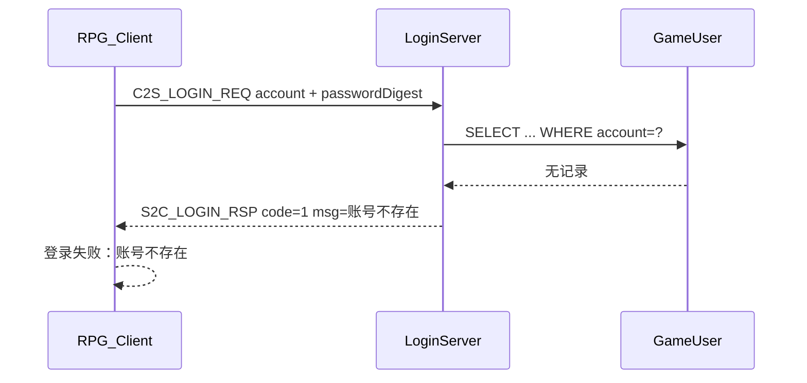

# 登录「账号不存在」诊断与修复

## 结论：**服务端协议未对齐（主因）+ 数据库无该账号（直接原因）**

客户端显示的 `登录失败：账号不存在` 来自 [`sdk/net/ClientErrorText.cpp`](sdk/net/ClientErrorText.cpp)：

```cpp
return std::string(u8"登录失败：") + preferServerMsg(serverMsg, ...);
```

`serverMsg` 由 LoginServer 写入 `Msg_S2C_LoginRsp.msg`，**不是客户端臆造的错误**。



## 服务端何时返回「账号不存在」

[`RPG_Server/LoginServer/LoginAuthService.cpp`](../RPG_Server/LoginServer/LoginAuthService.cpp) 仅在 SQL 查不到行时设置：

```cpp
if (!row) {
    loginRsp.code = 1;
    copyToWire(loginRsp.msg, ..., "账号不存在");
}
```

若账号存在但密码不对，文案应为 **「账号或密码错误」**。你当前看到的是前者，说明 **GameUser 里没有这条账号记录**（或账号字符串与库中不一致）。

## 根因：Common 子模块与登录协议不一致

| 仓库 | Common commit | `Msg_C2S_LoginReq` 密码字段 |
|------|---------------|----------------------------|
| RPG_Client | `b1cbfb30` | `uint8_t passwordDigest[32]`（SHA-256） |
| RPG_Server | `78e275f2` | `char password[32]`（明文） |

客户端已按新协议组包（[`sdk/net/ClientMsgHandler.cpp`](sdk/net/ClientMsgHandler.cpp) `buildLoginReq` / `buildRegisterReq` 调用 `PasswordDigest::sha256Utf8Password`）。

服务端登录/注册仍读取旧字段：

- 登录：[`LoginAuthService.cpp` L118-121](../RPG_Server/LoginServer/LoginAuthService.cpp) `req->password`
- 注册：[`LoginRegisterService.cpp` L66-71](../RPG_Server/LoginServer/LoginRegisterService.cpp) `req->password` / `req->confirmPassword`，且 `isPrintableAscii` 校验

**注册链路因此几乎必然失败**：客户端发来 32 字节二进制 digest，`isPrintableAscii` 会拒绝（非可打印 ASCII）→ 返回「账号或密码格式非法」，**账号不会写入 GameUser**。之后登录就会报「账号不存在」。

> 若你曾在旧版客户端（明文 password）下注册成功，用新版客户端登录时，应看到「账号或密码错误」而非「账号不存在」。当前现象更符合 **从未成功注册到当前库**。

## 客户端侧无需改登录展示逻辑

[`net/LoginSession.cpp`](net/LoginSession.cpp) `handleLoginRsp` 在 `code != 0` 时调用 `ClientErrorText::loginResultText`，行为正确。

账号名字段偏移在两侧 struct 总大小均为 74 字节时一致（`2+32+32+4+1+3`），**账号名本身不会因 digest 变更而错位**；问题在服务端未按 digest 完成注册/校验。

## 修复方案（在 RPG_Server 实施）

### 1. 对齐 Common 子模块

将 [`RPG_Server/Common`](../RPG_Server/Common) 更新到与客户端相同 commit（`b1cbfb30` 或更新），使 `LoginMsg.h` 使用 `passwordDigest` / `confirmPasswordDigest`。

```bash
cd RPG_Server
git submodule update --remote Common   # 或 pin 到 b1cbfb30
```

### 2. 改造 LoginRegisterService

文件：[`LoginRegisterService.cpp`](../RPG_Server/LoginServer/LoginRegisterService.cpp)

- 读取 `req->passwordDigest` / `req->confirmPasswordDigest`
- 用 `memcmp` 比较两次 digest（替代 `strcmp` 明文）
- 移除对 digest 的 `isPrintableAscii` 校验（可保留对 `account` 的 ASCII 校验）
- 入库：对 **digest 的固定表示** 做 bcrypt（建议 hex 编码 32 字节后 `hashPasswordBcrypt`，避免二进制中的 `\0` 截断）

### 3. 改造 LoginAuthService

文件：[`LoginAuthService.cpp`](../RPG_Server/LoginServer/LoginAuthService.cpp)

- 读取 `req->passwordDigest[32]`
- 将 digest 同样 hex 编码后，用 `verifyPasswordBcrypt(hexDigest, password_hash)` 校验
- 删除对 `req->password` 的引用

可抽取公共 helper（如 `digestToHex` + `verifyDigestBcrypt`）放在 `PasswordUtil.h` 或 LoginServer 本地工具。

### 4. 数据与联调

- **旧账号**（明文注册入库）在新 digest 协议下无法登录，需删库重注册或做一次性迁移
- 修复后流程：注册 → 日志 `账号注册成功` → 同账号密码登录 → `S2C_LOGIN_RSP code=0`
- 客户端日志应出现 `LoginSession：注册成功` 且随后登录不再报「账号不存在」

## 临时验证（修复前）

1. 查 LoginServer 日志：注册时是否出现「账号或密码格式非法」
2. 查 MySQL：`SELECT account FROM GameUser;` 确认目标账号是否存在
3. 确认登录用的账号与注册时完全一致（大小写、空格）

## 与区列表「维护中」的关系

区列表维护是 Gateway/Super 未就绪导致 `loadLevel=3`，与登录账号不存在是**独立问题**。即使区显示维护，只要 `enabled=1` 仍可选区并尝试登录；当前登录失败发生在 **LoginServer 账号校验** 阶段。
