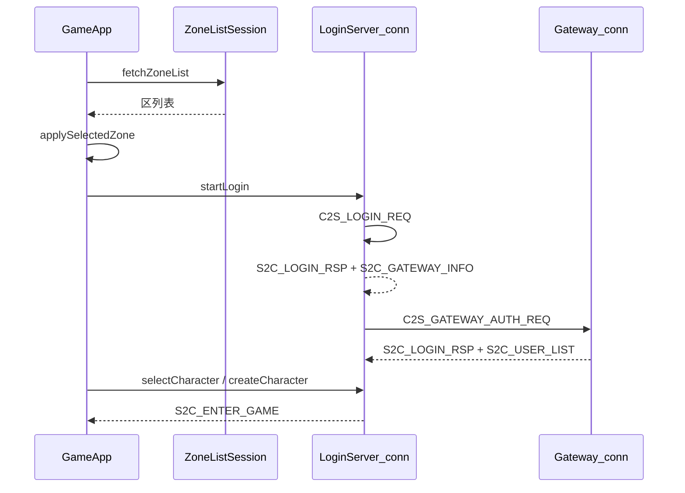

# 角色登录全流程客户端日志

## 流程与现状



| 阶段 | 已有日志 | 缺口 |
|------|----------|------|
| 区列表 | 连接、收到 N 区、ERR | TCP 已连接、发送请求、解析失败原因 |
| UI 入口 | 进入游戏成功 | 拉区列表、选区、开始登录/注册 |
| LoginServer | 连接、Gateway 切换 | 发送登录请求、登录响应详情、网关信息详情 |
| Gateway | 鉴权发送/成败、列表数量 | TCP 已连接、断开 LoginServer 切换 |
| 选角/创角 | 选择角色、创角 name= | 创角成功、取消会话、英文标签 |
| 异常 | fail() 统一 ERR | 超时/断开时可带阶段上下文（已有文案，可选补 warn） |

遵守 [`.cursor/rules/log-language.mdc`](.cursor/rules/log-language.mdc)：固定文案中文；专有名词可保留（LoginServer、Gateway、Lua）。

**安全**：只打 `账号`、`区服`、`区名`、`角色ID`；**禁止** `password`、`loginToken` 全文。

---

## 1. [`app/GameApp.cpp`](app/GameApp.cpp) — UI 层里程碑

在以下函数各加一条 `info`：

| 函数 | 日志示例 |
|------|----------|
| `beginFetchZoneList` | `GameApp：开始拉取区列表` |
| `applySelectedZone` | `GameApp：选中区服 区服=%u 类型=%u 名称=%s` |
| `beginEnterAuth` | `GameApp：进入账号登录界面 区服=%u` |
| `beginLogin` | `GameApp：开始登录 账号=%s 区服=%u` |
| `beginRegister` | `GameApp：开始注册 账号=%s 区服=%u` |
| `finishLoadingAuth` | `GameApp：登录资源加载完成，进入账号界面` |
| 选角回调 `setOnEnterGame` | `GameApp：请求进入游戏 角色=%llu` |
| 创角回调 `setOnCreateCharacter` | `GameApp：请求创建角色 名称=%s` |
| 选角返回 `setOnBack` | `GameApp：取消选角，返回账号登录` |
| `exitToCharacterSelect` 成功分支 | `GameApp：返回选角 高亮角色=%llu` |

`onEnterGame` 已有 `进入游戏成功`，可补充 `角色=%llu`。

---

## 2. [`net/ZoneListSession.cpp`](net/ZoneListSession.cpp) — 区列表

| 位置 | 日志 |
|------|------|
| `onTcpConnected` | `ZoneListSession：LoginServer 连接已建立` |
| `sendZoneListReq` | `ZoneListSession：发送区列表请求 类型=%u` |
| `onTcpMessage` 解析失败 | `warn`：`ZoneListSession：区列表解析失败 %s`（用 `errMsg`） |
| `onTcpDisconnected`（非 Idle） | `warn`：`ZoneListSession：连接已断开 阶段=%s`（Connecting / WaitResponse） |

`收到 %zu 个区服` 可改为 `数量=%zu` 以统一中文标签。

---

## 3. [`net/LoginSession.cpp`](net/LoginSession.cpp) — 核心会话（重点）

### 3.1 连接与请求

| 位置 | 日志 |
|------|------|
| `onTcpConnected` Login/Register 分支 | `LoginSession：LoginServer 连接已建立` |
| `sendLoginReq` | `LoginSession：发送登录请求 账号=%s 区服=%u` |
| `sendRegisterReq` | `LoginSession：发送注册请求 账号=%s 区服=%u` |
| `onTcpConnected` Gateway 分支 | `LoginSession：Gateway 连接已建立` |
| `tryConnectGateway` 断开前 | `LoginSession：断开 LoginServer，切换 Gateway` |

### 3.2 响应处理

| 位置 | 日志 |
|------|------|
| `handleLoginRsp` 成功 | `info`：`LoginSession：登录成功 账号ID=%llu 角色=%llu 过期时间=%llu` |
| `handleLoginRsp` 失败 | 已由 `fail(loginResultText)` 覆盖，无需重复 |
| `handleGatewayInfo` 成功 | `LoginSession：收到网关信息 地址=%s:%u` |
| `handleUserList` | 已有；`deliverUserList` 前可打 `LoginSession：交付角色列表 数量=%zu 高亮=%llu` |
| `handleCreateUserRsp` 成功 | `LoginSession：创建角色成功 角色=%llu 名称=%s` |
| `handleSystemError` / `S2C_KICK` | `warn`：`LoginSession：收到网关系统错误 错误码=%d`（再 `fail`） |

### 3.3 生命周期

| 位置 | 日志 |
|------|------|
| `cancel` | `info`：`LoginSession：取消会话` |
| `resumeGatewayForCharSelect` | 已有；可补 `高亮角色=%llu` |

### 3.4 统一现有英文标签（同文件顺带改）

- `创建角色 name=%s` → `名称=%s`
- `选择角色 user=%llu` → `角色=%llu`
- `进入游戏 user=%llu map=%u` → `角色=%llu 地图=%u`

---

## 4. 实现约定

- **不改** [`LoginSession.h`](net/LoginSession.h) 公开 API；日志全部写在 `.cpp` 实现内。
- **不新增** 独立日志工具类；仅在 `LoginSession.cpp` 匿名命名空间加 `stateLabel(State)` 静态函数（供断开日志用），避免魔法字符串重复。
- **日志级别**：正常里程碑 `info`；可恢复/被忽略 `warn`；失败仍走现有 `fail()` → `err`。
- **编译验证**：`build_client.ps1` 或 VS 重新生成 `RPGClient`。

---

## 5. 验证

登录一次完整流程，检查 `logs/client_*.log` 是否按顺序出现：

```text
GameApp：开始拉取区列表
ZoneListSession：连接 … → LoginServer 连接已建立 → 发送区列表请求 → 收到 … 个区服
GameApp：选中区服 …
GameApp：开始登录 …
LoginSession：连接 LoginServer … → LoginServer 连接已建立 → 发送登录请求
LoginSession：登录成功 … → 收到网关信息 … → 断开 LoginServer，切换 Gateway
LoginSession：连接 Gateway … → Gateway 连接已建立 → 发送 Gateway 票据鉴权
LoginSession：Gateway 鉴权成功 → 收到角色列表响应 → 交付角色列表
GameApp：请求进入游戏 … → LoginSession：进入游戏 … → GameApp：进入游戏成功
```

失败场景应能在对应阶段看到最后一条里程碑日志，便于与 Gateway/Record 服务端日志对照。
