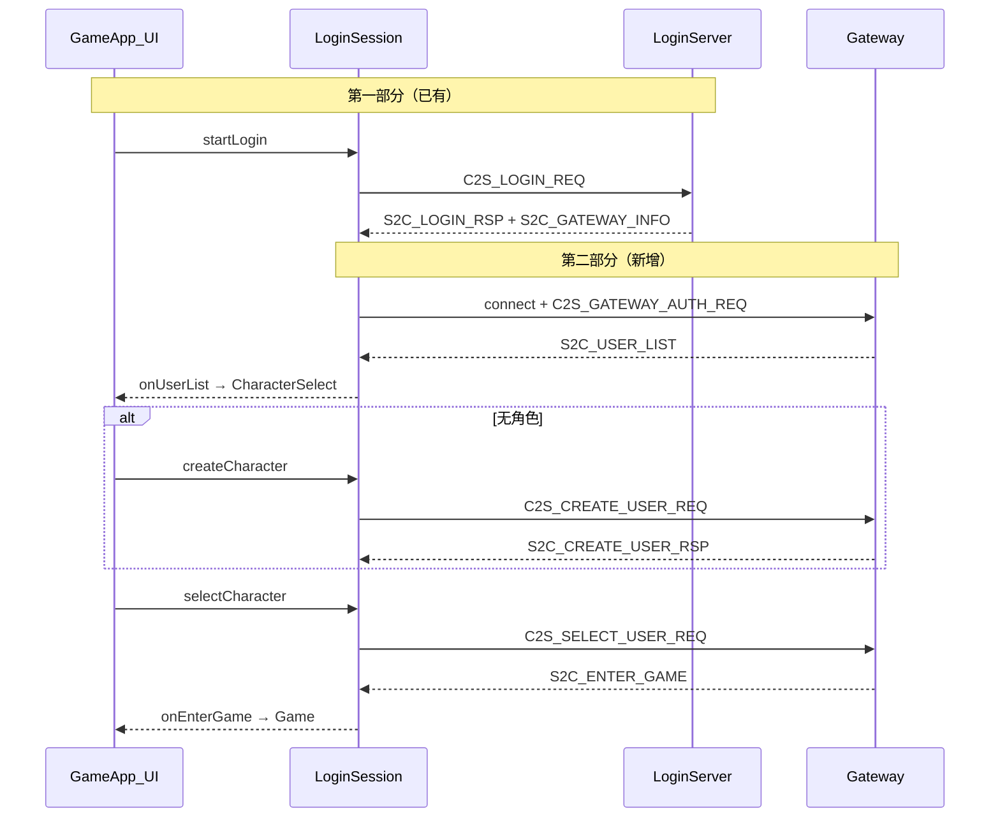

# 登录第二阶段：角色选择与进入游戏（客户端）

## 目标（对照 [`Common/login_plan.txt`](Common/login_plan.txt)）

在已实现的选区 → 账号登录/注册之后，补齐：

1. 账号登录成功后展示**角色列表**
2. 支持**创建角色**（无角色或用户主动创建）
3. 选定角色后发送 `C2S_SELECT_USER_REQ`，收到 `S2C_ENTER_GAME` 进入地图
4. 与第一部分流程衔接；Gateway 改用 `loginToken` 鉴权（顺带优化第一部分安全链路）

**不在本任务范围**：SuperServer/Gateway/Scene 服务端实现、主城地图/出生点配置（由服务端 `S2C_ENTER_GAME` 下发 mapID/x/y/z，客户端 [`GameScene::enter`](game/GameScene.cpp) 已能加载）。

---

## 当前缺口

| 环节 | 现状 |
|------|------|
| Gateway 握手 | 重发 `C2S_LOGIN_REQ`（密码二次传输） |
| `S2C_USER_LIST` / 选角 / 创角 | 无 handler、无 UI |
| `AppState` | 无选角状态，登录成功直等 `S2C_ENTER_GAME` |
| `ClientMsgHandler` | 缺 `buildGatewayAuthReq` / `buildSelectUserReq` / `buildCreateUserReq` / `parseUserList` / `parseCreateUserRsp` |

协议定义已在 [`Common/ClientMsg.h`](Common/ClientMsg.h)（`0x0005`–`0x0008`、`0x000D`）。

---

## 目标流程



**兼容旧 Gateway**：若 Gateway 连接后未收到 `S2C_USER_LIST` 而直接收到 `S2C_ENTER_GAME`，仍走现有 `onEnterGame`（与当前行为一致）。若 `loginToken` 为空，Gateway 首包回退 `C2S_LOGIN_REQ`。

---

## 1. 协议辅助层

### 新增 [`net/CharacterTypes.h`](net/CharacterTypes.h)

```cpp
struct CharacterEntry {
    uint64_t userID;
    std::string name;
    uint32_t level;
    uint8_t vocation;
    uint8_t sex;
};
```

职业/性别显示名（客户端 UI 用，与 wire `uint8_t` 对齐，默认 `0=战士/男, 1=法师/女`，可在头文件注释标明需与 Server 一致）。

### 扩展 [`sdk/net/ClientMsgHandler.h`](sdk/net/ClientMsgHandler.h) / [`.cpp`](sdk/net/ClientMsgHandler.cpp)

| 方法 | 说明 |
|------|------|
| `buildGatewayAuthReq(account, loginToken, zoneId, gameType)` | `0x000D` |
| `parseUserList(data, len, entries, errMsg)` | 解析 `Msg_S2C_UserListHeader` + N×`Msg_S2C_UserListEntryWire` |
| `buildSelectUserReq(userID, loginTxnId=0)` | `0x0005` |
| `buildCreateUserReq(name, vocation, sex)` | `0x0007` |
| `parseCreateUserRsp(data, len, out)` | `0x0008` |

---

## 2. LoginSession 状态机扩展

修改 [`net/LoginSession.h`](net/LoginSession.h) / [`.cpp`](net/LoginSession.cpp)：

### 新增状态

- `WaitUserList` — 已发 Gateway 鉴权，等待 `S2C_USER_LIST`
- `WaitUserAction` — 已收到列表，等待 UI 调用 `selectCharacter` / `createCharacter`
- `WaitCreateUserRsp` — 已发创角请求

`WaitGatewayLoginRsp` 重命名为语义更清晰的 `WaitGatewayAuth`（或保留并改行为）。

### 新增 API / 回调

```cpp
using UserListCallback = std::function<void(
    const std::vector<CharacterEntry>& chars, uint64_t lastUserId)>;

void setOnUserList(UserListCallback cb);
void selectCharacter(uint64_t userID);
void createCharacter(const std::string& name, uint8_t vocation, uint8_t sex);
```

### 关键行为

1. **LoginServer 登录成功**后断开并连 Gateway（保持现有逻辑）
2. **Gateway `onTcpConnected`**：优先 `sendGatewayAuthReq()`（用 `m_loginRsp.loginToken`）；`loginToken` 为空时 `sendLoginReq()` 兼容
3. **`S2C_USER_LIST`**：`code!=0` → `fail`；成功 → `m_state=WaitUserAction`，`m_onUserList(entries, m_loginRsp.userID)`
4. **`selectCharacter`**：发 `C2S_SELECT_USER_REQ` → `WaitEnterGame`
5. **`createCharacter`**：发 `C2S_CREATE_USER_REQ` → `WaitCreateUserRsp`；成功后将新角色并入本地列表并再次 `m_onUserList`（或自动选中新建角色）
6. **`S2C_ENTER_GAME`**：保持现有 `onEnterGame` 链路
7. **`fail()` 文案**：统一为中文（符合日志规范），如 `登录响应解析失败` → `LoginSession：登录响应解析失败`

`isBusy()` 在 `WaitUserAction` / `WaitCreateUserRsp` / `WaitEnterGame` 期间仍为 `true`，保证 TCP 连接由 `LoginSession` 持有。

---

## 3. 选角 UI

### 新增 [`ui/CharacterSelectPanel.h`](ui/CharacterSelectPanel.h) / [`.cpp`](ui/CharacterSelectPanel.cpp)

参考 [`ServerListPanel`](ui/ServerListPanel.cpp) 列表 + 按钮布局，复用 `UiTheme` / `Button` / `TextInput`：

| 区域 | 内容 |
|------|------|
| 标题 | 「选择角色」 |
| 列表 | 角色名、等级、职业、性别；支持点击高亮；`lastUserId` 对应行标注「上次登录」 |
| 按钮 | 「进入游戏」（选中角色后可用）、「创建角色」、「返回登录」 |
| 创角子界面 | 角色名输入、职业/性别选择（2 选 1 按钮组即可）、「确认创建」「取消」 |
| 状态 | Loading / Ready / Error 文案（连接中、创角中、进游戏中） |

**交互规则**：

- `chars.empty()` → 自动展开创角表单
- 有角色时默认选中 `lastUserId`（若存在于列表），否则选第一项
- 创角成功后刷新列表并选中新角色

---

## 4. GameApp 集成

### [`app/AppState.h`](app/AppState.h)

新增：

```cpp
CharacterSelect,  /**< 账号登录后选角/创角 */
```

### [`app/GameApp.h`](app/GameApp.h) / [`.cpp`](app/GameApp.cpp)

- 成员：`CharacterSelectPanel m_characterSelectPanel`
- `isPreGameState()` 加入 `CharacterSelect`（共享登录背景/chrome）
- `wireCallbacks()`：
  - `m_loginSession.setOnUserList` → 填充 panel → `switchState(CharacterSelect)`
  - panel `onEnterGame` → `m_loginSession.selectCharacter(userId)`，panel 显示 loading
  - panel `onCreate` → `m_loginSession.createCharacter(...)`
  - panel `onBack` → `m_loginSession.cancel()` → `AuthLogin`
- `processEvents` / `update` / `render`：为 `CharacterSelect` 增加分支；**`CharacterSelect` 时仍调用 `m_loginSession.update()`**（维持 Gateway 连接与消息处理）
- `setOnError`：若在选角阶段失败，切回 `AuthLogin` 并清空 panel 状态
- `Connecting` 阶段文案：账号验证中显示「正在验证账号...」；收到列表前保持 Connecting，收到后切 CharacterSelect

`onEnterGame` **不变**：`GameSession` + `GameScene::enter` + `AppState::Game`。

---

## 5. 文档与注释

### [`README.md`](README.md) — 登录流程

更新为完整链路：

1. 选区 → 进入游戏 → 账号登录/注册（已有）
2. **账号登录成功 → Gateway 鉴权 → 角色列表**
3. **选择角色 / 创建角色 → 进入游戏**
4. 加载地图场景（`S2C_ENTER_GAME` 坐标）

补充协议表：`C2S_GATEWAY_AUTH_REQ`、`S2C_USER_LIST`、`C2S_SELECT_USER_REQ`、`C2S_CREATE_USER_REQ`、`S2C_CREATE_USER_RSP`。

### 代码注释

- 更新 [`LoginSession.h`](net/LoginSession.h) 文件头职责说明
- [`CharacterSelectPanel.h`](ui/CharacterSelectPanel.h) 说明与 `LoginSession` 协作关系

---

## 6. 验证计划

1. **Debug 构建**（`scripts/build_debug.ps1`）
2. **新服务端联调**（Gateway 已实现 Phase 2 时）：
   - 有角色账号：登录 → 见列表 → 选角 → 进主城地图
   - 新账号：登录 → 创角 → 选角/自动选中 → 进游戏
   - `lastUserId` 高亮与默认选中
3. **旧 Gateway 兼容**：若服务端仍直发 `S2C_ENTER_GAME`，应跳过选角直接进入 `Game`
4. **断线/错误**：选角页「返回登录」、服务器错误均回到 `AuthLogin` 并中文提示

---

## 文件变更清单

| 文件 | 操作 |
|------|------|
| `net/CharacterTypes.h` | 新增 |
| `sdk/net/ClientMsgHandler.*` | 扩展 build/parse |
| `net/LoginSession.*` | Gateway 鉴权 + 选角/创角状态机 |
| `ui/CharacterSelectPanel.*` | 新增选角 UI |
| `app/AppState.h` | 新增 `CharacterSelect` |
| `app/GameApp.*` | 状态机、回调、渲染/事件 |
| `README.md` | 登录流程与协议说明 |

CMake 无需改（`ui/*.cpp` 已 GLOB 收录）。

---

## 风险与依赖

- **服务端需同步实现** `C2S_GATEWAY_AUTH_REQ`、`S2C_USER_LIST`、选角/创角；否则只能走旧 Gateway 直进或联调失败
- 职业/性别枚举值需与 RecordServer 一致；首版用 `0/1` 并在 README 注明，后续可从配表读取
- `Common` 子模块为 dirty 状态（本地 `login_plan.txt`）；实现时勿修改 Common 内协议，仅在客户端消费已有定义
