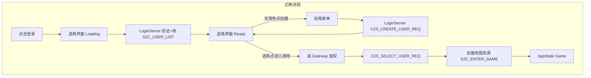

# 选角流程与界面补全

## 需求对照（你描述的 6 点）

| # | 需求 | 现状 | 缺口 |
|---|------|------|------|
| 1 | 点击登录后切换到角色选择界面 | `Connecting` 仍渲染 [`AuthLoginPanel`](ui/AuthLoginPanel.cpp)，底部显示状态文案 | 登录后应显示选角界面（Loading） |
| 2 | 右上角色列表、右下「创建角色」、中下「进入游戏」 | 居中窄面板，列表在左侧中部，按钮左/右并排 | **布局需重做** |
| 3 | 无角色时点「创建角色」走创角流程 | 空列表时 `setCharacters` **自动**切 `Mode::Create` | 应留在选角页，由用户点按钮进入创角 |
| 4 | 创角：输入名字 + 选择职业 | 已有名字、战士/法师、男/女 | 职业选择保留；性别可保留（协议 `C2S_CREATE_USER_REQ` 含 `sex`） |
| 5 | 有角色也可创建新角色 | `createCharButton` 在 `Mode::Select` 可用 | 已支持，布局调整后保持 |
| 6 | 选角色 +「进入游戏」→ 加载资源进地图 | `onEnterGame` 同步 `GameScene::enter` 加载 map/water 等 | 需明确 Loading 文案；修复 Gateway 选角链路 |

另：**卡在「正在获取角色列表...」** 根因是 [`LoginSession::tryConnectGateway`](net/LoginSession.cpp) 在**未收 `S2C_USER_LIST`** 时就断开 LoginServer 转连 Gateway，却在 Gateway 上等待列表（协议规定列表由 **LoginServer** 下发，见 [`Common/LoginMsg.h`](Common/LoginMsg.h) `S2C_USER_LIST`）。空列表本身有 `deliverUserList` 逻辑，**不会**单独导致卡住。



---

## 一、LoginSession：协议正确顺序（[`net/LoginSession.cpp`](net/LoginSession.cpp)）

与 [修复角色列表等待](.cursor/plans/修复角色列表等待_3f6183bc.plan.md) 一致：

1. **`tryConnectGateway`**：仅当 `m_pendingSelectUserId != 0`（用户点「进入游戏」）时切换 Gateway；删除 `!m_gotUserList` 时提前切网关的逻辑。
2. **`handleUserList`**：在 LoginServer 连接上收到列表后**立即** `deliverUserList`（含 `count=0`）。
3. **`handleLoginRsp`**：登录成功且 `!m_gotUserList` 时 `notifyStatus("正在获取角色列表...")`，**保持 LoginServer 连接**。
4. **`onTcpConnected(ConnectGateway)`**：鉴权后走 `sendSelectUserReq`，文案「正在连接游戏网关...」/「正在进入游戏...」，**不再**在 Gateway 首连进入 `WaitUserList`。
5. **`onGatewayAuthSent`**：仅处理 `m_pendingSelectUserId` 选角进游戏。

创角仍在 LoginServer（`!m_gatewayConnected` 时 `createCharacter`），与协议一致。

---

## 二、GameApp：登录后立即进选角界面（[`app/GameApp.cpp`](app/GameApp.cpp)）

### `beginLogin` 调整

```cpp
m_characterSelectPanel.reset();
m_characterSelectPanel.setStatus(Loading, u8"正在验证账号...");
switchState(AppState::CharacterSelect);  // 不再停留在 AuthLogin + Connecting 渲染登录页
m_loginSession.startLogin(...);
```

### 事件 / 渲染 / 更新

| 状态 | 当前 | 改为 |
|------|------|------|
| `Connecting`（仅登录/注册网络中） | 渲染 `authLoginPanel` | 登录：`CharacterSelectPanel` Loading；注册：仍可用 `authLoginPanel` 或保持 Register 页 |
| `CharacterSelect` | 渲染选角面板 | 不变 |
| `setOnStatus` | 仅 `Connecting` 更新 `m_statusMessage` | 在 `CharacterSelect` Loading 时同步 `characterSelectPanel.setStatus(Loading, msg)` |

`loginSession.update()` 已在 `Connecting || CharacterSelect` 调用，保持不变。

### 进入游戏 Loading

[`characterSelectPanel.setOnEnterGame`](app/GameApp.cpp) 回调中状态文案改为：

`u8"正在加载地图与角色资源..."`

`WaitEnterGame` 收到 `S2C_ENTER_GAME` 后仍走现有 `onEnterGame` → `GameScene::enter`（已加载 map/water/ambient/buildings）。

---

## 三、CharacterSelectPanel：布局与交互重做（[`ui/CharacterSelectPanel.cpp`](ui/CharacterSelectPanel.cpp)）

### 目标布局（相对窗口，玻璃面板可略加宽，如 720×520）

```
┌─────────────────────────────────────────────┐
│  选择角色                          [角色列表] │  ← 右上区域：可滚动列表
│                                    角色1     │
│                                    角色2     │
│  [创角时：中间区显示名字/职业/性别/确认取消]   │
│                                             │
│           [ 进入游戏 ]        [ 创建角色 ]   │  ← 中下居中 / 右下
│              [ 返回登录 ]                    │
└─────────────────────────────────────────────┘
```

实现要点：

- 新增 `listAreaRect()`：面板**右上**（约 `panel.right - listW - 20`, `panel.top + 80`）
- `m_enterGameButton`：面板**底部居中**（`centerX - btnW/2`）
- `m_createCharButton`：面板**右下**（`panel.right - btnW - 40`）
- `Mode::Create`：创角表单占**面板中部左侧**，不遮挡右上列表（有角色时列表仍可见或可半透明禁用）
- 为 `m_nameInput` 增加 `update(dt)`（光标闪烁），在 `GameApp::update` 的 `CharacterSelect` 分支调用

### 交互规则（按你的描述修正）

| 场景 | 行为 |
|------|------|
| 收到空列表 | `Mode::Select`，列表区显示「暂无角色」；**不**自动进创角 |
| 点「创建角色」 | `Mode::Create`，显示名字 + 职业（+ 性别） |
| 创角「取消」 | 回到 `Mode::Select`（即使列表为空也回选角页，不强制回登录） |
| 创角成功 | `setCharacters` 刷新列表，`Mode::Select`，选中新角色 |
| 点列表行 | 高亮选中 |
| 点「进入游戏」 | 需已选角色 → `onEnterGame(userId)` |

### 空列表时按钮状态

- 「进入游戏」：禁用（无选中角色）
- 「创建角色」：启用
- 「返回登录」：始终可用（取消登录会话）

---

## 四、文档更新

| 文件 | 更新内容 |
|------|----------|
| [`README.md`](README.md) §登录流程 | 明确：登录后**立即进入选角界面**；`S2C_USER_LIST` 在 **LoginServer** 收取；创角在 LoginServer；**仅选角进游戏时**连 Gateway；附 UI 交互说明 |
| [`ui/CharacterSelectPanel.h`](ui/CharacterSelectPanel.h) | 文件头补充布局说明与 `LoginSession` 协作关系 |
| [`net/LoginSession.h`](net/LoginSession.h) | 职责说明改为「LoginServer：登录/列表/创角；Gateway：鉴权/选角/进世界」 |

不修改 `.cursor/plans` 内历史 plan 文件（按你要求）。

---

## 五、验证清单

1. 点登录 → **立刻**看到选角界面（Loading），不再停在账号登录页
2. 几秒内收到列表 → Ready；右上列表、按钮位置符合描述
3. **无角色**：列表空提示 → 点「创建角色」→ 输入名+选职业 → 创角成功回列表
4. **有角色**：可选中 +「进入游戏」；也可点「创建角色」新建
5. 进游戏前显示「正在加载地图与角色资源...」→ 进入地图场景
6. 日志无「在 Gateway 上等待角色列表」长时间卡住；回环网关替换仍生效
7. Debug 编译通过

---

## 涉及文件

| 文件 | 变更 |
|------|------|
| [`net/LoginSession.cpp`](net/LoginSession.cpp) | 角色列表协议顺序修复 |
| [`app/GameApp.cpp`](app/GameApp.cpp) | 登录后切选角、状态同步、进游戏 Loading 文案 |
| [`ui/CharacterSelectPanel.h`](ui/CharacterSelectPanel.h) | 布局说明、`update()` 声明 |
| [`ui/CharacterSelectPanel.cpp`](ui/CharacterSelectPanel.cpp) | 布局重做、交互规则、空列表不自动创角 |
| [`net/LoginSession.h`](net/LoginSession.h) | 职责注释 |
| [`README.md`](README.md) | 登录/选角/进游戏完整流程 |
